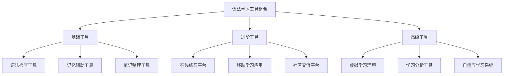

# 语法学习工具

## 核心概念
语法学习工具是辅助英语语法学习的各种技术手段和方法，帮助学习者提高学习效率、加深理解和巩固记忆。

## 数字化学习工具

### 1. 语法检查工具
| 工具名称 | 功能特点 | 使用场景 | 推荐指数 | 获取方式 |
|----------|----------|----------|----------|----------|
| **Grammarly** | 实时语法检查，准确率高 | 写作辅助，语法纠错 | ⭐⭐⭐⭐⭐ | 免费/付费 |
| **Ginger** | 功能全面，易于使用 | 写作辅助，语法检查 | ⭐⭐⭐⭐ | 免费/付费 |
| **LanguageTool** | 开源免费，功能强大 | 写作辅助，语法检查 | ⭐⭐⭐⭐ | 免费 |
| **ProWritingAid** | 专业性强，功能丰富 | 专业写作，语法分析 | ⭐⭐⭐⭐ | 付费 |
| **WhiteSmoke** | 功能全面，效果显著 | 写作辅助，语法检查 | ⭐⭐⭐⭐ | 付费 |

**使用技巧**:
- 将工具设置为学习模式，不仅纠错还解释原因
- 定期查看错误报告，分析常见错误类型
- 结合工具建议和语法规则，加深理解

### 2. 记忆辅助工具
| 工具名称 | 功能特点 | 使用场景 | 推荐指数 | 获取方式 |
|----------|----------|----------|----------|----------|
| **Anki** | 间隔重复，记忆效果好 | 语法规则记忆，单词记忆 | ⭐⭐⭐⭐⭐ | 免费 |
| **Quizlet** | 卡片学习，互动性强 | 语法练习，词汇记忆 | ⭐⭐⭐⭐ | 免费/付费 |
| **Memrise** | 游戏化学习，趣味性强 | 语法记忆，词汇记忆 | ⭐⭐⭐⭐ | 免费/付费 |
| **SuperMemo** | 科学记忆，效果显著 | 语法规则记忆 | ⭐⭐⭐⭐ | 付费 |
| **Mnemosyne** | 开源免费，功能强大 | 语法规则记忆 | ⭐⭐⭐⭐ | 免费 |

**使用技巧**:
- 制作语法规则卡片，包含规则、例句、练习
- 设置合理的复习间隔，遵循遗忘曲线
- 结合视觉、听觉多种感官进行记忆

### 3. 笔记整理工具
| 工具名称 | 功能特点 | 使用场景 | 推荐指数 | 获取方式 |
|----------|----------|----------|----------|----------|
| **Obsidian** | 知识图谱，关联性强 | 语法笔记，知识管理 | ⭐⭐⭐⭐⭐ | 免费/付费 |
| **Notion** | 功能强大，易于使用 | 语法笔记，学习计划 | ⭐⭐⭐⭐⭐ | 免费/付费 |
| **OneNote** | 微软出品，集成度高 | 语法笔记，手写支持 | ⭐⭐⭐⭐ | 免费 |
| **Evernote** | 功能全面，同步方便 | 语法笔记，资料收集 | ⭐⭐⭐⭐ | 免费/付费 |
| **Roam Research** | 双向链接，思维网络 | 语法笔记，知识关联 | ⭐⭐⭐⭐ | 付费 |

**使用技巧**:
- 建立语法知识体系，使用标签和分类
- 创建语法规则模板，提高笔记效率
- 定期回顾和整理笔记，保持知识更新

## 在线学习平台

### 4. 语法练习网站
| 网站名称 | 功能特点 | 使用场景 | 推荐指数 | 获取方式 |
|----------|----------|----------|----------|----------|
| **English Grammar Online** | 免费练习，内容丰富 | 语法练习，测试 | ⭐⭐⭐⭐ | 免费 |
| **Grammar Bytes** | 趣味性强，易于理解 | 语法游戏，练习 | ⭐⭐⭐⭐ | 免费 |
| **Perfect English Grammar** | 重点突出，易于掌握 | 语法重点，练习 | ⭐⭐⭐⭐ | 免费 |
| **Grammar Monster** | 解释详细，练习丰富 | 语法解释，练习 | ⭐⭐⭐⭐ | 免费 |
| **English Grammar 101** | 系统性强，循序渐进 | 系统学习，练习 | ⭐⭐⭐⭐ | 免费 |

**使用技巧**:
- 制定练习计划，每天坚持练习
- 记录错误题目，分析错误原因
- 结合语法规则，理解练习原理

### 5. 移动学习应用
| 应用名称 | 功能特点 | 使用场景 | 推荐指数 | 获取方式 |
|----------|----------|----------|----------|----------|
| **Duolingo** | 游戏化学习，趣味性强 | 语法练习，词汇学习 | ⭐⭐⭐⭐ | 免费/付费 |
| **Busuu** | 社交学习，互动性强 | 语法对话，实践应用 | ⭐⭐⭐⭐ | 免费/付费 |
| **Babbel** | 实用性强，效果显著 | 语法应用，日常对话 | ⭐⭐⭐⭐ | 付费 |
| **HelloTalk** | 语言交换，实践性强 | 语法实践，口语练习 | ⭐⭐⭐⭐ | 免费/付费 |
| **Tandem** | 语言交换，质量保证 | 语法实践，口语练习 | ⭐⭐⭐⭐ | 免费/付费 |

**使用技巧**:
- 利用碎片时间进行学习
- 设置学习提醒，保持学习连续性
- 结合应用学习和传统学习

## 传统学习工具

### 6. 纸质学习材料
| 材料类型 | 功能特点 | 使用场景 | 推荐指数 | 获取方式 |
|----------|----------|----------|----------|----------|
| **语法练习册** | 系统练习，效果显著 | 语法练习，巩固知识 | ⭐⭐⭐⭐ | 购买 |
| **语法参考书** | 权威性强，内容全面 | 语法查询，深入学习 | ⭐⭐⭐⭐⭐ | 购买 |
| **语法卡片** | 便携性强，易于复习 | 语法记忆，随时复习 | ⭐⭐⭐⭐ | 自制/购买 |
| **语法图表** | 视觉化强，易于理解 | 语法理解，知识梳理 | ⭐⭐⭐⭐ | 自制/购买 |
| **语法笔记本** | 个性化强，易于整理 | 语法笔记，知识整理 | ⭐⭐⭐⭐ | 自制 |

**使用技巧**:
- 制作个人语法笔记，记录重点难点
- 使用不同颜色标记，提高视觉效果
- 定期回顾和更新笔记内容

### 7. 音频学习资源
| 资源类型 | 功能特点 | 使用场景 | 推荐指数 | 获取方式 |
|----------|----------|----------|----------|----------|
| **语法播客** | 便携性强，易于收听 | 语法学习，听力练习 | ⭐⭐⭐⭐ | 免费 |
| **语法音频课程** | 专业性强，质量保证 | 语法学习，听力练习 | ⭐⭐⭐⭐ | 付费 |
| **语法朗读材料** | 发音标准，易于模仿 | 语法发音，口语练习 | ⭐⭐⭐⭐ | 免费/付费 |
| **语法听力练习** | 实用性强，效果显著 | 语法听力，理解练习 | ⭐⭐⭐⭐ | 免费/付费 |
| **语法口语练习** | 实践性强，效果显著 | 语法口语，应用练习 | ⭐⭐⭐⭐ | 免费/付费 |

**使用技巧**:
- 选择适合自己水平的音频材料
- 反复听同一材料，加深理解
- 结合文本材料，提高学习效果

## 互动学习工具

### 8. 在线社区平台
| 平台名称 | 功能特点 | 使用场景 | 推荐指数 | 获取方式 |
|----------|----------|----------|----------|----------|
| **Reddit r/EnglishLearning** | 活跃度高，互助性强 | 语法讨论，问题解答 | ⭐⭐⭐⭐ | 免费 |
| **Stack Exchange English** | 专业性强，质量保证 | 语法问答，深入学习 | ⭐⭐⭐⭐⭐ | 免费 |
| **Quora English Learning** | 问答丰富，质量较高 | 语法问答，知识分享 | ⭐⭐⭐⭐ | 免费 |
| **知乎英语学习** | 中文社区，易于理解 | 语法讨论，问题解答 | ⭐⭐⭐⭐ | 免费 |
| **豆瓣英语学习小组** | 中文社区，互动性强 | 语法讨论，经验分享 | ⭐⭐⭐⭐ | 免费 |

**使用技巧**:
- 积极参与讨论，提出问题
- 分享学习经验，帮助他人
- 关注高质量回答，学习他人经验

### 9. 虚拟学习环境
| 环境类型 | 功能特点 | 使用场景 | 推荐指数 | 获取方式 |
|----------|----------|----------|----------|----------|
| **VR语法学习** | 沉浸式体验，效果显著 | 语法学习，虚拟实践 | ⭐⭐⭐⭐ | 付费 |
| **AR语法应用** | 增强现实，互动性强 | 语法学习，现实应用 | ⭐⭐⭐⭐ | 付费 |
| **在线虚拟教室** | 实时互动，效果显著 | 语法学习，在线教学 | ⭐⭐⭐⭐ | 付费 |
| **虚拟语法实验室** | 实验性强，效果显著 | 语法学习，实验验证 | ⭐⭐⭐⭐ | 付费 |
| **虚拟语法游戏** | 游戏化学习，趣味性强 | 语法学习，游戏练习 | ⭐⭐⭐⭐ | 付费 |

**使用技巧**:
- 选择适合的虚拟学习环境
- 结合传统学习方法
- 注意保护眼睛，适度使用

## 个性化学习工具

### 10. 学习分析工具
| 工具名称 | 功能特点 | 使用场景 | 推荐指数 | 获取方式 |
|----------|----------|----------|----------|----------|
| **学习进度跟踪** | 数据分析，效果评估 | 学习监控，效果评估 | ⭐⭐⭐⭐ | 免费/付费 |
| **学习习惯分析** | 行为分析，习惯改善 | 学习优化，习惯培养 | ⭐⭐⭐⭐ | 免费/付费 |
| **学习效果评估** | 效果测量，改进建议 | 学习评估，效果改进 | ⭐⭐⭐⭐ | 免费/付费 |
| **学习路径规划** | 个性化规划，效果显著 | 学习规划，路径优化 | ⭐⭐⭐⭐ | 免费/付费 |
| **学习资源推荐** | 智能推荐，个性化强 | 资源选择，学习优化 | ⭐⭐⭐⭐ | 免费/付费 |

**使用技巧**:
- 定期分析学习数据
- 根据分析结果调整学习策略
- 结合个人特点优化学习计划

### 11. 自适应学习系统
| 系统名称 | 功能特点 | 使用场景 | 推荐指数 | 获取方式 |
|----------|----------|----------|----------|----------|
| **Knewton** | 自适应学习，效果显著 | 个性化学习，效果优化 | ⭐⭐⭐⭐ | 付费 |
| **Coursera自适应** | 课程推荐，个性化强 | 在线学习，课程选择 | ⭐⭐⭐⭐ | 免费/付费 |
| **Khan Academy** | 免费教育，质量保证 | 基础学习，知识巩固 | ⭐⭐⭐⭐⭐ | 免费 |
| **edX自适应** | 名校课程，质量保证 | 在线学习，课程选择 | ⭐⭐⭐⭐ | 免费/付费 |
| **Udemy自适应** | 实用课程，价格合理 | 在线学习，技能提升 | ⭐⭐⭐⭐ | 付费 |

**使用技巧**:
- 选择适合的自适应学习系统
- 结合个人学习目标
- 定期评估学习效果

## 工具使用策略

### 12. 工具组合使用

### 13. 工具选择原则
1. **目标导向**: 根据学习目标选择工具
2. **质量保证**: 选择高质量、可靠的工具
3. **个性化**: 选择适合个人特点的工具
4. **综合使用**: 结合多种工具提高效果

## 相关链接
- [[01-语法术语表]] - 语法术语解释
- [[02-语法规则速查]] - 语法规则速查
- [[03-推荐学习资源]] - 推荐学习资源
- [[05-语法学习心得]] - 语法学习心得

## 学习要点
1. **工具选择**: 根据学习需求选择合适的工具
2. **工具使用**: 熟练掌握工具的使用方法
3. **工具组合**: 结合多种工具提高学习效果
4. **工具更新**: 根据学习进度更新工具

---
*学习建议: 根据个人学习风格和目标，选择最适合的工具组合*
