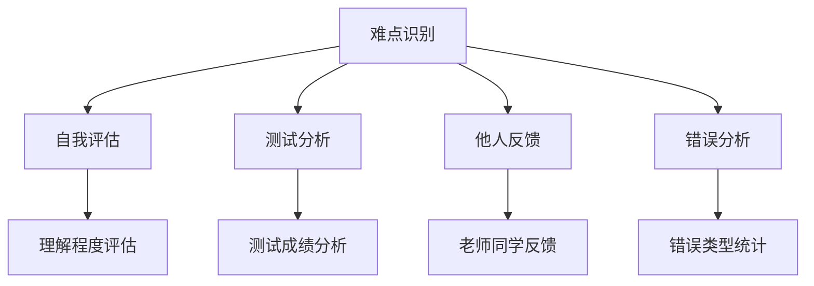
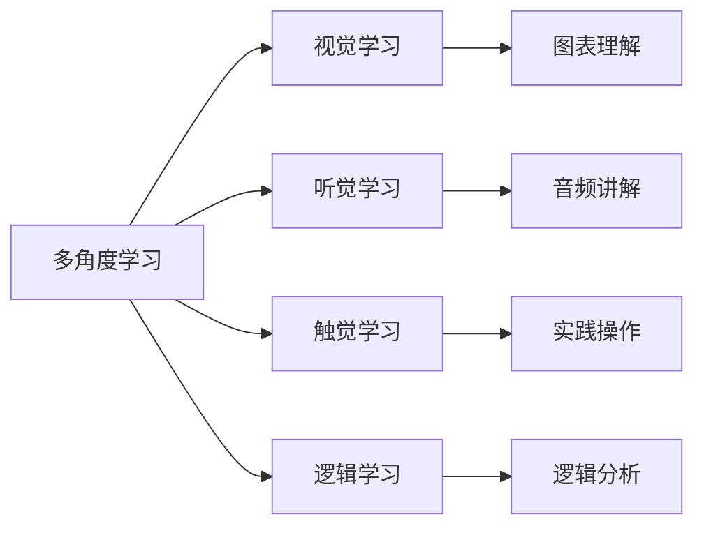
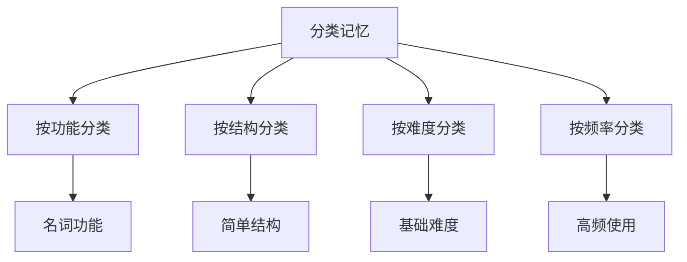
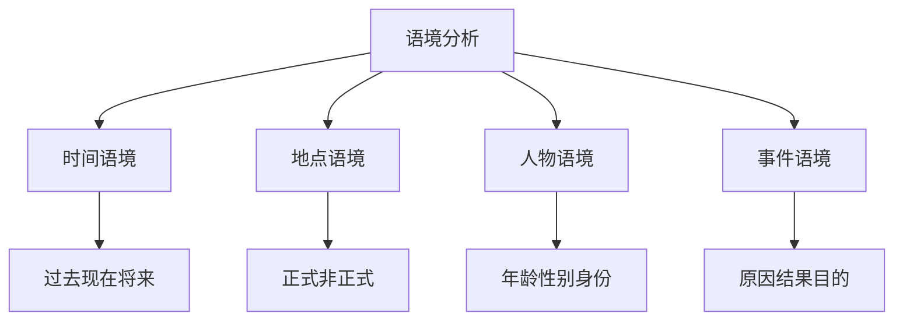
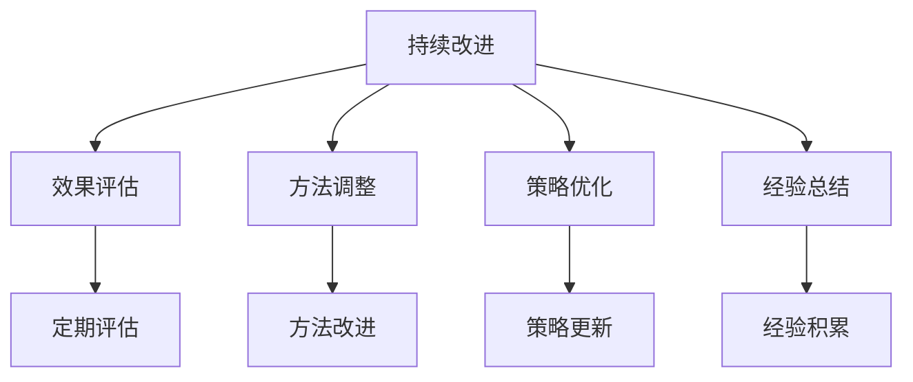

# 难点攻克

## 核心概念
难点攻克是英语语法学习中的重要环节，通过系统化的方法分析和解决学习中的难点问题，提高学习效果。

## 难点识别

### 1. 难点分类
| 难点类型 | 特点描述 | 典型表现 | 影响程度 |
|----------|----------|----------|----------|
| **理解难点** | 对语法规则理解不透彻 | 概念模糊，规则混淆 | 高 |
| **记忆难点** | 语法规则记忆不牢固 | 容易遗忘，混淆规则 | 中 |
| **应用难点** | 实际应用中错误率高 | 理论懂，实践错 | 高 |
| **分析难点** | 语法结构分析困难 | 无法分析复杂句子 | 中 |
| **创新难点** | 创新应用语法困难 | 缺乏灵活性 | 低 |

### 2. 难点识别方法


**识别步骤**:
1. **自我评估**: 评估对语法点的理解程度
2. **测试分析**: 通过测试发现薄弱环节
3. **他人反馈**: 听取老师和同学的建议
4. **错误分析**: 分析错误类型和原因

## 难点分析

### 3. 理解难点分析
| 难点 | 原因分析 | 表现症状 | 解决策略 |
|------|----------|----------|----------|
| **时态概念模糊** | 时间概念理解不清 | 时态选择错误 | 时间轴理解法 |
| **语态转换困难** | 主动被动关系不清 | 语态使用错误 | 对比分析法 |
| **从句结构复杂** | 句子结构分析困难 | 从句识别错误 | 结构分析法 |
| **非谓语动词混淆** | 功能理解不清 | 使用选择错误 | 功能分析法 |

### 4. 记忆难点分析
| 难点 | 原因分析 | 表现症状 | 解决策略 |
|------|----------|----------|----------|
| **规则记忆不牢** | 记忆方法不当 | 容易遗忘 | 记忆技巧法 |
| **规则混淆** | 相似规则区分不清 | 规则混用 | 对比记忆法 |
| **例外规则** | 例外情况记忆困难 | 例外使用错误 | 分类记忆法 |
| **长期记忆** | 缺乏复习巩固 | 长期遗忘 | 间隔复习法 |

### 5. 应用难点分析
| 难点 | 原因分析 | 表现症状 | 解决策略 |
|------|----------|----------|----------|
| **语境判断** | 语境理解能力不足 | 语境选择错误 | 语境分析法 |
| **规则选择** | 规则选择能力不足 | 规则使用错误 | 决策树法 |
| **综合应用** | 综合运用能力不足 | 综合应用错误 | 综合练习法 |
| **创新应用** | 创新能力不足 | 缺乏灵活性 | 创新练习法 |

## 攻克策略

### 6. 理解难点攻克策略
**策略1: 多角度学习法**


**实施步骤**:
1. **视觉学习**: 使用图表、思维导图理解语法
2. **听觉学习**: 听音频讲解，加深理解
3. **触觉学习**: 通过实践操作理解语法
4. **逻辑学习**: 通过逻辑分析理解语法

**策略2: 类比理解法**
- **时间类比**: 用时间概念理解时态
- **空间类比**: 用空间概念理解语态
- **关系类比**: 用关系概念理解从句
- **功能类比**: 用功能概念理解非谓语动词

**策略3: 分解理解法**
- **概念分解**: 将复杂概念分解为简单概念
- **规则分解**: 将复杂规则分解为简单规则
- **结构分解**: 将复杂结构分解为简单结构
- **功能分解**: 将复杂功能分解为简单功能

### 7. 记忆难点攻克策略
**策略1: 记忆技巧法**
| 技巧类型 | 技巧描述 | 适用场景 | 效果评估 |
|----------|----------|----------|----------|
| **口诀记忆** | 将规则编成口诀 | 规则记忆 | ⭐⭐⭐⭐⭐ |
| **联想记忆** | 通过联想加深记忆 | 概念记忆 | ⭐⭐⭐⭐ |
| **视觉记忆** | 使用图表颜色辅助 | 结构记忆 | ⭐⭐⭐⭐ |
| **重复记忆** | 通过重复加深印象 | 所有记忆 | ⭐⭐⭐⭐⭐ |

**策略2: 分类记忆法**


**策略3: 间隔复习法**
- **短期复习**: 学习后1天、3天、7天复习
- **中期复习**: 学习后1个月、3个月复习
- **长期复习**: 学习后6个月、1年复习
- **随机复习**: 根据遗忘曲线随机复习

### 8. 应用难点攻克策略
**策略1: 语境分析法**


**策略2: 决策树法**
- **时态选择**: 时间点→动作状态→时态选择
- **语态选择**: 主语重要性→语态选择
- **从句选择**: 功能需求→从句类型选择
- **非谓语选择**: 语法功能→非谓语类型选择

**策略3: 综合练习法**
- **基础练习**: 单项语法点练习
- **综合练习**: 多个语法点综合练习
- **应用练习**: 实际语境应用练习
- **创新练习**: 创新性应用练习

## 具体攻克案例

### 9. 时态难点攻克案例
**难点描述**: 时态选择困难，经常混淆不同时态

**分析过程**:
1. **问题识别**: 通过测试发现时态选择错误率高
2. **原因分析**: 时间概念理解不清，时态规则记忆不牢
3. **策略制定**: 采用时间轴理解法+记忆技巧法

**攻克过程**:
```
第一步: 建立时间轴概念
- 绘制时间轴图
- 理解过去、现在、将来的关系
- 掌握时间标志词

第二步: 学习时态规则
- 学习各时态的构成
- 理解各时态的用法
- 掌握时态选择规则

第三步: 大量练习
- 单项时态练习
- 时态对比练习
- 综合应用练习

第四步: 错误分析
- 分析错误原因
- 针对性改进
- 持续练习
```

**效果评估**:
- **理解程度**: 从⭐⭐提升到⭐⭐⭐⭐
- **应用准确性**: 从60%提升到85%
- **错误率**: 从25%降低到8%

### 10. 从句难点攻克案例
**难点描述**: 从句结构分析困难，无法正确识别从句类型

**分析过程**:
1. **问题识别**: 通过练习发现从句识别错误率高
2. **原因分析**: 句子结构分析能力不足，从句概念理解不清
3. **策略制定**: 采用结构分析法+功能分析法

**攻克过程**:
```
第一步: 学习句子结构
- 理解主句和从句的关系
- 掌握从句的基本结构
- 学会从句的识别方法

第二步: 学习从句功能
- 理解名词性从句的功能
- 理解定语从句的功能
- 理解状语从句的功能

第三步: 大量练习
- 从句识别练习
- 从句构建练习
- 从句应用练习

第四步: 综合应用
- 复杂句子分析
- 从句综合应用
- 创新性应用
```

**效果评估**:
- **识别准确性**: 从50%提升到90%
- **构建能力**: 从30%提升到80%
- **应用灵活性**: 从20%提升到70%

### 11. 非谓语动词难点攻克案例
**难点描述**: 非谓语动词选择困难，经常混淆不定式、动名词和分词

**分析过程**:
1. **问题识别**: 通过测试发现非谓语动词使用错误率高
2. **原因分析**: 功能理解不清，选择规则记忆不牢
3. **策略制定**: 采用功能分析法+对比记忆法

**攻克过程**:
```
第一步: 理解非谓语动词功能
- 理解不定式的功能
- 理解动名词的功能
- 理解分词的功能

第二步: 学习选择规则
- 学习不定式的使用规则
- 学习动名词的使用规则
- 学习分词的使用规则

第三步: 对比分析
- 不定式vs动名词对比
- 现在分词vs过去分词对比
- 非谓语动词vs谓语动词对比

第四步: 实践应用
- 单项选择练习
- 综合应用练习
- 创新性应用练习
```

**效果评估**:
- **选择准确性**: 从40%提升到85%
- **功能理解**: 从⭐⭐提升到⭐⭐⭐⭐
- **应用灵活性**: 从25%提升到75%

## 攻克效果跟踪

### 12. 攻克效果评估表
| 难点类型 | 攻克前水平 | 攻克后水平 | 提升幅度 | 效果评估 | 持续改进 |
|----------|------------|------------|----------|----------|----------|
| **时态理解** | ⭐⭐ | ⭐⭐⭐⭐ | +100% | 效果显著 | 持续练习 |
| **时态应用** | 60% | 85% | +42% | 效果良好 | 加强综合应用 |
| **从句识别** | 50% | 90% | +80% | 效果显著 | 保持练习 |
| **从句构建** | 30% | 80% | +167% | 效果显著 | 创新应用 |
| **非谓语选择** | 40% | 85% | +113% | 效果显著 | 综合应用 |

### 13. 攻克方法总结
| 方法类型 | 适用难点 | 实施难度 | 效果评估 | 推荐指数 |
|----------|----------|----------|----------|----------|
| **多角度学习法** | 理解难点 | 中 | ⭐⭐⭐⭐ | ⭐⭐⭐⭐⭐ |
| **记忆技巧法** | 记忆难点 | 低 | ⭐⭐⭐⭐⭐ | ⭐⭐⭐⭐⭐ |
| **语境分析法** | 应用难点 | 中 | ⭐⭐⭐⭐ | ⭐⭐⭐⭐ |
| **决策树法** | 选择难点 | 中 | ⭐⭐⭐⭐ | ⭐⭐⭐⭐ |
| **综合练习法** | 综合难点 | 高 | ⭐⭐⭐⭐⭐ | ⭐⭐⭐⭐ |

## 持续改进

### 14. 改进策略


### 15. 改进记录
| 改进日期 | 改进内容 | 改进原因 | 改进效果 | 后续计划 |
|----------|----------|----------|----------|----------|
| 2024-01-20 | 增加视觉学习 | 理解困难 | 效果良好 | 继续使用 |
| 2024-01-25 | 调整记忆方法 | 记忆不牢 | 效果显著 | 优化方法 |
| 2024-01-30 | 加强实践应用 | 应用困难 | 效果良好 | 增加练习 |
| 2024-02-05 | 优化学习策略 | 效果不佳 | 效果待观察 | 密切跟踪 |

## 相关链接
- [[01-学习计划]] - 详细学习计划
- [[02-进度记录]] - 进度记录
- [[04-学习成果]] - 学习成果展示
- [[04-综合应用/02-常见错误分析]] - 常见错误分析

## 学习要点
1. **难点识别**: 准确识别学习中的难点
2. **策略制定**: 制定针对性的攻克策略
3. **方法实施**: 有效实施攻克方法
4. **效果评估**: 定期评估攻克效果

---
*学习建议: 遇到难点不要气馁，要系统分析，制定策略，持续改进*
