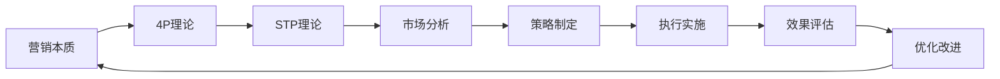
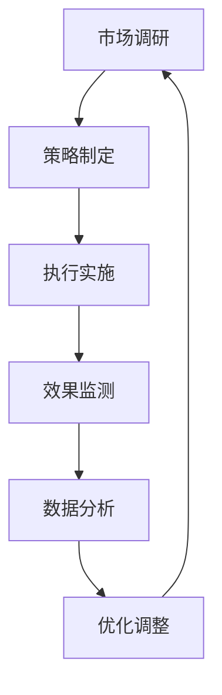

# 营销知识地图

## 知识体系概览

```mermaid
graph TD
    A[营销知识体系] --> B[01-营销总览]
    A --> C[02-营销基础认知]
    A --> D[03-营销理论框架]
    A --> E[04-营销策略制定]
    A --> F[05-营销执行实施]
    A --> G[06-营销效果评估]
    A --> H[07-营销创新趋势]
    A --> I[08-营销案例分析]
    A --> J[09-营销工具资源]
    A --> K[10-学习总结]
    
    B --> B1[知识地图]
    B --> B2[学习路径]
    B --> B3[概念速查]
    
    C --> C1[营销本质]
    C --> C2[发展历程]
    C --> C3[现代环境]
    C --> C4[思维模式]
    C --> C5[心理学基础]
    
    D --> D1[经典理论]
    D --> D2[战略理论]
    D --> D3[消费者行为]
    
    E --> E1[市场分析]
    E --> E2[竞争策略]
    E --> E3[品牌策略]
    E --> E4[产品策略]
    
    F --> F1[数字营销]
    F --> F2[传统营销]
    F --> F3[客户管理]
    F --> F4[B2B营销]
    
    G --> G1[营销指标]
    G --> G2[数据分析]
    G --> G3[优化改进]
    
    H --> H1[新兴技术]
    H --> H2[新兴模式]
    H --> H3[未来趋势]
    H --> H4[全球化营销]
    
    I --> I1[成功案例]
    I --> I2[失败案例]
    I --> I3[行业案例]
    I --> I4[分析方法]
    
    J --> J1[营销工具]
    J --> J2[学习资源]
    J --> J3[模板工具]
    J --> J4[营销伦理]
    
    K --> K1[知识总结]
    K --> K2[学习心得]
    K --> K3[实践记录]
    K --> K4[学习计划]
```

## 学习路径规划

### 第一阶段：基础认知（1-2周）
- [[02-营销基础认知/01-营销本质与概念|营销本质与概念]]
- [[02-营销基础认知/02-营销发展历程|营销发展历程]]
- [[02-营销基础认知/03-现代营销环境|现代营销环境]]

### 第二阶段：理论框架（2-3周）
- [[03-营销理论框架/01-经典营销理论/01-4P营销理论|4P营销理论]]
- [[03-营销理论框架/02-战略营销理论/01-STP理论|STP理论]]
- [[03-营销理论框架/03-消费者行为理论/01-消费者决策过程|消费者决策过程]]

### 第三阶段：策略制定（3-4周）
- [[04-营销策略制定/01-市场分析/01-市场调研方法|市场调研方法]]
- [[04-营销策略制定/02-竞争策略/01-竞争对手分析|竞争对手分析]]
- [[04-营销策略制定/03-品牌策略/01-品牌定位策略|品牌定位策略]]

### 第四阶段：执行实施（4-5周）
- [[05-营销执行实施/01-数字营销/01-社交媒体营销|社交媒体营销]]
- [[05-营销执行实施/02-传统营销/01-广告策略|广告策略]]
- [[05-营销执行实施/03-客户管理/01-客户关系管理|客户关系管理]]

### 第五阶段：效果评估（5-6周）
- [[06-营销效果评估/01-营销指标/01-KPI指标体系|KPI指标体系]]
- [[06-营销效果评估/02-数据分析/01-营销数据分析|营销数据分析]]
- [[06-营销效果评估/03-优化改进/01-A-B测试方法|A/B测试方法]]

### 第六阶段：创新趋势（6-7周）
- [[07-营销创新趋势/01-新兴技术/01-AI营销应用|AI营销应用]]
- [[07-营销创新趋势/02-新兴模式/01-私域流量运营|私域流量运营]]
- [[07-营销创新趋势/03-未来趋势/01-营销发展趋势|营销发展趋势]]

### 第七阶段：案例分析（7-8周）
- [[08-营销案例分析/01-成功案例/01-经典营销案例|经典营销案例]]
- [[08-营销案例分析/02-失败案例/01-营销失败案例分析|营销失败案例分析]]
- [[08-营销案例分析/03-行业案例/01-快消品营销案例|快消品营销案例]]

### 第八阶段：工具资源（8-9周）
- [[09-营销工具资源/01-营销工具/01-市场调研工具|市场调研工具]]
- [[09-营销工具资源/02-学习资源/01-推荐书籍|推荐书籍]]
- [[09-营销工具资源/03-模板工具/01-营销计划模板|营销计划模板]]

## 知识关联网络

### 核心概念关联

### 实践应用循环

## 学习目标设定

### 认知层面
- 理解营销的本质和核心概念
- 掌握营销理论框架和思维模式
- 建立系统性的营销知识结构

### 理解层面
- 能够分析市场环境和竞争态势
- 理解消费者行为和心理机制
- 掌握营销策略制定的逻辑和方法

### 应用层面
- 能够制定完整的营销策略
- 熟练运用各种营销工具和方法
- 具备营销效果评估和优化能力

## 学习建议

### 费曼学习法应用
1. **选择概念**：选择一个营销概念
2. **教授他人**：用简单语言解释给他人听
3. **识别盲点**：找出理解不清晰的地方
4. **重新学习**：回到原始材料重新学习
5. **简化表达**：用更简单的语言重新表达

### 刻意练习要点
1. **明确目标**：设定具体的学习目标
2. **专注练习**：集中注意力在关键技能上
3. **及时反馈**：通过案例分析获得反馈
4. **持续改进**：不断调整和改进学习方法

### 知识巩固方法
1. **定期复习**：按照遗忘曲线安排复习
2. **实践应用**：通过项目实践巩固知识
3. **知识连接**：建立知识点之间的关联
4. **输出总结**：通过写作和分享加深理解

---

**下一步学习**：[[营销/01-营销总览/02-学习路径指南|学习路径指南]]
