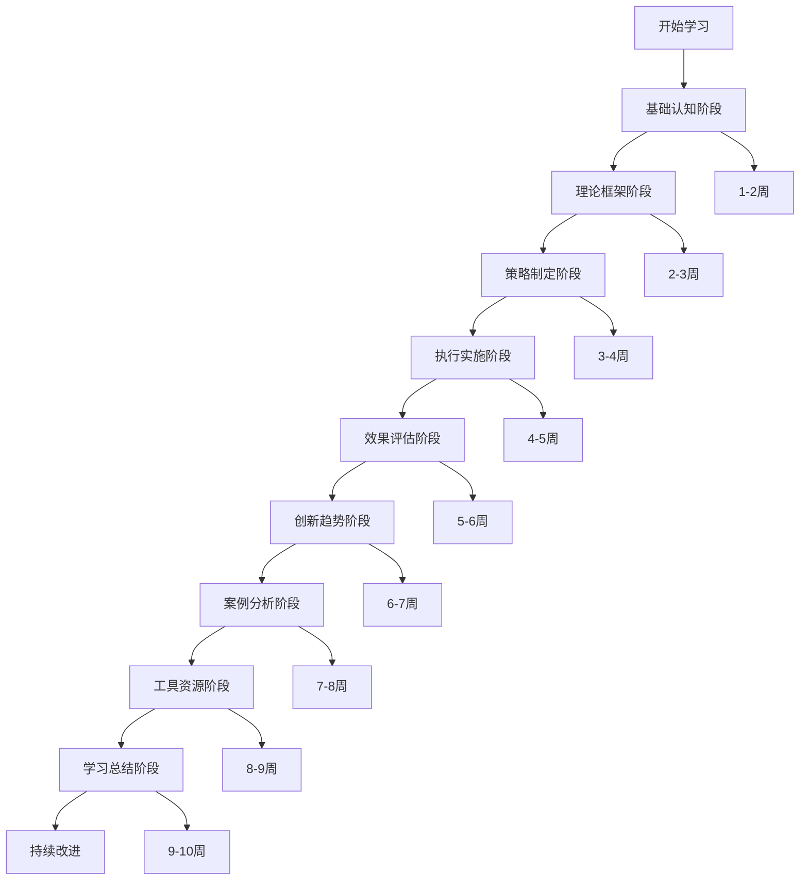

# 学习路径指南

## 学习路径总览

## 详细学习路径

### 第一阶段：基础认知（1-2周）

#### 学习目标
- 建立营销基础概念框架
- 理解营销的本质和发展历程
- 掌握现代营销环境特点

#### 学习内容
1. **营销本质与概念** [[02-营销基础认知/01-营销本质与概念]]
   - 营销的定义和核心要素
   - 营销与销售的区别
   - 营销的价值创造过程

2. **营销发展历程** [[02-营销基础认知/02-营销发展历程]]
   - 营销1.0到4.0的演进
   - 各阶段的特点和标志
   - 未来发展趋势

3. **现代营销环境** [[02-营销基础认知/03-现代营销环境]]
   - 数字化环境特征
   - 消费者行为变化
   - 竞争格局演变

4. **营销思维模式** [[02-营销基础认知/04-营销思维模式]]
   - 用户思维
   - 数据思维
   - 系统思维

5. **营销心理学基础** [[02-营销基础认知/05-营销心理学基础]]
   - 消费者心理机制
   - 认知偏差应用
   - 情感营销原理

#### 学习成果检验
- [ ] 能够清晰解释营销的本质
- [ ] 理解营销发展各阶段特点
- [ ] 掌握现代营销环境特征
- [ ] 建立营销思维模式

### 第二阶段：理论框架（2-3周）

#### 学习目标
- 掌握经典营销理论
- 理解战略营销思维
- 建立消费者行为分析框架

#### 学习内容
1. **经典营销理论** [[03-营销理论框架/01-经典营销理论]]
   - 4P营销理论
   - 4C营销理论
   - 4R营销理论
   - 理论对比分析

2. **战略营销理论** [[03-营销理论框架/02-战略营销理论]]
   - STP理论
   - 竞争分析理论
   - 定位理论
   - 蓝海战略理论

3. **消费者行为理论** [[03-营销理论框架/03-消费者行为理论]]
   - 消费者决策过程
   - 消费者心理分析
   - 消费者细分理论
   - 消费者洞察方法

#### 学习成果检验
- [ ] 熟练运用4P理论分析营销组合
- [ ] 能够进行STP分析
- [ ] 理解消费者决策过程
- [ ] 掌握消费者洞察方法

### 第三阶段：策略制定（3-4周）

#### 学习目标
- 掌握市场分析方法
- 制定竞争策略
- 建立品牌和产品策略

#### 学习内容
1. **市场分析** [[04-营销策略制定/01-市场分析]]
   - 市场调研方法
   - 市场细分策略
   - 目标市场选择
   - 市场机会分析

2. **竞争策略** [[04-营销策略制定/02-竞争策略]]
   - 竞争对手分析
   - 差异化策略
   - 定价策略
   - 竞争定位策略

3. **品牌策略** [[04-营销策略制定/03-品牌策略]]
   - 品牌定位策略
   - 品牌传播策略
   - 品牌管理策略
   - 品牌价值评估

4. **产品策略** [[04-营销策略制定/04-产品策略]]
   - 产品生命周期管理
   - 产品组合策略
   - 新产品开发策略
   - 产品创新策略

#### 学习成果检验
- [ ] 能够进行完整的市场分析
- [ ] 制定有效的竞争策略
- [ ] 设计品牌定位和传播策略
- [ ] 制定产品策略组合

### 第四阶段：执行实施（4-5周）

#### 学习目标
- 掌握数字营销方法
- 理解传统营销手段
- 建立客户管理体系
- 学习B2B营销策略

#### 学习内容
1. **数字营销** [[05-营销执行实施/01-数字营销]]
   - 社交媒体营销
   - 搜索引擎营销
   - 内容营销
   - 邮件营销
   - 移动营销
   - 程序化广告

2. **传统营销** [[05-营销执行实施/02-传统营销]]
   - 广告策略
   - 公关策略
   - 促销策略
   - 渠道管理
   - 零售营销

3. **客户管理** [[05-营销执行实施/03-客户管理]]
   - 客户关系管理
   - 客户生命周期管理
   - 客户价值分析
   - 客户忠诚度管理

4. **B2B营销** [[05-营销执行实施/04-B2B营销]]
   - B2B营销策略
   - 销售团队管理
   - 渠道伙伴管理
   - 企业客户开发

#### 学习成果检验
- [ ] 能够制定数字营销策略
- [ ] 掌握传统营销手段
- [ ] 建立客户管理体系
- [ ] 理解B2B营销特点

### 第五阶段：效果评估（5-6周）

#### 学习目标
- 建立营销指标体系
- 掌握数据分析方法
- 学会优化改进技巧

#### 学习内容
1. **营销指标** [[06-营销效果评估/01-营销指标]]
   - KPI指标体系
   - ROI计算方法
   - 营销效果评估
   - 营销预算管理

2. **数据分析** [[06-营销效果评估/02-数据分析]]
   - 营销数据分析
   - 用户行为分析
   - 市场趋势分析
   - 预测分析模型

3. **优化改进** [[06-营销效果评估/03-优化改进]]
   - A/B测试方法
   - 营销优化策略
   - 持续改进机制
   - 营销实验设计

#### 学习成果检验
- [ ] 建立完整的KPI体系
- [ ] 掌握数据分析方法
- [ ] 能够进行A/B测试
- [ ] 制定优化改进方案

### 第六阶段：创新趋势（6-7周）

#### 学习目标
- 了解新兴技术应用
- 掌握新兴营销模式
- 预测未来发展趋势
- 学习全球化营销

#### 学习内容
1. **新兴技术** [[07-营销创新趋势/01-新兴技术]]
   - AI营销应用
   - 大数据营销
   - 区块链营销
   - 物联网营销
   - 虚拟现实营销

2. **新兴模式** [[07-营销创新趋势/02-新兴模式]]
   - 私域流量运营
   - 直播营销
   - 短视频营销
   - 社群营销
   - influencer营销

3. **未来趋势** [[07-营销创新趋势/03-未来趋势]]
   - 营销发展趋势
   - 消费者行为变化
   - 营销技术演进
   - 营销模式创新

4. **全球化营销** [[07-营销创新趋势/04-全球化营销]]
   - 国际市场进入策略
   - 跨文化营销
   - 全球品牌管理
   - 本地化营销策略

#### 学习成果检验
- [ ] 了解新兴技术应用
- [ ] 掌握新兴营销模式
- [ ] 预测未来发展趋势
- [ ] 理解全球化营销策略

### 第七阶段：案例分析（7-8周）

#### 学习目标
- 分析成功案例
- 总结失败教训
- 学习行业案例
- 掌握分析方法

#### 学习内容
1. **成功案例** [[08-营销案例分析/01-成功案例]]
   - 经典营销案例
   - 数字营销案例
   - 品牌营销案例
   - 创新营销案例

2. **失败案例** [[08-营销案例分析/02-失败案例]]
   - 营销失败案例分析
   - 危机公关案例
   - 经验教训总结

3. **行业案例** [[08-营销案例分析/03-行业案例]]
   - 快消品营销案例
   - 科技产品营销案例
   - 服务业营销案例
   - 金融业营销案例

4. **案例分析方法** [[08-营销案例分析/04-案例分析方法]]
   - 案例研究框架
   - 案例分析工具
   - 案例学习技巧

#### 学习成果检验
- [ ] 能够分析成功案例
- [ ] 总结失败教训
- [ ] 掌握行业案例特点
- [ ] 运用案例分析方法

### 第八阶段：工具资源（8-9周）

#### 学习目标
- 掌握营销工具使用
- 建立学习资源库
- 学会使用模板工具
- 理解营销伦理

#### 学习内容
1. **营销工具** [[09-营销工具资源/01-营销工具]]
   - 市场调研工具
   - 数据分析工具
   - 内容创作工具
   - 营销自动化工具
   - 项目管理工具

2. **学习资源** [[09-营销工具资源/02-学习资源]]
   - 推荐书籍
   - 在线课程
   - 行业报告
   - 专业网站
   - 学术期刊

3. **模板工具** [[09-营销工具资源/03-模板工具]]
   - 营销计划模板
   - 竞品分析模板
   - 内容规划模板
   - 效果评估模板
   - 预算规划模板

4. **营销伦理** [[09-营销工具资源/04-营销伦理]]
   - 营销伦理原则
   - 消费者权益保护
   - 数据隐私保护
   - 社会责任营销

#### 学习成果检验
- [ ] 熟练使用营销工具
- [ ] 建立学习资源库
- [ ] 掌握模板工具使用
- [ ] 理解营销伦理要求

### 第九阶段：学习总结（9-10周）

#### 学习目标
- 总结知识体系
- 记录学习心得
- 制定实践计划
- 规划持续学习

#### 学习内容
1. **知识体系总结** [[10-学习总结/01-知识体系总结]]
2. **学习心得记录** [[10-学习总结/02-学习心得记录]]
3. **实践应用记录** [[10-学习总结/03-实践应用记录]]
4. **持续学习计划** [[10-学习总结/04-持续学习计划]]

#### 学习成果检验
- [ ] 完成知识体系总结
- [ ] 记录学习心得
- [ ] 制定实践计划
- [ ] 规划持续学习

## 学习建议

### 时间安排
- **每日学习时间**：1-2小时
- **每周学习天数**：5-6天
- **总学习周期**：10周
- **复习频率**：每周复习一次

### 学习方法
1. **主动学习**：主动思考，提出问题
2. **实践应用**：结合实际项目练习
3. **知识连接**：建立知识点之间的关联
4. **定期复习**：按照遗忘曲线复习

### 学习工具
- **笔记工具**：Obsidian
- **思维导图**：XMind
- **项目管理**：Notion
- **数据分析**：Excel/Tableau

### 评估标准
- **理解程度**：能够解释概念
- **应用能力**：能够解决实际问题
- **创新思维**：能够提出新想法
- **持续改进**：能够不断优化

---

**下一步学习**：[[03-营销核心概念速查|营销核心概念速查]]
