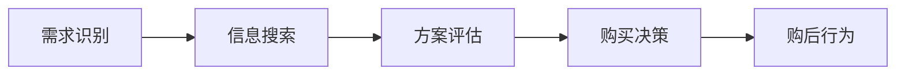
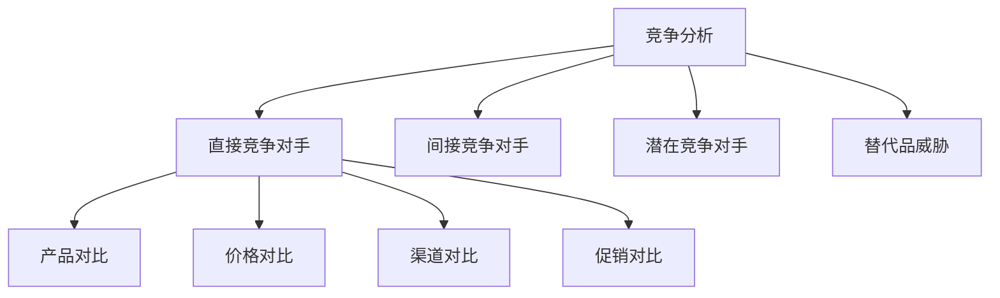
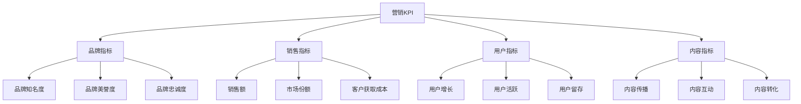

# 营销核心概念速查

## 基础概念

### 营销定义
**营销（Marketing）**：通过创造、传播、传递和交换对顾客、客户、合作伙伴和社会有价值的市场供应物来管理客户关系的过程。

### 核心要素
- **价值创造**：为顾客创造价值
- **关系管理**：建立和维护客户关系
- **交换过程**：促进价值交换
- **市场导向**：以市场为中心

## 经典理论

### 4P营销理论
| 要素 | 英文 | 中文 | 内容 |
|------|------|------|------|
| Product | 产品 | 产品策略 | 产品设计、功能、质量、品牌 |
| Price | 价格 | 价格策略 | 定价方法、价格策略、折扣 |
| Place | 渠道 | 渠道策略 | 分销渠道、零售、物流 |
| Promotion | 促销 | 促销策略 | 广告、公关、促销、人员销售 |

### 4C营销理论
| 要素 | 英文 | 中文 | 内容 |
|------|------|------|------|
| Customer | 顾客 | 顾客需求 | 顾客需求、偏好、行为 |
| Cost | 成本 | 顾客成本 | 价格、时间成本、心理成本 |
| Convenience | 便利 | 便利性 | 购买便利、使用便利 |
| Communication | 沟通 | 沟通 | 双向沟通、互动交流 |

### STP理论
| 步骤 | 英文 | 中文 | 内容 |
|------|------|------|------|
| Segmentation | 市场细分 | 市场细分 | 按需求、行为、特征细分 |
| Targeting | 目标市场 | 目标市场选择 | 选择最有吸引力的细分市场 |
| Positioning | 市场定位 | 市场定位 | 在目标市场中建立独特位置 |

## 消费者行为

### 消费者决策过程

### 消费者心理因素
- **认知因素**：感知、学习、记忆
- **情感因素**：态度、情绪、动机
- **社会因素**：文化、社会阶层、参考群体
- **个人因素**：年龄、性别、收入、生活方式

## 市场分析

### 市场细分标准
| 标准 | 内容 | 示例 |
|------|------|------|
| 地理细分 | 地区、城市、气候 | 一线城市、二线城市 |
| 人口细分 | 年龄、性别、收入 | 25-35岁、高收入群体 |
| 心理细分 | 生活方式、价值观 | 追求品质、环保意识 |
| 行为细分 | 使用频率、忠诚度 | 重度用户、品牌忠诚 |

### 竞争分析框架

## 品牌策略

### 品牌要素
- **品牌名称**：易于记忆、有含义
- **品牌标识**：视觉识别、符号化
- **品牌口号**：简洁有力、传达价值
- **品牌故事**：情感连接、文化内涵

### 品牌价值评估
| 维度 | 指标 | 说明 |
|------|------|------|
| 品牌知名度 | 认知度、回忆度 | 品牌在消费者心中的认知程度 |
| 品牌美誉度 | 满意度、推荐度 | 消费者对品牌的正面评价 |
| 品牌忠诚度 | 重复购买、转换成本 | 消费者对品牌的忠诚程度 |
| 品牌联想 | 品牌形象、个性 | 消费者对品牌的联想内容 |

## 数字营销

### 数字营销渠道
| 渠道 | 特点 | 适用场景 |
|------|------|----------|
| 搜索引擎 | 精准、主动 | 信息搜索、产品比较 |
| 社交媒体 | 互动、传播 | 品牌建设、用户互动 |
| 内容营销 | 价值、教育 | 品牌教育、用户培育 |
| 邮件营销 | 精准、成本低 | 客户维护、促销通知 |

### 数字营销指标
| 指标类型 | 具体指标 | 说明 |
|----------|----------|------|
| 流量指标 | PV、UV、跳出率 | 网站访问情况 |
| 转化指标 | 转化率、客单价 | 销售转化效果 |
| 用户指标 | 活跃度、留存率 | 用户参与程度 |
| 内容指标 | 分享率、评论数 | 内容传播效果 |

## 效果评估

### KPI指标体系

### ROI计算方法
**ROI = (收益 - 成本) / 成本 × 100%**

| 指标 | 计算公式 | 说明 |
|------|----------|------|
| 营销ROI | (营销收益 - 营销成本) / 营销成本 | 营销投资回报率 |
| 客户获取成本 | 营销成本 / 新增客户数 | 获得一个客户的成本 |
| 客户生命周期价值 | 平均客单价 × 购买频次 × 客户生命周期 | 客户总价值 |
| 投资回收期 | 投资成本 / 年净收益 | 收回投资的时间 |

## 创新趋势

### 新兴技术应用
| 技术 | 营销应用 | 优势 |
|------|----------|------|
| AI | 个性化推荐、智能客服 | 精准、高效 |
| 大数据 | 用户画像、预测分析 | 洞察、预测 |
| 区块链 | 数据安全、透明化 | 信任、透明 |
| 物联网 | 智能设备、场景营销 | 连接、场景 |

### 新兴营销模式
| 模式 | 特点 | 适用场景 |
|------|------|----------|
| 私域流量 | 自主可控、精准触达 | 用户运营、品牌建设 |
| 直播营销 | 实时互动、直观展示 | 产品展示、用户互动 |
| 短视频营销 | 内容生动、传播快速 | 品牌传播、用户教育 |
| 社群营销 | 用户聚合、价值共创 | 用户运营、品牌社区 |

## 营销伦理

### 基本原则
- **诚实守信**：真实宣传、不夸大
- **尊重隐私**：保护用户数据、合规使用
- **社会责任**：关注社会价值、可持续发展
- **公平竞争**：遵守规则、公平竞争

### 常见问题
| 问题 | 表现 | 后果 |
|------|------|------|
| 虚假宣传 | 夸大产品功效 | 法律风险、品牌受损 |
| 数据滥用 | 未经授权使用用户数据 | 隐私泄露、信任危机 |
| 价格欺诈 | 虚假折扣、价格操纵 | 消费者权益受损 |
| 恶意竞争 | 诋毁竞争对手 | 行业恶性竞争 |

## 学习资源

### 推荐书籍
- 《营销管理》- 菲利普·科特勒
- 《定位》- 艾·里斯、杰克·特劳特
- 《蓝海战略》- W.钱·金、勒妮·莫博涅
- 《增长黑客》- 肖恩·埃利斯

### 专业网站
- 营销人网站
- 36氪营销频道
- 虎嗅营销专栏
- 第一财经营销观察

### 学习工具
- 思维导图：XMind、MindMaster
- 数据分析：Excel、Tableau
- 项目管理：Notion、Trello
- 设计工具：Canva、Figma

---

**相关链接**：
- [[01-营销知识地图|营销知识地图]]
- [[营销/01-营销总览/02-学习路径指南|学习路径指南]]
- [[02-营销基础认知/01-营销本质与概念|营销本质与概念]]
