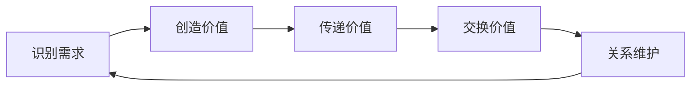
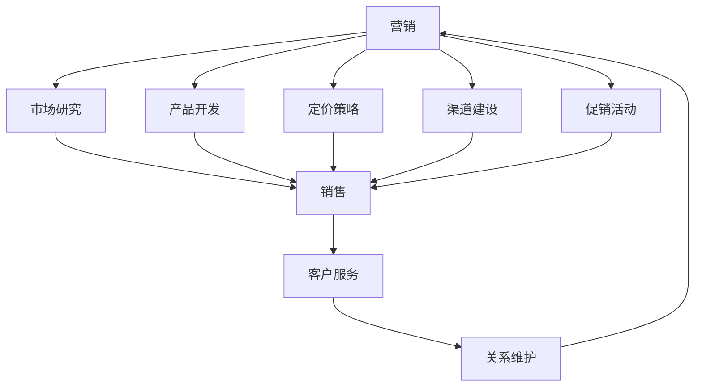
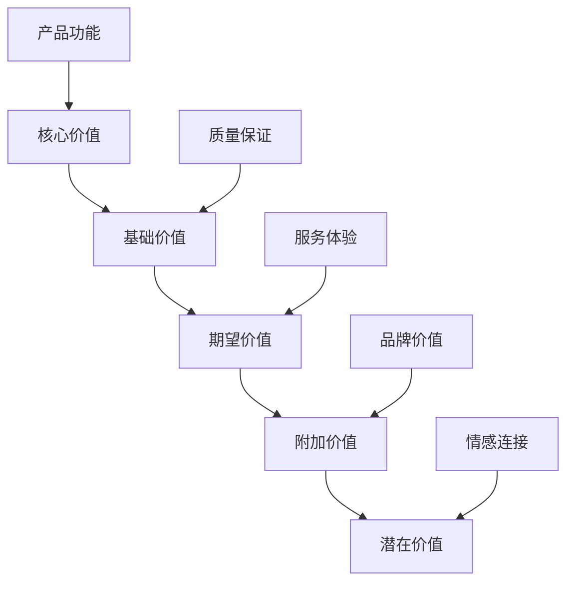
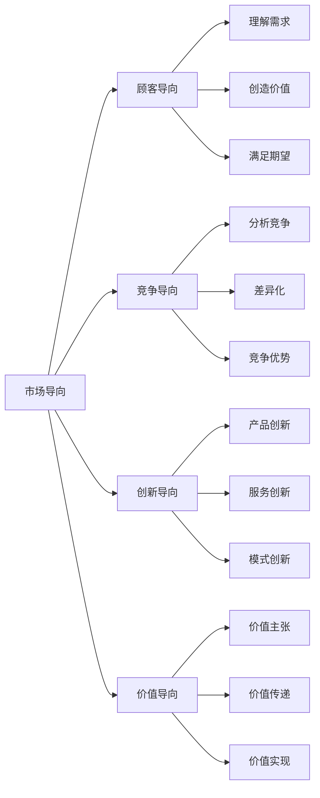
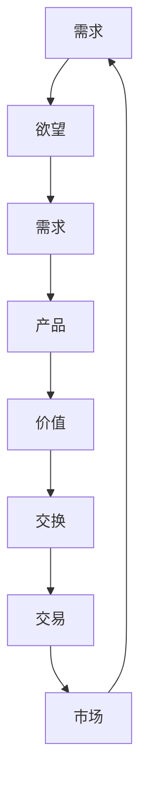
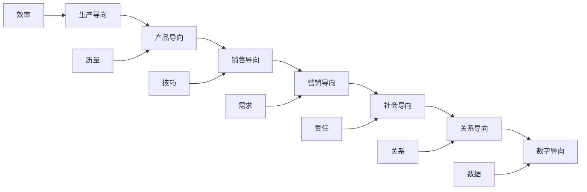
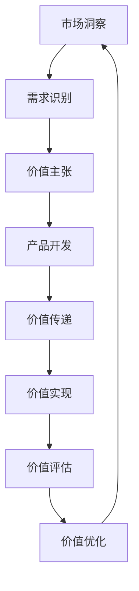
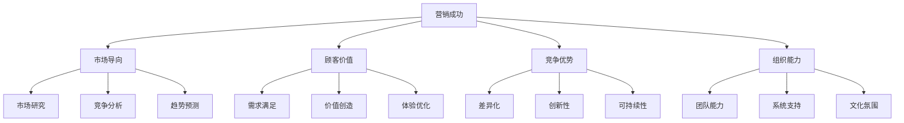

# 营销本质与概念

## 营销的定义

### 经典定义
**营销（Marketing）**：通过创造、传播、传递和交换对顾客、客户、合作伙伴和社会有价值的市场供应物来管理客户关系的过程。

### 现代定义
营销是识别、预测和满足客户需求，同时为企业创造利润的管理过程。

## 营销的核心要素

### 价值创造过程

### 四大核心要素
| 要素 | 内容 | 重要性 |
|------|------|--------|
| **价值创造** | 为顾客创造独特价值 | 营销的根本目的 |
| **关系管理** | 建立长期客户关系 | 持续竞争优势 |
| **交换过程** | 促进价值交换 | 营销的核心活动 |
| **市场导向** | 以市场为中心 | 营销的思维方式 |

## 营销与销售的区别

### 对比分析
| 维度 | 营销 | 销售 |
|------|------|------|
| **关注点** | 顾客需求 | 产品特性 |
| **时间范围** | 长期关系 | 短期交易 |
| **方法** | 价值创造 | 说服技巧 |
| **目标** | 顾客满意 | 销售业绩 |
| **视角** | 市场导向 | 产品导向 |

### 关系图解

## 营销的价值创造

### 价值层次理论

### 价值创造方法
1. **功能价值**：产品的基本功能
2. **情感价值**：品牌情感连接
3. **社会价值**：社会认同和地位
4. **认知价值**：知识和信息价值
5. **体验价值**：使用体验和感受

## 营销的思维方式

### 市场导向思维

### 系统思维
- **整体性**：从全局角度思考问题
- **关联性**：理解各要素之间的关系
- **动态性**：关注变化和发展趋势
- **反馈性**：建立反馈机制和调整机制

## 营销的基本概念

### 核心概念体系
| 概念 | 定义 | 应用 |
|------|------|------|
| **需求** | 人类感到缺乏的状态 | 市场机会识别 |
| **欲望** | 对特定满足物的愿望 | 产品设计方向 |
| **需求** | 有购买力的欲望 | 目标市场选择 |
| **产品** | 能够满足需求的任何东西 | 价值载体 |
| **价值** | 顾客对产品效用的评价 | 竞争优势来源 |
| **交换** | 通过提供某种东西获得所需 | 营销核心活动 |
| **交易** | 双方达成协议的交换 | 营销成功标志 |
| **市场** | 有需求和购买力的顾客群体 | 营销活动场所 |

### 概念关系图

## 营销的演变历程

### 营销观念演进
| 阶段 | 观念 | 特点 | 时间 |
|------|------|------|------|
| **生产观念** | 以生产为中心 | 关注生产效率 | 20世纪初 |
| **产品观念** | 以产品为中心 | 关注产品质量 | 20世纪20年代 |
| **销售观念** | 以销售为中心 | 关注销售技巧 | 20世纪30年代 |
| **营销观念** | 以顾客为中心 | 关注顾客需求 | 20世纪50年代 |
| **社会营销观念** | 以社会为中心 | 关注社会责任 | 20世纪70年代 |
| **关系营销观念** | 以关系为中心 | 关注长期关系 | 20世纪90年代 |
| **数字营销观念** | 以数据为中心 | 关注数字化 | 21世纪初 |

### 演进趋势

## 现代营销特点

### 数字化特征
- **数据驱动**：基于数据分析做决策
- **精准营销**：精准触达目标用户
- **实时互动**：实时与用户互动
- **个性化**：提供个性化体验

### 用户中心化
- **用户画像**：深入了解用户特征
- **用户旅程**：关注用户全生命周期
- **用户体验**：优化用户接触点
- **用户价值**：创造用户价值

### 全渠道整合
- **线上线下融合**：打通全渠道体验
- **多触点管理**：管理所有接触点
- **一致性体验**：提供一致的用户体验
- **数据整合**：整合全渠道数据

## 营销的价值创造机制

### 价值创造流程

### 价值创造要素
1. **市场洞察**：深入了解市场环境
2. **需求识别**：识别未被满足的需求
3. **价值主张**：设计独特的价值主张
4. **产品开发**：开发满足需求的产品
5. **价值传递**：有效传递价值信息
6. **价值实现**：实现价值交换
7. **价值评估**：评估价值创造效果
8. **价值优化**：持续优化价值创造

## 营销的成功要素

### 成功要素模型

### 关键成功因素
1. **市场导向**：以市场为中心
2. **顾客价值**：创造顾客价值
3. **竞争优势**：建立竞争优势
4. **组织能力**：提升组织能力
5. **创新驱动**：持续创新
6. **数据支撑**：数据驱动决策
7. **执行能力**：高效执行
8. **学习能力**：持续学习改进

## 实践应用

### 营销思维训练
1. **换位思考**：从顾客角度思考问题
2. **价值思维**：关注价值创造
3. **系统思维**：整体性思考
4. **创新思维**：突破传统思维
5. **数据思维**：基于数据决策

### 营销能力建设
1. **市场洞察能力**：敏锐的市场嗅觉
2. **需求分析能力**：深入的需求理解
3. **价值创造能力**：独特的价值创造
4. **沟通传播能力**：有效的沟通传播
5. **关系管理能力**：长期的关系维护

---

**相关链接**：
- [[02-营销发展历程|营销发展历程]]
- [[03-现代营销环境|现代营销环境]]
- [[04-营销思维模式|营销思维模式]]
- [[03-营销理论框架/01-经典营销理论/01-4P营销理论|4P营销理论]]
