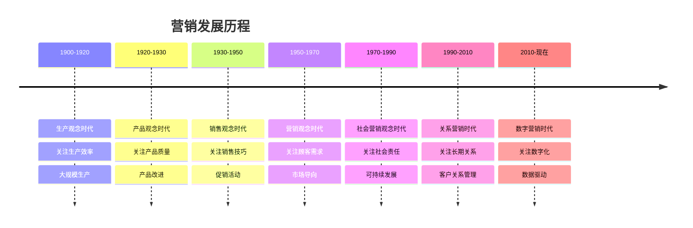
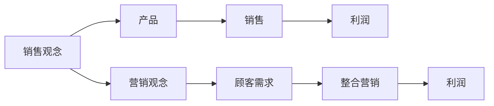
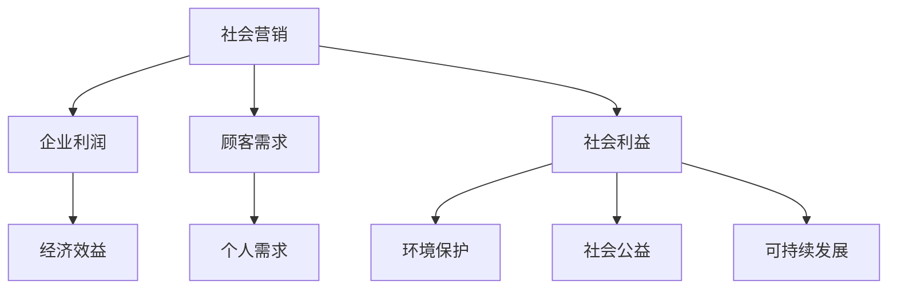
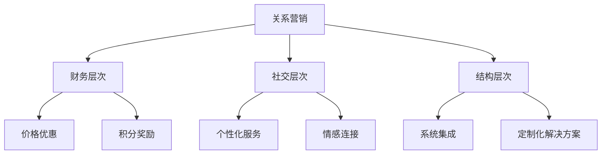
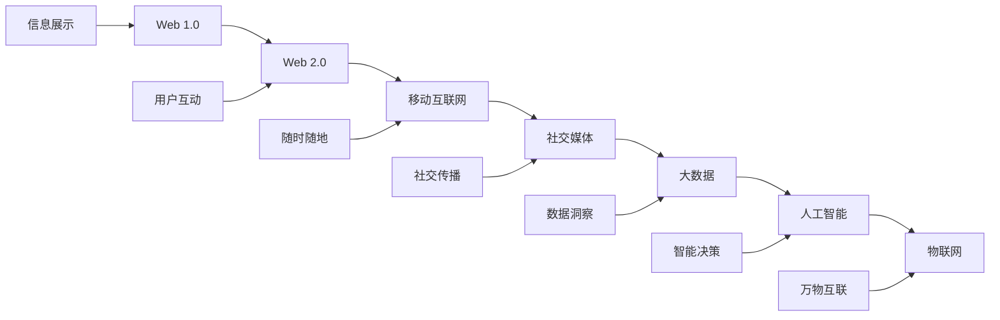
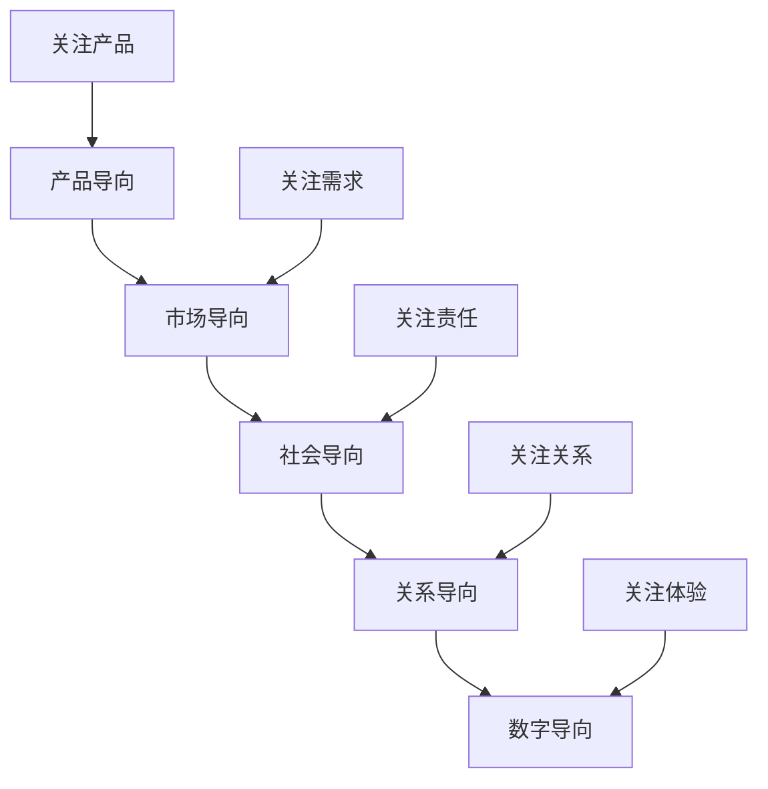
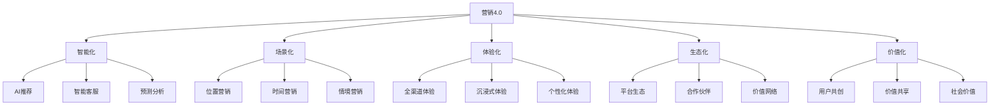

# 营销发展历程

## 营销发展阶段概览

### 发展时间线

## 各阶段详细分析

### 1. 生产观念时代（1900-1920）

#### 时代背景
- 工业革命带来生产力大幅提升
- 市场需求旺盛，供不应求
- 企业关注如何提高生产效率

#### 核心特征
| 特征 | 内容 | 影响 |
|------|------|------|
| **关注点** | 生产效率 | 大规模生产 |
| **假设** | 顾客喜欢便宜的产品 | 价格竞争 |
| **方法** | 提高生产效率 | 降低成本 |
| **目标** | 扩大生产规模 | 满足需求 |

#### 典型代表
- **福特汽车**：T型车的大规模生产
- **可口可乐**：标准化生产流程
- **通用电气**：流水线生产方式

#### 局限性
- 忽视产品质量和多样性
- 不关注顾客个性化需求
- 缺乏市场调研和顾客反馈

### 2. 产品观念时代（1920-1930）

#### 时代背景
- 生产技术不断改进
- 产品质量成为竞争焦点
- 企业开始关注产品改进

#### 核心特征
| 特征 | 内容 | 影响 |
|------|------|------|
| **关注点** | 产品质量 | 产品改进 |
| **假设** | 顾客喜欢高质量产品 | 质量竞争 |
| **方法** | 持续改进产品 | 技术创新 |
| **目标** | 生产最好产品 | 技术领先 |

#### 典型代表
- **IBM**：注重产品质量和技术
- **通用汽车**：产品多样化和质量提升
- **宝洁**：产品研发和创新

#### 局限性
- 过度关注产品而忽视市场需求
- 缺乏市场导向思维
- 可能陷入"产品陷阱"

### 3. 销售观念时代（1930-1950）

#### 时代背景
- 经济大萧条导致需求下降
- 市场竞争加剧
- 企业需要主动销售产品

#### 核心特征
| 特征 | 内容 | 影响 |
|------|------|------|
| **关注点** | 销售技巧 | 促销活动 |
| **假设** | 顾客不会主动购买 | 主动销售 |
| **方法** | 广告和促销 | 说服技巧 |
| **目标** | 提高销售量 | 销售业绩 |

#### 典型代表
- **广告业兴起**：大规模广告投放
- **销售培训**：销售技巧培训
- **促销活动**：各种促销手段

#### 局限性
- 忽视顾客真实需求
- 可能产生过度销售
- 缺乏长期关系建设

### 4. 营销观念时代（1950-1970）

#### 时代背景
- 战后经济繁荣
- 消费者需求多样化
- 企业开始关注顾客需求

#### 核心特征
| 特征 | 内容 | 影响 |
|------|------|------|
| **关注点** | 顾客需求 | 市场导向 |
| **假设** | 满足顾客需求才能成功 | 顾客中心 |
| **方法** | 市场调研 | 需求分析 |
| **目标** | 顾客满意 | 长期成功 |

#### 典型代表
- **麦当劳**：标准化服务和体验
- **迪士尼**：顾客体验至上
- **宝洁**：市场细分和定位

#### 营销观念革命

#### 重要意义
- 从产品导向转向市场导向
- 从销售导向转向需求导向
- 从短期交易转向长期关系

### 5. 社会营销观念时代（1970-1990）

#### 时代背景
- 环境问题日益严重
- 社会责任意识增强
- 可持续发展理念兴起

#### 核心特征
| 特征 | 内容 | 影响 |
|------|------|------|
| **关注点** | 社会责任 | 可持续发展 |
| **假设** | 企业应承担社会责任 | 社会价值 |
| **方法** | 绿色营销 | 公益营销 |
| **目标** | 社会效益 | 长期发展 |

#### 典型代表
- **Patagonia**：环保理念和可持续发展
- **Ben & Jerry's**：社会公益活动
- **Body Shop**：反对动物测试

#### 社会营销模型

### 6. 关系营销时代（1990-2010）

#### 时代背景
- 市场竞争白热化
- 顾客获取成本上升
- 长期关系价值凸显

#### 核心特征
| 特征 | 内容 | 影响 |
|------|------|------|
| **关注点** | 长期关系 | 客户关系管理 |
| **假设** | 保留顾客比获取更重要 | 关系价值 |
| **方法** | CRM系统 | 个性化服务 |
| **目标** | 顾客忠诚 | 长期价值 |

#### 关系营销层次

#### 典型代表
- **亚马逊**：个性化推荐和会员服务
- **星巴克**：会员制度和社区建设
- **苹果**：生态系统和用户粘性

### 7. 数字营销时代（2010-现在）

#### 时代背景
- 互联网和移动互联网普及
- 大数据和人工智能发展
- 社交媒体和电商兴起

#### 核心特征
| 特征 | 内容 | 影响 |
|------|------|------|
| **关注点** | 数字化 | 数据驱动 |
| **假设** | 数据是新的石油 | 精准营销 |
| **方法** | 数字技术 | 智能化 |
| **目标** | 用户体验 | 数字化转型 |

#### 数字营销演进

#### 数字营销特点
- **精准性**：精准触达目标用户
- **互动性**：实时互动和反馈
- **个性化**：个性化内容和体验
- **数据化**：数据驱动决策
- **智能化**：AI辅助营销

## 营销观念对比

### 观念演进对比表
| 阶段 | 关注点 | 方法 | 目标 | 时间 |
|------|--------|------|------|------|
| **生产观念** | 生产效率 | 大规模生产 | 降低成本 | 1900-1920 |
| **产品观念** | 产品质量 | 产品改进 | 技术领先 | 1920-1930 |
| **销售观念** | 销售技巧 | 广告促销 | 提高销量 | 1930-1950 |
| **营销观念** | 顾客需求 | 市场调研 | 顾客满意 | 1950-1970 |
| **社会营销** | 社会责任 | 绿色营销 | 社会效益 | 1970-1990 |
| **关系营销** | 长期关系 | CRM系统 | 顾客忠诚 | 1990-2010 |
| **数字营销** | 数字化 | 数字技术 | 用户体验 | 2010-现在 |

### 观念转变趋势

## 未来发展趋势

### 营销4.0时代特征
| 特征 | 内容 | 趋势 |
|------|------|------|
| **智能化** | AI驱动的个性化营销 | 机器学习和深度学习 |
| **场景化** | 基于场景的营销 | 物联网和5G技术 |
| **体验化** | 全渠道用户体验 | 线上线下融合 |
| **生态化** | 平台生态营销 | 生态系统建设 |
| **价值化** | 价值共创营销 | 用户参与价值创造 |

### 未来营销模型

## 学习启示

### 历史经验总结
1. **适应变化**：营销观念需要不断适应环境变化
2. **顾客中心**：始终以顾客需求为中心
3. **价值创造**：持续创造顾客价值
4. **关系建设**：建立长期客户关系
5. **技术创新**：利用新技术提升营销效果

### 现代营销启示
1. **数据驱动**：基于数据分析做决策
2. **用户思维**：从用户角度思考问题
3. **体验至上**：关注用户体验
4. **生态思维**：构建营销生态系统
5. **持续创新**：持续创新营销方法

---

**相关链接**：
- [[01-营销本质与概念|营销本质与概念]]
- [[03-现代营销环境|现代营销环境]]
- [[04-营销思维模式|营销思维模式]]
- [[07-营销创新趋势/03-未来趋势/01-营销发展趋势|营销发展趋势]]
