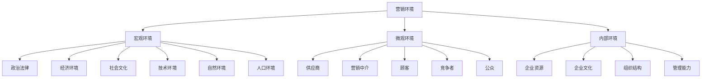
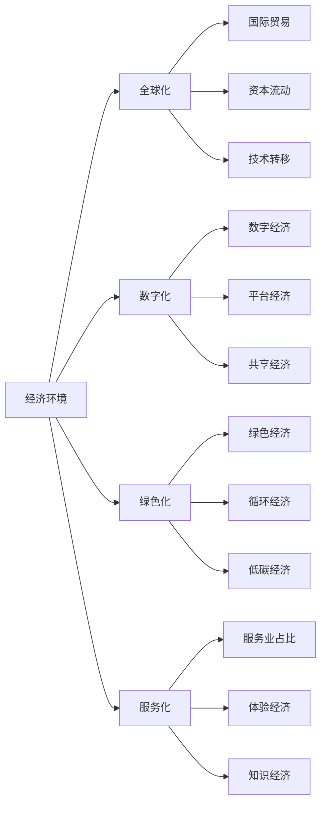
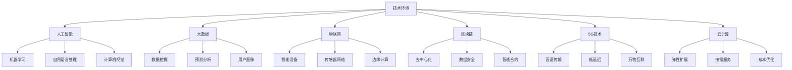
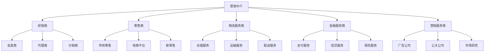
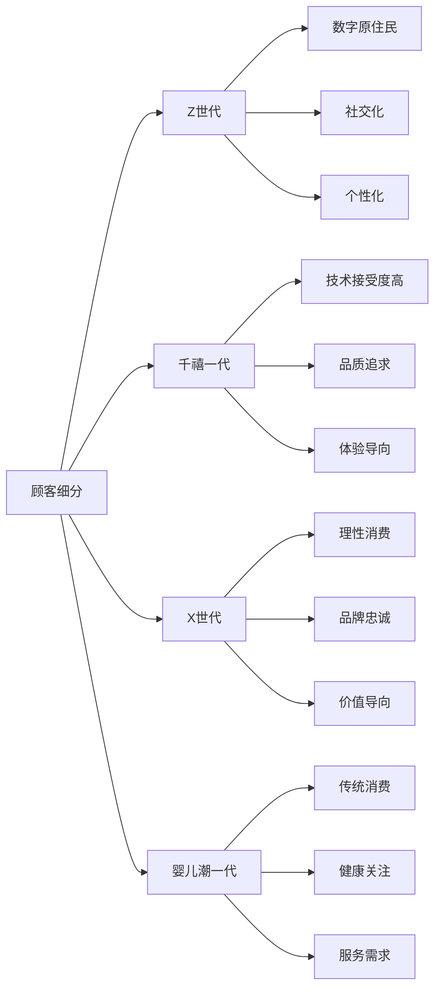
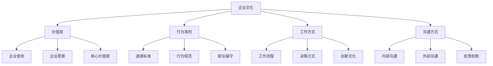
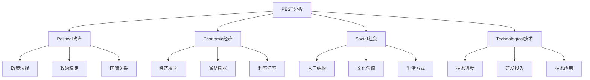
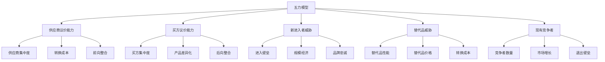

# 现代营销环境

## 营销环境概述

### 环境分析框架

## 宏观环境分析

### 1. 政治法律环境

#### 主要影响因素
| 因素 | 内容 | 影响 |
|------|------|------|
| **政策法规** | 行业政策、监管要求 | 合规经营、市场准入 |
| **政治稳定** | 政治环境稳定性 | 投资信心、市场预期 |
| **国际关系** | 贸易政策、外交关系 | 进出口、国际合作 |
| **法律体系** | 知识产权、消费者保护 | 创新保护、权益保障 |

#### 发展趋势
- **监管趋严**：数据保护、隐私法规
- **政策支持**：数字化转型、绿色发展
- **国际合作**：一带一路、区域合作
- **法律完善**：消费者权益、知识产权

### 2. 经济环境

#### 关键指标
| 指标 | 内容 | 影响 |
|------|------|------|
| **GDP增长** | 经济增长速度 | 市场容量、消费能力 |
| **通货膨胀** | 物价水平变化 | 成本压力、定价策略 |
| **利率水平** | 资金成本 | 投资决策、消费信贷 |
| **汇率变化** | 货币价值波动 | 进出口、国际竞争 |

#### 经济环境特点

### 3. 社会文化环境

#### 社会变化趋势
| 趋势 | 内容 | 营销影响 |
|------|------|----------|
| **人口老龄化** | 老年人口增加 | 银发经济、健康产品 |
| **城市化进程** | 城市人口增长 | 城市消费、生活方式 |
| **教育水平提升** | 知识型社会 | 品质消费、理性选择 |
| **价值观多元化** | 个性化需求 | 细分市场、定制化 |

#### 文化环境特征
- **传统文化复兴**：国潮品牌、文化自信
- **国际化融合**：跨文化营销、全球化品牌
- **生活方式变化**：健康生活、环保意识
- **消费观念升级**：品质消费、体验消费

### 4. 技术环境

#### 技术发展趋势

#### 技术对营销的影响
- **精准营销**：基于大数据的用户画像
- **个性化推荐**：AI驱动的智能推荐
- **实时互动**：5G技术支持的实时体验
- **数据安全**：区块链技术保障数据安全

### 5. 自然环境

#### 环境挑战
| 挑战 | 内容 | 营销应对 |
|------|------|----------|
| **气候变化** | 全球变暖、极端天气 | 绿色营销、可持续发展 |
| **资源短缺** | 能源、水资源紧张 | 节能产品、循环利用 |
| **环境污染** | 空气、水、土壤污染 | 环保产品、清洁技术 |
| **生物多样性** | 物种灭绝、生态破坏 | 生态保护、可持续消费 |

#### 绿色营销趋势
- **可持续发展**：ESG理念、绿色品牌
- **循环经济**：产品回收、资源再利用
- **清洁能源**：可再生能源、低碳技术
- **环保意识**：消费者环保意识提升

### 6. 人口环境

#### 人口结构变化
| 变化 | 特征 | 营销机会 |
|------|------|----------|
| **人口老龄化** | 65岁以上人口增加 | 银发经济、健康产品 |
| **少子化** | 生育率下降 | 教育投资、品质消费 |
| **城市化** | 城市人口增长 | 城市服务、生活方式 |
| **中产阶级扩大** | 消费能力提升 | 品质消费、品牌消费 |

#### 人口红利变化
- **数量红利**：向质量红利转变
- **年龄结构**：老龄化社会特征
- **教育水平**：知识型劳动力
- **消费能力**：中产阶级消费升级

## 微观环境分析

### 1. 供应商环境

#### 供应商关系管理
| 关系类型 | 特征 | 管理策略 |
|----------|------|----------|
| **战略合作伙伴** | 长期合作、共同发展 | 深度合作、价值共创 |
| **重要供应商** | 关键资源、不可替代 | 稳定关系、风险管控 |
| **一般供应商** | 标准产品、可替代 | 成本控制、效率优化 |
| **潜在供应商** | 新兴供应商、备选方案 | 市场调研、关系建立 |

#### 供应商发展趋势
- **数字化采购**：在线采购平台、智能采购
- **供应链协同**：信息共享、协同计划
- **可持续发展**：绿色供应链、社会责任
- **风险管控**：供应链安全、应急管理

### 2. 营销中介环境

#### 中介类型分析

#### 中介环境变化
- **渠道整合**：线上线下融合
- **服务升级**：增值服务、体验优化
- **技术驱动**：数字化、智能化
- **生态合作**：平台生态、价值网络

### 3. 顾客环境

#### 顾客行为变化
| 变化 | 特征 | 营销影响 |
|------|------|----------|
| **数字化消费** | 在线购物、移动支付 | 全渠道营销、数字化体验 |
| **个性化需求** | 定制化、个性化 | 精准营销、个性化服务 |
| **体验导向** | 重视体验、情感价值 | 体验营销、情感连接 |
| **社交化消费** | 社交分享、口碑传播 | 社交营销、口碑管理 |

#### 顾客细分趋势

### 4. 竞争者环境

#### 竞争格局分析
| 竞争类型 | 特征 | 应对策略 |
|----------|------|----------|
| **直接竞争** | 同类产品、相同市场 | 差异化、竞争优势 |
| **间接竞争** | 替代产品、不同市场 | 价值创新、市场拓展 |
| **潜在竞争** | 新进入者、技术替代 | 壁垒建设、创新领先 |
| **供应商竞争** | 供应商议价能力 | 供应商管理、替代方案 |

#### 竞争环境特点
- **竞争加剧**：市场饱和、同质化
- **创新驱动**：技术创新、模式创新
- **生态竞争**：平台生态、生态系统
- **全球化竞争**：国际竞争、本土化

### 5. 公众环境

#### 公众类型分析
| 公众类型 | 特征 | 关系管理 |
|----------|------|----------|
| **媒体公众** | 信息传播、舆论影响 | 媒体关系、危机公关 |
| **政府公众** | 政策制定、监管执行 | 政府关系、合规经营 |
| **社区公众** | 本地社区、社会责任 | 社区关系、公益活动 |
| **内部公众** | 员工、股东 | 内部沟通、员工关系 |

#### 公众关系管理
- **透明沟通**：信息公开、透明经营
- **社会责任**：公益活动、可持续发展
- **危机管理**：危机预防、应急响应
- **利益相关者**：多方利益、平衡发展

## 内部环境分析

### 1. 企业资源分析

#### 资源类型
| 资源类型 | 内容 | 重要性 |
|----------|------|--------|
| **有形资源** | 资金、设备、厂房 | 基础支撑 |
| **无形资源** | 品牌、专利、技术 | 竞争优势 |
| **人力资源** | 员工、管理团队 | 核心能力 |
| **组织资源** | 文化、制度、流程 | 运营效率 |

#### 资源评估
- **资源价值**：资源对企业的价值
- **资源稀缺性**：资源的稀缺程度
- **资源可替代性**：资源的可替代性
- **资源可模仿性**：资源的可模仿性

### 2. 企业文化分析

#### 文化要素

#### 文化对营销的影响
- **品牌文化**：品牌价值观、品牌个性
- **服务文化**：客户服务、用户体验
- **创新文化**：产品创新、营销创新
- **合作文化**：团队合作、外部合作

### 3. 组织结构分析

#### 组织类型
| 组织类型 | 特征 | 适用场景 |
|----------|------|----------|
| **职能型** | 按职能分工 | 稳定环境、标准化 |
| **产品型** | 按产品线分工 | 多产品、差异化 |
| **市场型** | 按市场区域分工 | 多市场、本地化 |
| **矩阵型** | 双重汇报关系 | 复杂项目、跨部门 |

#### 组织对营销的影响
- **决策效率**：组织结构影响决策速度
- **协调能力**：跨部门协调和合作
- **创新能力**：组织灵活性影响创新
- **执行能力**：组织结构影响执行效果

### 4. 管理能力分析

#### 管理能力要素
| 能力要素 | 内容 | 重要性 |
|----------|------|--------|
| **战略管理** | 战略规划、战略执行 | 方向指引 |
| **运营管理** | 流程优化、效率提升 | 运营效率 |
| **人力资源管理** | 人才招聘、人才培养 | 人才保障 |
| **财务管理** | 资金管理、成本控制 | 财务健康 |

#### 管理能力评估
- **领导力**：管理层的领导能力
- **执行力**：战略执行和落地能力
- **学习力**：组织学习和适应能力
- **创新力**：管理创新和变革能力

## 环境分析工具

### 1. PEST分析

### 2. 五力模型

### 3. SWOT分析
| 内部因素 | 外部因素 |
|----------|----------|
| **优势(Strengths)** | **机会(Opportunities)** |
| **劣势(Weaknesses)** | **威胁(Threats)** |

## 环境适应策略

### 1. 环境监测
- **趋势跟踪**：持续跟踪环境变化趋势
- **预警机制**：建立环境变化预警系统
- **信息收集**：多渠道收集环境信息
- **分析评估**：定期分析评估环境影响

### 2. 适应性调整
- **战略调整**：根据环境变化调整战略
- **组织变革**：适应环境变化的组织变革
- **能力建设**：提升环境适应能力
- **风险管理**：识别和管理环境风险

### 3. 主动影响
- **政策参与**：参与政策制定和行业标准
- **行业合作**：与行业伙伴共同应对挑战
- **技术创新**：通过技术创新改变环境
- **社会责任**：承担社会责任影响环境

---

**相关链接**：
- [[02-营销发展历程|营销发展历程]]
- [[04-营销思维模式|营销思维模式]]
- [[03-营销理论框架/02-战略营销理论/02-竞争分析理论|竞争分析理论]]
- [[04-营销策略制定/01-市场分析/01-市场调研方法|市场调研方法]]
