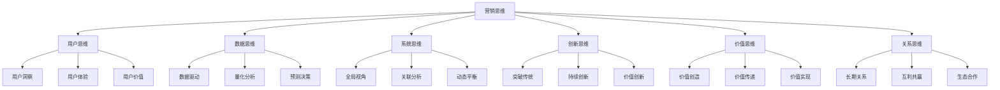
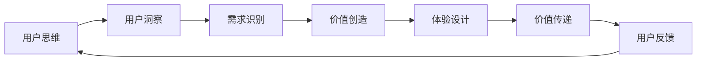
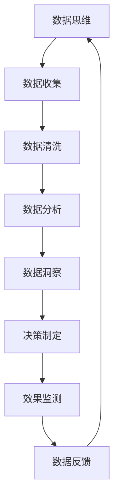
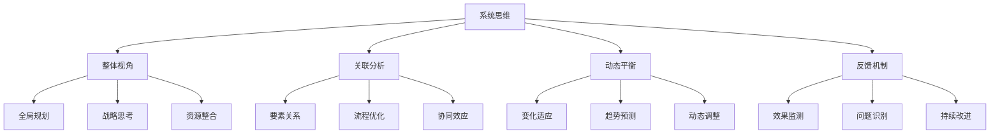
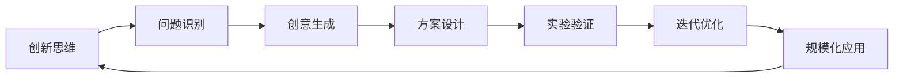
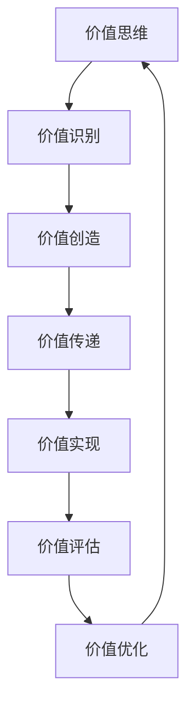
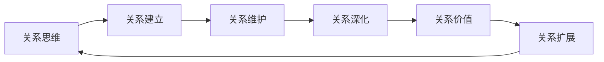
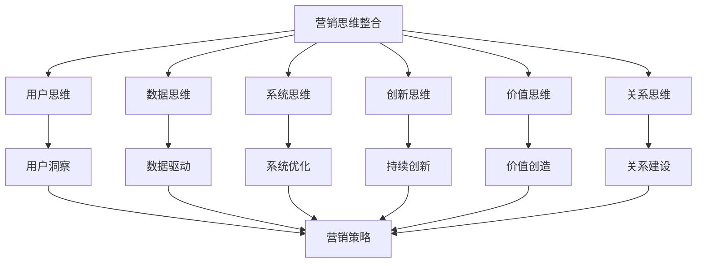

# 营销思维模式

## 营销思维概述

### 思维模式定义
**营销思维**：以市场为导向，以顾客为中心，以价值创造为目标，以系统性和创新性为特征的思维方式。

### 思维模式框架

## 用户思维

### 用户思维核心
**用户思维**：始终从用户角度思考问题，关注用户需求、体验和价值。

### 用户思维要素
| 要素 | 内容 | 应用 |
|------|------|------|
| **用户洞察** | 深入理解用户需求和行为 | 市场调研、用户画像 |
| **用户体验** | 优化用户接触点体验 | 产品设计、服务优化 |
| **用户价值** | 为用户创造价值 | 价值主张、价值传递 |
| **用户参与** | 让用户参与价值创造 | 用户共创、社区建设 |

### 用户思维模型

### 用户思维实践
1. **换位思考**：站在用户角度思考问题
2. **深度访谈**：深入了解用户真实需求
3. **用户旅程**：分析用户完整体验过程
4. **快速迭代**：基于用户反馈快速改进
5. **用户共创**：让用户参与产品和服务设计

## 数据思维

### 数据思维核心
**数据思维**：基于数据分析做决策，用数据驱动营销活动。

### 数据思维要素
| 要素 | 内容 | 应用 |
|------|------|------|
| **数据收集** | 多渠道收集相关数据 | 用户行为、市场数据 |
| **数据分析** | 运用分析方法挖掘洞察 | 统计分析、机器学习 |
| **数据可视化** | 将数据转化为直观图表 | 仪表板、报告展示 |
| **数据驱动** | 基于数据做决策 | 策略制定、效果评估 |

### 数据思维流程

### 数据思维工具
- **统计分析**：描述统计、推断统计
- **机器学习**：分类、聚类、预测
- **数据可视化**：图表、仪表板、地图
- **A/B测试**：实验设计、效果验证

## 系统思维

### 系统思维核心
**系统思维**：从整体和系统的角度思考问题，关注各要素之间的关联和相互作用。

### 系统思维要素
| 要素 | 内容 | 应用 |
|------|------|------|
| **整体性** | 从全局角度思考问题 | 战略规划、系统设计 |
| **关联性** | 理解各要素之间的关系 | 流程优化、协同合作 |
| **动态性** | 关注系统变化和发展 | 趋势分析、预测规划 |
| **反馈性** | 建立反馈机制和调整 | 效果评估、持续改进 |

### 系统思维模型

### 系统思维应用
1. **营销生态系统**：构建完整的营销生态系统
2. **价值链分析**：分析整个价值链的各个环节
3. **利益相关者**：考虑所有利益相关者的需求
4. **长期规划**：从长期角度规划营销活动
5. **协同效应**：发挥各要素的协同效应

## 创新思维

### 创新思维核心
**创新思维**：突破传统思维模式，寻求新的解决方案和价值创造方式。

### 创新思维要素
| 要素 | 内容 | 应用 |
|------|------|------|
| **突破性** | 突破传统思维限制 | 产品创新、模式创新 |
| **前瞻性** | 预测未来发展趋势 | 技术趋势、市场趋势 |
| **实验性** | 通过实验验证想法 | 快速原型、A/B测试 |
| **迭代性** | 持续改进和优化 | 敏捷开发、持续迭代 |

### 创新思维模型

### 创新思维方法
1. **设计思维**：以人为中心的创新方法
2. **蓝海战略**：创造新的市场空间
3. **颠覆性创新**：颠覆现有市场格局
4. **开放式创新**：利用外部资源创新
5. **敏捷创新**：快速迭代的创新方法

## 价值思维

### 价值思维核心
**价值思维**：以价值创造为核心，关注价值创造、传递和实现的全过程。

### 价值思维要素
| 要素 | 内容 | 应用 |
|------|------|------|
| **价值创造** | 为顾客创造独特价值 | 产品设计、服务创新 |
| **价值传递** | 有效传递价值信息 | 品牌传播、营销沟通 |
| **价值实现** | 实现价值交换 | 销售转化、价值变现 |
| **价值评估** | 评估价值创造效果 | 效果测量、ROI分析 |

### 价值思维模型

### 价值思维应用
1. **价值主张**：设计独特的价值主张
2. **价值网络**：构建价值创造网络
3. **价值共创**：与顾客共同创造价值
4. **价值分享**：与合作伙伴分享价值
5. **价值最大化**：最大化整体价值

## 关系思维

### 关系思维核心
**关系思维**：重视长期关系建设，通过关系管理创造持续价值。

### 关系思维要素
| 要素 | 内容 | 应用 |
|------|------|------|
| **长期导向** | 关注长期关系发展 | 客户关系管理、品牌建设 |
| **互利共赢** | 寻求双方共同利益 | 合作伙伴关系、生态合作 |
| **信任建设** | 建立信任和信誉 | 品牌信任、企业信誉 |
| **情感连接** | 建立情感连接 | 品牌情感、用户粘性 |

### 关系思维模型

### 关系思维应用
1. **客户关系管理**：建立长期客户关系
2. **合作伙伴关系**：与合作伙伴共同发展
3. **员工关系**：建立良好的员工关系
4. **社区关系**：与社区建立良好关系
5. **生态关系**：构建健康的生态系统

## 思维模式整合

### 整合模型

### 思维模式协同
1. **用户思维 + 数据思维**：基于数据洞察用户需求
2. **系统思维 + 价值思维**：从系统角度优化价值创造
3. **创新思维 + 关系思维**：通过创新深化关系
4. **数据思维 + 系统思维**：用数据优化系统
5. **价值思维 + 用户思维**：为用户创造价值

## 思维模式培养

### 培养方法
1. **理论学习**：学习相关理论和方法
2. **实践应用**：在实际工作中应用
3. **反思总结**：定期反思和总结
4. **交流学习**：与同行交流学习
5. **持续改进**：持续改进和优化

### 培养工具
- **思维导图**：整理和梳理思维
- **案例分析**：通过案例学习思维
- **角色扮演**：换位思考练习
- **头脑风暴**：激发创新思维
- **复盘总结**：总结经验和教训

### 培养评估
1. **思维敏捷性**：思维反应速度
2. **思维深度**：思维分析深度
3. **思维广度**：思维覆盖范围
4. **思维创新性**：思维创新程度
5. **思维实用性**：思维应用效果

## 实践应用

### 营销策略制定
1. **用户思维**：深入了解目标用户
2. **数据思维**：基于数据分析制定策略
3. **系统思维**：考虑整体营销系统
4. **创新思维**：寻求差异化策略
5. **价值思维**：关注价值创造
6. **关系思维**：建立长期关系

### 营销执行实施
1. **用户思维**：优化用户体验
2. **数据思维**：数据驱动执行
3. **系统思维**：协调各要素
4. **创新思维**：创新执行方法
5. **价值思维**：传递价值信息
6. **关系思维**：维护客户关系

### 营销效果评估
1. **用户思维**：从用户角度评估
2. **数据思维**：用数据评估效果
3. **系统思维**：全面评估系统
4. **创新思维**：创新评估方法
5. **价值思维**：评估价值创造
6. **关系思维**：评估关系质量

---

**相关链接**：
- [[01-营销本质与概念|营销本质与概念]]
- [[05-营销心理学基础|营销心理学基础]]
- [[03-营销理论框架/03-消费者行为理论/02-消费者心理分析|消费者心理分析]]
- [[04-营销策略制定/01-市场分析/01-市场调研方法|市场调研方法]]
