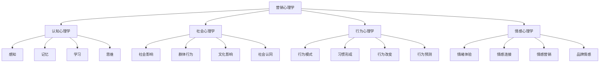
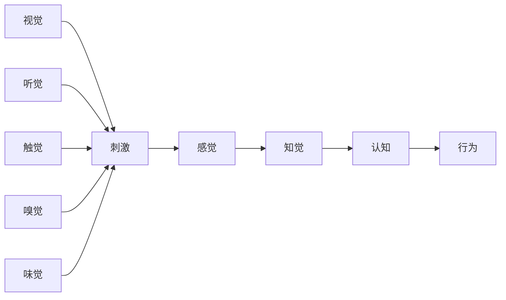
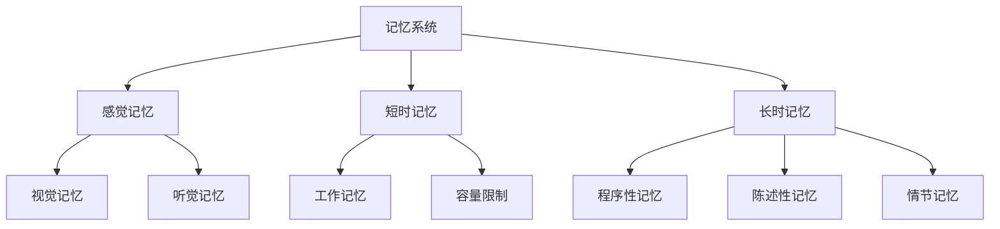
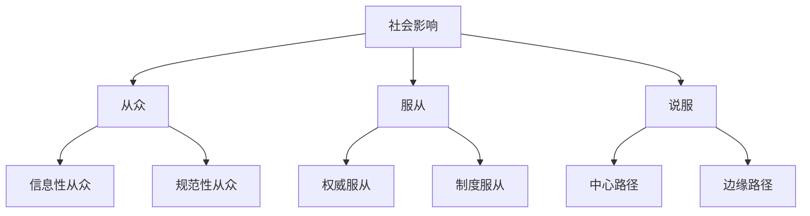
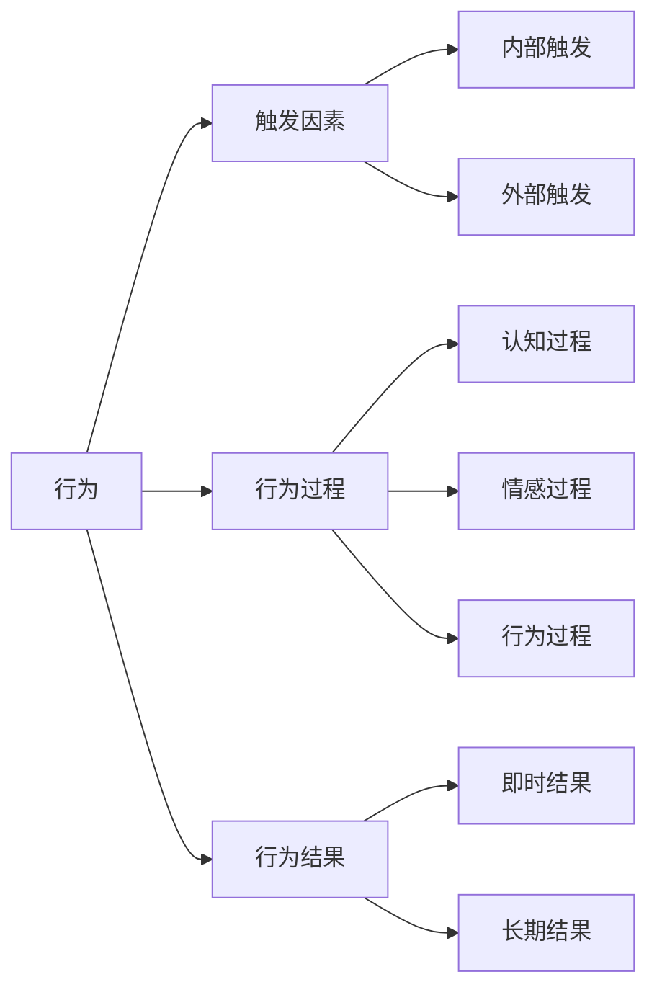
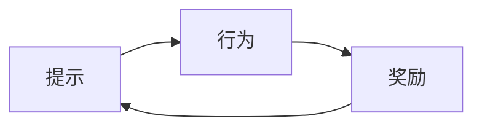
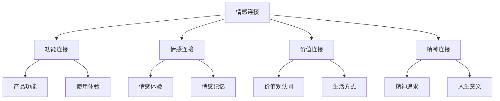

# 营销心理学基础

## 营销心理学概述

### 定义与作用
**营销心理学**：研究消费者在营销活动中的心理现象、心理过程和心理规律的科学。

### 核心作用
| 作用 | 内容 | 应用 |
|------|------|------|
| **理解消费者** | 深入了解消费者心理 | 用户画像、需求分析 |
| **预测行为** | 预测消费者购买行为 | 市场预测、销售预测 |
| **影响决策** | 影响消费者购买决策 | 营销策略、广告设计 |
| **优化体验** | 优化消费者体验 | 产品设计、服务优化 |

### 心理学基础框架

## 认知心理学应用

### 1. 感知与注意

#### 感知过程

#### 感知规律
| 规律 | 内容 | 营销应用 |
|------|------|----------|
| **选择性注意** | 只关注部分信息 | 突出关键信息 |
| **知觉组织** | 将信息组织成整体 | 设计整体形象 |
| **知觉恒常性** | 保持对事物的稳定认知 | 品牌一致性 |
| **知觉偏差** | 感知中的系统性偏差 | 利用认知偏差 |

#### 营销应用
- **视觉设计**：色彩、形状、布局
- **品牌标识**：简洁、易识别、有含义
- **包装设计**：吸引注意、传达信息
- **广告设计**：突出卖点、易于理解

### 2. 记忆与学习

#### 记忆系统

#### 记忆规律
| 规律 | 内容 | 营销应用 |
|------|------|----------|
| **编码特异性** | 记忆与编码环境相关 | 情境营销 |
| **遗忘曲线** | 记忆随时间衰减 | 重复营销 |
| **记忆重构** | 记忆会被重构 | 品牌故事 |
| **情绪记忆** | 情绪增强记忆 | 情感营销 |

#### 学习理论
- **经典条件反射**：巴甫洛夫条件反射
- **操作条件反射**：斯金纳强化理论
- **观察学习**：班杜拉社会学习理论
- **认知学习**：信息加工理论

### 3. 思维与决策

#### 决策过程

#### 决策类型
| 类型 | 特征 | 营销策略 |
|------|------|----------|
| **理性决策** | 逻辑分析、全面比较 | 提供详细信息 |
| **感性决策** | 情感驱动、直觉判断 | 情感诉求 |
| **习惯性决策** | 自动化、无需思考 | 建立品牌习惯 |
| **冲动性决策** | 即时满足、情绪驱动 | 刺激购买冲动 |

#### 认知偏差
| 偏差类型 | 内容 | 营销应用 |
|----------|------|----------|
| **锚定效应** | 过度依赖初始信息 | 价格锚定 |
| **损失厌恶** | 对损失的敏感度更高 | 损失框架 |
| **从众效应** | 跟随他人行为 | 社会证明 |
| **确认偏差** | 寻找支持自己观点的信息 | 品牌一致性 |

## 社会心理学应用

### 1. 社会影响

#### 影响机制

#### 社会证明
| 类型 | 内容 | 营销应用 |
|------|------|----------|
| **数量证明** | 很多人都在使用 | 销量数据、用户数量 |
| **质量证明** | 专家推荐、权威认证 | 专家背书、权威机构 |
| **相似性证明** | 相似人群的选择 | 用户画像、案例分享 |
| **稀缺性证明** | 限量、限时 | 限量发售、限时优惠 |

### 2. 群体行为

#### 群体特征
| 特征 | 内容 | 营销应用 |
|------|------|----------|
| **群体认同** | 对群体的归属感 | 品牌社区、用户群体 |
| **群体规范** | 群体内的行为准则 | 品牌文化、价值观 |
| **群体压力** | 群体对个体的影响 | 社会压力、同伴影响 |
| **群体极化** | 群体决策的极端化 | 群体讨论、意见领袖 |

#### 意见领袖
- **定义**：在特定领域具有影响力的个人
- **特征**：专业知识、社会地位、沟通能力
- **作用**：信息传播、意见影响、行为引导
- **应用**：KOL营销、专家推荐、用户推荐

### 3. 文化影响

#### 文化维度
| 维度 | 内容 | 营销影响 |
|------|------|----------|
| **个人主义vs集体主义** | 个人与集体的关系 | 个人诉求vs集体价值 |
| **权力距离** | 对权力不平等的接受度 | 权威营销vs平等沟通 |
| **不确定性规避** | 对不确定性的容忍度 | 风险沟通、保证承诺 |
| **长期导向vs短期导向** | 时间观念 | 长期价值vs即时满足 |

#### 文化适应
- **文化敏感度**：理解不同文化背景
- **文化适应**：适应目标文化环境
- **文化融合**：融合不同文化元素
- **文化创新**：创造新的文化价值

## 行为心理学应用

### 1. 行为模式

#### 行为分析

#### 行为改变
| 阶段 | 内容 | 营销策略 |
|------|------|----------|
| **前意向阶段** | 没有改变意图 | 意识唤醒、信息提供 |
| **意向阶段** | 有改变意图 | 动机激发、目标设定 |
| **准备阶段** | 准备改变 | 计划制定、资源提供 |
| **行动阶段** | 开始改变 | 行为支持、过程指导 |
| **维持阶段** | 维持改变 | 习惯强化、持续支持 |

### 2. 习惯形成

#### 习惯循环

#### 习惯要素
| 要素 | 内容 | 营销应用 |
|------|------|----------|
| **提示** | 触发行为的信号 | 品牌提醒、使用场景 |
| **行为** | 具体的行为动作 | 产品使用、品牌接触 |
| **奖励** | 行为带来的好处 | 功能价值、情感价值 |

#### 习惯营销
- **产品设计**：易于使用、符合习惯
- **使用场景**：创造使用场景
- **奖励机制**：提供使用奖励
- **习惯强化**：重复使用、习惯形成

### 3. 行为预测

#### 预测模型
| 模型 | 内容 | 应用 |
|------|------|------|
| **理性行为理论** | 态度和主观规范预测行为 | 态度调查、社会影响 |
| **计划行为理论** | 加入感知行为控制 | 能力评估、资源提供 |
| **技术接受模型** | 感知有用性和易用性 | 产品设计、用户体验 |
| **行为意图模型** | 意图预测行为 | 购买意图、使用意图 |

## 情感心理学应用

### 1. 情绪体验

#### 情绪分类
| 情绪类型 | 内容 | 营销应用 |
|----------|------|----------|
| **基本情绪** | 快乐、悲伤、愤怒、恐惧 | 情感诉求、情绪调节 |
| **复合情绪** | 骄傲、羞愧、嫉妒、爱 | 复杂情感、深度连接 |
| **社会情绪** | 同情、感激、内疚、自豪 | 社会价值、道德诉求 |

#### 情绪影响
- **情绪与记忆**：情绪增强记忆
- **情绪与决策**：情绪影响决策
- **情绪与行为**：情绪驱动行为
- **情绪与品牌**：情绪连接品牌

### 2. 情感连接

#### 连接层次

#### 情感营销
- **情感诉求**：触动消费者情感
- **情感体验**：创造情感体验
- **情感记忆**：建立情感记忆
- **情感连接**：建立情感连接

### 3. 品牌情感

#### 品牌情感维度
| 维度 | 内容 | 营销策略 |
|------|------|----------|
| **品牌个性** | 品牌的人格特征 | 品牌人格化、个性表达 |
| **品牌情感** | 消费者对品牌的情感 | 情感营销、情感连接 |
| **品牌信任** | 对品牌的信任程度 | 信任建设、信誉管理 |
| **品牌忠诚** | 对品牌的忠诚度 | 忠诚计划、关系维护 |

## 心理学营销策略

### 1. 认知策略

#### 信息处理
- **信息简化**：简化复杂信息
- **信息突出**：突出关键信息
- **信息重复**：重复重要信息
- **信息组织**：逻辑组织信息

#### 认知偏差利用
- **锚定效应**：设置价格锚点
- **损失厌恶**：强调损失风险
- **从众效应**：展示社会证明
- **确认偏差**：提供支持信息

### 2. 情感策略

#### 情感诉求
- **正面情感**：快乐、满足、自豪
- **负面情感**：恐惧、焦虑、内疚
- **社会情感**：归属、认同、爱
- **个人情感**：自我实现、成长

#### 情感体验
- **感官体验**：视觉、听觉、触觉
- **情感体验**：情感起伏、情感共鸣
- **认知体验**：思考、理解、学习
- **行为体验**：参与、互动、创造

### 3. 行为策略

#### 行为引导
- **行为提示**：提供行为提示
- **行为简化**：简化行为过程
- **行为奖励**：提供行为奖励
- **行为习惯**：建立行为习惯

#### 行为改变
- **意识唤醒**：提高问题意识
- **动机激发**：激发改变动机
- **能力建设**：提升行为能力
- **环境支持**：提供环境支持

## 实践应用

### 1. 产品设计
- **用户研究**：深入了解用户心理
- **需求分析**：分析用户真实需求
- **体验设计**：设计用户体验
- **情感设计**：融入情感元素

### 2. 品牌建设
- **品牌个性**：塑造品牌个性
- **品牌故事**：讲述品牌故事
- **品牌情感**：建立品牌情感
- **品牌社区**：建设品牌社区

### 3. 营销沟通
- **信息设计**：设计沟通信息
- **渠道选择**：选择沟通渠道
- **时机把握**：把握沟通时机
- **效果评估**：评估沟通效果

### 4. 销售促进
- **购买动机**：激发购买动机
- **购买决策**：影响购买决策
- **购买行为**：促进购买行为
- **购买后行为**：影响购买后行为

---

**相关链接**：
- [[04-营销思维模式|营销思维模式]]
- [[03-营销理论框架/03-消费者行为理论/02-消费者心理分析|消费者心理分析]]
- [[03-营销理论框架/03-消费者行为理论/01-消费者决策过程|消费者决策过程]]
- [[04-营销策略制定/03-品牌策略/01-品牌定位策略|品牌定位策略]]
