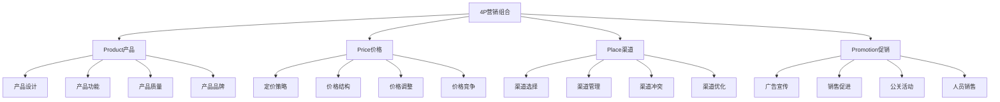
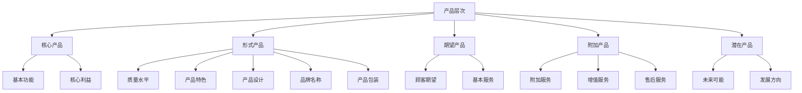
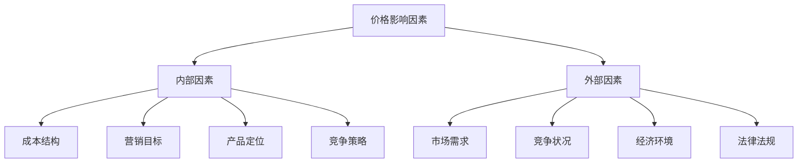
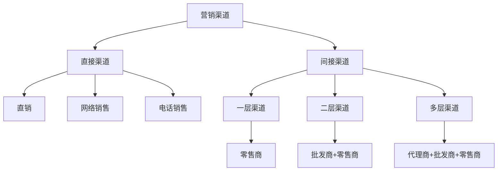
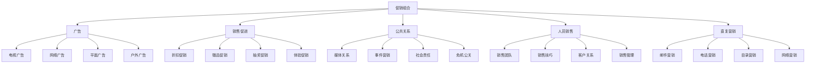

# 4P营销理论

## 4P理论概述

### 理论定义
**4P营销理论**：由杰罗姆·麦卡锡（Jerome McCarthy）在1960年提出的营销组合理论，包括产品（Product）、价格（Price）、渠道（Place）、促销（Promotion）四个要素。

### 理论价值
| 价值 | 内容 | 意义 |
|------|------|------|
| **系统性** | 系统化思考营销要素 | 全面分析营销组合 |
| **操作性** | 具体可操作的营销工具 | 指导营销实践 |
| **平衡性** | 平衡各要素之间的关系 | 协调营销活动 |
| **基础性** | 营销理论的基础框架 | 其他理论的基础 |

### 4P要素关系

## Product（产品）

### 产品定义
**产品**：能够满足顾客需求或欲望的任何东西，包括有形产品、服务、体验、想法等。

### 产品层次

### 产品策略要素
| 要素 | 内容 | 策略重点 |
|------|------|----------|
| **产品组合** | 产品线宽度、深度、关联度 | 产品组合优化 |
| **产品生命周期** | 导入期、成长期、成熟期、衰退期 | 生命周期管理 |
| **产品创新** | 新产品开发、产品改进 | 创新驱动 |
| **品牌管理** | 品牌定位、品牌延伸、品牌保护 | 品牌价值提升 |

### 产品决策
1. **产品设计**：功能设计、外观设计、用户体验
2. **产品质量**：质量标准、质量控制、质量改进
3. **产品特色**：差异化特色、竞争优势
4. **产品包装**：包装设计、包装功能、包装环保
5. **产品服务**：售前服务、售中服务、售后服务

## Price（价格）

### 价格定义
**价格**：顾客为获得产品而支付的货币数量，是营销组合中唯一产生收入的要素。

### 价格影响因素

### 定价策略
| 策略类型 | 内容 | 适用场景 |
|----------|------|----------|
| **成本导向定价** | 成本加成、目标利润 | 成本控制、利润目标 |
| **需求导向定价** | 价值定价、心理定价 | 价值创造、心理影响 |
| **竞争导向定价** | 随行就市、竞争定价 | 市场竞争、价格竞争 |
| **价值导向定价** | 顾客价值、价值定价 | 价值营销、差异化 |

### 定价方法
1. **成本加成法**：成本 + 利润 = 价格
2. **目标利润法**：基于目标利润定价
3. **感知价值法**：基于顾客感知价值定价
4. **竞争定价法**：基于竞争对手定价
5. **心理定价法**：利用心理因素定价

### 价格策略
- **撇脂定价**：高价进入市场
- **渗透定价**：低价进入市场
- **竞争定价**：与竞争对手价格相当
- **价值定价**：基于价值定价
- **动态定价**：根据市场变化调整价格

## Place（渠道）

### 渠道定义
**渠道**：产品从生产者到最终消费者的路径，包括各种中间商和销售渠道。

### 渠道类型

### 渠道功能
| 功能 | 内容 | 价值 |
|------|------|------|
| **信息功能** | 收集和传递市场信息 | 市场洞察 |
| **促销功能** | 说服和影响顾客购买 | 销售促进 |
| **谈判功能** | 就价格和其他条件达成协议 | 交易达成 |
| **订货功能** | 向供应商下订单 | 需求传递 |
| **融资功能** | 为渠道成员提供资金 | 资金支持 |
| **风险承担** | 承担渠道中的各种风险 | 风险分担 |
| **物流功能** | 产品的储存和运输 | 物流保障 |
| **付款功能** | 顾客向供应商付款 | 资金回收 |

### 渠道策略
1. **渠道设计**：渠道长度、宽度、类型
2. **渠道选择**：选择适合的渠道成员
3. **渠道管理**：激励、控制、评估渠道成员
4. **渠道冲突**：识别、预防、解决渠道冲突
5. **渠道创新**：创新渠道模式和方式

### 渠道发展趋势
- **全渠道营销**：线上线下融合
- **数字化渠道**：电商、社交媒体
- **体验式渠道**：体验店、概念店
- **服务化渠道**：服务增值、解决方案

## Promotion（促销）

### 促销定义
**促销**：企业向目标市场传递产品信息，说服和影响顾客购买的各种活动。

### 促销组合

### 促销策略
| 策略类型 | 内容 | 特点 |
|----------|------|------|
| **推式策略** | 通过渠道推动产品销售 | 渠道驱动 |
| **拉式策略** | 通过促销拉动顾客需求 | 需求驱动 |
| **推拉结合** | 推式和拉式策略结合 | 综合驱动 |

### 促销工具
1. **广告**：付费的大众传播
2. **销售促进**：短期刺激购买
3. **公共关系**：建立良好关系
4. **人员销售**：面对面销售
5. **直复营销**：直接回应营销

## 4P理论应用

### 应用步骤
1. **市场分析**：分析目标市场和顾客需求
2. **产品策略**：制定产品策略和组合
3. **价格策略**：制定价格策略和结构
4. **渠道策略**：设计渠道结构和选择
5. **促销策略**：制定促销组合和计划
6. **整合实施**：整合4P要素实施
7. **效果评估**：评估营销效果和调整

### 应用原则
| 原则 | 内容 | 要求 |
|------|------|------|
| **系统性** | 4P要素相互关联 | 整体考虑 |
| **平衡性** | 各要素平衡发展 | 协调一致 |
| **动态性** | 根据市场变化调整 | 灵活应变 |
| **目标性** | 围绕营销目标 | 目标导向 |

### 应用案例
#### 苹果公司4P策略
- **Product**：创新设计、优质产品、生态系统
- **Price**：高端定价、价值定价、品牌溢价
- **Place**：直营店、授权店、在线商店
- **Promotion**：品牌营销、体验营销、口碑营销

#### 小米公司4P策略
- **Product**：性价比产品、生态链产品、创新功能
- **Price**：低价策略、成本定价、规模效应
- **Place**：线上销售、线下体验店、合作伙伴
- **Promotion**：粉丝营销、社交媒体、事件营销

## 4P理论发展

### 理论扩展
- **4C理论**：顾客、成本、便利、沟通
- **4R理论**：关联、反应、关系、回报
- **7P理论**：在4P基础上增加人员、过程、有形展示
- **4I理论**：趣味、利益、互动、个性

### 现代挑战
| 挑战 | 内容 | 应对 |
|------|------|------|
| **数字化** | 数字技术改变营销方式 | 数字化转型 |
| **个性化** | 个性化需求增加 | 个性化营销 |
| **体验化** | 体验成为重要因素 | 体验营销 |
| **社交化** | 社交媒体影响增大 | 社交营销 |

### 发展趋势
- **整合营销**：4P要素深度整合
- **体验营销**：注重顾客体验
- **关系营销**：建立长期关系
- **价值营销**：创造顾客价值
- **数字营销**：数字化营销方式

## 实践指导

### 策略制定
1. **市场调研**：深入了解目标市场
2. **竞争分析**：分析竞争对手策略
3. **资源评估**：评估企业资源能力
4. **目标设定**：设定明确的营销目标
5. **策略选择**：选择适合的4P策略
6. **计划制定**：制定详细的实施计划
7. **执行监控**：执行和监控营销活动
8. **效果评估**：评估和调整策略

### 注意事项
- **市场导向**：以市场为导向
- **顾客中心**：以顾客为中心
- **竞争导向**：考虑竞争因素
- **资源约束**：考虑资源限制
- **动态调整**：根据变化调整
- **效果评估**：持续评估效果

---

**相关链接**：
- [[02-4C营销理论|4C营销理论]]
- [[03-4R营销理论|4R营销理论]]
- [[04-营销理论对比分析|营销理论对比分析]]
- [[02-战略营销理论/01-STP理论|STP理论]]
