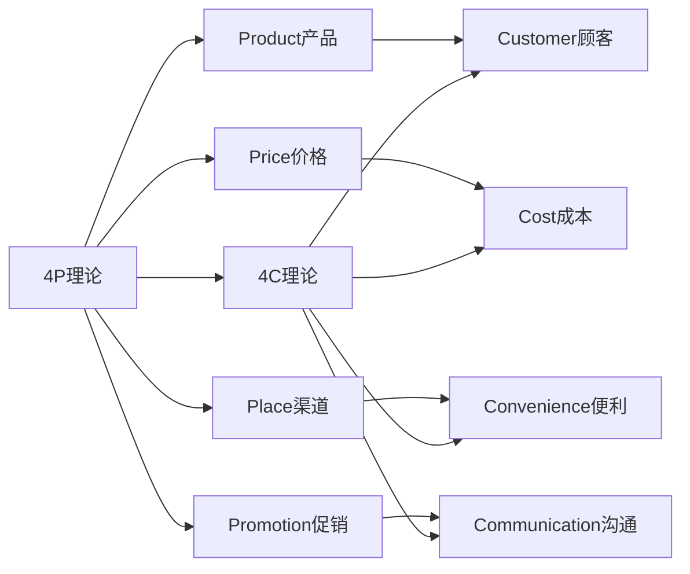
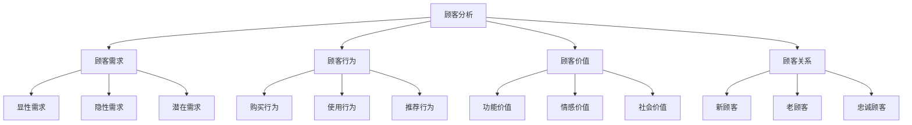
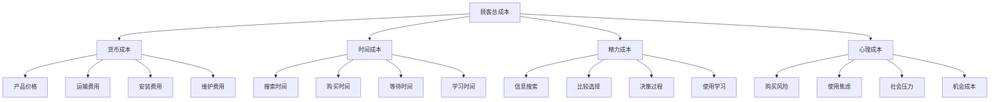
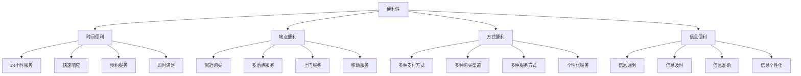
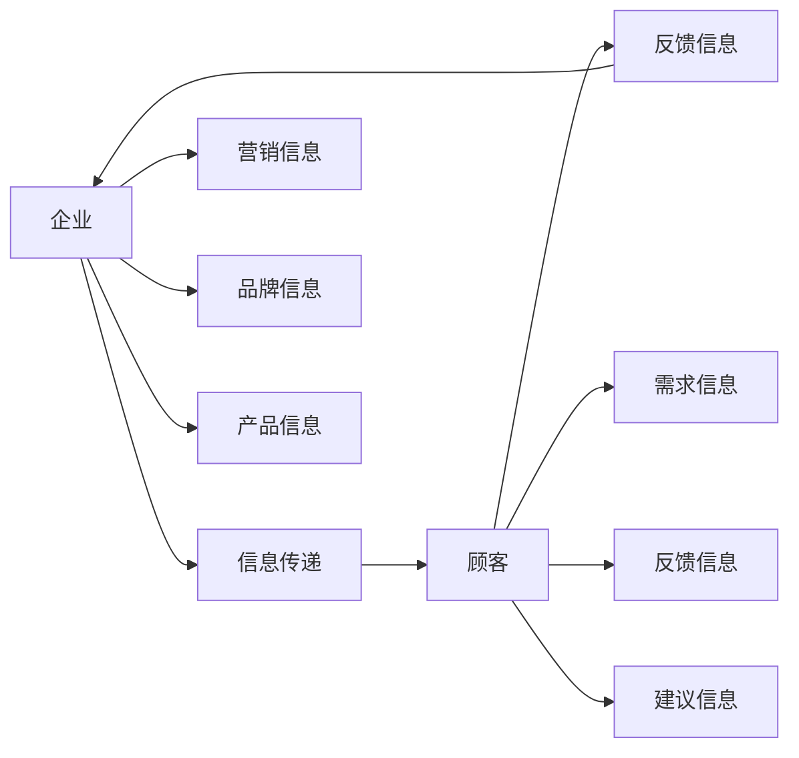

# 4C营销理论

## 4C理论概述

### 理论背景
**4C营销理论**：由罗伯特·劳特朋（Robert Lauterborn）在1990年提出，是对4P理论的补充和发展，强调以顾客为中心的市场营销。

### 理论核心
| 要素                | 中文  | 核心思想     |
| ----------------- | --- | -------- |
| **Customer**      | 顾客  | 以顾客需求为中心 |
| **Cost**          | 成本  | 考虑顾客总成本  |
| **Convenience**   | 便利  | 提供购买便利性  |
| **Communication** | 沟通  | 双向沟通交流   |

### 4C与4P对比

### 理论价值
| 价值 | 内容 | 意义 |
|------|------|------|
| **顾客导向** | 以顾客需求为中心 | 市场导向思维 |
| **成本思维** | 考虑顾客总成本 | 价值创造思维 |
| **便利性** | 提供购买便利 | 用户体验思维 |
| **沟通性** | 双向沟通交流 | 关系营销思维 |

## Customer（顾客）

### 顾客定义
**顾客**：购买和使用企业产品或服务的个人或组织，是营销活动的中心。

### 顾客分析框架

### 顾客需求层次
| 层次 | 内容 | 特征 | 营销策略 |
|------|------|------|----------|
| **基本需求** | 产品基本功能 | 必须满足 | 质量保证 |
| **期望需求** | 顾客期望功能 | 应该满足 | 功能完善 |
| **兴奋需求** | 超出期望功能 | 意外惊喜 | 创新突破 |
| **潜在需求** | 未表达的需求 | 需要挖掘 | 需求洞察 |

### 顾客细分
1. **人口统计细分**：年龄、性别、收入、教育
2. **地理细分**：地区、城市、气候、文化
3. **心理细分**：生活方式、价值观、个性
4. **行为细分**：使用频率、忠诚度、购买时机

### 顾客价值创造
- **功能价值**：产品功能满足需求
- **情感价值**：情感体验和连接
- **社会价值**：社会认同和地位
- **认知价值**：知识和信息价值
- **体验价值**：使用体验和感受

## Cost（成本）

### 成本定义
**成本**：顾客为获得产品而支付的总成本，包括货币成本和非货币成本。

### 顾客总成本构成

### 成本优化策略
| 策略 | 内容 | 方法 |
|------|------|------|
| **价格优化** | 合理定价 | 价值定价、竞争定价 |
| **时间优化** | 减少时间成本 | 快速交付、便捷购买 |
| **精力优化** | 简化购买过程 | 一站式服务、智能推荐 |
| **心理优化** | 降低心理成本 | 风险保障、信任建设 |

### 价值定价
- **价值感知**：顾客对产品价值的感知
- **价值传递**：向顾客传递价值信息
- **价值实现**：帮助顾客实现价值
- **价值评估**：评估价值创造效果

## Convenience（便利）

### 便利定义
**便利**：顾客购买和使用产品的便利性，包括时间便利、地点便利、方式便利。

### 便利性维度

### 便利性策略
| 策略 | 内容 | 实施方法 |
|------|------|----------|
| **渠道便利** | 多渠道购买 | 线上线下、全渠道 |
| **时间便利** | 随时购买 | 24小时服务、快速响应 |
| **地点便利** | 就近购买 | 门店布局、上门服务 |
| **方式便利** | 多种方式 | 支付方式、服务方式 |

### 数字化便利
- **在线购买**：电商平台、移动购物
- **移动支付**：支付宝、微信支付
- **智能推荐**：个性化推荐、智能客服
- **一键服务**：一键购买、一键服务

## Communication（沟通）

### 沟通定义
**沟通**：企业与顾客之间的双向信息交流，建立理解和信任。

### 沟通模式

### 沟通要素
| 要素 | 内容 | 重要性 |
|------|------|--------|
| **发送者** | 企业、品牌 | 信息源 |
| **信息** | 营销信息、品牌信息 | 沟通内容 |
| **渠道** | 媒体、平台、人员 | 信息载体 |
| **接收者** | 目标顾客 | 信息接收 |
| **反馈** | 顾客反应、行为 | 沟通效果 |

### 沟通策略
| 策略 | 内容 | 特点 |
|------|------|------|
| **单向沟通** | 企业向顾客传递信息 | 信息传播 |
| **双向沟通** | 企业与顾客互动交流 | 关系建立 |
| **多向沟通** | 多方参与沟通 | 社区建设 |
| **个性化沟通** | 针对个人定制 | 精准营销 |

### 沟通工具
1. **传统媒体**：电视、广播、报纸、杂志
2. **数字媒体**：网站、社交媒体、移动应用
3. **人员沟通**：销售代表、客服人员
4. **活动沟通**：事件营销、体验活动
5. **内容沟通**：内容营销、故事营销

## 4C理论应用

### 应用步骤
1. **顾客分析**：深入了解目标顾客
2. **成本分析**：分析顾客总成本
3. **便利性设计**：设计便利的购买体验
4. **沟通策略**：制定沟通策略
5. **整合实施**：整合4C要素实施
6. **效果评估**：评估营销效果

### 应用原则
| 原则 | 内容 | 要求 |
|------|------|------|
| **顾客中心** | 以顾客为中心 | 顾客导向 |
| **价值创造** | 为顾客创造价值 | 价值思维 |
| **便利优先** | 提供便利服务 | 便利思维 |
| **沟通互动** | 双向沟通交流 | 关系思维 |

### 应用案例
#### 亚马逊4C策略
- **Customer**：深入了解顾客需求，个性化推荐
- **Cost**：降低顾客总成本，免费配送
- **Convenience**：提供便利购买，一键购买
- **Communication**：多渠道沟通，客户服务

#### 星巴克4C策略
- **Customer**：创造第三空间，满足社交需求
- **Cost**：提供价值体验，合理定价
- **Convenience**：多地点服务，移动支付
- **Communication**：品牌故事，社区建设

## 4C理论发展

### 理论扩展
- **4R理论**：关联、反应、关系、回报
- **4I理论**：趣味、利益、互动、个性
- **4V理论**：差异化、功能化、附加价值、共鸣
- **4S理论**：满意、服务、速度、诚意

### 现代发展
| 发展 | 内容 | 特点 |
|------|------|------|
| **数字化** | 数字技术应用 | 精准、高效 |
| **个性化** | 个性化营销 | 定制、专属 |
| **社交化** | 社交媒体营销 | 互动、分享 |
| **体验化** | 体验营销 | 沉浸、感受 |

### 未来趋势
- **智能化**：AI驱动的个性化营销
- **场景化**：基于场景的营销
- **生态化**：构建营销生态系统
- **价值化**：价值共创营销

## 实践指导

### 策略制定
1. **顾客洞察**：深入了解顾客需求
2. **成本优化**：降低顾客总成本
3. **便利性提升**：提供便利服务
4. **沟通优化**：改善沟通效果
5. **整合营销**：整合4C要素
6. **持续改进**：持续优化策略

### 注意事项
- **顾客导向**：始终以顾客为中心
- **价值创造**：为顾客创造价值
- **便利优先**：提供便利服务
- **沟通互动**：建立双向沟通
- **持续改进**：持续优化策略
- **效果评估**：评估营销效果

---

**相关链接**：
- [[01-4P营销理论|4P营销理论]]
- [[03-4R营销理论|4R营销理论]]
- [[04-营销理论对比分析|营销理论对比分析]]
- [[03-消费者行为理论/01-消费者决策过程|消费者决策过程]]
