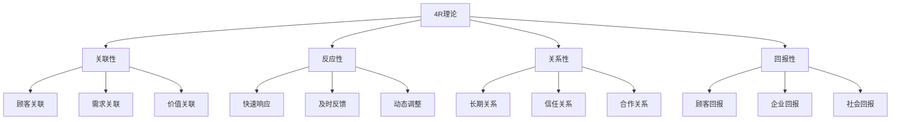
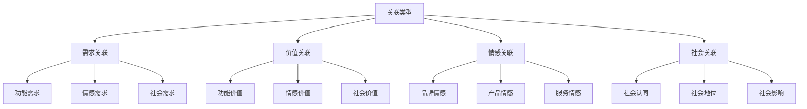
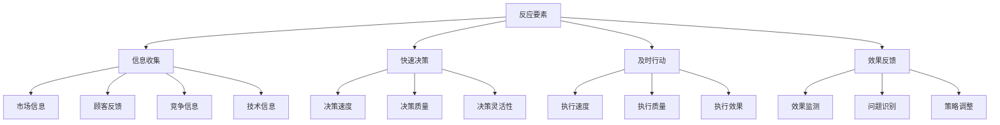
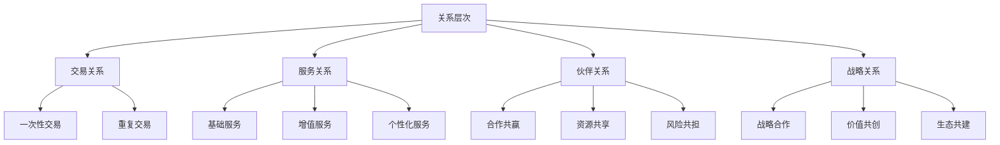
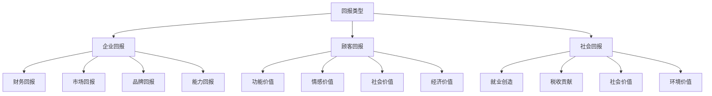

# 4R营销理论

## 4R理论概述

### 理论背景
**4R营销理论**：由唐·舒尔茨（Don Schultz）在2001年提出，强调关系营销和互动营销，适应网络时代的发展。

### 理论核心
| 要素 | 英文 | 中文 | 核心思想 |
|------|------|------|----------|
| **Relevance** | Relevance | 关联 | 与顾客建立关联 |
| **Reaction** | Reaction | 反应 | 快速响应顾客需求 |
| **Relationship** | Relationship | 关系 | 建立长期关系 |
| **Reward** | Reward | 回报 | 获得合理回报 |

### 4R理论特点

### 理论价值
| 价值 | 内容 | 意义 |
|------|------|------|
| **关系导向** | 建立长期关系 | 关系营销思维 |
| **互动导向** | 双向互动交流 | 互动营销思维 |
| **价值导向** | 创造共同价值 | 价值共创思维 |
| **回报导向** | 获得合理回报 | 可持续发展思维 |

## Relevance（关联）

### 关联定义
**关联**：企业与顾客之间建立的联系，包括需求关联、价值关联、情感关联等。

### 关联类型

### 关联策略
| 策略 | 内容 | 实施方法 |
|------|------|----------|
| **需求关联** | 满足顾客需求 | 需求分析、产品设计 |
| **价值关联** | 创造共同价值 | 价值主张、价值传递 |
| **情感关联** | 建立情感连接 | 情感营销、品牌故事 |
| **社会关联** | 社会认同连接 | 社会责任、社区建设 |

### 关联建立
1. **需求洞察**：深入了解顾客需求
2. **价值创造**：为顾客创造价值
3. **情感连接**：建立情感连接
4. **社会认同**：获得社会认同
5. **持续互动**：持续互动交流

## Reaction（反应）

### 反应定义
**反应**：企业对顾客需求和市场变化的快速响应能力。

### 反应要素

### 反应策略
| 策略 | 内容 | 特点 |
|------|------|------|
| **快速响应** | 快速响应市场变化 | 速度优先 |
| **灵活调整** | 灵活调整策略 | 适应性 |
| **持续改进** | 持续改进优化 | 学习性 |
| **预测反应** | 预测性反应 | 前瞻性 |

### 反应能力建设
1. **信息系统**：建立完善的信息系统
2. **决策机制**：建立快速决策机制
3. **执行能力**：提升执行能力
4. **学习能力**：建立学习型组织
5. **创新能力**：提升创新能力

## Relationship（关系）

### 关系定义
**关系**：企业与顾客之间建立的长期、稳定、互利的合作关系。

### 关系层次

### 关系管理
| 管理要素 | 内容 | 策略 |
|----------|------|------|
| **关系建立** | 建立初始关系 | 信任建设、价值创造 |
| **关系维护** | 维护现有关系 | 持续服务、价值提升 |
| **关系深化** | 深化关系层次 | 合作升级、价值共创 |
| **关系恢复** | 恢复受损关系 | 问题解决、关系修复 |

### 关系营销策略
1. **客户细分**：基于关系价值细分客户
2. **个性化服务**：提供个性化服务
3. **价值共创**：与顾客共同创造价值
4. **社区建设**：建设品牌社区
5. **忠诚计划**：实施忠诚计划

## Reward（回报）

### 回报定义
**回报**：营销活动为企业、顾客和社会带来的价值回报。

### 回报类型

### 回报策略
| 策略 | 内容 | 实施方法 |
|------|------|----------|
| **价值创造** | 为各方创造价值 | 价值主张、价值传递 |
| **利益分享** | 分享营销利益 | 利润分享、价值分享 |
| **可持续发展** | 可持续发展 | 长期规划、社会责任 |
| **共赢合作** | 多方共赢 | 合作模式、利益平衡 |

### 回报评估
1. **财务指标**：收入、利润、ROI
2. **市场指标**：市场份额、品牌价值
3. **顾客指标**：满意度、忠诚度、推荐度
4. **社会指标**：社会贡献、环境影响

## 4R理论应用

### 应用步骤
1. **关联建立**：与顾客建立关联
2. **反应机制**：建立快速反应机制
3. **关系管理**：管理顾客关系
4. **回报实现**：实现各方回报
5. **整合优化**：整合4R要素
6. **持续改进**：持续改进优化

### 应用原则
| 原则 | 内容 | 要求 |
|------|------|------|
| **关联导向** | 建立有效关联 | 关联思维 |
| **反应导向** | 快速响应变化 | 反应思维 |
| **关系导向** | 建立长期关系 | 关系思维 |
| **回报导向** | 实现合理回报 | 回报思维 |

### 应用案例
#### 苹果公司4R策略
- **Relevance**：与用户生活方式关联
- **Reaction**：快速响应市场变化
- **Relationship**：建立品牌忠诚关系
- **Reward**：创造用户和企业价值

#### 亚马逊4R策略
- **Relevance**：与用户需求深度关联
- **Reaction**：快速响应用户需求
- **Relationship**：建立长期服务关系
- **Reward**：实现多方价值回报

## 4R理论发展

### 理论扩展
- **4I理论**：趣味、利益、互动、个性
- **4V理论**：差异化、功能化、附加价值、共鸣
- **4S理论**：满意、服务、速度、诚意
- **4E理论**：体验、参与、情感、生态

### 现代发展
| 发展 | 内容 | 特点 |
|------|------|------|
| **数字化** | 数字技术应用 | 精准、高效 |
| **社交化** | 社交媒体营销 | 互动、分享 |
| **体验化** | 体验营销 | 沉浸、感受 |
| **生态化** | 生态营销 | 协同、共创 |

### 未来趋势
- **智能化**：AI驱动的个性化营销
- **场景化**：基于场景的营销
- **价值化**：价值共创营销
- **可持续化**：可持续发展营销

## 实践指导

### 策略制定
1. **关联分析**：分析顾客关联点
2. **反应机制**：建立反应机制
3. **关系规划**：规划关系发展
4. **回报设计**：设计回报机制
5. **整合实施**：整合4R要素
6. **效果评估**：评估营销效果

### 注意事项
- **关联有效性**：确保关联有效
- **反应及时性**：确保反应及时
- **关系长期性**：建立长期关系
- **回报合理性**：确保回报合理
- **持续改进**：持续优化策略
- **效果评估**：评估营销效果

---

**相关链接**：
- [[01-4P营销理论|4P营销理论]]
- [[02-4C营销理论|4C营销理论]]
- [[04-营销理论对比分析|营销理论对比分析]]
- [[03-消费者行为理论/03-消费者细分理论|消费者细分理论]]
