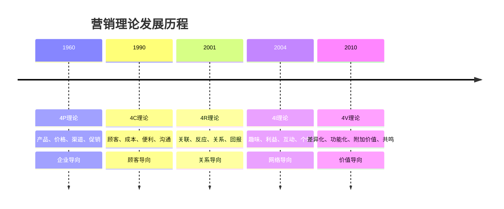
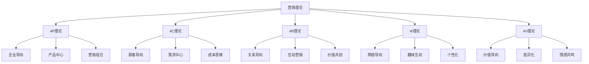

# 营销理论对比分析

## 营销理论演进

### 理论发展时间线

### 理论演进特点
| 阶段 | 理论 | 导向 | 特点 |
|------|------|------|------|
| **第一代** | 4P理论 | 企业导向 | 产品中心、营销组合 |
| **第二代** | 4C理论 | 顾客导向 | 顾客中心、需求满足 |
| **第三代** | 4R理论 | 关系导向 | 关系营销、互动营销 |
| **第四代** | 4I理论 | 网络导向 | 网络营销、互动体验 |
| **第五代** | 4V理论 | 价值导向 | 价值营销、差异化 |

## 4P理论分析

### 理论核心
**4P理论**：产品（Product）、价格（Price）、渠道（Place）、促销（Promotion）

### 理论特点
| 特点 | 内容 | 优势 | 局限 |
|------|------|------|------|
| **企业导向** | 从企业角度思考 | 操作性强、系统完整 | 忽视顾客需求 |
| **产品中心** | 以产品为核心 | 产品管理清晰 | 产品导向思维 |
| **营销组合** | 四要素组合 | 要素关系明确 | 要素相对独立 |
| **操作性强** | 具体可操作 | 易于实施 | 缺乏灵活性 |

### 适用场景
- **产品导向市场**：产品差异化明显
- **传统营销环境**：媒体环境相对简单
- **B2B营销**：企业间营销
- **标准化产品**：产品相对标准化

### 现代挑战
- **顾客需求多样化**：难以满足个性化需求
- **竞争环境复杂**：单纯产品竞争不足
- **媒体环境变化**：传统媒体效果下降
- **数字化冲击**：数字技术改变营销方式

## 4C理论分析

### 理论核心
**4C理论**：顾客（Customer）、成本（Cost）、便利（Convenience）、沟通（Communication）

### 理论特点
| 特点 | 内容 | 优势 | 局限 |
|------|------|------|------|
| **顾客导向** | 从顾客角度思考 | 顾客中心、需求满足 | 可能忽视企业能力 |
| **需求中心** | 以需求为核心 | 需求导向思维 | 需求变化快 |
| **成本思维** | 考虑总成本 | 价值创造思维 | 成本计算复杂 |
| **便利性** | 提供便利服务 | 用户体验优化 | 便利性成本高 |

### 适用场景
- **顾客导向市场**：顾客需求多样化
- **服务行业**：服务体验重要
- **B2C营销**：消费者营销
- **个性化产品**：产品个性化程度高

### 现代发展
- **数字化便利**：数字技术提升便利性
- **个性化服务**：大数据支持个性化
- **全渠道营销**：线上线下融合
- **体验营销**：注重顾客体验

## 4R理论分析

### 理论核心
**4R理论**：关联（Relevance）、反应（Reaction）、关系（Relationship）、回报（Reward）

### 理论特点
| 特点 | 内容 | 优势 | 局限 |
|------|------|------|------|
| **关系导向** | 建立长期关系 | 关系营销、客户忠诚 | 关系维护成本高 |
| **互动营销** | 双向互动交流 | 互动性强、参与度高 | 互动管理复杂 |
| **价值共创** | 共同创造价值 | 价值最大化 | 价值分配困难 |
| **可持续发展** | 长期发展 | 可持续发展 | 短期效果不明显 |

### 适用场景
- **关系导向市场**：长期关系重要
- **高价值产品**：产品价值高
- **B2B营销**：企业间长期合作
- **服务行业**：服务关系重要

### 现代发展
- **数字化关系**：数字技术管理关系
- **社交化营销**：社交媒体建立关系
- **社区营销**：品牌社区建设
- **生态营销**：构建营销生态系统

## 4I理论分析

### 理论核心
**4I理论**：趣味（Interesting）、利益（Interests）、互动（Interaction）、个性（Individuality）

### 理论特点
| 特点 | 内容 | 优势 | 局限 |
|------|------|------|------|
| **网络导向** | 适应网络环境 | 网络营销、互动体验 | 依赖网络技术 |
| **趣味性** | 增加营销趣味 | 吸引力强、传播性好 | 趣味性难以持续 |
| **互动性** | 强调互动参与 | 参与度高、体验感强 | 互动管理复杂 |
| **个性化** | 个性化营销 | 精准营销、效果显著 | 个性化成本高 |

### 适用场景
- **网络营销环境**：网络媒体发达
- **年轻消费群体**：追求趣味和个性
- **社交媒体营销**：社交媒体平台
- **内容营销**：内容创作和传播

### 现代发展
- **AI个性化**：人工智能支持个性化
- **AR/VR体验**：增强现实和虚拟现实
- **直播营销**：实时互动体验
- **短视频营销**：短视频内容营销

## 4V理论分析

### 理论核心
**4V理论**：差异化（Variation）、功能化（Versatility）、附加价值（Value）、共鸣（Vibration）

### 理论特点
| 特点 | 内容 | 优势 | 局限 |
|------|------|------|------|
| **价值导向** | 以价值为核心 | 价值创造、差异化 | 价值评估困难 |
| **差异化** | 产品差异化 | 竞争优势明显 | 差异化成本高 |
| **功能化** | 产品功能多样 | 满足多样需求 | 功能复杂化 |
| **共鸣** | 情感共鸣 | 情感连接强 | 共鸣难以量化 |

### 适用场景
- **价值导向市场**：价值竞争激烈
- **高端产品**：产品价值高
- **品牌营销**：品牌价值重要
- **情感营销**：情感连接重要

### 现代发展
- **价值共创**：与顾客共同创造价值
- **情感营销**：情感连接和共鸣
- **品牌价值**：品牌价值提升
- **社会价值**：社会责任和价值

## 理论对比总结

### 对比矩阵
| 维度 | 4P | 4C | 4R | 4I | 4V |
|------|----|----|----|----|----|
| **导向** | 企业 | 顾客 | 关系 | 网络 | 价值 |
| **核心** | 产品 | 需求 | 关系 | 互动 | 价值 |
| **重点** | 营销组合 | 顾客满意 | 长期关系 | 网络体验 | 价值创造 |
| **优势** | 系统完整 | 顾客中心 | 关系营销 | 互动性强 | 价值导向 |
| **局限** | 企业导向 | 需求变化 | 成本较高 | 技术依赖 | 评估困难 |
| **适用** | 传统营销 | 服务营销 | 关系营销 | 网络营销 | 价值营销 |

### 理论关系

## 理论选择指导

### 选择因素
| 因素 | 内容 | 影响 |
|------|------|------|
| **市场环境** | 竞争程度、市场成熟度 | 理论适用性 |
| **产品特性** | 产品类型、价值水平 | 理论匹配度 |
| **顾客特征** | 顾客需求、行为特点 | 理论有效性 |
| **企业能力** | 资源能力、技术水平 | 理论可行性 |
| **营销目标** | 短期目标、长期目标 | 理论目标性 |

### 选择策略
1. **单一理论应用**：选择最适合的理论
2. **理论组合应用**：结合多个理论
3. **理论创新应用**：创新应用理论
4. **理论动态调整**：根据变化调整

### 应用建议
| 场景 | 推荐理论 | 理由 |
|------|----------|------|
| **传统产品营销** | 4P理论 | 产品导向、系统完整 |
| **服务行业营销** | 4C理论 | 顾客导向、体验重要 |
| **B2B关系营销** | 4R理论 | 关系导向、长期合作 |
| **网络数字营销** | 4I理论 | 网络导向、互动体验 |
| **高端品牌营销** | 4V理论 | 价值导向、情感共鸣 |

## 理论发展趋势

### 发展趋势
| 趋势 | 内容 | 特点 |
|------|------|------|
| **整合化** | 理论整合应用 | 综合优势 |
| **数字化** | 数字技术应用 | 精准高效 |
| **个性化** | 个性化营销 | 定制专属 |
| **体验化** | 体验营销 | 沉浸感受 |
| **生态化** | 生态营销 | 协同共创 |

### 未来方向
- **智能化营销**：AI驱动的智能营销
- **场景化营销**：基于场景的营销
- **价值化营销**：价值共创营销
- **可持续营销**：可持续发展营销
- **全球化营销**：全球化营销策略

---

**相关链接**：
- [[01-4P营销理论|4P营销理论]]
- [[02-4C营销理论|4C营销理论]]
- [[03-4R营销理论|4R营销理论]]
- [[02-战略营销理论/01-STP理论|STP理论]]
