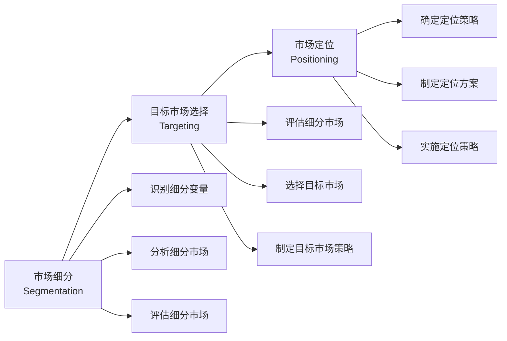
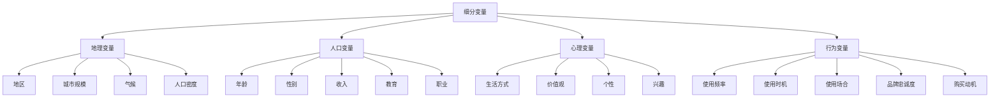
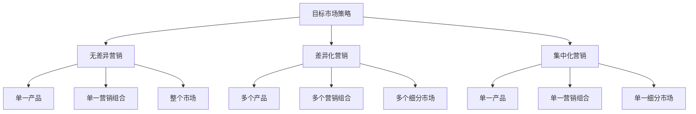
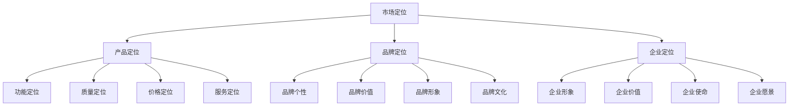

# STP理论

## STP理论概述

### 理论定义
**STP理论**：由菲利普·科特勒提出的战略营销理论，包括市场细分（Segmentation）、目标市场选择（Targeting）、市场定位（Positioning）三个步骤。

### 理论价值
| 价值 | 内容 | 意义 |
|------|------|------|
| **系统性** | 系统化市场分析 | 全面分析市场机会 |
| **战略性** | 战略层面思考 | 指导营销战略制定 |
| **针对性** | 针对特定市场 | 提高营销效率 |
| **差异化** | 实现差异化竞争 | 建立竞争优势 |

### STP流程

## Segmentation（市场细分）

### 市场细分定义
**市场细分**：将整个市场按照一定的标准划分为若干个具有相似需求和特征的子市场。

### 细分变量

### 细分标准
| 标准 | 内容 | 特点 |
|------|------|------|
| **可测量性** | 细分市场可量化 | 数据可获得 |
| **可进入性** | 能够进入细分市场 | 渠道可达 |
| **可盈利性** | 细分市场有利润 | 规模足够 |
| **可区分性** | 细分市场有差异 | 需求不同 |
| **可行动性** | 能够制定营销策略 | 策略可行 |

### 细分方法
1. **单一变量细分**：使用一个变量细分
2. **多变量细分**：使用多个变量细分
3. **组合细分**：组合不同变量细分
4. **动态细分**：根据变化动态调整

### 细分步骤
1. **确定细分变量**：选择细分标准
2. **收集数据**：收集相关数据
3. **分析数据**：分析细分结果
4. **评估细分**：评估细分有效性
5. **调整细分**：优化细分方案

## Targeting（目标市场选择）

### 目标市场定义
**目标市场**：企业决定进入的细分市场，是企业营销活动的重点。

### 目标市场策略

### 策略对比
| 策略 | 特点 | 优势 | 劣势 | 适用条件 |
|------|------|------|------|----------|
| **无差异营销** | 忽略差异，统一营销 | 成本低、管理简单 | 竞争激烈、效果有限 | 产品同质化、需求相似 |
| **差异化营销** | 针对不同市场制定策略 | 满足多样需求、竞争力强 | 成本高、管理复杂 | 资源充足、需求差异大 |
| **集中化营销** | 专注单一细分市场 | 专业化、成本效益高 | 风险集中、市场有限 | 资源有限、细分市场有潜力 |

### 目标市场评估
| 评估维度 | 内容 | 评估标准 |
|----------|------|----------|
| **市场规模** | 细分市场容量 | 足够大、有增长潜力 |
| **市场增长** | 市场增长速度 | 增长快、前景好 |
| **竞争强度** | 竞争激烈程度 | 竞争适中、有机会 |
| **盈利能力** | 市场盈利能力 | 利润率高、回报好 |
| **资源匹配** | 企业资源匹配度 | 资源充足、能力匹配 |

### 选择步骤
1. **评估细分市场**：评估各细分市场
2. **比较分析**：比较各细分市场
3. **选择策略**：选择目标市场策略
4. **制定计划**：制定目标市场计划
5. **实施监控**：实施和监控策略

## Positioning（市场定位）

### 市场定位定义
**市场定位**：在目标市场中为产品或品牌建立独特的市场位置，形成差异化竞争优势。

### 定位要素

### 定位策略
| 策略类型 | 内容 | 特点 | 适用场景 |
|----------|------|------|----------|
| **功能定位** | 强调产品功能 | 功能突出、实用性强 | 功能导向产品 |
| **质量定位** | 强调产品质量 | 质量可靠、信誉好 | 质量敏感产品 |
| **价格定位** | 强调价格优势 | 价格实惠、性价比高 | 价格敏感市场 |
| **服务定位** | 强调服务质量 | 服务优质、体验好 | 服务导向产品 |
| **情感定位** | 强调情感连接 | 情感共鸣、品牌忠诚 | 情感导向产品 |

### 定位方法
1. **属性定位**：基于产品属性定位
2. **利益定位**：基于顾客利益定位
3. **用途定位**：基于产品用途定位
4. **用户定位**：基于目标用户定位
5. **竞争定位**：基于竞争对手定位
6. **价值定位**：基于价值主张定位

### 定位步骤
1. **分析竞争环境**：分析竞争对手定位
2. **识别定位机会**：寻找定位机会
3. **确定定位策略**：选择定位策略
4. **制定定位方案**：制定具体方案
5. **实施定位策略**：执行定位策略
6. **监控定位效果**：评估定位效果

## STP理论应用

### 应用步骤
1. **市场调研**：深入了解市场环境
2. **市场细分**：进行市场细分分析
3. **目标市场选择**：选择目标市场
4. **市场定位**：制定市场定位策略
5. **营销组合**：制定4P营销组合
6. **实施监控**：实施和监控策略

### 应用原则
| 原则 | 内容 | 要求 |
|------|------|------|
| **市场导向** | 以市场为导向 | 市场中心 |
| **顾客导向** | 以顾客为中心 | 顾客需求 |
| **竞争导向** | 考虑竞争因素 | 竞争优势 |
| **资源导向** | 考虑资源约束 | 资源匹配 |

### 应用案例
#### 苹果公司STP策略
- **Segmentation**：按生活方式和价值观细分
- **Targeting**：选择追求创新和品质的用户
- **Positioning**：定位为创新、设计、品质的领导者

#### 小米公司STP策略
- **Segmentation**：按价格敏感度和技术接受度细分
- **Targeting**：选择追求性价比的年轻用户
- **Positioning**：定位为高性价比的智能产品

## STP理论发展

### 理论扩展
- **动态STP**：动态调整STP策略
- **数字化STP**：基于大数据的STP
- **个性化STP**：个性化营销策略
- **全渠道STP**：全渠道营销策略

### 现代挑战
| 挑战 | 内容 | 应对策略 |
|------|------|----------|
| **市场变化快** | 市场环境快速变化 | 动态调整、敏捷响应 |
| **个性化需求** | 个性化需求增加 | 精准营销、个性化服务 |
| **竞争激烈** | 竞争环境激烈 | 差异化定位、创新突破 |
| **技术发展** | 技术快速发展 | 技术应用、数字化转型 |

### 发展趋势
- **精准化**：精准识别目标市场
- **个性化**：个性化营销策略
- **动态化**：动态调整策略
- **数字化**：数字化营销工具
- **生态化**：构建营销生态系统

## 实践指导

### 策略制定
1. **市场分析**：深入分析市场环境
2. **细分分析**：进行市场细分分析
3. **目标选择**：选择合适的目标市场
4. **定位策略**：制定差异化定位策略
5. **营销组合**：制定4P营销组合
6. **实施计划**：制定详细实施计划
7. **效果评估**：评估策略效果

### 注意事项
- **市场导向**：始终以市场为导向
- **顾客中心**：以顾客需求为中心
- **竞争分析**：深入分析竞争环境
- **资源匹配**：确保资源与策略匹配
- **动态调整**：根据变化动态调整
- **效果评估**：持续评估策略效果

---

**相关链接**：
- [[02-竞争分析理论|竞争分析理论]]
- [[03-定位理论|定位理论]]
- [[04-蓝海战略理论|蓝海战略理论]]
- [[04-营销策略制定/01-市场分析/02-市场细分策略|市场细分策略]]
