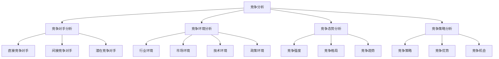
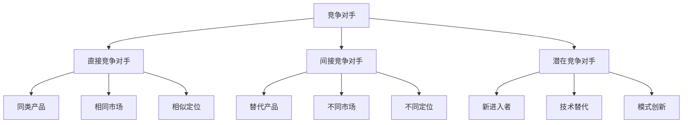
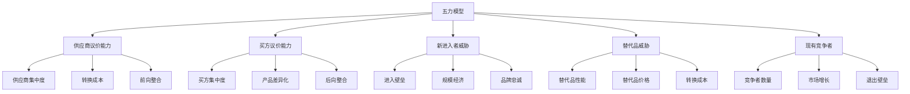
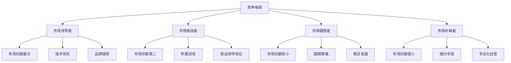
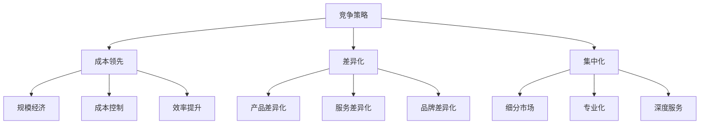

# 竞争分析理论

## 竞争分析概述

### 理论定义
**竞争分析**：系统分析竞争对手、竞争环境、竞争态势，为企业制定竞争策略提供依据。

### 分析框架

### 分析价值
| 价值 | 内容 | 意义 |
|------|------|------|
| **战略指导** | 指导竞争策略制定 | 战略决策支持 |
| **机会识别** | 识别市场机会 | 市场机会把握 |
| **威胁预警** | 预警竞争威胁 | 风险防范 |
| **优势构建** | 构建竞争优势 | 竞争力提升 |

## 竞争对手分析

### 竞争对手识别

### 竞争对手分类
| 类型 | 特征 | 影响 | 应对策略 |
|------|------|------|----------|
| **直接竞争对手** | 同类产品、相同市场 | 直接竞争、市场份额争夺 | 差异化、竞争优势 |
| **间接竞争对手** | 替代产品、不同市场 | 间接竞争、需求争夺 | 价值创新、市场拓展 |
| **潜在竞争对手** | 新进入者、技术替代 | 未来竞争、市场威胁 | 壁垒建设、创新领先 |

### 竞争对手分析维度
| 维度 | 内容 | 分析方法 |
|------|------|----------|
| **基本信息** | 公司规模、历史、文化 | 公开信息、媒体报道 |
| **产品分析** | 产品线、功能、质量 | 产品对比、用户评价 |
| **市场表现** | 市场份额、销售业绩 | 市场数据、财务报告 |
| **营销策略** | 定价、渠道、促销 | 营销活动、广告分析 |
| **资源能力** | 资金、技术、人才 | 资源评估、能力分析 |
| **战略意图** | 发展目标、战略方向 | 战略分析、趋势预测 |

### 竞争对手分析工具
1. **竞争对手档案**：建立竞争对手详细档案
2. **产品对比表**：对比产品功能和特点
3. **市场表现分析**：分析市场表现和趋势
4. **营销策略分析**：分析营销策略和活动
5. **资源能力评估**：评估资源能力和优势
6. **战略意图分析**：分析战略意图和发展方向

## 竞争环境分析

### 五力模型分析

### 五力分析要素
| 力量 | 影响因素 | 分析要点 |
|------|----------|----------|
| **供应商议价能力** | 供应商集中度、转换成本、前向整合 | 供应商关系、采购策略 |
| **买方议价能力** | 买方集中度、产品差异化、后向整合 | 客户关系、价值创造 |
| **新进入者威胁** | 进入壁垒、规模经济、品牌忠诚 | 壁垒建设、竞争优势 |
| **替代品威胁** | 替代品性能、价格、转换成本 | 产品创新、价值提升 |
| **现有竞争者** | 竞争者数量、市场增长、退出壁垒 | 竞争策略、差异化 |

### 竞争环境评估
| 评估维度 | 内容 | 评估标准 |
|----------|------|----------|
| **竞争强度** | 竞争激烈程度 | 高、中、低 |
| **市场集中度** | 市场集中程度 | 集中、分散 |
| **进入壁垒** | 进入难度 | 高、中、低 |
| **退出壁垒** | 退出难度 | 高、中、低 |
| **产品差异化** | 产品差异程度 | 高、中、低 |

## 竞争态势分析

### 竞争格局分析

### 竞争地位分析
| 地位 | 特征 | 策略重点 |
|------|------|----------|
| **市场领导者** | 市场份额最大、技术领先 | 防御策略、创新领先 |
| **市场挑战者** | 市场份额第二、积极进攻 | 进攻策略、差异化 |
| **市场跟随者** | 市场份额较小、跟随策略 | 跟随策略、成本控制 |
| **市场补缺者** | 市场份额很小、专业化 | 补缺策略、专业化 |

### 竞争趋势分析
| 趋势 | 内容 | 影响 |
|------|------|------|
| **竞争加剧** | 竞争越来越激烈 | 压力增大、机会减少 |
| **技术驱动** | 技术成为竞争关键 | 技术投入、创新重要 |
| **品牌竞争** | 品牌价值凸显 | 品牌建设、价值提升 |
| **服务竞争** | 服务成为差异化 | 服务创新、体验优化 |
| **生态竞争** | 生态系统竞争 | 生态建设、合作重要 |

## 竞争策略分析

### 竞争策略类型

### 竞争策略对比
| 策略 | 特点 | 优势 | 劣势 | 适用条件 |
|------|------|------|------|----------|
| **成本领先** | 低成本、低价格 | 价格优势、规模效应 | 利润薄、创新不足 | 标准化产品、价格敏感 |
| **差异化** | 独特价值、高价格 | 价值优势、品牌忠诚 | 成本高、市场有限 | 个性化需求、价值敏感 |
| **集中化** | 专注细分市场 | 专业化、成本效益 | 市场有限、风险集中 | 细分市场、资源有限 |

### 竞争优势分析
| 优势类型 | 内容 | 特点 |
|----------|------|------|
| **成本优势** | 低成本、高效率 | 价格竞争力强 |
| **技术优势** | 技术领先、创新强 | 产品竞争力强 |
| **品牌优势** | 品牌价值、知名度 | 品牌竞争力强 |
| **渠道优势** | 渠道覆盖、关系好 | 渠道竞争力强 |
| **服务优势** | 服务优质、体验好 | 服务竞争力强 |

## 竞争分析工具

### 分析工具
| 工具 | 内容 | 用途 |
|------|------|------|
| **SWOT分析** | 优势、劣势、机会、威胁 | 综合分析 |
| **五力模型** | 五种竞争力量 | 行业分析 |
| **竞争对手矩阵** | 竞争对手对比 | 竞争对比 |
| **竞争态势图** | 竞争地位分析 | 地位分析 |
| **价值链分析** | 价值创造过程 | 价值分析 |

### 数据收集
| 数据源 | 内容 | 方法 |
|--------|------|------|
| **公开信息** | 年报、公告、新闻 | 信息收集 |
| **市场调研** | 消费者、渠道、专家 | 调研分析 |
| **竞争情报** | 竞争对手信息 | 情报收集 |
| **行业报告** | 行业分析报告 | 报告分析 |
| **专家访谈** | 行业专家观点 | 专家咨询 |

## 竞争分析应用

### 应用步骤
1. **确定分析目标**：明确分析目的和范围
2. **收集信息**：收集相关信息和数据
3. **分析竞争对手**：分析主要竞争对手
4. **分析竞争环境**：分析竞争环境
5. **分析竞争态势**：分析竞争态势
6. **制定竞争策略**：制定竞争策略
7. **实施监控**：实施和监控策略

### 应用原则
| 原则 | 内容 | 要求 |
|------|------|------|
| **客观性** | 客观分析 | 数据支撑 |
| **全面性** | 全面分析 | 多维度分析 |
| **动态性** | 动态分析 | 持续更新 |
| **实用性** | 实用导向 | 策略指导 |

### 应用案例
#### 智能手机行业竞争分析
- **竞争对手**：苹果、三星、华为、小米
- **竞争环境**：技术驱动、品牌竞争
- **竞争态势**：苹果领先、华为挑战
- **竞争策略**：差异化、创新驱动

#### 电商行业竞争分析
- **竞争对手**：淘宝、京东、拼多多
- **竞争环境**：平台竞争、服务竞争
- **竞争态势**：淘宝领先、拼多多崛起
- **竞争策略**：平台生态、下沉市场

## 竞争分析发展

### 发展趋势
| 趋势 | 内容 | 特点 |
|------|------|------|
| **数字化** | 数字技术应用 | 精准、高效 |
| **实时化** | 实时竞争分析 | 快速响应 |
| **智能化** | AI辅助分析 | 智能决策 |
| **生态化** | 生态系统分析 | 全面分析 |

### 现代挑战
| 挑战 | 内容 | 应对策略 |
|------|------|----------|
| **信息过载** | 信息量巨大 | 信息筛选、智能分析 |
| **变化快速** | 环境变化快 | 实时监控、快速响应 |
| **竞争复杂** | 竞争关系复杂 | 系统分析、动态调整 |
| **技术依赖** | 依赖技术工具 | 技术应用、能力建设 |

---

**相关链接**：
- [[01-STP理论|STP理论]]
- [[03-定位理论|定位理论]]
- [[04-蓝海战略理论|蓝海战略理论]]
- [[04-营销策略制定/02-竞争策略/01-竞争对手分析|竞争对手分析]]
