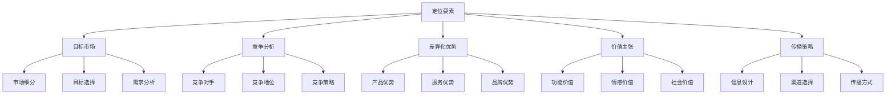
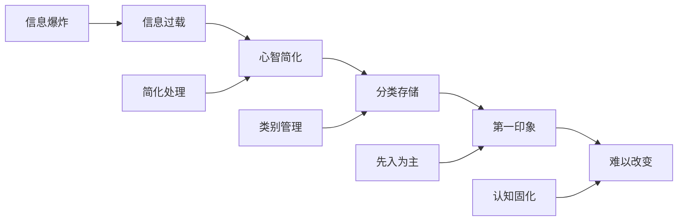
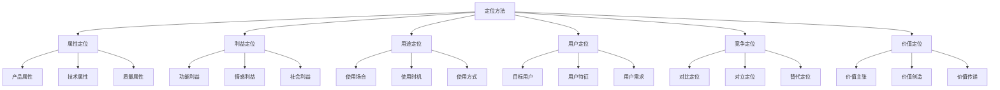
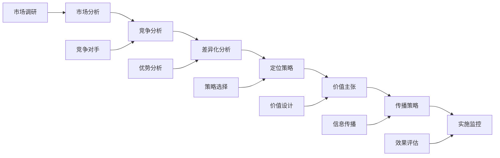
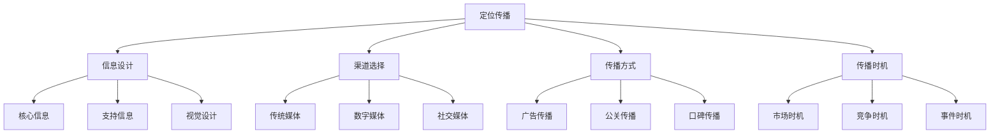

# 定位理论

## 定位理论概述

### 理论定义
**定位理论**：由艾·里斯和杰克·特劳特提出的营销理论，强调在顾客心智中建立独特位置，形成差异化竞争优势。

### 理论核心
| 核心概念 | 内容 | 意义 |
|----------|------|------|
| **心智定位** | 在顾客心智中定位 | 认知决定购买 |
| **差异化** | 与竞争对手差异化 | 避免同质化竞争 |
| **聚焦** | 聚焦核心优势 | 资源集中使用 |
| **简单** | 信息简单明了 | 易于记忆传播 |

### 定位要素

### 理论价值
| 价值 | 内容 | 意义 |
|------|------|------|
| **认知优势** | 建立认知优势 | 心智占位 |
| **差异化** | 实现差异化 | 避免竞争 |
| **资源聚焦** | 资源集中使用 | 效率提升 |
| **品牌价值** | 提升品牌价值 | 品牌资产 |

## 定位原理

### 心智原理

### 心智特点
| 特点 | 内容 | 营销启示 |
|------|------|----------|
| **容量有限** | 心智容量有限 | 信息要简洁 |
| **厌恶混乱** | 不喜欢复杂信息 | 信息要清晰 |
| **缺乏安全感** | 购买决策有风险 | 提供安全感 |
| **不会改变** | 认知难以改变 | 抢占先机 |
| **会失去焦点** | 容易失去焦点 | 保持聚焦 |

### 定位原则
1. **第一原则**：成为第一，抢占心智
2. **聚焦原则**：聚焦核心优势
3. **简单原则**：信息简单明了
4. **差异原则**：与竞争对手差异化
5. **持续原则**：持续传播定位

## 定位策略

### 定位方法

### 定位策略类型
| 策略类型 | 内容 | 特点 | 适用场景 |
|----------|------|------|----------|
| **属性定位** | 基于产品属性 | 功能突出 | 功能导向产品 |
| **利益定位** | 基于顾客利益 | 价值明确 | 价值导向产品 |
| **用途定位** | 基于产品用途 | 场景明确 | 场景化产品 |
| **用户定位** | 基于目标用户 | 用户明确 | 细分市场产品 |
| **竞争定位** | 基于竞争对手 | 对比鲜明 | 竞争激烈市场 |
| **价值定位** | 基于价值主张 | 价值独特 | 高端产品 |

### 定位策略选择
| 选择因素 | 内容 | 影响 |
|----------|------|------|
| **产品特性** | 产品特点、功能 | 定位方向 |
| **市场环境** | 竞争状况、需求 | 定位策略 |
| **企业资源** | 资源能力、优势 | 定位可行性 |
| **目标市场** | 市场特征、需求 | 定位匹配度 |

## 定位实施

### 定位步骤

### 实施要素
| 要素 | 内容 | 要求 |
|------|------|------|
| **市场分析** | 深入了解市场 | 数据支撑 |
| **竞争分析** | 分析竞争对手 | 对比分析 |
| **差异化分析** | 识别差异化优势 | 优势突出 |
| **定位策略** | 制定定位策略 | 策略清晰 |
| **价值主张** | 设计价值主张 | 价值明确 |
| **传播策略** | 制定传播策略 | 传播有效 |
| **实施监控** | 实施和监控 | 持续优化 |

### 实施原则
1. **一致性**：保持定位一致性
2. **持续性**：持续传播定位
3. **聚焦性**：聚焦核心定位
4. **差异性**：保持差异化
5. **简单性**：信息简单明了

## 定位传播

### 传播要素

### 传播策略
| 策略 | 内容 | 特点 |
|------|------|------|
| **集中传播** | 集中资源传播 | 效果显著 |
| **持续传播** | 持续传播定位 | 建立认知 |
| **多渠道传播** | 多渠道传播 | 覆盖全面 |
| **精准传播** | 精准目标传播 | 效率高 |

### 传播工具
1. **广告**：传统广告、数字广告
2. **公关**：媒体关系、事件营销
3. **内容**：内容营销、故事营销
4. **社交**：社交媒体、口碑营销
5. **体验**：体验营销、互动营销

## 定位评估

### 评估维度
| 维度 | 内容 | 评估方法 |
|------|------|----------|
| **认知度** | 品牌认知程度 | 市场调研 |
| **差异化** | 差异化程度 | 对比分析 |
| **相关性** | 与需求相关性 | 需求分析 |
| **可信度** | 定位可信度 | 信任调查 |
| **记忆度** | 定位记忆度 | 记忆测试 |

### 评估指标
| 指标 | 内容 | 测量方法 |
|------|------|----------|
| **品牌知名度** | 品牌认知程度 | 无提示/有提示知名度 |
| **品牌联想** | 品牌联想内容 | 品牌联想测试 |
| **品牌偏好** | 品牌偏好程度 | 偏好度调查 |
| **品牌忠诚** | 品牌忠诚度 | 重复购买率 |
| **品牌价值** | 品牌价值评估 | 品牌价值评估 |

### 评估方法
1. **市场调研**：定量和定性调研
2. **品牌测试**：品牌认知测试
3. **竞争分析**：竞争地位分析
4. **财务分析**：财务表现分析
5. **专家评估**：专家意见评估

## 定位案例

### 成功案例
#### 苹果公司定位
- **定位**：创新、设计、品质的领导者
- **差异化**：设计美学、用户体验
- **价值主张**：Think Different
- **传播策略**：品牌故事、体验营销

#### 沃尔玛定位
- **定位**：天天低价的零售商
- **差异化**：价格优势、规模效应
- **价值主张**：Save Money, Live Better
- **传播策略**：价格广告、口碑传播

#### 星巴克定位
- **定位**：第三空间的咖啡品牌
- **差异化**：体验、文化、社区
- **价值主张**：连接人们的咖啡
- **传播策略**：体验营销、社区建设

### 失败案例
#### 定位失败原因
1. **定位不清晰**：定位信息模糊
2. **差异化不足**：与竞争对手相似
3. **传播不一致**：传播信息不一致
4. **缺乏持续性**：定位传播不持续
5. **市场变化**：市场环境变化

## 定位理论发展

### 理论扩展
- **品牌定位**：品牌层面的定位
- **产品定位**：产品层面的定位
- **企业定位**：企业层面的定位
- **个人定位**：个人品牌定位

### 现代发展
| 发展 | 内容 | 特点 |
|------|------|------|
| **数字化定位** | 数字技术应用 | 精准、高效 |
| **个性化定位** | 个性化定位 | 定制、专属 |
| **动态定位** | 动态调整定位 | 灵活、适应 |
| **生态定位** | 生态系统定位 | 协同、共创 |

### 未来趋势
- **智能化定位**：AI驱动的智能定位
- **场景化定位**：基于场景的定位
- **价值化定位**：价值共创定位
- **可持续定位**：可持续发展定位

## 实践指导

### 定位策略制定
1. **市场分析**：深入分析目标市场
2. **竞争分析**：分析竞争对手定位
3. **差异化分析**：识别差异化优势
4. **定位策略**：制定定位策略
5. **价值主张**：设计价值主张
6. **传播策略**：制定传播策略
7. **实施监控**：实施和监控定位

### 注意事项
- **定位清晰**：定位信息要清晰
- **差异化**：与竞争对手差异化
- **一致性**：保持定位一致性
- **持续性**：持续传播定位
- **聚焦性**：聚焦核心定位
- **简单性**：信息简单明了

---

**相关链接**：
- [[01-STP理论|STP理论]]
- [[02-竞争分析理论|竞争分析理论]]
- [[04-蓝海战略理论|蓝海战略理论]]
- [[04-营销策略制定/03-品牌策略/01-品牌定位策略|品牌定位策略]]
