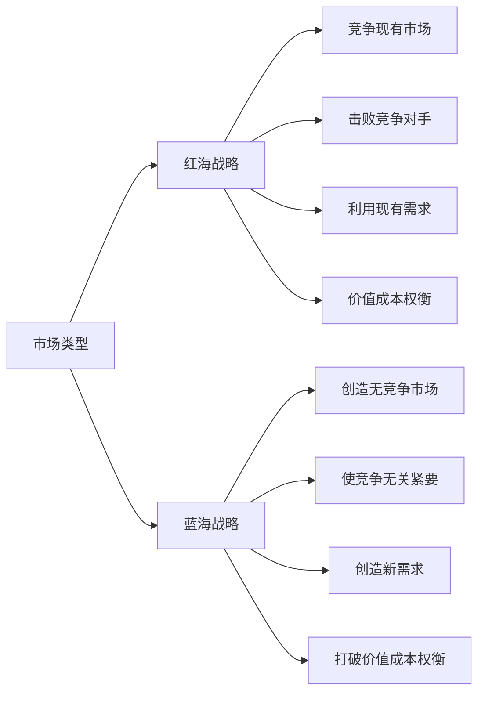
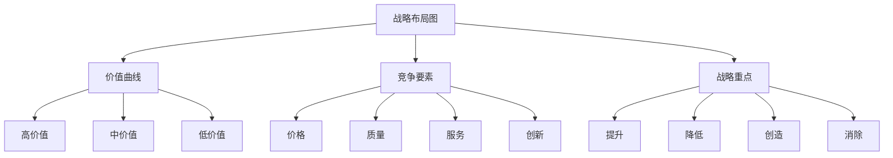
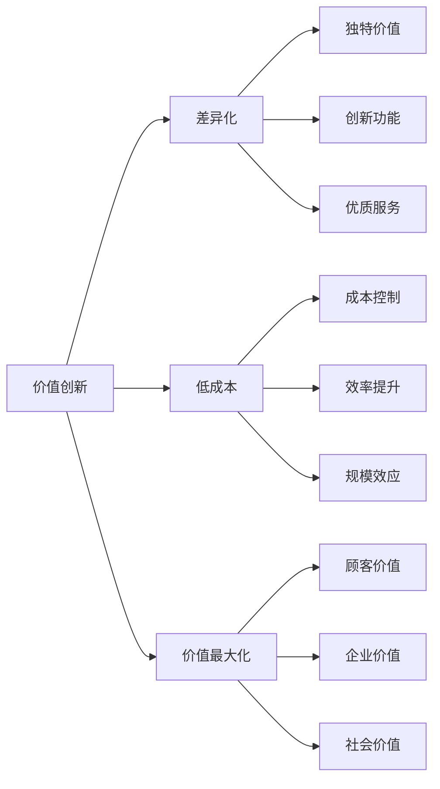
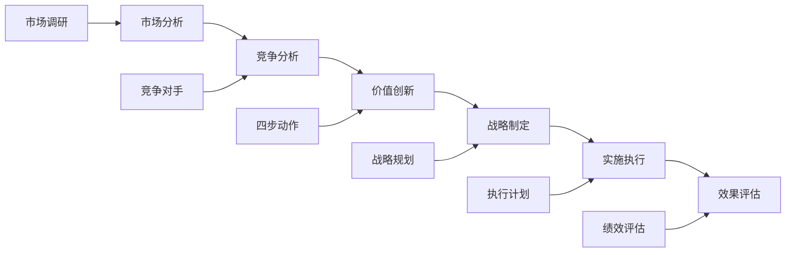

# 蓝海战略理论

## 蓝海战略概述

### 理论定义
**蓝海战略**：由W.钱·金和勒妮·莫博涅提出的战略理论，强调创造新的市场空间，摆脱竞争，实现价值创新。

### 理论核心
| 核心概念 | 内容 | 意义 |
|----------|------|------|
| **蓝海** | 未竞争的市场空间 | 摆脱竞争 |
| **红海** | 竞争激烈的市场 | 血腥竞争 |
| **价值创新** | 同时追求差异化和低成本 | 价值创造 |
| **战略布局图** | 可视化战略分析工具 | 战略分析 |

### 蓝海vs红海对比

### 理论价值
| 价值 | 内容 | 意义 |
|------|------|------|
| **摆脱竞争** | 创造无竞争市场 | 避免价格战 |
| **价值创新** | 同时实现差异化和低成本 | 价值最大化 |
| **市场创造** | 创造新的市场空间 | 增长机会 |
| **战略突破** | 实现战略突破 | 竞争优势 |

## 蓝海战略分析

### 战略布局图

### 四步动作框架
| 动作 | 内容 | 问题 | 目标 |
|------|------|------|------|
| **消除** | 消除哪些行业认为理所当然的要素 | 哪些要素应该被消除 | 降低成本 |
| **降低** | 降低哪些要素的标准 | 哪些要素应该被降低 | 成本控制 |
| **提升** | 提升哪些要素的标准 | 哪些要素应该被提升 | 价值创造 |
| **创造** | 创造哪些行业从未提供的要素 | 哪些要素应该被创造 | 差异化 |

### 价值创新

## 蓝海战略工具

### 战略画布
| 要素 | 内容 | 分析要点 |
|------|------|----------|
| **竞争要素** | 行业竞争的关键要素 | 识别关键要素 |
| **价值水平** | 各要素的价值水平 | 评估价值水平 |
| **价值曲线** | 企业的价值曲线 | 绘制价值曲线 |
| **战略重点** | 四步动作的重点 | 确定战略重点 |

### 四步动作框架应用
1. **消除**：识别并消除不必要的要素
2. **降低**：降低某些要素的标准
3. **提升**：提升关键要素的标准
4. **创造**：创造新的价值要素

### 价值创新矩阵
| 维度 | 内容 | 策略 |
|------|------|------|
| **差异化** | 与竞争对手的差异 | 提升、创造 |
| **低成本** | 成本控制能力 | 消除、降低 |
| **价值创新** | 同时实现差异化和低成本 | 四步动作 |

## 蓝海战略实施

### 实施步骤

### 实施要素
| 要素 | 内容 | 要求 |
|------|------|------|
| **市场洞察** | 深入了解市场 | 洞察力 |
| **创新思维** | 突破传统思维 | 创新性 |
| **价值创造** | 创造独特价值 | 价值性 |
| **执行能力** | 有效执行战略 | 执行力 |
| **持续改进** | 持续优化战略 | 改进性 |

### 实施原则
1. **价值创新**：同时追求差异化和低成本
2. **市场创造**：创造新的市场空间
3. **顾客导向**：以顾客价值为中心
4. **系统思维**：系统化思考问题
5. **持续创新**：持续创新和改进

## 蓝海战略案例

### 成功案例
#### 太阳马戏团
- **消除**：消除动物表演、明星表演
- **降低**：降低场地成本、道具成本
- **提升**：提升艺术性、故事性
- **创造**：创造马戏艺术新形式
- **结果**：创造蓝海市场，获得巨大成功

#### 西南航空
- **消除**：消除餐饮服务、座位预订
- **降低**：降低票价、运营成本
- **提升**：提升服务速度、便利性
- **创造**：创造低成本航空模式
- **结果**：成为美国最成功的航空公司

#### 任天堂Wii
- **消除**：消除复杂操作、高画质
- **降低**：降低硬件成本、游戏复杂度
- **提升**：提升互动性、家庭娱乐
- **创造**：创造体感游戏新体验
- **结果**：重新定义游戏市场

### 失败案例
#### 失败原因分析
1. **价值创新不足**：未能实现真正的价值创新
2. **市场理解错误**：对市场需求理解错误
3. **执行能力不足**：缺乏有效执行能力
4. **竞争应对不当**：未能应对竞争对手反应
5. **持续创新不足**：缺乏持续创新能力

## 蓝海战略发展

### 理论扩展
- **数字蓝海**：数字化时代的蓝海战略
- **平台蓝海**：平台经济的蓝海战略
- **生态蓝海**：生态系统的蓝海战略
- **可持续蓝海**：可持续发展的蓝海战略

### 现代发展
| 发展 | 内容 | 特点 |
|------|------|------|
| **数字化** | 数字技术应用 | 精准、高效 |
| **平台化** | 平台经济模式 | 生态、协同 |
| **个性化** | 个性化定制 | 定制、专属 |
| **可持续化** | 可持续发展 | 环保、责任 |

### 未来趋势
- **智能化蓝海**：AI驱动的智能蓝海
- **场景化蓝海**：基于场景的蓝海
- **价值化蓝海**：价值共创的蓝海
- **全球化蓝海**：全球化的蓝海

## 蓝海战略应用

### 应用领域
| 领域 | 内容 | 特点 |
|------|------|------|
| **产品创新** | 新产品开发 | 功能创新、体验创新 |
| **服务创新** | 新服务模式 | 服务创新、模式创新 |
| **商业模式** | 新商业模式 | 模式创新、价值创新 |
| **市场开发** | 新市场开发 | 市场创新、需求创新 |

### 应用步骤
1. **市场分析**：分析现有市场
2. **竞争分析**：分析竞争对手
3. **价值创新**：运用四步动作框架
4. **战略制定**：制定蓝海战略
5. **实施执行**：执行蓝海战略
6. **效果评估**：评估战略效果

### 应用原则
- **价值创新**：始终追求价值创新
- **顾客导向**：以顾客价值为中心
- **系统思维**：系统化思考问题
- **持续创新**：持续创新和改进
- **执行能力**：确保有效执行

## 实践指导

### 策略制定
1. **市场洞察**：深入了解市场环境
2. **竞争分析**：分析竞争对手策略
3. **价值创新**：运用四步动作框架
4. **战略规划**：制定蓝海战略规划
5. **实施计划**：制定详细实施计划
6. **效果评估**：建立效果评估机制

### 注意事项
- **价值创新**：确保真正的价值创新
- **市场验证**：验证市场需求
- **执行能力**：确保执行能力
- **竞争应对**：应对竞争对手反应
- **持续创新**：持续创新和改进
- **风险控制**：控制战略风险

---

**相关链接**：
- [[01-STP理论|STP理论]]
- [[02-竞争分析理论|竞争分析理论]]
- [[03-定位理论|定位理论]]
- [[04-营销策略制定/02-竞争策略/02-差异化策略|差异化策略]]
