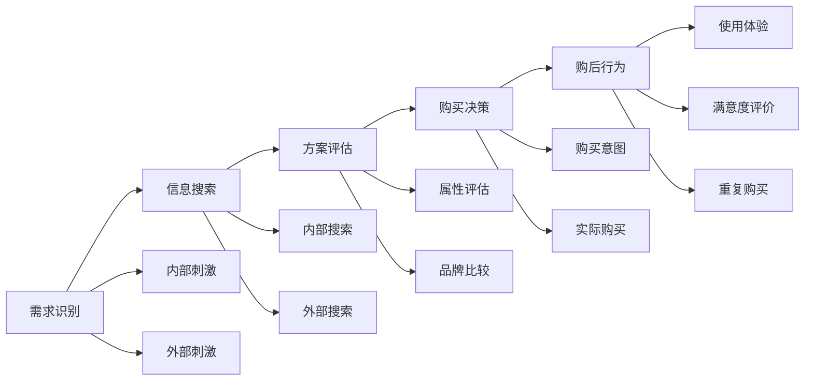
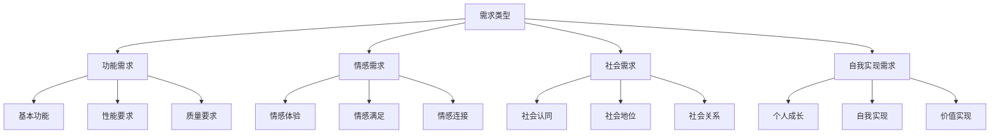
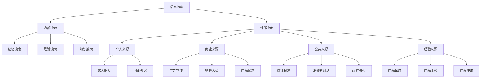
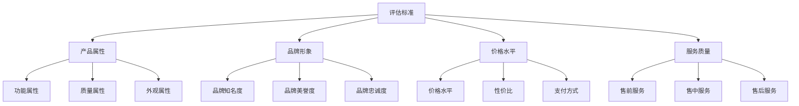
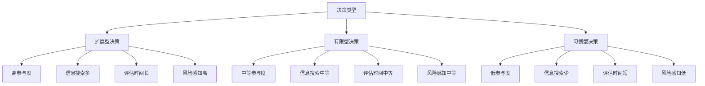
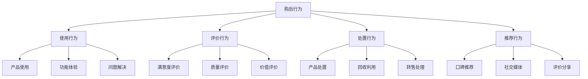

# 消费者决策过程

## 消费者决策概述

### 决策定义
**消费者决策**：消费者在购买过程中，从识别需求到购后评价的完整决策过程。

### 决策特点
| 特点 | 内容 | 影响 |
|------|------|------|
| **复杂性** | 涉及多个因素 | 决策难度大 |
| **动态性** | 过程动态变化 | 需要灵活应对 |
| **个体性** | 个体差异明显 | 需要个性化 |
| **情境性** | 受情境影响 | 需要情境化 |

### 决策过程模型

## 需求识别阶段

### 需求类型

### 需求识别过程
| 过程 | 内容 | 营销策略 |
|------|------|----------|
| **需求感知** | 感知到需求存在 | 需求唤醒、刺激需求 |
| **需求分析** | 分析需求内容 | 需求理解、需求引导 |
| **需求确认** | 确认需求真实性 | 需求验证、需求强化 |
| **需求优先级** | 确定需求优先级 | 需求排序、需求重点 |

### 需求识别影响因素
| 因素 | 内容 | 影响机制 |
|------|------|----------|
| **内部因素** | 生理、心理状态 | 直接驱动需求 |
| **外部因素** | 环境、社会影响 | 间接影响需求 |
| **情境因素** | 时间、地点、场合 | 情境化需求 |
| **个人因素** | 个性、价值观 | 个性化需求 |

## 信息搜索阶段

### 搜索类型

### 搜索行为特点
| 特点 | 内容 | 营销启示 |
|------|------|----------|
| **选择性** | 选择性搜索信息 | 信息要突出 |
| **有限性** | 搜索信息有限 | 信息要简洁 |
| **主观性** | 主观解释信息 | 信息要客观 |
| **动态性** | 搜索过程动态 | 信息要更新 |

### 搜索策略
1. **信息提供**：主动提供相关信息
2. **信息简化**：简化复杂信息
3. **信息突出**：突出关键信息
4. **信息对比**：提供对比信息
5. **信息验证**：提供验证信息

## 方案评估阶段

### 评估标准

### 评估方法
| 方法 | 内容 | 特点 |
|------|------|------|
| **补偿性模型** | 综合评估各属性 | 全面但复杂 |
| **非补偿性模型** | 关键属性决定 | 简单但片面 |
| **词典式模型** | 按重要性排序 | 层次清晰 |
| **排除式模型** | 逐步排除选项 | 效率较高 |

### 评估过程
1. **属性识别**：识别重要属性
2. **权重分配**：分配属性权重
3. **评分评估**：对各选项评分
4. **综合比较**：综合比较各选项
5. **选择决策**：做出最终选择

## 购买决策阶段

### 决策类型

### 决策影响因素
| 因素 | 内容 | 影响程度 |
|------|------|----------|
| **个人因素** | 年龄、性别、收入 | 中等 |
| **心理因素** | 动机、态度、个性 | 高 |
| **社会因素** | 文化、社会阶层 | 中等 |
| **情境因素** | 时间、地点、场合 | 高 |

### 决策过程
1. **购买意图**：形成购买意图
2. **购买计划**：制定购买计划
3. **购买执行**：执行购买行为
4. **购买确认**：确认购买结果

## 购后行为阶段

### 购后行为类型

### 购后评价
| 评价维度 | 内容 | 影响 |
|----------|------|------|
| **满意度** | 对产品的满意程度 | 重复购买、推荐 |
| **质量感知** | 对产品质量的感知 | 品牌形象、信任 |
| **价值感知** | 对产品价值的感知 | 性价比、价值 |
| **期望对比** | 与期望的对比 | 满意度、忠诚度 |

### 购后行为管理
1. **使用指导**：提供使用指导
2. **问题解决**：及时解决问题
3. **满意度调查**：调查满意度
4. **关系维护**：维护客户关系
5. **口碑管理**：管理口碑传播

## 决策过程影响因素

### 个人因素
| 因素 | 内容 | 影响机制 |
|------|------|----------|
| **人口统计** | 年龄、性别、收入 | 直接影响需求 |
| **心理特征** | 个性、价值观 | 影响决策风格 |
| **生活方式** | 生活模式、兴趣 | 影响产品选择 |
| **购买经验** | 历史购买经验 | 影响决策效率 |

### 社会因素
| 因素 | 内容 | 影响机制 |
|------|------|----------|
| **文化背景** | 文化价值观 | 影响价值判断 |
| **社会阶层** | 社会地位 | 影响产品偏好 |
| **参考群体** | 重要他人 | 影响决策标准 |
| **家庭影响** | 家庭成员 | 影响购买决策 |

### 情境因素
| 因素 | 内容 | 影响机制 |
|------|------|----------|
| **时间因素** | 购买时间 | 影响决策时间 |
| **地点因素** | 购买地点 | 影响购买环境 |
| **场合因素** | 使用场合 | 影响产品选择 |
| **情绪因素** | 情绪状态 | 影响决策质量 |

## 营销策略应用

### 需求识别策略
1. **需求唤醒**：唤醒潜在需求
2. **需求引导**：引导需求方向
3. **需求强化**：强化需求强度
4. **需求创造**：创造新需求

### 信息搜索策略
1. **信息提供**：主动提供信息
2. **信息简化**：简化复杂信息
3. **信息突出**：突出关键信息
4. **信息对比**：提供对比信息

### 方案评估策略
1. **属性优化**：优化产品属性
2. **品牌建设**：建设品牌形象
3. **价格策略**：制定价格策略
4. **服务提升**：提升服务质量

### 购买决策策略
1. **购买便利**：提供购买便利
2. **风险降低**：降低购买风险
3. **购买激励**：提供购买激励
4. **购买支持**：提供购买支持

### 购后行为策略
1. **使用指导**：提供使用指导
2. **问题解决**：及时解决问题
3. **关系维护**：维护客户关系
4. **口碑管理**：管理口碑传播

## 实践应用

### 应用步骤
1. **决策分析**：分析消费者决策过程
2. **影响因素**：识别关键影响因素
3. **策略制定**：制定针对性策略
4. **实施执行**：执行营销策略
5. **效果评估**：评估策略效果

### 应用原则
- **顾客导向**：以顾客为中心
- **过程导向**：关注决策过程
- **个性化**：个性化营销策略
- **系统性**：系统化思考问题
- **动态性**：动态调整策略

---

**相关链接**：
- [[02-消费者心理分析|消费者心理分析]]
- [[03-消费者细分理论|消费者细分理论]]
- [[04-消费者洞察方法|消费者洞察方法]]
- [[04-营销策略制定/01-市场分析/01-市场调研方法|市场调研方法]]
