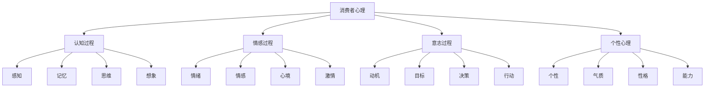
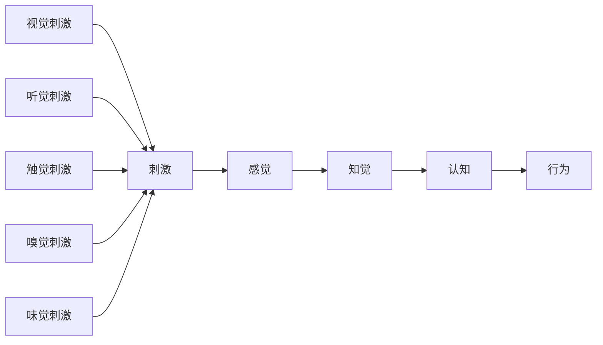
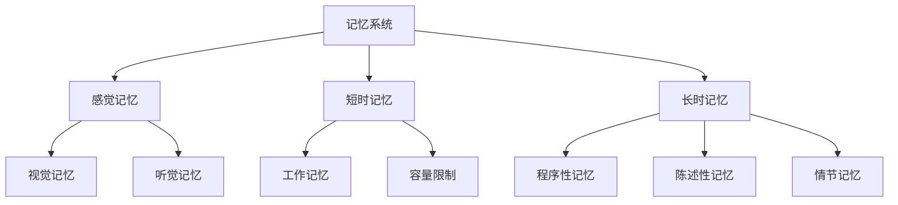
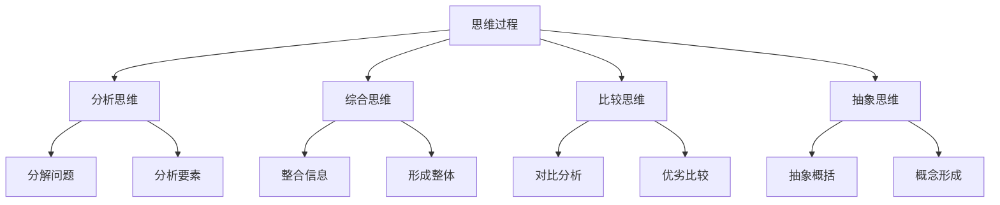
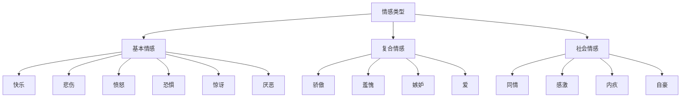
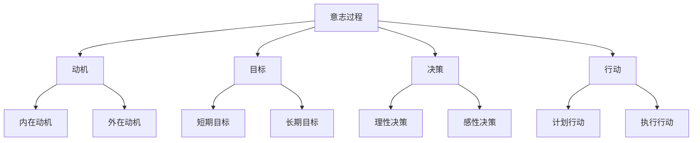
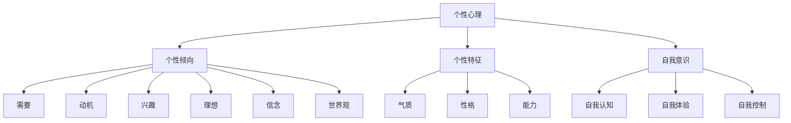

# 消费者心理分析

## 消费者心理概述

### 心理定义
**消费者心理**：消费者在购买和使用产品过程中的心理活动、心理过程和心理特征。

### 心理结构

### 心理特点
| 特点 | 内容 | 营销启示 |
|------|------|----------|
| **复杂性** | 心理活动复杂多样 | 需要深入理解 |
| **动态性** | 心理状态动态变化 | 需要动态应对 |
| **个体性** | 个体差异明显 | 需要个性化 |
| **情境性** | 受情境影响 | 需要情境化 |

## 认知过程分析

### 感知过程

### 感知规律
| 规律 | 内容 | 营销应用 |
|------|------|----------|
| **选择性注意** | 只关注部分信息 | 突出关键信息 |
| **知觉组织** | 将信息组织成整体 | 设计整体形象 |
| **知觉恒常性** | 保持对事物的稳定认知 | 品牌一致性 |
| **知觉偏差** | 感知中的系统性偏差 | 利用认知偏差 |

### 记忆过程

### 记忆规律
| 规律 | 内容 | 营销应用 |
|------|------|------|
| **编码特异性** | 记忆与编码环境相关 | 情境营销 |
| **遗忘曲线** | 记忆随时间衰减 | 重复营销 |
| **记忆重构** | 记忆会被重构 | 品牌故事 |
| **情绪记忆** | 情绪增强记忆 | 情感营销 |

### 思维过程

### 思维特点
| 特点 | 内容 | 营销启示 |
|------|------|----------|
| **逻辑性** | 逻辑思维分析 | 提供逻辑信息 |
| **创造性** | 创造性思维 | 激发创新思维 |
| **批判性** | 批判性思维 | 提供客观信息 |
| **直觉性** | 直觉思维判断 | 利用直觉判断 |

## 情感过程分析

### 情感类型

### 情感特点
| 特点 | 内容 | 营销应用 |
|------|------|----------|
| **强度性** | 情感强度不同 | 情感强度控制 |
| **方向性** | 情感有正负方向 | 情感方向引导 |
| **持续性** | 情感持续时间不同 | 情感持续管理 |
| **感染性** | 情感会相互感染 | 情感传播利用 |

### 情感影响
| 影响 | 内容 | 机制 |
|------|------|------|
| **认知影响** | 影响认知过程 | 情感调节认知 |
| **行为影响** | 影响行为决策 | 情感驱动行为 |
| **记忆影响** | 影响记忆效果 | 情感增强记忆 |
| **判断影响** | 影响价值判断 | 情感影响判断 |

### 情感营销
1. **情感诉求**：触动消费者情感
2. **情感体验**：创造情感体验
3. **情感连接**：建立情感连接
4. **情感记忆**：建立情感记忆

## 意志过程分析

### 意志结构

### 动机类型
| 类型 | 内容 | 特点 |
|------|------|------|
| **生理动机** | 满足生理需求 | 基础性、强烈性 |
| **安全动机** | 满足安全需求 | 保护性、稳定性 |
| **社交动机** | 满足社交需求 | 社会性、归属性 |
| **尊重动机** | 满足尊重需求 | 自尊性、成就性 |
| **自我实现** | 满足自我实现需求 | 成长性、创造性 |

### 动机特点
| 特点 | 内容 | 营销启示 |
|------|------|----------|
| **驱动性** | 驱动行为发生 | 激发购买动机 |
| **指向性** | 指向特定目标 | 引导购买目标 |
| **强度性** | 动机强度不同 | 强化购买动机 |
| **变化性** | 动机动态变化 | 动态调整策略 |

### 意志营销
1. **动机激发**：激发购买动机
2. **目标引导**：引导购买目标
3. **决策支持**：支持购买决策
4. **行动促进**：促进购买行动

## 个性心理分析

### 个性结构

### 气质类型
| 类型 | 特点 | 营销策略 |
|------|------|----------|
| **胆汁质** | 热情、冲动、外向 | 刺激性强、节奏快 |
| **多血质** | 活泼、好动、善变 | 多样化、趣味性 |
| **粘液质** | 安静、稳重、内向 | 稳定可靠、质量保证 |
| **抑郁质** | 敏感、细腻、内向 | 情感细腻、个性化 |

### 性格特征
| 特征 | 内容 | 营销应用 |
|------|------|----------|
| **外向性** | 外向、社交、活跃 | 社交营销、互动体验 |
| **内向性** | 内向、安静、思考 | 深度内容、个人体验 |
| **开放性** | 开放、创新、好奇 | 创新产品、新奇体验 |
| **尽责性** | 负责、自律、可靠 | 质量保证、服务承诺 |
| **神经质** | 情绪化、敏感、焦虑 | 情感支持、安全感 |

### 能力差异
| 能力 | 内容 | 营销策略 |
|------|------|----------|
| **认知能力** | 理解、分析、判断 | 信息简化、逻辑清晰 |
| **情感能力** | 情感理解、表达 | 情感共鸣、情感体验 |
| **社交能力** | 沟通、合作、领导 | 社交功能、社区建设 |
| **创造能力** | 创新、想象、设计 | 创新产品、创意体验 |

## 心理偏差分析

### 认知偏差
| 偏差类型 | 内容 | 营销应用 |
|----------|------|----------|
| **锚定效应** | 过度依赖初始信息 | 价格锚定、价值锚定 |
| **损失厌恶** | 对损失的敏感度更高 | 损失框架、风险提示 |
| **从众效应** | 跟随他人行为 | 社会证明、群体压力 |
| **确认偏差** | 寻找支持自己观点的信息 | 品牌一致性、信息筛选 |
| **可用性启发** | 基于易获得的信息判断 | 信息突出、案例展示 |

### 情感偏差
| 偏差类型 | 内容 | 营销应用 |
|----------|------|----------|
| **情绪感染** | 情绪会相互感染 | 情感营销、情绪传播 |
| **情绪记忆** | 情绪增强记忆 | 情感体验、情感故事 |
| **情绪决策** | 情绪影响决策 | 情感诉求、情感引导 |
| **情绪调节** | 情绪需要调节 | 情感支持、情绪管理 |

### 社会偏差
| 偏差类型 | 内容 | 营销应用 |
|----------|------|----------|
| **社会认同** | 寻求社会认同 | 社会证明、群体归属 |
| **权威效应** | 权威影响判断 | 专家推荐、权威认证 |
| **稀缺效应** | 稀缺性增加价值 | 限量发售、限时优惠 |
| **互惠原理** | 回报他人好意 | 免费试用、礼品赠送 |

## 心理营销策略

### 认知策略
1. **信息简化**：简化复杂信息
2. **信息突出**：突出关键信息
3. **信息重复**：重复重要信息
4. **信息组织**：逻辑组织信息

### 情感策略
1. **情感诉求**：触动消费者情感
2. **情感体验**：创造情感体验
3. **情感连接**：建立情感连接
4. **情感记忆**：建立情感记忆

### 意志策略
1. **动机激发**：激发购买动机
2. **目标引导**：引导购买目标
3. **决策支持**：支持购买决策
4. **行动促进**：促进购买行动

### 个性策略
1. **个性匹配**：匹配消费者个性
2. **个性表达**：满足个性表达需求
3. **个性认同**：建立个性认同
4. **个性发展**：支持个性发展

## 实践应用

### 应用步骤
1. **心理分析**：分析消费者心理
2. **心理洞察**：洞察心理需求
3. **策略制定**：制定心理营销策略
4. **实施执行**：执行心理营销策略
5. **效果评估**：评估心理营销效果

### 应用原则
- **心理导向**：以心理为导向
- **个性化**：个性化心理策略
- **情感化**：情感化营销
- **系统化**：系统化心理分析
- **动态化**：动态化心理应对

---

**相关链接**：
- [[01-消费者决策过程|消费者决策过程]]
- [[03-消费者细分理论|消费者细分理论]]
- [[04-消费者洞察方法|消费者洞察方法]]
- [[02-营销基础认知/05-营销心理学基础|营销心理学基础]]
