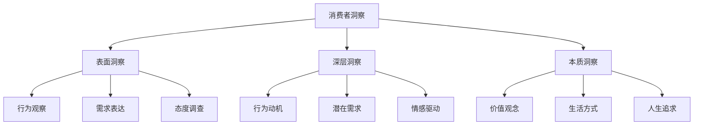
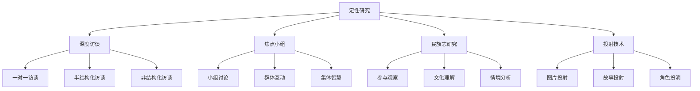
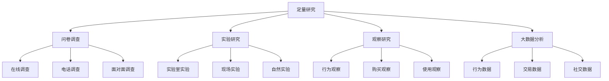
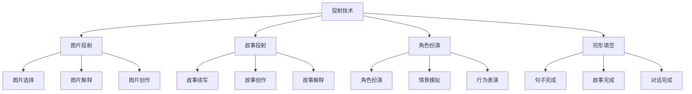
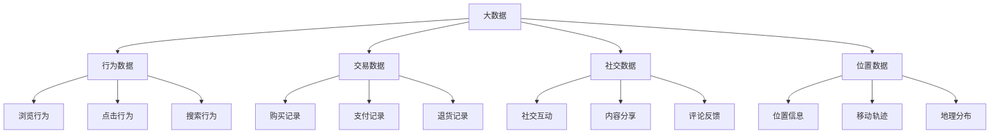

# 消费者洞察方法

## 消费者洞察概述

### 洞察定义
**消费者洞察**：通过深入分析消费者行为、心理、需求等，发现消费者真实需求和行为动机的深度理解。

### 洞察价值
| 价值 | 内容 | 意义 |
|------|------|------|
| **需求发现** | 发现真实需求 | 产品创新指导 |
| **行为理解** | 理解行为动机 | 营销策略制定 |
| **机会识别** | 识别市场机会 | 商业机会把握 |
| **竞争优势** | 建立竞争优势 | 差异化竞争 |

### 洞察层次

### 洞察特点
| 特点 | 内容 | 要求 |
|------|------|------|
| **深度性** | 深入理解消费者 | 深度分析 |
| **真实性** | 反映真实情况 | 客观准确 |
| **前瞻性** | 预测未来趋势 | 趋势预测 |
| **可操作性** | 可指导行动 | 实用可行 |

## 洞察方法

### 定性研究方法

### 定量研究方法

### 混合研究方法
| 方法 | 内容 | 特点 |
|------|------|------|
| **定性+定量** | 结合定性和定量 | 全面深入 |
| **探索+验证** | 探索性+验证性 | 科学严谨 |
| **描述+解释** | 描述性+解释性 | 完整理解 |

## 深度访谈

### 访谈类型
| 类型 | 内容 | 特点 | 适用场景 |
|------|------|------|----------|
| **结构化访谈** | 固定问题顺序 | 标准化、可比性 | 大规模调研 |
| **半结构化访谈** | 部分固定问题 | 灵活性、深度性 | 深度调研 |
| **非结构化访谈** | 自由对话 | 开放性、探索性 | 探索性调研 |

### 访谈技巧
| 技巧 | 内容 | 应用 |
|------|------|------|
| **建立信任** | 建立良好关系 | 获得真实信息 |
| **积极倾听** | 专注倾听 | 理解深层含义 |
| **追问技巧** | 深入追问 | 获得详细信息 |
| **观察技巧** | 观察非语言 | 理解真实情感 |

### 访谈流程
1. **准备阶段**：确定目标、设计问题、选择对象
2. **开始阶段**：建立关系、说明目的、获得同意
3. **进行阶段**：引导对话、深入探索、记录信息
4. **结束阶段**：总结要点、确认理解、感谢参与

## 焦点小组

### 小组特点
| 特点 | 内容 | 优势 | 劣势 |
|------|------|------|------|
| **群体互动** | 成员相互影响 | 激发新想法 | 群体压力 |
| **集体智慧** | 集体讨论 | 丰富观点 | 主导者影响 |
| **成本效益** | 一次多人 | 成本较低 | 深度有限 |

### 小组设计
| 要素 | 内容 | 要求 |
|------|------|------|
| **小组规模** | 6-10人 | 适中规模 |
| **成员选择** | 同质性+异质性 | 平衡选择 |
| **讨论时间** | 1-2小时 | 充分时间 |
| **讨论环境** | 舒适环境 | 放松氛围 |

### 讨论技巧
1. **开场技巧**：破冰、介绍、说明
2. **引导技巧**：引导讨论、控制节奏
3. **激发技巧**：激发思考、鼓励表达
4. **总结技巧**：总结要点、确认理解

## 民族志研究

### 研究特点
| 特点 | 内容 | 优势 | 应用 |
|------|------|------|------|
| **参与观察** | 深入参与 | 真实理解 | 文化研究 |
| **情境理解** | 理解情境 | 全面理解 | 行为研究 |
| **长期观察** | 长期跟踪 | 深度洞察 | 趋势研究 |

### 研究方法
| 方法 | 内容 | 特点 |
|------|------|------|
| **参与观察** | 参与其中观察 | 真实体验 |
| **深度访谈** | 深度交流 | 理解动机 |
| **文档分析** | 分析相关文档 | 背景理解 |
| **文化分析** | 分析文化背景 | 文化理解 |

### 研究步骤
1. **准备阶段**：确定目标、选择地点、获得许可
2. **进入阶段**：建立关系、融入环境、开始观察
3. **观察阶段**：参与观察、记录信息、分析理解
4. **退出阶段**：总结发现、验证理解、形成洞察

## 投射技术

### 技术类型

### 技术特点
| 特点 | 内容 | 优势 | 应用 |
|------|------|------|------|
| **间接性** | 间接了解内心 | 避免防御 | 敏感话题 |
| **投射性** | 投射内心想法 | 真实表达 | 深层需求 |
| **创造性** | 激发创造力 | 丰富表达 | 创新研究 |

### 应用场景
1. **品牌研究**：品牌形象、品牌联想
2. **产品研究**：产品概念、产品体验
3. **广告研究**：广告创意、广告效果
4. **生活方式研究**：生活方式、价值观念

## 大数据分析

### 数据类型

### 分析方法
| 方法 | 内容 | 应用 |
|------|------|------|
| **描述性分析** | 描述数据特征 | 现状了解 |
| **预测性分析** | 预测未来趋势 | 趋势预测 |
| **关联性分析** | 发现关联关系 | 关系发现 |
| **聚类分析** | 群体分类 | 用户细分 |

### 分析工具
1. **统计分析**：SPSS、R、Python
2. **可视化**：Tableau、Power BI
3. **机器学习**：TensorFlow、Scikit-learn
4. **大数据平台**：Hadoop、Spark

## 洞察应用

### 产品开发
| 应用 | 内容 | 价值 |
|------|------|------|
| **需求发现** | 发现真实需求 | 产品创新 |
| **功能设计** | 设计产品功能 | 功能优化 |
| **体验优化** | 优化用户体验 | 体验提升 |
| **迭代改进** | 持续改进产品 | 产品完善 |

### 营销策略
| 应用 | 内容 | 价值 |
|------|------|------|
| **目标市场** | 确定目标市场 | 精准营销 |
| **定位策略** | 制定定位策略 | 差异化竞争 |
| **传播策略** | 制定传播策略 | 有效传播 |
| **渠道策略** | 制定渠道策略 | 渠道优化 |

### 品牌建设
| 应用 | 内容 | 价值 |
|------|------|------|
| **品牌定位** | 确定品牌定位 | 品牌差异化 |
| **品牌形象** | 塑造品牌形象 | 品牌认知 |
| **品牌传播** | 制定传播策略 | 品牌传播 |
| **品牌管理** | 管理品牌资产 | 品牌价值 |

## 洞察趋势

### 发展趋势
| 趋势 | 内容 | 特点 |
|------|------|------|
| **实时化** | 实时洞察 | 快速响应 |
| **智能化** | AI辅助洞察 | 智能分析 |
| **个性化** | 个性化洞察 | 精准理解 |
| **预测性** | 预测性洞察 | 趋势预测 |

### 技术发展
| 技术 | 内容 | 应用 |
|------|------|------|
| **人工智能** | AI算法 | 智能分析 |
| **机器学习** | 机器学习 | 模式识别 |
| **自然语言处理** | NLP技术 | 文本分析 |
| **计算机视觉** | 图像识别 | 视觉分析 |

### 未来方向
- **实时洞察**：实时了解消费者
- **预测洞察**：预测消费者行为
- **情感洞察**：理解消费者情感
- **全渠道洞察**：全渠道消费者理解

## 实践指导

### 应用步骤
1. **确定目标**：明确洞察目标
2. **选择方法**：选择合适方法
3. **收集数据**：收集相关数据
4. **分析数据**：深入分析数据
5. **形成洞察**：形成深度洞察
6. **应用洞察**：应用洞察指导行动
7. **验证效果**：验证洞察效果

### 应用原则
- **深度性**：深入理解消费者
- **真实性**：反映真实情况
- **前瞻性**：预测未来趋势
- **可操作性**：可指导行动
- **持续性**：持续洞察更新

### 注意事项
- **方法选择**：选择合适方法
- **数据质量**：确保数据质量
- **分析深度**：深入分析理解
- **应用效果**：验证应用效果
- **持续更新**：持续更新洞察

---

**相关链接**：
- [[01-消费者决策过程|消费者决策过程]]
- [[02-消费者心理分析|消费者心理分析]]
- [[03-消费者细分理论|消费者细分理论]]
- [[04-营销策略制定/01-市场分析/01-市场调研方法|市场调研方法]]
