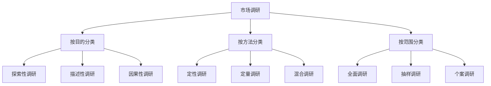
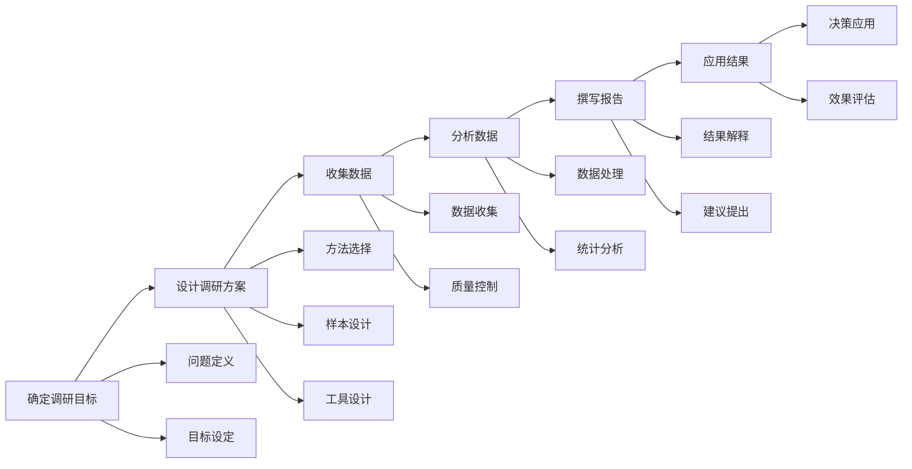
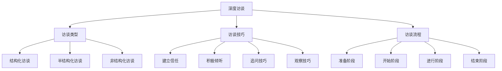
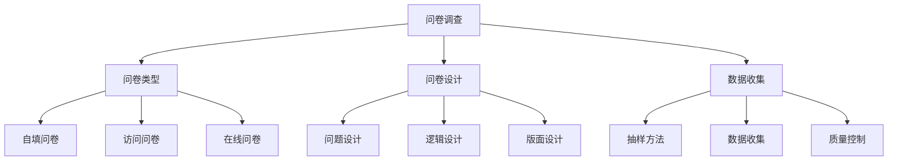
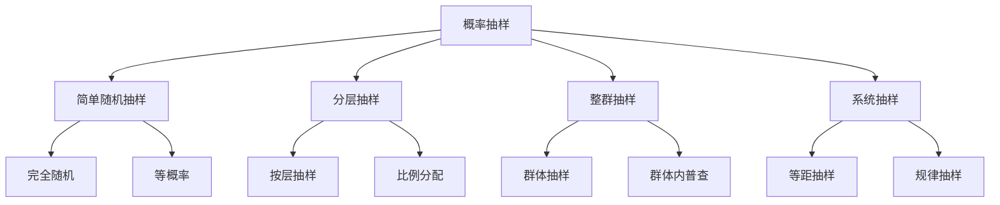
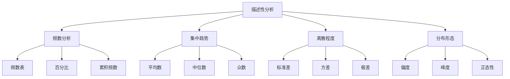
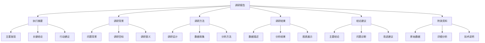

# 市场调研方法

## 市场调研概述

### 调研定义
**市场调研**：系统收集、记录、分析市场相关信息，为营销决策提供依据的研究活动。

### 调研价值
| 价值 | 内容 | 意义 |
|------|------|------|
| **决策支持** | 为营销决策提供依据 | 降低决策风险 |
| **机会识别** | 识别市场机会 | 把握市场机遇 |
| **问题诊断** | 诊断营销问题 | 解决问题 |
| **趋势预测** | 预测市场趋势 | 前瞻性规划 |

### 调研类型

### 调研原则
| 原则 | 内容 | 要求 |
|------|------|------|
| **客观性** | 客观收集信息 | 避免主观偏见 |
| **系统性** | 系统化调研 | 全面完整 |
| **科学性** | 科学方法 | 方法正确 |
| **时效性** | 及时有效 | 信息及时 |

## 调研设计

### 调研流程

### 调研方案设计
| 要素 | 内容 | 要求 |
|------|------|------|
| **调研目标** | 明确调研目的 | 具体明确 |
| **调研内容** | 确定调研内容 | 全面完整 |
| **调研方法** | 选择调研方法 | 科学有效 |
| **样本设计** | 设计样本方案 | 代表性 |
| **时间安排** | 制定时间计划 | 合理可行 |
| **预算控制** | 控制调研成本 | 经济有效 |

### 调研问题设计
| 类型 | 内容 | 特点 | 应用 |
|------|------|------|------|
| **开放式问题** | 自由回答 | 信息丰富 | 探索性调研 |
| **封闭式问题** | 固定选项 | 便于统计 | 描述性调研 |
| **量表问题** | 程度测量 | 精确测量 | 定量调研 |
| **排序问题** | 重要性排序 | 优先级 | 选择决策 |

## 定性调研方法

### 深度访谈

### 焦点小组
| 要素 | 内容 | 要求 |
|------|------|------|
| **小组规模** | 6-10人 | 适中规模 |
| **成员选择** | 同质性+异质性 | 平衡选择 |
| **讨论时间** | 1-2小时 | 充分时间 |
| **讨论环境** | 舒适环境 | 放松氛围 |

### 观察法
| 类型 | 内容 | 特点 | 应用 |
|------|------|------|------|
| **参与观察** | 参与其中观察 | 真实体验 | 行为研究 |
| **非参与观察** | 外部观察 | 客观记录 | 行为记录 |
| **结构化观察** | 按计划观察 | 系统完整 | 定量分析 |
| **非结构化观察** | 自由观察 | 灵活开放 | 探索发现 |

### 投射技术
| 技术 | 内容 | 特点 | 应用 |
|------|------|------|------|
| **图片投射** | 图片选择解释 | 间接表达 | 品牌研究 |
| **故事投射** | 故事创作续写 | 创造性表达 | 产品概念 |
| **角色扮演** | 角色扮演表演 | 情境体验 | 服务体验 |
| **完形填空** | 句子故事完成 | 投射内心 | 态度研究 |

## 定量调研方法

### 问卷调查

### 实验法
| 类型 | 内容 | 特点 | 应用 |
|------|------|------|------|
| **实验室实验** | 控制环境实验 | 精确控制 | 因果关系 |
| **现场实验** | 真实环境实验 | 真实性强 | 效果验证 |
| **自然实验** | 自然发生实验 | 真实自然 | 趋势观察 |
| **准实验** | 部分控制实验 | 平衡控制 | 实用研究 |

### 观察法
| 方法 | 内容 | 特点 | 应用 |
|------|------|------|------|
| **行为观察** | 观察购买行为 | 真实行为 | 行为分析 |
| **使用观察** | 观察产品使用 | 使用体验 | 产品改进 |
| **环境观察** | 观察使用环境 | 环境因素 | 环境设计 |
| **时间观察** | 观察时间模式 | 时间规律 | 时机选择 |

## 抽样方法

### 概率抽样

### 非概率抽样
| 方法 | 内容 | 特点 | 适用场景 |
|------|------|------|----------|
| **便利抽样** | 方便获得样本 | 成本低、效率高 | 探索性调研 |
| **判断抽样** | 专家判断选择 | 针对性强 | 特殊群体 |
| **配额抽样** | 按配额选择 | 结构控制 | 描述性调研 |
| **滚雪球抽样** | 推荐获得样本 | 网络效应 | 隐蔽群体 |

### 样本量确定
| 因素 | 内容 | 影响 |
|------|------|------|
| **总体规模** | 总体大小 | 样本量需求 |
| **置信水平** | 置信度要求 | 样本量需求 |
| **误差范围** | 允许误差 | 样本量需求 |
| **总体异质性** | 总体差异 | 样本量需求 |
| **调研成本** | 成本限制 | 样本量限制 |

## 数据分析

### 描述性分析

### 推断性分析
| 方法 | 内容 | 应用 |
|------|------|------|
| **假设检验** | 检验假设 | 差异检验 |
| **相关分析** | 分析相关性 | 关系分析 |
| **回归分析** | 预测分析 | 因果关系 |
| **方差分析** | 多组比较 | 差异分析 |
| **因子分析** | 降维分析 | 结构分析 |
| **聚类分析** | 分类分析 | 市场细分 |

### 高级分析
| 方法 | 内容 | 应用 |
|------|------|------|
| **结构方程模型** | 复杂关系建模 | 理论验证 |
| **多层线性模型** | 层次数据分析 | 嵌套数据 |
| **生存分析** | 时间事件分析 | 生命周期 |
| **时间序列分析** | 时间趋势分析 | 趋势预测 |
| **机器学习** | 智能分析 | 模式识别 |

## 调研报告

### 报告结构

### 报告撰写
| 要素 | 内容 | 要求 |
|------|------|------|
| **逻辑清晰** | 结构逻辑清楚 | 易于理解 |
| **数据支撑** | 结论有数据支撑 | 客观准确 |
| **图表丰富** | 适当使用图表 | 直观明了 |
| **建议可行** | 建议具有可操作性 | 实用有效 |
| **语言简洁** | 语言简洁明了 | 易于阅读 |

## 调研质量控制

### 质量要素
| 要素 | 内容 | 控制方法 |
|------|------|----------|
| **有效性** | 测量有效性 | 效度检验 |
| **可靠性** | 测量可靠性 | 信度检验 |
| **代表性** | 样本代表性 | 抽样控制 |
| **完整性** | 数据完整性 | 质量控制 |
| **准确性** | 数据准确性 | 验证检查 |

### 质量控制方法
1. **设计控制**：科学设计调研方案
2. **过程控制**：控制调研过程质量
3. **数据控制**：控制数据质量
4. **分析控制**：控制分析质量
5. **结果控制**：控制结果质量

## 调研应用

### 应用领域
| 领域 | 内容 | 应用 |
|------|------|------|
| **市场分析** | 市场环境分析 | 市场机会识别 |
| **消费者研究** | 消费者行为研究 | 消费者洞察 |
| **产品开发** | 产品需求研究 | 产品创新 |
| **品牌研究** | 品牌形象研究 | 品牌建设 |
| **广告研究** | 广告效果研究 | 广告优化 |

### 应用步骤
1. **问题识别**：识别调研问题
2. **方案设计**：设计调研方案
3. **数据收集**：收集调研数据
4. **数据分析**：分析调研数据
5. **结果应用**：应用调研结果
6. **效果评估**：评估应用效果

## 调研趋势

### 发展趋势
| 趋势 | 内容 | 特点 |
|------|------|------|
| **数字化** | 数字技术应用 | 高效便捷 |
| **实时化** | 实时数据收集 | 快速响应 |
| **智能化** | AI辅助分析 | 智能洞察 |
| **个性化** | 个性化调研 | 精准定制 |

### 技术发展
| 技术 | 内容 | 应用 |
|------|------|------|
| **大数据** | 大数据分析 | 全面洞察 |
| **人工智能** | AI算法 | 智能分析 |
| **移动技术** | 移动调研 | 便捷高效 |
| **社交媒体** | 社交数据 | 真实反馈 |

---

**相关链接**：
- [[02-市场细分策略|市场细分策略]]
- [[03-目标市场选择|目标市场选择]]
- [[04-市场机会分析|市场机会分析]]
- [[03-消费者行为理论/04-消费者洞察方法|消费者洞察方法]]
