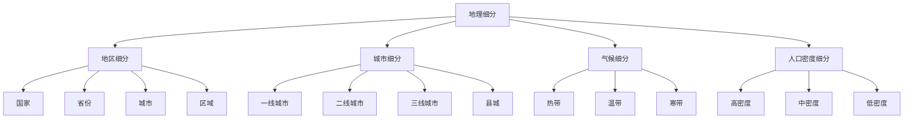
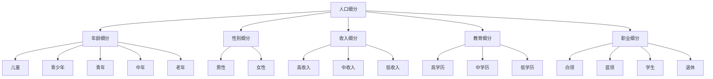
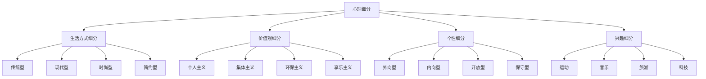
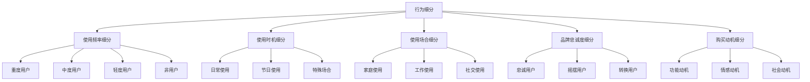
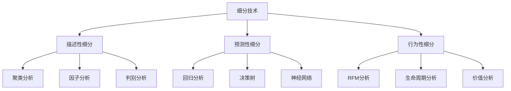

# 市场细分策略

## 市场细分概述

### 细分定义
**市场细分**：根据消费者的需求、行为、特征等差异，将整个市场划分为若干个具有相似特征的消费者群体。

### 细分价值
| 价值 | 内容 | 意义 |
|------|------|------|
| **精准营销** | 精准识别目标市场 | 提高营销效率 |
| **个性化服务** | 提供个性化服务 | 提升顾客满意度 |
| **资源优化** | 优化资源配置 | 提高资源利用效率 |
| **竞争优势** | 建立竞争优势 | 差异化竞争 |

### 细分原则
| 原则 | 内容 | 要求 |
|------|------|------|
| **可测量性** | 细分变量可量化 | 数据可获得 |
| **可进入性** | 能够进入细分市场 | 渠道可达 |
| **可盈利性** | 细分市场有利润 | 规模足够 |
| **可区分性** | 细分市场有差异 | 需求不同 |
| **可行动性** | 能够制定营销策略 | 策略可行 |

## 细分变量

### 地理细分

### 人口细分

### 心理细分

### 行为细分

## 细分方法

### 单一变量细分
| 方法 | 内容 | 特点 | 适用场景 |
|------|------|------|----------|
| **单一变量** | 使用一个变量细分 | 简单易行 | 初步细分 |
| **多变量** | 使用多个变量细分 | 更精确 | 深度细分 |
| **组合变量** | 组合不同变量 | 更全面 | 综合细分 |

### 细分技术

### 细分步骤
1. **确定细分变量**：选择细分标准
2. **收集数据**：收集相关数据
3. **分析数据**：分析细分结果
4. **评估细分**：评估细分有效性
5. **调整细分**：优化细分方案

## 细分市场分析

### 细分市场特征
| 特征 | 内容 | 分析要点 |
|------|------|----------|
| **市场规模** | 细分市场容量 | 市场潜力、增长空间 |
| **市场结构** | 市场组成结构 | 竞争格局、集中度 |
| **市场需求** | 需求特点和强度 | 需求类型、需求强度 |
| **市场行为** | 购买行为特征 | 购买模式、决策过程 |

### 细分市场评估
| 评估维度 | 内容 | 评估标准 |
|----------|------|----------|
| **吸引力** | 市场吸引力 | 高、中、低 |
| **竞争强度** | 竞争激烈程度 | 高、中、低 |
| **进入难度** | 进入市场难度 | 高、中、低 |
| **盈利潜力** | 盈利可能性 | 高、中、低 |

### 细分市场选择
| 选择标准 | 内容 | 要求 |
|----------|------|------|
| **市场潜力** | 市场增长潜力 | 足够大、有增长 |
| **竞争状况** | 竞争激烈程度 | 竞争适中、有机会 |
| **资源匹配** | 企业资源匹配 | 资源充足、能力匹配 |
| **战略一致性** | 与战略一致性 | 符合战略、支持目标 |

## 细分策略

### 无差异营销
| 特点 | 内容 | 优势 | 劣势 |
|------|------|------|------|
| **策略** | 忽略差异，统一营销 | 成本低、管理简单 | 竞争激烈、效果有限 |
| **适用** | 产品同质化、需求相似 | 标准化产品 | 个性化需求不足 |

### 差异化营销
| 特点 | 内容 | 优势 | 劣势 |
|------|------|------|------|
| **策略** | 针对不同市场制定策略 | 满足多样需求、竞争力强 | 成本高、管理复杂 |
| **适用** | 资源充足、需求差异大 | 多样化产品 | 资源要求高 |

### 集中化营销
| 特点 | 内容 | 优势 | 劣势 |
|------|------|------|------|
| **策略** | 专注单一细分市场 | 专业化、成本效益高 | 风险集中、市场有限 |
| **适用** | 资源有限、细分市场有潜力 | 专业化产品 | 市场风险大 |

## 细分应用

### 产品策略
| 策略 | 内容 | 应用 |
|------|------|------|
| **产品开发** | 针对细分市场开发产品 | 满足特定需求 |
| **产品定位** | 为细分市场定位产品 | 建立差异化 |
| **产品组合** | 为不同细分市场提供产品 | 覆盖多个市场 |

### 价格策略
| 策略 | 内容 | 应用 |
|------|------|------|
| **差异化定价** | 不同细分市场不同价格 | 价值定价 |
| **心理定价** | 利用心理因素定价 | 心理影响 |
| **动态定价** | 根据细分市场动态定价 | 市场响应 |

### 渠道策略
| 策略 | 内容 | 应用 |
|------|------|------|
| **渠道选择** | 选择适合的渠道 | 渠道匹配 |
| **渠道管理** | 管理不同渠道 | 渠道优化 |
| **渠道创新** | 创新渠道模式 | 渠道突破 |

### 促销策略
| 策略 | 内容 | 应用 |
|------|------|------|
| **信息定制** | 定制化信息 | 精准传播 |
| **媒体选择** | 选择合适媒体 | 媒体匹配 |
| **活动设计** | 设计针对性活动 | 活动效果 |

## 细分案例

### 成功案例
#### 宝洁公司细分策略
- **细分变量**：年龄、性别、收入、生活方式
- **细分市场**：不同年龄段、不同性别的消费者
- **产品策略**：针对不同细分市场开发不同产品
- **营销策略**：差异化营销策略

#### 星巴克细分策略
- **细分变量**：生活方式、价值观、消费习惯
- **细分市场**：追求品质生活的消费者
- **产品策略**：高品质咖啡和体验
- **营销策略**：体验营销策略

### 失败案例
#### 细分失败原因
1. **细分过度**：细分过于细致
2. **需求误判**：对需求理解错误
3. **资源不足**：资源无法支撑细分
4. **竞争激烈**：细分市场竞争激烈
5. **变化快速**：市场变化太快

## 细分趋势

### 发展趋势
| 趋势 | 内容 | 特点 |
|------|------|------|
| **精准化** | 精准识别细分市场 | 数据驱动 |
| **个性化** | 个性化细分策略 | 定制化 |
| **动态化** | 动态调整细分 | 实时响应 |
| **智能化** | AI辅助细分 | 智能分析 |

### 技术发展
| 技术 | 内容 | 应用 |
|------|------|------|
| **大数据** | 大数据分析 | 精准细分 |
| **人工智能** | AI算法 | 智能细分 |
| **机器学习** | 机器学习 | 预测细分 |
| **云计算** | 云计算平台 | 高效分析 |

### 未来方向
- **实时细分**：实时识别细分市场
- **预测细分**：预测细分市场变化
- **自动细分**：自动化细分过程
- **智能细分**：智能化细分策略

## 实践应用

### 应用步骤
1. **市场调研**：深入了解市场
2. **变量选择**：选择细分变量
3. **数据分析**：分析细分数据
4. **市场细分**：进行市场细分
5. **市场评估**：评估细分市场
6. **策略制定**：制定细分策略
7. **实施监控**：实施和监控策略

### 应用原则
- **市场导向**：以市场为导向
- **数据驱动**：基于数据分析
- **动态调整**：动态调整策略
- **效果评估**：评估细分效果
- **持续优化**：持续优化细分

### 注意事项
- **细分有效性**：确保细分有效
- **资源匹配**：确保资源匹配
- **竞争分析**：分析竞争环境
- **变化适应**：适应市场变化
- **效果监控**：监控细分效果

---

**相关链接**：
- [[01-市场调研方法|市场调研方法]]
- [[03-目标市场选择|目标市场选择]]
- [[04-市场机会分析|市场机会分析]]
- [[03-消费者行为理论/03-消费者细分理论|消费者细分理论]]
