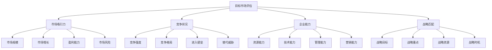
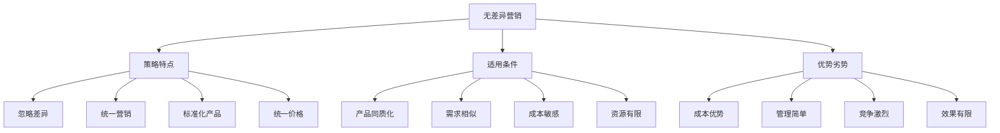
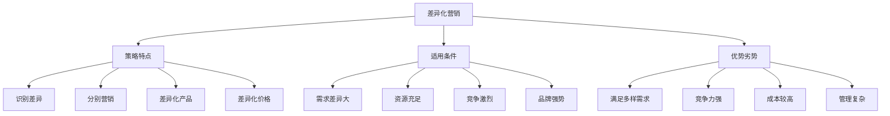
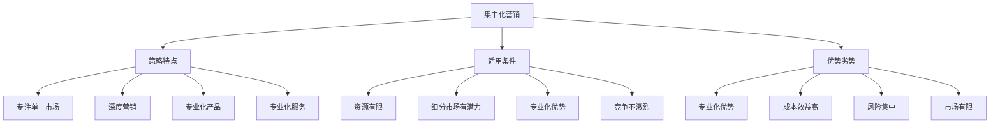
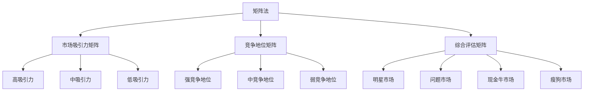
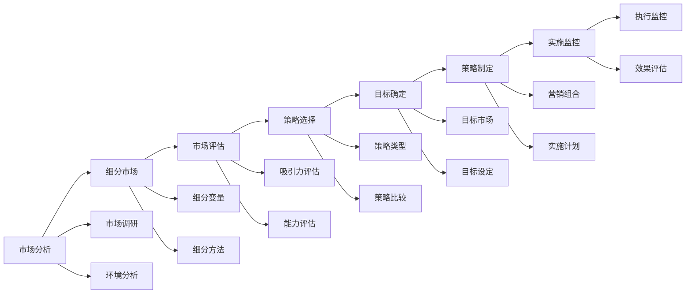

# 目标市场选择

## 目标市场概述

### 选择定义
**目标市场选择**：在细分市场分析基础上，选择最适合企业进入的细分市场作为营销目标。

### 选择价值
| 价值 | 内容 | 意义 |
|------|------|------|
| **资源聚焦** | 集中资源投入 | 提高资源效率 |
| **竞争优势** | 建立竞争优势 | 差异化竞争 |
| **市场定位** | 明确市场定位 | 清晰市场形象 |
| **营销效率** | 提高营销效率 | 精准营销 |

### 选择原则
| 原则 | 内容 | 要求 |
|------|------|------|
| **市场导向** | 以市场为导向 | 市场需求 |
| **资源匹配** | 与企业资源匹配 | 能力匹配 |
| **竞争导向** | 考虑竞争因素 | 竞争优势 |
| **战略一致** | 与战略一致 | 战略支持 |

## 目标市场评估

### 评估维度

### 市场吸引力评估
| 指标 | 内容 | 评估标准 |
|------|------|----------|
| **市场规模** | 市场容量大小 | 足够大、有潜力 |
| **市场增长** | 市场增长速度 | 增长快、前景好 |
| **盈利能力** | 市场盈利能力 | 利润率高、回报好 |
| **市场风险** | 市场风险程度 | 风险可控、可承受 |

### 竞争状况评估
| 指标 | 内容 | 评估标准 |
|------|------|----------|
| **竞争强度** | 竞争激烈程度 | 竞争适中、有机会 |
| **竞争格局** | 竞争格局状况 | 格局清晰、有空间 |
| **进入壁垒** | 进入市场难度 | 壁垒适中、可进入 |
| **替代威胁** | 替代品威胁 | 威胁较小、可应对 |

### 企业能力评估
| 指标 | 内容 | 评估标准 |
|------|------|----------|
| **资源能力** | 资源充足程度 | 资源充足、可支撑 |
| **技术能力** | 技术水平 | 技术先进、有优势 |
| **管理能力** | 管理水平 | 管理高效、有经验 |
| **营销能力** | 营销能力 | 营销专业、有渠道 |

## 选择策略

### 无差异营销策略

### 差异化营销策略

### 集中化营销策略

## 选择方法

### 评分法
| 步骤 | 内容 | 方法 |
|------|------|------|
| **确定指标** | 确定评估指标 | 多维度指标 |
| **权重分配** | 分配指标权重 | 专家判断 |
| **评分标准** | 制定评分标准 | 量化标准 |
| **计算得分** | 计算各市场得分 | 加权平均 |
| **排序选择** | 按得分排序选择 | 选择高分市场 |

### 矩阵法

### 决策树法
| 步骤 | 内容 | 方法 |
|------|------|------|
| **构建决策树** | 构建决策树结构 | 逻辑结构 |
| **设定条件** | 设定决策条件 | 判断标准 |
| **计算概率** | 计算各路径概率 | 概率分析 |
| **计算期望值** | 计算期望收益 | 期望值计算 |
| **选择最优** | 选择最优路径 | 最优决策 |

## 选择实施

### 实施步骤

### 实施要素
| 要素 | 内容 | 要求 |
|------|------|------|
| **市场分析** | 深入分析市场 | 全面准确 |
| **细分评估** | 评估细分市场 | 客观科学 |
| **策略选择** | 选择合适策略 | 适合企业 |
| **目标确定** | 确定目标市场 | 明确具体 |
| **策略制定** | 制定营销策略 | 可操作 |
| **实施监控** | 实施和监控 | 有效执行 |

### 实施原则
1. **市场导向**：以市场为导向
2. **资源匹配**：与企业资源匹配
3. **竞争导向**：考虑竞争因素
4. **战略一致**：与战略一致
5. **动态调整**：动态调整策略

## 选择案例

### 成功案例
#### 苹果公司目标市场选择
- **细分市场**：追求创新和品质的高端用户
- **选择策略**：集中化营销策略
- **目标市场**：高端智能手机市场
- **营销策略**：创新、设计、品质定位

#### 小米公司目标市场选择
- **细分市场**：追求性价比的年轻用户
- **选择策略**：差异化营销策略
- **目标市场**：中低端智能手机市场
- **营销策略**：性价比、互联网营销

### 失败案例
#### 选择失败原因
1. **市场误判**：对市场需求判断错误
2. **竞争激烈**：目标市场竞争激烈
3. **资源不足**：企业资源无法支撑
4. **策略不当**：营销策略不适合
5. **执行不力**：策略执行不到位

## 选择优化

### 优化方法
| 方法 | 内容 | 应用 |
|------|------|------|
| **市场重新评估** | 重新评估市场 | 市场变化 |
| **策略调整** | 调整营销策略 | 策略优化 |
| **资源重新配置** | 重新配置资源 | 资源优化 |
| **目标重新设定** | 重新设定目标 | 目标调整 |

### 优化原则
1. **市场导向**：以市场变化为导向
2. **资源优化**：优化资源配置
3. **策略调整**：调整营销策略
4. **效果评估**：评估优化效果
5. **持续改进**：持续改进优化

## 选择趋势

### 发展趋势
| 趋势 | 内容 | 特点 |
|------|------|------|
| **精准化** | 精准选择目标市场 | 数据驱动 |
| **个性化** | 个性化目标市场 | 定制化 |
| **动态化** | 动态调整目标市场 | 实时响应 |
| **智能化** | AI辅助选择 | 智能分析 |

### 技术发展
| 技术 | 内容 | 应用 |
|------|------|------|
| **大数据** | 大数据分析 | 精准选择 |
| **人工智能** | AI算法 | 智能选择 |
| **机器学习** | 机器学习 | 预测选择 |
| **云计算** | 云计算平台 | 高效分析 |

### 未来方向
- **实时选择**：实时选择目标市场
- **预测选择**：预测目标市场变化
- **自动选择**：自动化选择过程
- **智能选择**：智能化选择策略

## 实践应用

### 应用步骤
1. **市场分析**：深入分析市场环境
2. **细分评估**：评估各细分市场
3. **策略选择**：选择合适策略
4. **目标确定**：确定目标市场
5. **策略制定**：制定营销策略
6. **实施监控**：实施和监控策略

### 应用原则
- **市场导向**：以市场为导向
- **资源匹配**：确保资源匹配
- **竞争分析**：深入分析竞争
- **战略一致**：与战略保持一致
- **动态调整**：动态调整策略

### 注意事项
- **市场准确性**：确保市场分析准确
- **资源充足性**：确保资源充足
- **竞争分析**：深入分析竞争环境
- **策略可行性**：确保策略可行
- **效果监控**：监控选择效果

---

**相关链接**：
- [[01-市场调研方法|市场调研方法]]
- [[02-市场细分策略|市场细分策略]]
- [[04-市场机会分析|市场机会分析]]
- [[02-战略营销理论/01-STP理论|STP理论]]
