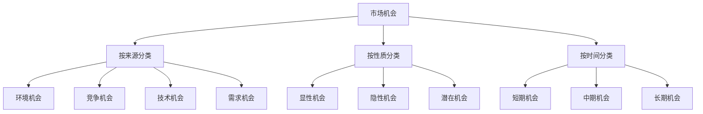
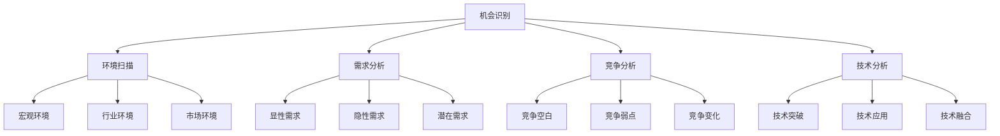
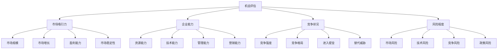
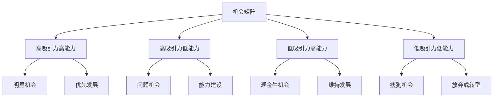
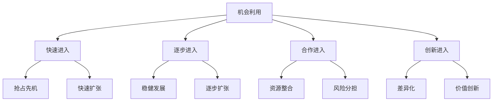

# 市场机会分析

## 市场机会概述

### 机会定义
**市场机会**：在特定市场环境中，企业能够满足消费者需求并获得竞争优势的有利条件。

### 机会特征
| 特征 | 内容 | 意义 |
|------|------|------|
| **时效性** | 机会有时间限制 | 及时把握 |
| **稀缺性** | 机会相对稀缺 | 竞争激烈 |
| **价值性** | 机会具有价值 | 值得投入 |
| **风险性** | 机会伴随风险 | 风险控制 |

### 机会类型

### 机会价值
| 价值 | 内容 | 意义 |
|------|------|------|
| **增长机会** | 市场增长机会 | 业务增长 |
| **创新机会** | 产品创新机会 | 产品创新 |
| **扩张机会** | 市场扩张机会 | 市场扩张 |
| **转型机会** | 业务转型机会 | 业务转型 |

## 机会识别

### 识别方法

### 环境扫描
| 维度 | 内容 | 机会类型 |
|------|------|----------|
| **政治法律** | 政策法规变化 | 政策机会 |
| **经济环境** | 经济发展变化 | 经济机会 |
| **社会文化** | 社会文化变化 | 文化机会 |
| **技术环境** | 技术发展变化 | 技术机会 |
| **自然环境** | 自然环境变化 | 环保机会 |
| **人口环境** | 人口结构变化 | 人口机会 |

### 需求分析
| 类型 | 内容 | 识别方法 |
|------|------|----------|
| **显性需求** | 明确表达的需求 | 市场调研 |
| **隐性需求** | 未明确表达的需求 | 深度访谈 |
| **潜在需求** | 未来可能的需求 | 趋势分析 |
| **创造需求** | 可以创造的需求 | 创新思维 |

### 竞争分析
| 角度 | 内容 | 机会识别 |
|------|------|----------|
| **竞争空白** | 未被满足的市场 | 空白市场 |
| **竞争弱点** | 竞争对手的弱点 | 差异化机会 |
| **竞争变化** | 竞争格局变化 | 重新定位 |
| **新进入者** | 新进入者的机会 | 跟随机会 |

## 机会评估

### 评估维度

### 市场吸引力评估
| 指标 | 内容 | 评估标准 |
|------|------|----------|
| **市场规模** | 市场容量大小 | 足够大、有潜力 |
| **市场增长** | 市场增长速度 | 增长快、前景好 |
| **盈利能力** | 市场盈利能力 | 利润率高、回报好 |
| **市场稳定性** | 市场稳定程度 | 稳定、可预测 |

### 企业能力评估
| 指标 | 内容 | 评估标准 |
|------|------|----------|
| **资源能力** | 资源充足程度 | 资源充足、可支撑 |
| **技术能力** | 技术水平 | 技术先进、有优势 |
| **管理能力** | 管理水平 | 管理高效、有经验 |
| **营销能力** | 营销能力 | 营销专业、有渠道 |

### 竞争状况评估
| 指标 | 内容 | 评估标准 |
|------|------|----------|
| **竞争强度** | 竞争激烈程度 | 竞争适中、有机会 |
| **竞争格局** | 竞争格局状况 | 格局清晰、有空间 |
| **进入壁垒** | 进入市场难度 | 壁垒适中、可进入 |
| **替代威胁** | 替代品威胁 | 威胁较小、可应对 |

## 机会矩阵

### 机会评估矩阵

### 机会优先级
| 优先级 | 特征 | 策略 |
|--------|------|------|
| **高优先级** | 高吸引力+高能力 | 优先发展 |
| **中优先级** | 中吸引力+中能力 | 选择性发展 |
| **低优先级** | 低吸引力+低能力 | 暂缓发展 |

### 机会组合
| 组合 | 内容 | 策略 |
|------|------|------|
| **机会组合** | 多个机会组合 | 分散风险 |
| **机会平衡** | 短期长期平衡 | 平衡发展 |
| **机会协同** | 机会间协同 | 协同效应 |

## 机会利用

### 利用策略

### 进入时机
| 时机 | 特点 | 策略 |
|------|------|------|
| **早期进入** | 市场初期 | 先发优势 |
| **成长期进入** | 市场成长期 | 跟随策略 |
| **成熟期进入** | 市场成熟期 | 差异化策略 |
| **衰退期进入** | 市场衰退期 | 转型策略 |

### 进入方式
| 方式 | 内容 | 特点 |
|------|------|------|
| **独立进入** | 独立开发市场 | 自主控制 |
| **合作进入** | 与合作伙伴进入 | 资源共享 |
| **收购进入** | 收购现有企业 | 快速进入 |
| **联盟进入** | 战略联盟进入 | 协同效应 |

## 机会管理

### 管理流程

### 管理要素
| 要素 | 内容 | 要求 |
|------|------|------|
| **机会识别** | 识别市场机会 | 敏锐洞察 |
| **机会评估** | 评估机会价值 | 客观科学 |
| **机会选择** | 选择合适机会 | 战略匹配 |
| **机会利用** | 利用市场机会 | 有效执行 |
| **机会监控** | 监控机会变化 | 动态调整 |

### 管理原则
1. **市场导向**：以市场为导向
2. **战略一致**：与战略一致
3. **资源匹配**：与资源匹配
4. **风险控制**：控制风险
5. **动态管理**：动态管理

## 机会案例

### 成功案例
#### 苹果公司iPhone机会
- **机会识别**：智能手机市场空白
- **机会评估**：高吸引力+高能力
- **机会利用**：创新产品+体验营销
- **机会结果**：重新定义智能手机市场

#### 特斯拉电动汽车机会
- **机会识别**：环保趋势+技术突破
- **机会评估**：高吸引力+技术能力
- **机会利用**：技术创新+品牌建设
- **机会结果**：引领电动汽车市场

### 失败案例
#### 机会失败原因
1. **机会误判**：对机会判断错误
2. **能力不足**：企业能力不足
3. **时机不当**：进入时机不当
4. **竞争激烈**：竞争过于激烈
5. **执行不力**：执行不到位

## 机会趋势

### 发展趋势
| 趋势 | 内容 | 特点 |
|------|------|------|
| **数字化** | 数字化机会 | 技术驱动 |
| **个性化** | 个性化机会 | 需求驱动 |
| **可持续化** | 可持续发展机会 | 责任驱动 |
| **全球化** | 全球化机会 | 市场驱动 |

### 技术发展
| 技术 | 内容 | 机会 |
|------|------|------|
| **人工智能** | AI技术发展 | 智能化机会 |
| **大数据** | 大数据应用 | 数据化机会 |
| **物联网** | 物联网发展 | 连接化机会 |
| **区块链** | 区块链技术 | 去中心化机会 |

### 未来方向
- **技术机会**：新技术带来的机会
- **市场机会**：新市场带来的机会
- **模式机会**：新模式带来的机会
- **生态机会**：新生态带来的机会

## 实践应用

### 应用步骤
1. **环境扫描**：扫描市场环境
2. **机会识别**：识别市场机会
3. **机会评估**：评估机会价值
4. **机会选择**：选择合适机会
5. **机会利用**：利用市场机会
6. **机会监控**：监控机会变化

### 应用原则
- **市场导向**：以市场为导向
- **战略一致**：与战略一致
- **资源匹配**：与资源匹配
- **风险控制**：控制风险
- **动态管理**：动态管理

### 注意事项
- **机会准确性**：确保机会识别准确
- **能力匹配性**：确保能力匹配
- **时机适当性**：确保时机适当
- **风险可控性**：确保风险可控
- **执行有效性**：确保执行有效

---

**相关链接**：
- [[01-市场调研方法|市场调研方法]]
- [[02-市场细分策略|市场细分策略]]
- [[03-目标市场选择|目标市场选择]]
- [[02-战略营销理论/04-蓝海战略理论|蓝海战略理论]]
