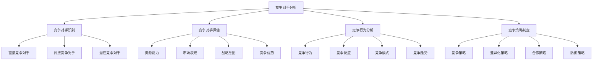
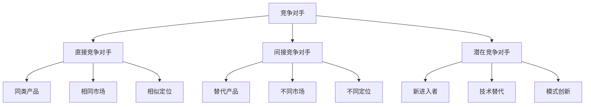
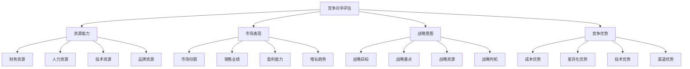
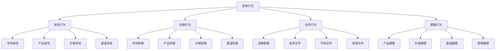
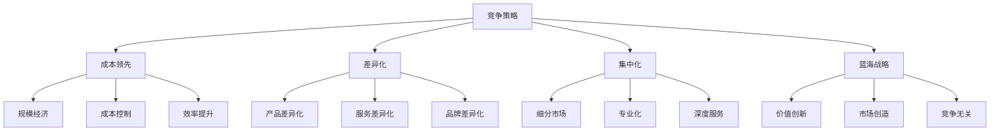

# 竞争对手分析

## 竞争对手分析概述

### 分析定义
**竞争对手分析**：系统分析竞争对手的战略、资源、能力和行为，为企业制定竞争策略提供依据。

### 分析价值
| 价值 | 内容 | 意义 |
|------|------|------|
| **战略指导** | 指导竞争策略制定 | 战略决策支持 |
| **机会识别** | 识别竞争机会 | 市场机会把握 |
| **威胁预警** | 预警竞争威胁 | 风险防范 |
| **优势构建** | 构建竞争优势 | 竞争力提升 |

### 分析框架

### 分析原则
| 原则 | 内容 | 要求 |
|------|------|------|
| **客观性** | 客观分析竞争对手 | 避免主观偏见 |
| **全面性** | 全面分析竞争环境 | 多维度分析 |
| **动态性** | 动态跟踪竞争变化 | 持续更新 |
| **实用性** | 实用导向分析 | 策略指导 |

## 竞争对手识别

### 竞争对手类型

### 识别标准
| 标准 | 内容 | 判断依据 |
|------|------|----------|
| **产品相似性** | 产品功能相似 | 产品对比 |
| **市场重叠性** | 目标市场重叠 | 市场分析 |
| **资源竞争性** | 资源竞争关系 | 资源分析 |
| **战略冲突性** | 战略目标冲突 | 战略分析 |

### 识别方法
1. **市场调研**：通过市场调研识别
2. **行业分析**：通过行业分析识别
3. **专家咨询**：通过专家咨询识别
4. **数据分析**：通过数据分析识别
5. **网络搜索**：通过网络搜索识别

## 竞争对手评估

### 评估维度

### 资源能力评估
| 维度 | 内容 | 评估方法 |
|------|------|----------|
| **财务资源** | 资金实力、财务状况 | 财务分析 |
| **人力资源** | 人才数量、质量 | 人才分析 |
| **技术资源** | 技术水平、创新能力 | 技术分析 |
| **品牌资源** | 品牌价值、知名度 | 品牌分析 |

### 市场表现评估
| 指标 | 内容 | 数据来源 |
|------|------|----------|
| **市场份额** | 市场占有率 | 市场数据 |
| **销售业绩** | 销售收入、销量 | 财务报告 |
| **盈利能力** | 利润率、ROI | 财务分析 |
| **增长趋势** | 增长率、趋势 | 历史数据 |

### 战略意图评估
| 要素 | 内容 | 分析方法 |
|------|------|----------|
| **战略目标** | 长期目标、愿景 | 战略分析 |
| **战略重点** | 重点领域、方向 | 资源配置 |
| **战略资源** | 资源投入、配置 | 投资分析 |
| **战略时机** | 时机选择、节奏 | 时间分析 |

## 竞争行为分析

### 行为类型

### 行为模式
| 模式 | 特点 | 策略 |
|------|------|------|
| **领导者模式** | 市场领导者行为 | 创新、防御 |
| **挑战者模式** | 市场挑战者行为 | 进攻、差异化 |
| **跟随者模式** | 市场跟随者行为 | 跟随、模仿 |
| **补缺者模式** | 市场补缺者行为 | 专业化、细分 |

### 行为预测
| 方法 | 内容 | 应用 |
|------|------|------|
| **历史分析** | 分析历史行为 | 行为模式 |
| **趋势分析** | 分析行为趋势 | 趋势预测 |
| **情景分析** | 分析不同情景 | 情景预测 |
| **专家判断** | 专家经验判断 | 经验预测 |

## 竞争策略制定

### 策略类型

### 策略选择
| 因素 | 内容 | 影响 |
|------|------|------|
| **企业资源** | 资源能力 | 策略可行性 |
| **市场环境** | 市场状况 | 策略适应性 |
| **竞争状况** | 竞争激烈程度 | 策略有效性 |
| **产品特性** | 产品特点 | 策略匹配性 |

### 策略实施
| 步骤 | 内容 | 要求 |
|------|------|------|
| **策略制定** | 制定竞争策略 | 明确具体 |
| **资源配置** | 配置资源支持 | 资源充足 |
| **执行计划** | 制定执行计划 | 可操作 |
| **监控调整** | 监控和调整 | 动态管理 |

## 竞争分析工具

### 分析工具
| 工具 | 内容 | 应用 |
|------|------|------|
| **SWOT分析** | 优势、劣势、机会、威胁 | 综合分析 |
| **五力模型** | 五种竞争力量 | 行业分析 |
| **竞争对手矩阵** | 竞争对手对比 | 竞争对比 |
| **竞争态势图** | 竞争地位分析 | 地位分析 |
| **价值链分析** | 价值创造过程 | 价值分析 |

### 数据收集
| 数据源 | 内容 | 方法 |
|--------|------|------|
| **公开信息** | 年报、公告、新闻 | 信息收集 |
| **市场调研** | 消费者、渠道、专家 | 调研分析 |
| **竞争情报** | 竞争对手信息 | 情报收集 |
| **行业报告** | 行业分析报告 | 报告分析 |
| **专家访谈** | 行业专家观点 | 专家咨询 |

## 竞争分析应用

### 应用领域
| 领域 | 内容 | 应用 |
|------|------|------|
| **战略制定** | 制定竞争战略 | 战略决策 |
| **产品开发** | 开发竞争产品 | 产品创新 |
| **市场进入** | 进入新市场 | 市场拓展 |
| **价格策略** | 制定价格策略 | 价格竞争 |
| **营销策略** | 制定营销策略 | 营销竞争 |

### 应用步骤
1. **确定分析目标**：明确分析目的
2. **收集信息**：收集相关信息
3. **分析竞争对手**：分析主要竞争对手
4. **分析竞争环境**：分析竞争环境
5. **制定竞争策略**：制定竞争策略
6. **实施监控**：实施和监控策略

### 应用原则
| 原则 | 内容 | 要求 |
|------|------|------|
| **客观性** | 客观分析 | 数据支撑 |
| **全面性** | 全面分析 | 多维度分析 |
| **动态性** | 动态分析 | 持续更新 |
| **实用性** | 实用导向 | 策略指导 |

## 竞争分析案例

### 成功案例
#### 智能手机行业竞争分析
- **竞争对手**：苹果、三星、华为、小米
- **竞争环境**：技术驱动、品牌竞争
- **竞争策略**：差异化、创新驱动
- **竞争结果**：市场格局清晰

#### 电商行业竞争分析
- **竞争对手**：淘宝、京东、拼多多
- **竞争环境**：平台竞争、服务竞争
- **竞争策略**：平台生态、下沉市场
- **竞争结果**：竞争格局稳定

### 失败案例
#### 分析失败原因
1. **信息不准确**：信息收集不准确
2. **分析不深入**：分析不够深入
3. **策略不当**：竞争策略不当
4. **执行不力**：策略执行不力
5. **变化应对**：应对变化不及时

## 竞争分析趋势

### 发展趋势
| 趋势 | 内容 | 特点 |
|------|------|------|
| **数字化** | 数字技术应用 | 精准、高效 |
| **实时化** | 实时竞争分析 | 快速响应 |
| **智能化** | AI辅助分析 | 智能决策 |
| **生态化** | 生态系统分析 | 全面分析 |

### 技术发展
| 技术 | 内容 | 应用 |
|------|------|------|
| **大数据** | 大数据分析 | 全面洞察 |
| **人工智能** | AI算法 | 智能分析 |
| **机器学习** | 机器学习 | 模式识别 |
| **云计算** | 云计算平台 | 高效分析 |

### 未来方向
- **实时分析**：实时了解竞争对手
- **预测分析**：预测竞争行为
- **智能分析**：智能化竞争分析
- **生态分析**：生态系统竞争分析

## 实践应用

### 应用步骤
1. **确定目标**：明确分析目标
2. **收集信息**：收集相关信息
3. **分析对手**：分析竞争对手
4. **分析环境**：分析竞争环境
5. **制定策略**：制定竞争策略
6. **实施监控**：实施和监控

### 应用原则
- **客观性**：客观分析竞争对手
- **全面性**：全面分析竞争环境
- **动态性**：动态跟踪竞争变化
- **实用性**：实用导向分析
- **持续性**：持续分析更新

### 注意事项
- **信息准确性**：确保信息准确
- **分析深度**：深入分析理解
- **策略可行性**：确保策略可行
- **执行有效性**：确保执行有效
- **变化适应性**：适应变化调整

---

**相关链接**：
- [[02-差异化策略|差异化策略]]
- [[03-定价策略|定价策略]]
- [[04-竞争定位策略|竞争定位策略]]
- [[03-营销理论框架/02-战略营销理论/02-竞争分析理论|竞争分析理论]]
