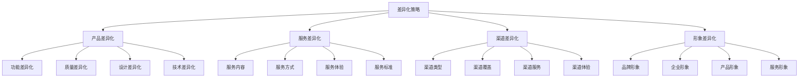
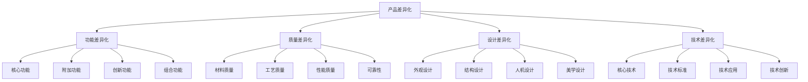
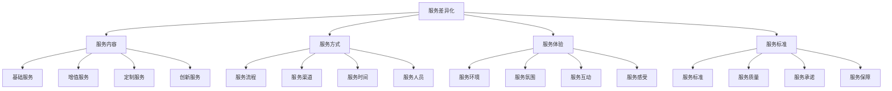
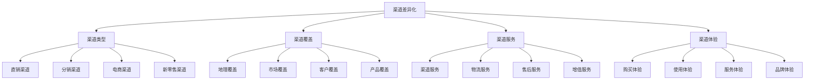
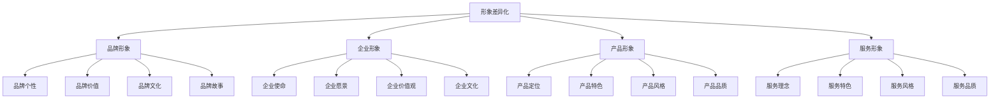
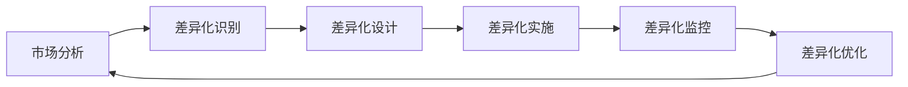

# 差异化策略

## 差异化策略概述

### 策略定义
**差异化策略**：通过提供独特的产品、服务或体验，与竞争对手形成明显差异，建立竞争优势的营销策略。

### 策略价值
| 价值 | 内容 | 意义 |
|------|------|------|
| **竞争优势** | 建立独特优势 | 避免同质化竞争 |
| **品牌价值** | 提升品牌价值 | 品牌差异化 |
| **顾客忠诚** | 增强顾客忠诚 | 降低转换成本 |
| **利润提升** | 提高盈利能力 | 价值溢价 |

### 差异化类型

### 策略原则
| 原则 | 内容 | 要求 |
|------|------|------|
| **独特性** | 具有独特性 | 与众不同 |
| **价值性** | 创造价值 | 顾客认可 |
| **可持续性** | 可持续差异 | 难以模仿 |
| **盈利性** | 具有盈利性 | 经济可行 |

## 产品差异化

### 差异化维度

### 功能差异化
| 类型 | 内容 | 策略 |
|------|------|------|
| **核心功能** | 产品基本功能 | 功能优化 |
| **附加功能** | 额外功能 | 功能扩展 |
| **创新功能** | 全新功能 | 功能创新 |
| **组合功能** | 功能组合 | 功能整合 |

### 质量差异化
| 维度 | 内容 | 策略 |
|------|------|------|
| **材料质量** | 原材料质量 | 优质材料 |
| **工艺质量** | 制造工艺 | 精工制造 |
| **性能质量** | 产品性能 | 性能提升 |
| **可靠性** | 产品可靠性 | 质量保证 |

### 设计差异化
| 要素 | 内容 | 策略 |
|------|------|------|
| **外观设计** | 产品外观 | 美学设计 |
| **结构设计** | 产品结构 | 结构优化 |
| **人机设计** | 人机交互 | 用户体验 |
| **美学设计** | 美学价值 | 艺术设计 |

## 服务差异化

### 服务要素

### 服务内容差异化
| 类型 | 内容 | 策略 |
|------|------|------|
| **基础服务** | 基本服务内容 | 服务完善 |
| **增值服务** | 额外服务内容 | 服务增值 |
| **定制服务** | 个性化服务 | 服务定制 |
| **创新服务** | 全新服务 | 服务创新 |

### 服务方式差异化
| 要素 | 内容 | 策略 |
|------|------|------|
| **服务流程** | 服务过程 | 流程优化 |
| **服务渠道** | 服务途径 | 渠道创新 |
| **服务时间** | 服务时间 | 时间便利 |
| **服务人员** | 服务人员 | 人员专业 |

### 服务体验差异化
| 维度 | 内容 | 策略 |
|------|------|------|
| **服务环境** | 服务场所 | 环境优化 |
| **服务氛围** | 服务气氛 | 氛围营造 |
| **服务互动** | 服务交流 | 互动增强 |
| **服务感受** | 服务感受 | 感受提升 |

## 渠道差异化

### 渠道类型

### 渠道类型差异化
| 类型 | 内容 | 策略 |
|------|------|------|
| **直销渠道** | 直接销售 | 渠道控制 |
| **分销渠道** | 间接销售 | 渠道覆盖 |
| **电商渠道** | 在线销售 | 渠道便利 |
| **新零售渠道** | 线上线下融合 | 渠道创新 |

### 渠道覆盖差异化
| 维度 | 内容 | 策略 |
|------|------|------|
| **地理覆盖** | 地理范围 | 覆盖扩展 |
| **市场覆盖** | 市场范围 | 市场渗透 |
| **客户覆盖** | 客户群体 | 客户细分 |
| **产品覆盖** | 产品范围 | 产品组合 |

## 形象差异化

### 形象要素

### 品牌形象差异化
| 要素 | 内容 | 策略 |
|------|------|------|
| **品牌个性** | 品牌人格特征 | 个性塑造 |
| **品牌价值** | 品牌价值主张 | 价值传递 |
| **品牌文化** | 品牌文化内涵 | 文化建设 |
| **品牌故事** | 品牌故事内容 | 故事营销 |

### 企业形象差异化
| 维度 | 内容 | 策略 |
|------|------|------|
| **企业使命** | 企业使命陈述 | 使命明确 |
| **企业愿景** | 企业愿景描述 | 愿景清晰 |
| **企业价值观** | 企业价值观念 | 价值观塑造 |
| **企业文化** | 企业文化特色 | 文化建设 |

## 差异化实施

### 实施步骤

### 实施要素
| 要素 | 内容 | 要求 |
|------|------|------|
| **市场分析** | 分析市场需求 | 需求导向 |
| **差异化识别** | 识别差异化机会 | 机会识别 |
| **差异化设计** | 设计差异化方案 | 方案设计 |
| **差异化实施** | 实施差异化策略 | 有效执行 |
| **差异化监控** | 监控差异化效果 | 效果监控 |
| **差异化优化** | 优化差异化策略 | 持续优化 |

### 实施原则
1. **市场导向**：以市场需求为导向
2. **价值创造**：创造顾客价值
3. **可持续性**：确保差异化可持续
4. **盈利性**：确保差异化盈利
5. **创新性**：持续创新差异化

## 差异化案例

### 成功案例
#### 苹果公司差异化策略
- **产品差异化**：创新设计、优质产品
- **服务差异化**：优质服务、体验至上
- **渠道差异化**：直营店、体验店
- **形象差异化**：创新、设计、品质

#### 星巴克差异化策略
- **产品差异化**：高品质咖啡、独特口味
- **服务差异化**：第三空间、个性化服务
- **渠道差异化**：直营店、社区店
- **形象差异化**：咖啡文化、生活方式

### 失败案例
#### 差异化失败原因
1. **差异化不足**：差异化程度不够
2. **价值不明确**：顾客价值不明确
3. **成本过高**：差异化成本过高
4. **难以持续**：差异化难以持续
5. **市场不接受**：市场不接受差异化

## 差异化趋势

### 发展趋势
| 趋势 | 内容 | 特点 |
|------|------|------|
| **个性化** | 个性化差异化 | 定制化 |
| **体验化** | 体验差异化 | 沉浸式 |
| **数字化** | 数字化差异化 | 技术驱动 |
| **可持续化** | 可持续发展差异化 | 责任导向 |

### 技术发展
| 技术 | 内容 | 应用 |
|------|------|------|
| **人工智能** | AI技术应用 | 智能差异化 |
| **大数据** | 大数据分析 | 精准差异化 |
| **物联网** | 物联网技术 | 连接差异化 |
| **区块链** | 区块链技术 | 透明差异化 |

### 未来方向
- **智能差异化**：AI驱动的智能差异化
- **体验差异化**：沉浸式体验差异化
- **价值差异化**：价值共创差异化
- **生态差异化**：生态系统差异化

## 实践应用

### 应用步骤
1. **市场分析**：分析市场需求和竞争
2. **差异化识别**：识别差异化机会
3. **差异化设计**：设计差异化方案
4. **差异化实施**：实施差异化策略
5. **差异化监控**：监控差异化效果
6. **差异化优化**：优化差异化策略

### 应用原则
- **市场导向**：以市场需求为导向
- **价值创造**：创造顾客价值
- **可持续性**：确保差异化可持续
- **盈利性**：确保差异化盈利
- **创新性**：持续创新差异化

### 注意事项
- **差异化有效性**：确保差异化有效
- **价值明确性**：确保价值明确
- **成本可控性**：确保成本可控
- **可持续性**：确保差异化可持续
- **市场接受性**：确保市场接受

---

**相关链接**：
- [[01-竞争对手分析|竞争对手分析]]
- [[03-定价策略|定价策略]]
- [[04-竞争定位策略|竞争定位策略]]
- [[02-战略营销理论/04-蓝海战略理论|蓝海战略理论]]
