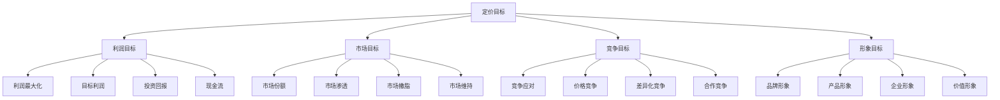
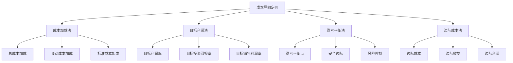
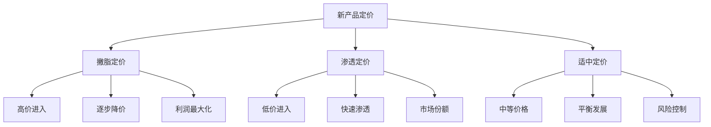

# 定价策略

## 定价策略概述

### 策略定义
**定价策略**：企业根据市场环境、竞争状况、成本结构和营销目标，制定产品价格的方法和策略。

### 定价价值
| 价值 | 内容 | 意义 |
|------|------|------|
| **收入创造** | 创造企业收入 | 盈利基础 |
| **市场定位** | 确定市场定位 | 品牌形象 |
| **竞争工具** | 竞争的重要手段 | 竞争优势 |
| **需求调节** | 调节市场需求 | 市场平衡 |

### 定价目标

### 定价原则
| 原则 | 内容 | 要求 |
|------|------|------|
| **价值导向** | 以价值为导向 | 价值定价 |
| **市场导向** | 以市场为导向 | 市场接受 |
| **竞争导向** | 以竞争为导向 | 竞争优势 |
| **成本导向** | 以成本为导向 | 成本覆盖 |

## 定价方法

### 成本导向定价

### 需求导向定价
| 方法 | 内容 | 特点 | 适用场景 |
|------|------|------|----------|
| **感知价值定价** | 基于顾客感知价值 | 价值导向 | 差异化产品 |
| **需求弹性定价** | 基于需求弹性 | 弹性分析 | 价格敏感产品 |
| **心理定价** | 基于心理因素 | 心理影响 | 消费品 |
| **动态定价** | 基于需求变化 | 动态调整 | 服务产品 |

### 竞争导向定价
| 方法 | 内容 | 特点 | 适用场景 |
|------|------|------|----------|
| **随行就市定价** | 跟随市场价格 | 竞争跟随 | 同质化产品 |
| **竞争定价** | 基于竞争对手 | 竞争导向 | 竞争激烈市场 |
| **投标定价** | 基于投标竞争 | 竞争投标 | 工程项目 |
| **拍卖定价** | 基于拍卖竞争 | 竞争拍卖 | 稀缺产品 |

### 价值导向定价
| 方法 | 内容 | 特点 | 适用场景 |
|------|------|------|----------|
| **价值定价** | 基于顾客价值 | 价值创造 | 高价值产品 |
| **生命周期定价** | 基于产品生命周期 | 阶段定价 | 创新产品 |
| **捆绑定价** | 基于产品组合 | 组合价值 | 相关产品 |
| **版本定价** | 基于产品版本 | 版本差异 | 软件产品 |

## 定价策略

### 新产品定价策略

### 产品组合定价策略
| 策略 | 内容 | 特点 | 应用 |
|------|------|------|------|
| **产品线定价** | 产品线价格结构 | 层次定价 | 多产品企业 |
| **可选产品定价** | 可选产品价格 | 附加价值 | 定制产品 |
| **附属产品定价** | 附属产品价格 | 互补定价 | 配套产品 |
| **副产品定价** | 副产品价格 | 成本分摊 | 制造企业 |

### 心理定价策略
| 策略 | 内容 | 特点 | 应用 |
|------|------|------|------|
| **尾数定价** | 价格尾数设计 | 心理影响 | 消费品 |
| **整数定价** | 整数价格设计 | 品质形象 | 高端产品 |
| **声望定价** | 高价格策略 | 品牌形象 | 奢侈品 |
| **习惯定价** | 习惯价格策略 | 价格习惯 | 日常用品 |

### 折扣定价策略
| 策略 | 内容 | 特点 | 应用 |
|------|------|------|------|
| **数量折扣** | 购买数量折扣 | 批量优惠 | 批发产品 |
| **现金折扣** | 现金支付折扣 | 资金回笼 | 资金紧张 |
| **季节折扣** | 季节性折扣 | 季节调节 | 季节性产品 |
| **功能折扣** | 渠道功能折扣 | 渠道激励 | 渠道产品 |

## 定价实施

### 实施步骤

### 实施要素
| 要素 | 内容 | 要求 |
|------|------|------|
| **成本分析** | 分析成本结构 | 成本准确 |
| **需求分析** | 分析需求状况 | 需求理解 |
| **竞争分析** | 分析竞争状况 | 竞争了解 |
| **价值分析** | 分析价值创造 | 价值明确 |
| **价格确定** | 确定最终价格 | 价格合理 |
| **价格实施** | 实施价格策略 | 执行有效 |
| **价格监控** | 监控价格效果 | 效果跟踪 |
| **价格调整** | 调整价格策略 | 动态调整 |

### 实施原则
1. **价值导向**：以价值为导向定价
2. **市场导向**：以市场为导向定价
3. **竞争导向**：以竞争为导向定价
4. **成本导向**：以成本为导向定价
5. **动态调整**：动态调整价格策略

## 定价管理

### 价格管理
| 管理 | 内容 | 要求 |
|------|------|------|
| **价格制定** | 制定价格策略 | 科学合理 |
| **价格执行** | 执行价格策略 | 严格执行 |
| **价格监控** | 监控价格变化 | 及时监控 |
| **价格调整** | 调整价格策略 | 灵活调整 |

### 价格控制
| 控制 | 内容 | 方法 |
|------|------|------|
| **成本控制** | 控制产品成本 | 成本管理 |
| **价格控制** | 控制产品价格 | 价格管理 |
| **利润控制** | 控制产品利润 | 利润管理 |
| **市场控制** | 控制市场价格 | 市场管理 |

### 价格优化
| 优化 | 内容 | 方法 |
|------|------|------|
| **价格优化** | 优化价格策略 | 策略优化 |
| **利润优化** | 优化利润结构 | 利润优化 |
| **市场优化** | 优化市场表现 | 市场优化 |
| **竞争优化** | 优化竞争优势 | 竞争优化 |

## 定价案例

### 成功案例
#### 苹果公司定价策略
- **定价方法**：价值导向定价
- **定价策略**：撇脂定价策略
- **价格定位**：高端市场定位
- **价格结果**：高利润、强品牌

#### 小米公司定价策略
- **定价方法**：成本导向定价
- **定价策略**：渗透定价策略
- **价格定位**：性价比定位
- **价格结果**：高销量、快增长

### 失败案例
#### 定价失败原因
1. **成本计算错误**：成本计算不准确
2. **市场需求误判**：市场需求判断错误
3. **竞争分析不足**：竞争分析不充分
4. **价格策略不当**：价格策略不适合
5. **执行监控不力**：执行监控不到位

## 定价趋势

### 发展趋势
| 趋势 | 内容 | 特点 |
|------|------|------|
| **动态定价** | 动态调整价格 | 实时响应 |
| **个性化定价** | 个性化价格 | 精准定价 |
| **价值定价** | 价值导向定价 | 价值创造 |
| **透明定价** | 价格透明化 | 信息对称 |

### 技术发展
| 技术 | 内容 | 应用 |
|------|------|------|
| **大数据** | 大数据分析 | 精准定价 |
| **人工智能** | AI算法 | 智能定价 |
| **机器学习** | 机器学习 | 预测定价 |
| **云计算** | 云计算平台 | 高效定价 |

### 未来方向
- **智能定价**：AI驱动的智能定价
- **实时定价**：实时动态定价
- **个性化定价**：个性化定制定价
- **价值定价**：价值共创定价

## 实践应用

### 应用步骤
1. **定价分析**：分析定价环境
2. **定价方法**：选择定价方法
3. **定价策略**：制定定价策略
4. **价格确定**：确定最终价格
5. **价格实施**：实施价格策略
6. **价格监控**：监控价格效果
7. **价格调整**：调整价格策略

### 应用原则
- **价值导向**：以价值为导向
- **市场导向**：以市场为导向
- **竞争导向**：以竞争为导向
- **成本导向**：以成本为导向
- **动态调整**：动态调整策略

### 注意事项
- **成本准确性**：确保成本计算准确
- **需求理解**：深入理解市场需求
- **竞争分析**：充分分析竞争环境
- **价值明确**：明确价值创造
- **执行有效**：确保执行有效

---

**相关链接**：
- [[01-竞争对手分析|竞争对手分析]]
- [[02-差异化策略|差异化策略]]
- [[04-竞争定位策略|竞争定位策略]]
- [[03-营销理论框架/01-经典营销理论/01-4P营销理论|4P营销理论]]
