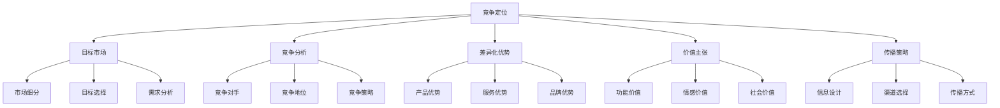
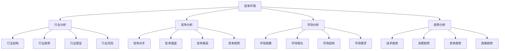
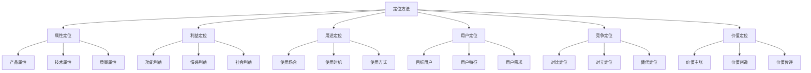
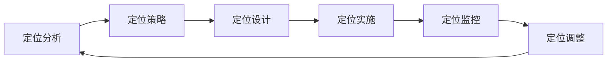
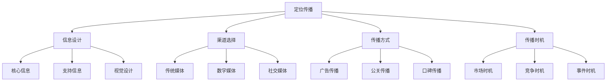

# 竞争定位策略

## 竞争定位概述

### 定位定义
**竞争定位**：企业在竞争环境中，通过差异化策略在目标市场中建立独特位置，形成竞争优势。

### 定位价值
| 价值 | 内容 | 意义 |
|------|------|------|
| **竞争优势** | 建立独特优势 | 差异化竞争 |
| **市场地位** | 明确市场地位 | 地位清晰 |
| **品牌价值** | 提升品牌价值 | 品牌差异化 |
| **顾客认知** | 影响顾客认知 | 心智占位 |

### 定位要素

### 定位原则
| 原则 | 内容 | 要求 |
|------|------|------|
| **独特性** | 具有独特性 | 与众不同 |
| **相关性** | 与需求相关 | 需求匹配 |
| **可信性** | 具有可信性 | 可信可靠 |
| **可持续性** | 可持续性 | 难以模仿 |

## 定位分析

### 竞争环境分析

### 竞争对手分析
| 维度 | 内容 | 分析方法 |
|------|------|----------|
| **战略分析** | 竞争对手战略 | 战略分析 |
| **资源分析** | 竞争对手资源 | 资源分析 |
| **能力分析** | 竞争对手能力 | 能力分析 |
| **行为分析** | 竞争对手行为 | 行为分析 |

### 市场机会分析
| 类型 | 内容 | 识别方法 |
|------|------|----------|
| **市场空白** | 未被满足的市场 | 市场调研 |
| **竞争弱点** | 竞争对手弱点 | 竞争分析 |
| **需求变化** | 需求变化趋势 | 趋势分析 |
| **技术突破** | 技术突破机会 | 技术分析 |

## 定位策略

### 定位方法

### 定位策略类型
| 策略 | 内容 | 特点 | 适用场景 |
|------|------|------|----------|
| **领导者定位** | 市场领导者定位 | 权威性、可信性 | 市场领导者 |
| **挑战者定位** | 市场挑战者定位 | 进攻性、创新性 | 市场挑战者 |
| **跟随者定位** | 市场跟随者定位 | 跟随性、稳定性 | 市场跟随者 |
| **补缺者定位** | 市场补缺者定位 | 专业性、细分性 | 市场补缺者 |

### 差异化定位
| 类型 | 内容 | 策略 |
|------|------|------|
| **产品差异化** | 产品独特优势 | 产品创新 |
| **服务差异化** | 服务独特优势 | 服务创新 |
| **渠道差异化** | 渠道独特优势 | 渠道创新 |
| **形象差异化** | 形象独特优势 | 形象塑造 |

## 定位实施

### 实施步骤

### 实施要素
| 要素 | 内容 | 要求 |
|------|------|------|
| **市场分析** | 深入分析市场 | 全面准确 |
| **竞争分析** | 分析竞争环境 | 客观科学 |
| **差异化分析** | 识别差异化优势 | 优势突出 |
| **定位策略** | 制定定位策略 | 策略清晰 |
| **价值主张** | 设计价值主张 | 价值明确 |
| **传播策略** | 制定传播策略 | 传播有效 |
| **实施监控** | 实施和监控 | 有效执行 |

### 实施原则
1. **市场导向**：以市场为导向
2. **竞争导向**：以竞争为导向
3. **差异化导向**：以差异化为导向
4. **价值导向**：以价值为导向
5. **持续优化**：持续优化定位

## 定位传播

### 传播策略

### 传播工具
| 工具 | 内容 | 特点 |
|------|------|------|
| **广告** | 付费传播 | 可控性强 |
| **公关** | 关系传播 | 可信度高 |
| **内容** | 内容传播 | 价值性强 |
| **社交** | 社交传播 | 互动性强 |
| **体验** | 体验传播 | 感受性强 |

### 传播效果
| 效果 | 内容 | 测量方法 |
|------|------|----------|
| **认知效果** | 品牌认知度 | 认知度调查 |
| **态度效果** | 品牌态度 | 态度调查 |
| **行为效果** | 购买行为 | 行为分析 |
| **销售效果** | 销售业绩 | 销售分析 |

## 定位管理

### 管理要素
| 要素 | 内容 | 要求 |
|------|------|------|
| **定位一致性** | 保持定位一致 | 一致性管理 |
| **定位适应性** | 适应市场变化 | 适应性管理 |
| **定位有效性** | 确保定位有效 | 有效性管理 |
| **定位可持续性** | 确保定位可持续 | 可持续性管理 |

### 管理方法
| 方法 | 内容 | 应用 |
|------|------|------|
| **定位监控** | 监控定位效果 | 效果监控 |
| **定位评估** | 评估定位效果 | 效果评估 |
| **定位调整** | 调整定位策略 | 策略调整 |
| **定位优化** | 优化定位策略 | 策略优化 |

### 管理原则
1. **一致性**：保持定位一致性
2. **适应性**：适应市场变化
3. **有效性**：确保定位有效
4. **可持续性**：确保定位可持续
5. **动态性**：动态管理定位

## 定位案例

### 成功案例
#### 苹果公司竞争定位
- **定位策略**：创新、设计、品质领导者
- **差异化优势**：创新技术、优质设计
- **价值主张**：Think Different
- **传播策略**：品牌故事、体验营销

#### 特斯拉竞争定位
- **定位策略**：电动汽车领导者
- **差异化优势**：技术创新、环保理念
- **价值主张**：加速世界向可持续能源转变
- **传播策略**：技术创新、品牌建设

### 失败案例
#### 定位失败原因
1. **定位不清晰**：定位信息模糊
2. **差异化不足**：与竞争对手相似
3. **传播不一致**：传播信息不一致
4. **缺乏持续性**：定位传播不持续
5. **市场不接受**：市场不接受定位

## 定位趋势

### 发展趋势
| 趋势 | 内容 | 特点 |
|------|------|------|
| **精准化** | 精准定位目标市场 | 数据驱动 |
| **个性化** | 个性化定位策略 | 定制化 |
| **动态化** | 动态调整定位 | 实时响应 |
| **价值化** | 价值导向定位 | 价值创造 |

### 技术发展
| 技术 | 内容 | 应用 |
|------|------|------|
| **大数据** | 大数据分析 | 精准定位 |
| **人工智能** | AI算法 | 智能定位 |
| **机器学习** | 机器学习 | 预测定位 |
| **云计算** | 云计算平台 | 高效定位 |

### 未来方向
- **智能定位**：AI驱动的智能定位
- **实时定位**：实时动态定位
- **个性化定位**：个性化定制定位
- **价值定位**：价值共创定位

## 实践应用

### 应用步骤
1. **定位分析**：分析定位环境
2. **定位策略**：制定定位策略
3. **定位设计**：设计定位方案
4. **定位实施**：实施定位策略
5. **定位监控**：监控定位效果
6. **定位调整**：调整定位策略

### 应用原则
- **市场导向**：以市场为导向
- **竞争导向**：以竞争为导向
- **差异化导向**：以差异化为导向
- **价值导向**：以价值为导向
- **持续优化**：持续优化定位

### 注意事项
- **定位清晰性**：确保定位清晰
- **差异化有效性**：确保差异化有效
- **传播一致性**：确保传播一致
- **市场接受性**：确保市场接受
- **持续有效性**：确保持续有效

---

**相关链接**：
- [[01-竞争对手分析|竞争对手分析]]
- [[02-差异化策略|差异化策略]]
- [[03-定价策略|定价策略]]
- [[02-战略营销理论/03-定位理论|定位理论]]
