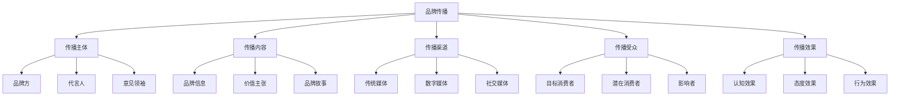
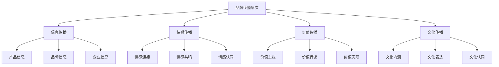
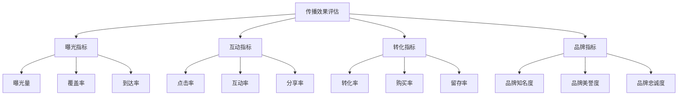

# 品牌传播策略

## 品牌传播概述

### 定义与本质
**品牌传播**：通过多种传播渠道和方式，向目标受众传递品牌信息，建立品牌认知、塑造品牌形象、传递品牌价值的过程。

### 传播要素模型

## 品牌传播理论

### 传播理论发展
| 理论 | 代表人物 | 核心观点 | 应用价值 |
|------|----------|----------|----------|
| **拉斯韦尔模式** | 哈罗德·拉斯韦尔 | 5W传播模式 | 传播要素分析 |
| **香农-韦弗模式** | 克劳德·香农 | 信息论传播 | 传播过程优化 |
| **使用与满足理论** | 卡茨、布鲁姆勒 | 受众主动选择 | 受众需求满足 |
| **议程设置理论** | 麦库姆斯、肖 | 媒体议程影响 | 媒体策略制定 |

### 品牌传播层次

## 品牌传播策略

### 1. 整合传播策略
#### 核心特征
- **统一性**：传播信息统一
- **一致性**：传播风格一致
- **协调性**：传播渠道协调

#### 实施要点
- 传播信息统一
- 传播风格一致
- 传播渠道协调
- 传播时机把握

### 2. 精准传播策略
#### 核心特征
- **精准定位**：精准定位受众
- **精准内容**：精准内容匹配
- **精准渠道**：精准渠道选择

#### 实施要点
- 受众精准定位
- 内容精准匹配
- 渠道精准选择
- 时机精准把握

### 3. 互动传播策略
#### 核心特征
- **双向沟通**：双向互动沟通
- **用户参与**：用户主动参与
- **社群建设**：品牌社群建设

#### 实施要点
- 双向沟通机制
- 用户参与设计
- 社群运营管理
- 互动效果评估

### 4. 内容传播策略
#### 核心特征
- **内容为王**：优质内容创造
- **价值传递**：价值内容传递
- **故事讲述**：品牌故事讲述

#### 实施要点
- 内容策略制定
- 内容创作执行
- 内容分发推广
- 内容效果评估

## 品牌传播渠道

### 传统传播渠道
#### 1. 广告传播
| 媒体类型 | 特点 | 优势 | 劣势 | 适用场景 |
|----------|------|------|------|----------|
| **电视广告** | 覆盖面广、影响力大 | 视觉冲击强、可信度高 | 成本高、互动性差 | 品牌知名度建设 |
| **广播广告** | 成本低、覆盖面广 | 成本效益高、灵活性好 | 视觉冲击弱、记忆度低 | 本地市场推广 |
| **平面广告** | 信息承载量大、保存性好 | 信息详细、可信度高 | 互动性差、时效性弱 | 产品详细介绍 |
| **户外广告** | 覆盖面广、重复曝光 | 成本效益高、视觉冲击强 | 信息承载量小、互动性差 | 品牌形象展示 |

#### 2. 公关传播
- **媒体关系**：建立良好媒体关系
- **事件营销**：策划营销事件
- **危机公关**：危机应对处理
- **社会责任**：社会责任传播

### 数字传播渠道
#### 1. 网络广告
| 广告类型 | 特点 | 优势 | 劣势 | 适用场景 |
|----------|------|------|------|----------|
| **搜索引擎广告** | 精准投放、效果可测 | 精准度高、成本可控 | 竞争激烈、点击率低 | 产品推广 |
| **展示广告** | 视觉冲击强、覆盖面广 | 品牌曝光度高、创意空间大 | 点击率低、成本较高 | 品牌建设 |
| **视频广告** | 内容丰富、互动性强 | 视觉冲击强、传播效果好 | 制作成本高、技术要求高 | 品牌故事讲述 |
| **移动广告** | 精准定位、互动性强 | 精准度高、互动性好 | 屏幕限制、用户反感 | 移动营销 |

#### 2. 社交媒体
- **微博营销**：微博平台营销
- **微信营销**：微信平台营销
- **抖音营销**：短视频平台营销
- **小红书营销**：生活方式平台营销

#### 3. 内容营销
- **博客营销**：博客内容营销
- **视频营销**：视频内容营销
- **直播营销**：直播内容营销
- **播客营销**：音频内容营销

## 品牌传播内容

### 内容类型
#### 1. 信息型内容
- **产品信息**：产品功能、特点、优势
- **品牌信息**：品牌历史、文化、价值观
- **企业信息**：企业实力、成就、社会责任

#### 2. 教育型内容
- **知识分享**：行业知识、使用技巧
- **问题解答**：常见问题、解决方案
- **趋势分析**：行业趋势、市场分析

#### 3. 娱乐型内容
- **趣味内容**：幽默、创意、互动
- **故事内容**：品牌故事、用户故事
- **活动内容**：线上线下活动

#### 4. 情感型内容
- **情感故事**：感人故事、情感共鸣
- **价值观内容**：价值观念、生活方式
- **社会责任**：公益活动、环保理念

### 内容创作原则
#### 1. 价值导向
- **用户价值**：为用户创造价值
- **品牌价值**：传递品牌价值
- **社会价值**：承担社会责任

#### 2. 真实性
- **信息真实**：信息准确可靠
- **情感真实**：情感真实自然
- **体验真实**：体验真实可信

#### 3. 创新性
- **内容创新**：内容新颖独特
- **形式创新**：形式创新多样
- **传播创新**：传播方式创新

## 品牌传播实施

### 传播策略制定
#### 1. 目标设定
- **传播目标**：明确传播目标
- **受众目标**：明确目标受众
- **效果目标**：明确效果目标

#### 2. 策略选择
- **传播策略**：选择传播策略
- **渠道策略**：选择传播渠道
- **内容策略**：制定内容策略

#### 3. 计划制定
- **时间计划**：制定时间计划
- **预算计划**：制定预算计划
- **执行计划**：制定执行计划

### 传播执行管理
#### 1. 内容创作
- **内容策划**：内容策略制定
- **内容创作**：内容创作执行
- **内容审核**：内容质量审核

#### 2. 渠道投放
- **渠道选择**：传播渠道选择
- **投放执行**：投放计划执行
- **效果监测**：投放效果监测

#### 3. 互动管理
- **用户互动**：用户互动管理
- **反馈处理**：用户反馈处理
- **关系维护**：用户关系维护

### 传播效果评估
#### 评估指标

#### 评估方法
- **定量分析**：数据统计分析
- **定性分析**：内容质量分析
- **对比分析**：前后对比分析
- **竞品分析**：竞争对手对比

## 品牌传播案例

### 成功案例：可口可乐品牌传播
#### 传播策略
- **核心信息**：快乐、分享、友谊
- **传播渠道**：全媒体整合传播
- **内容策略**：情感故事讲述

#### 实施要点
- 统一品牌信息
- 多渠道整合传播
- 情感内容创作
- 用户互动参与

#### 成功因素
- 清晰的品牌定位
- 一致的价值传递
- 强大的内容创作
- 有效的渠道整合

### 失败案例：传播信息不一致
#### 问题分析
- 传播信息混乱
- 渠道协调不足
- 内容质量参差
- 效果评估缺失

#### 改进建议
- 统一传播信息
- 协调传播渠道
- 提升内容质量
- 完善效果评估

## 实践应用

### 传播策略制定流程
1. **目标设定**：明确传播目标
2. **受众分析**：分析目标受众
3. **策略选择**：选择传播策略
4. **渠道规划**：规划传播渠道
5. **内容策划**：策划传播内容
6. **计划制定**：制定执行计划
7. **执行管理**：管理执行过程
8. **效果评估**：评估传播效果

### 传播策略优化
- **效果监测**：持续监测传播效果
- **策略调整**：根据效果调整策略
- **内容优化**：持续优化传播内容
- **渠道优化**：持续优化传播渠道

---

**相关链接**：
- [[01-品牌定位策略|品牌定位策略]]
- [[03-品牌管理策略|品牌管理策略]]
- [[04-品牌价值评估|品牌价值评估]]
- [[05-营销执行实施/01-数字营销/03-内容营销|内容营销]]
- [[05-营销执行实施/02-传统营销/01-广告策略|广告策略]]

