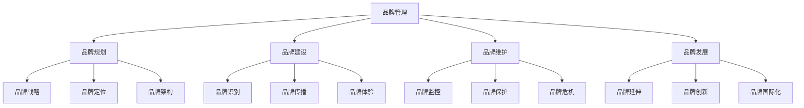
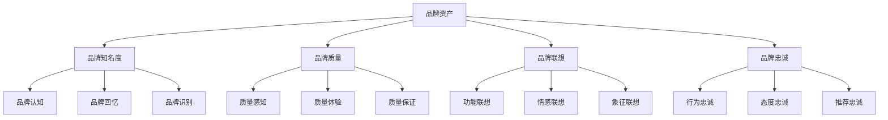
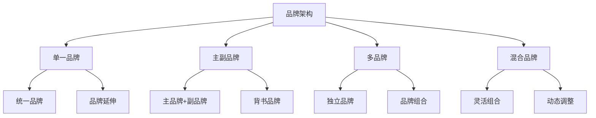
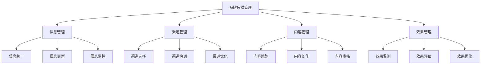
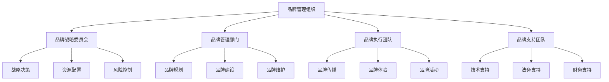
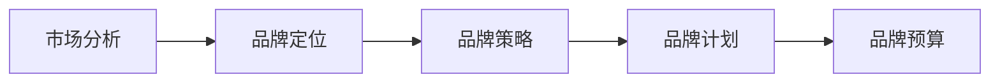
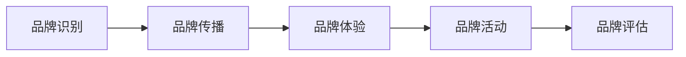
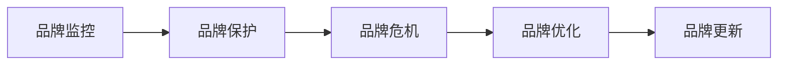

# 品牌管理策略

## 品牌管理概述

### 定义与本质
**品牌管理**：通过系统性的规划、组织、协调和控制，对品牌资产进行有效管理，实现品牌价值最大化的管理过程。

### 品牌管理框架

## 品牌管理理论

### 品牌资产理论
#### 品牌资产构成
| 维度 | 内容 | 重要性 | 管理重点 |
|------|------|--------|----------|
| **品牌知名度** | 品牌认知程度 | 基础要素 | 认知建立 |
| **品牌质量** | 品牌质量感知 | 核心要素 | 质量保证 |
| **品牌联想** | 品牌相关联想 | 差异要素 | 联想管理 |
| **品牌忠诚** | 品牌忠诚程度 | 价值要素 | 忠诚建设 |

#### 品牌资产模型

### 品牌生命周期理论
#### 生命周期阶段
| 阶段 | 特征 | 管理重点 | 策略重点 |
|------|------|----------|----------|
| **导入期** | 品牌建立、认知建设 | 品牌识别、市场教育 | 市场进入 |
| **成长期** | 品牌扩张、市场增长 | 品牌传播、渠道建设 | 市场扩张 |
| **成熟期** | 品牌稳定、市场饱和 | 品牌维护、差异化 | 市场维护 |
| **衰退期** | 品牌老化、市场萎缩 | 品牌创新、重新定位 | 市场转型 |

## 品牌管理策略

### 1. 品牌架构管理
#### 品牌架构类型

#### 架构选择原则
- **市场定位**：根据市场定位选择
- **资源能力**：根据资源能力选择
- **风险控制**：考虑风险控制因素
- **发展需要**：考虑发展需要

### 2. 品牌识别管理
#### 识别要素
| 要素类型 | 具体内容 | 管理要求 | 应用场景 |
|----------|----------|----------|----------|
| **视觉识别** | 标志、色彩、字体 | 统一性、一致性 | 品牌形象 |
| **听觉识别** | 声音、音乐、口号 | 独特性、记忆性 | 品牌传播 |
| **触觉识别** | 材质、质感、包装 | 体验性、差异性 | 产品体验 |
| **嗅觉识别** | 香味、气味 | 独特性、记忆性 | 环境体验 |

#### 识别管理原则
- **统一性**：识别要素统一
- **一致性**：应用场景一致
- **独特性**：识别要素独特
- **记忆性**：易于记忆识别

### 3. 品牌传播管理
#### 传播管理要素

### 4. 品牌体验管理
#### 体验管理要素
- **产品体验**：产品质量、功能体验
- **服务体验**：服务质量、服务流程
- **环境体验**：物理环境、数字环境
- **情感体验**：情感连接、情感共鸣

#### 体验管理原则
- **一致性**：体验一致性
- **差异性**：体验差异性
- **价值性**：体验价值性
- **记忆性**：体验记忆性

## 品牌管理实施

### 品牌管理组织
#### 组织架构

#### 职责分工
- **战略层面**：品牌战略制定
- **管理层面**：品牌管理执行
- **执行层面**：品牌活动执行
- **支持层面**：品牌支持服务

### 品牌管理流程
#### 1. 品牌规划流程

#### 2. 品牌建设流程

#### 3. 品牌维护流程

### 品牌管理工具
#### 1. 品牌监控工具
- **品牌监测**：品牌提及监测
- **舆情分析**：品牌舆情分析
- **竞品分析**：竞争对手分析
- **市场分析**：市场趋势分析

#### 2. 品牌评估工具
- **品牌价值评估**：品牌资产价值评估
- **品牌健康度评估**：品牌健康状况评估
- **品牌影响力评估**：品牌影响力评估
- **品牌满意度评估**：品牌满意度评估

#### 3. 品牌管理工具
- **品牌管理系统**：品牌管理信息系统
- **品牌资产管理**：品牌资产管理系统
- **品牌传播管理**：品牌传播管理系统
- **品牌体验管理**：品牌体验管理系统

## 品牌管理案例

### 成功案例：宝洁品牌管理
#### 管理策略
- **多品牌战略**：独立品牌管理
- **品牌组合**：品牌组合优化
- **品牌延伸**：品牌延伸策略

#### 实施要点
- 独立品牌管理
- 品牌组合优化
- 品牌延伸策略
- 品牌创新驱动

#### 成功因素
- 清晰的品牌架构
- 专业的品牌管理
- 强大的品牌组合
- 持续的品牌创新

### 失败案例：品牌管理混乱
#### 问题分析
- 品牌架构不清
- 管理职责不明
- 执行标准不一
- 效果评估缺失

#### 改进建议
- 明确品牌架构
- 清晰管理职责
- 统一执行标准
- 完善效果评估

## 品牌管理趋势

### 数字化品牌管理
#### 趋势特征
- **数据驱动**：数据驱动品牌管理
- **智能化**：智能化品牌管理
- **个性化**：个性化品牌体验
- **实时化**：实时品牌管理

#### 实施要点
- 数据收集分析
- 智能化工具应用
- 个性化体验设计
- 实时监控管理

### 可持续发展品牌管理
#### 趋势特征
- **环保理念**：环保品牌理念
- **社会责任**：社会责任承担
- **可持续发展**：可持续发展战略
- **价值共创**：价值共创模式

#### 实施要点
- 环保理念融入
- 社会责任承担
- 可持续发展战略
- 价值共创模式

## 实践应用

### 品牌管理实施步骤
1. **品牌审计**：全面品牌审计
2. **战略制定**：品牌战略制定
3. **组织建设**：品牌管理组织
4. **流程设计**：品牌管理流程
5. **工具选择**：品牌管理工具
6. **执行管理**：品牌管理执行
7. **效果评估**：品牌管理效果
8. **持续优化**：品牌管理优化

### 品牌管理最佳实践
- **战略导向**：以战略为导向
- **系统管理**：系统化管理
- **数据驱动**：数据驱动决策
- **持续创新**：持续创新发展
- **价值创造**：价值创造导向

---

**相关链接**：
- [[01-品牌定位策略|品牌定位策略]]
- [[02-品牌传播策略|品牌传播策略]]
- [[04-品牌价值评估|品牌价值评估]]
- [[03-营销理论框架/01-经典营销理论/01-4P营销理论|4P营销理论]]
- [[06-营销效果评估/01-营销指标/01-KPI指标体系|KPI指标体系]]

