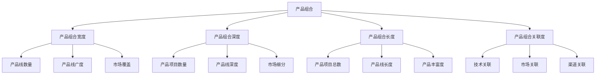
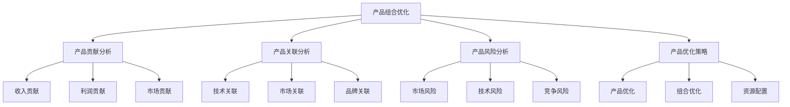
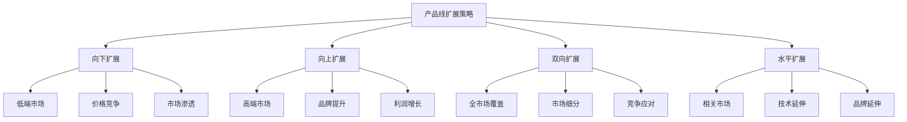
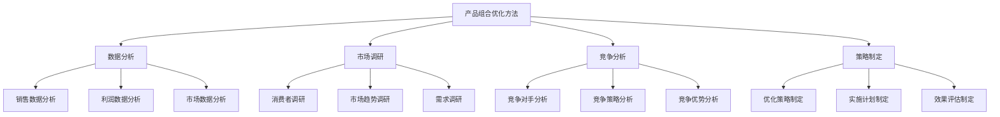
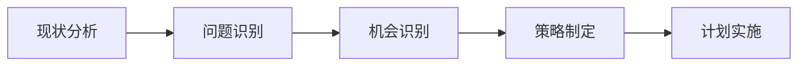
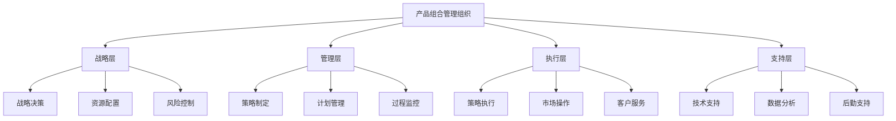

# 产品组合策略

## 产品组合概述

### 定义与本质
**产品组合**：企业向市场提供的所有产品线和产品项目的组合，包括产品组合的宽度、深度、长度和关联度四个维度。

### 产品组合维度

## 产品组合理论

### 产品组合分析模型
#### 1. 波士顿矩阵
| 象限 | 特征 | 策略 | 管理重点 | 资源配置 |
|------|------|------|----------|----------|
| **明星产品** | 高增长、高份额 | 投资发展 | 市场扩张 | 大量投资 |
| **现金牛产品** | 低增长、高份额 | 收获利润 | 成本控制 | 维持投资 |
| **问题产品** | 高增长、低份额 | 选择性投资 | 市场分析 | 谨慎投资 |
| **瘦狗产品** | 低增长、低份额 | 退出市场 | 资源转移 | 减少投资 |

#### 2. 产品组合优化模型

### 产品组合策略类型
#### 1. 扩展策略
- **宽度扩展**：增加产品线数量
- **深度扩展**：增加产品项目数量
- **长度扩展**：增加产品组合长度
- **关联扩展**：增加产品关联度

#### 2. 收缩策略
- **宽度收缩**：减少产品线数量
- **深度收缩**：减少产品项目数量
- **长度收缩**：减少产品组合长度
- **关联收缩**：减少产品关联度

#### 3. 优化策略
- **产品优化**：优化现有产品
- **组合优化**：优化产品组合
- **资源配置**：优化资源配置
- **市场定位**：优化市场定位

## 产品组合策略

### 1. 产品线扩展策略
#### 策略类型

#### 实施要点
- **市场分析**：分析目标市场
- **竞争分析**：分析竞争环境
- **资源评估**：评估资源能力
- **风险控制**：控制扩展风险

### 2. 产品线收缩策略
#### 策略类型
- **产品淘汰**：淘汰低效产品
- **市场退出**：退出低效市场
- **资源集中**：集中优势资源
- **成本控制**：控制运营成本

#### 实施要点
- **产品评估**：评估产品表现
- **市场分析**：分析市场前景
- **资源优化**：优化资源配置
- **退出管理**：管理退出过程

### 3. 产品组合优化策略
#### 优化维度
| 优化维度 | 优化内容 | 优化目标 | 优化方法 |
|----------|----------|----------|----------|
| **产品优化** | 产品功能、质量、设计 | 产品竞争力 | 产品改进、创新 |
| **组合优化** | 产品组合结构、配置 | 组合效率 | 组合调整、优化 |
| **资源配置** | 资源分配、利用 | 资源效率 | 资源配置、优化 |
| **市场定位** | 市场定位、策略 | 市场竞争力 | 定位调整、优化 |

#### 优化方法

## 产品组合管理

### 管理流程
#### 1. 产品组合分析

#### 2. 产品组合优化
- **产品评估**：评估产品表现
- **组合分析**：分析组合结构
- **优化策略**：制定优化策略
- **实施管理**：管理实施过程

#### 3. 产品组合监控
- **表现监控**：监控产品表现
- **市场监控**：监控市场变化
- **竞争监控**：监控竞争动态
- **效果评估**：评估优化效果

### 管理工具
#### 1. 分析工具
- **波士顿矩阵**：产品组合分析
- **GE矩阵**：产品组合评估
- **产品生命周期**：产品生命周期分析
- **市场吸引力**：市场吸引力分析

#### 2. 决策工具
- **决策树**：产品组合决策
- **情景分析**：不同情景分析
- **风险评估**：风险评估工具
- **成本效益分析**：成本效益分析

#### 3. 管理工具
- **产品组合管理系统**：产品组合管理
- **数据分析工具**：数据分析工具
- **市场调研工具**：市场调研工具
- **竞争分析工具**：竞争分析工具

## 产品组合策略实施

### 实施步骤
#### 1. 现状分析
- **产品分析**：分析现有产品
- **市场分析**：分析市场环境
- **竞争分析**：分析竞争环境
- **资源分析**：分析资源状况

#### 2. 策略制定
- **目标设定**：设定组合目标
- **策略选择**：选择组合策略
- **计划制定**：制定实施计划
- **资源配置**：配置所需资源

#### 3. 策略实施
- **计划执行**：执行实施计划
- **过程监控**：监控实施过程
- **效果评估**：评估实施效果
- **策略调整**：调整实施策略

### 实施管理
#### 1. 组织管理

#### 2. 流程管理
- **决策流程**：产品组合决策流程
- **执行流程**：产品组合执行流程
- **监控流程**：产品组合监控流程
- **评估流程**：产品组合评估流程

## 产品组合案例

### 成功案例：宝洁产品组合管理
#### 组合策略
- **多品牌战略**：独立品牌管理
- **市场细分**：精准市场细分
- **品牌组合**：品牌组合优化
- **资源整合**：资源整合配置

#### 实施要点
- 独立品牌管理
- 精准市场细分
- 品牌组合优化
- 资源整合配置

#### 成功因素
- 清晰的品牌架构
- 精准的市场定位
- 强大的品牌组合
- 有效的资源管理

### 失败案例：产品组合管理不当
#### 问题分析
- 组合结构不合理
- 资源配置不当
- 市场定位模糊
- 管理流程混乱

#### 改进建议
- 优化组合结构
- 合理资源配置
- 清晰市场定位
- 规范管理流程

## 产品组合趋势

### 数字化管理
#### 趋势特征
- **数据驱动**：数据驱动管理
- **智能化**：智能化管理工具
- **实时化**：实时组合管理
- **个性化**：个性化产品组合

#### 实施要点
- 数据收集自动化
- 管理工具智能化
- 组合管理实时化
- 产品组合个性化

### 可持续发展
#### 趋势特征
- **环保理念**：环保产品组合
- **资源优化**：资源优化配置
- **循环经济**：循环经济模式
- **社会责任**：社会责任承担

#### 实施要点
- 环保理念融入
- 资源优化配置
- 循环经济模式
- 社会责任承担

## 实践应用

### 产品组合管理实施步骤
1. **现状分析**：分析产品组合现状
2. **问题识别**：识别组合问题
3. **机会识别**：识别市场机会
4. **策略制定**：制定组合策略
5. **计划制定**：制定实施计划
6. **资源配置**：配置所需资源
7. **策略实施**：实施组合策略
8. **效果评估**：评估实施效果

### 产品组合管理最佳实践
- **科学分析**：科学分析产品组合
- **合理策略**：制定合理组合策略
- **有效执行**：有效执行组合策略
- **持续优化**：持续优化组合效果
- **风险控制**：有效控制组合风险

---

**相关链接**：
- [[01-产品生命周期管理|产品生命周期管理]]
- [[03-新产品开发策略|新产品开发策略]]
- [[04-产品创新策略|产品创新策略]]
- [[03-营销理论框架/01-经典营销理论/01-4P营销理论|4P营销理论]]
- [[06-营销效果评估/02-数据分析/01-营销数据分析|营销数据分析]]

