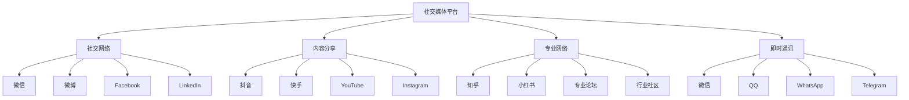
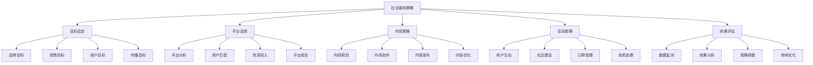
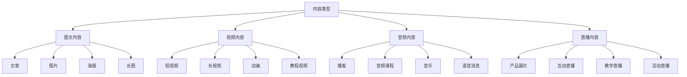
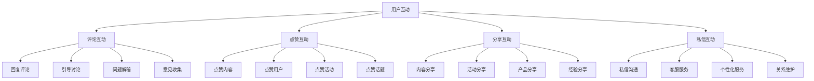
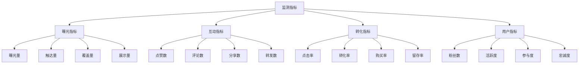

# 社交媒体营销

## 社交媒体营销概述

### 营销定义
**社交媒体营销**：利用社交媒体平台进行品牌推广、用户互动、内容传播和销售转化的营销活动。

### 营销价值
| 价值 | 内容 | 意义 |
|------|------|------|
| **品牌曝光** | 提升品牌知名度 | 品牌建设 |
| **用户互动** | 增强用户互动 | 关系建设 |
| **内容传播** | 扩大内容传播 | 影响力提升 |
| **销售转化** | 促进销售转化 | 业绩提升 |

### 平台类型

### 营销特点
| 特点 | 内容 | 优势 |
|------|------|------|
| **互动性强** | 双向互动交流 | 用户参与度高 |
| **传播速度快** | 信息传播迅速 | 影响力扩大 |
| **成本相对较低** | 营销成本较低 | 性价比高 |
| **精准度高** | 精准触达用户 | 营销效率高 |

## 社交媒体策略

### 策略制定

### 目标设定
| 目标类型 | 内容 | 指标 |
|----------|------|------|
| **品牌目标** | 品牌知名度、美誉度 | 曝光量、提及量 |
| **销售目标** | 销售转化、业绩提升 | 转化率、销售额 |
| **用户目标** | 用户增长、活跃度 | 粉丝数、互动率 |
| **传播目标** | 内容传播、影响力 | 分享量、转发量 |

### 平台选择
| 选择因素 | 内容 | 考虑要点 |
|----------|------|----------|
| **用户匹配** | 目标用户群体 | 用户画像匹配 |
| **平台特性** | 平台功能特点 | 功能适合性 |
| **竞争状况** | 竞争激烈程度 | 竞争环境 |
| **资源投入** | 资源投入能力 | 资源匹配度 |

## 内容营销

### 内容类型

### 内容策略
| 策略 | 内容 | 特点 |
|------|------|------|
| **教育型内容** | 知识分享、技能教学 | 价值性强 |
| **娱乐型内容** | 趣味内容、娱乐元素 | 吸引力强 |
| **情感型内容** | 情感共鸣、故事讲述 | 感染力强 |
| **实用型内容** | 实用信息、解决方案 | 实用性强 |

### 内容创作
| 要素 | 内容 | 要求 |
|------|------|------|
| **内容规划** | 内容主题规划 | 主题明确 |
| **内容创作** | 内容制作生产 | 质量保证 |
| **内容优化** | 内容优化改进 | 持续优化 |
| **内容发布** | 内容发布推广 | 时机把握 |

## 用户互动

### 互动方式

### 社区建设
| 要素 | 内容 | 策略 |
|------|------|------|
| **社区规则** | 社区管理规则 | 规则明确 |
| **社区活动** | 社区互动活动 | 活动丰富 |
| **社区管理** | 社区运营管理 | 管理有效 |
| **社区文化** | 社区文化氛围 | 文化积极 |

### 口碑管理
| 管理 | 内容 | 方法 |
|------|------|------|
| **正面口碑** | 积极口碑传播 | 口碑激励 |
| **负面口碑** | 负面口碑处理 | 及时回应 |
| **口碑监测** | 口碑情况监测 | 实时监控 |
| **口碑引导** | 口碑方向引导 | 主动引导 |

## 数据监测

### 监测指标

### 数据分析
| 分析 | 内容 | 方法 |
|------|------|------|
| **趋势分析** | 数据趋势变化 | 时间序列分析 |
| **对比分析** | 数据对比分析 | 横向纵向对比 |
| **用户分析** | 用户行为分析 | 用户画像分析 |
| **内容分析** | 内容效果分析 | 内容表现分析 |

### 效果评估
| 评估 | 内容 | 标准 |
|------|------|------|
| **目标达成** | 目标完成情况 | 目标完成率 |
| **ROI分析** | 投资回报分析 | ROI计算 |
| **用户反馈** | 用户反馈情况 | 满意度调查 |
| **竞争对比** | 竞争对比分析 | 市场地位 |

## 营销工具

### 管理工具
| 工具 | 内容 | 功能 |
|------|------|------|
| **内容管理** | 内容发布管理 | 内容规划、发布 |
| **用户管理** | 用户关系管理 | 用户分析、互动 |
| **数据监测** | 数据监测分析 | 数据收集、分析 |
| **效果评估** | 效果评估报告 | 效果分析、报告 |

### 创作工具
| 工具 | 内容 | 功能 |
|------|------|------|
| **图文创作** | 图文内容创作 | 设计、编辑 |
| **视频创作** | 视频内容创作 | 拍摄、剪辑 |
| **音频创作** | 音频内容创作 | 录制、编辑 |
| **直播工具** | 直播内容制作 | 直播、互动 |

### 分析工具
| 工具 | 内容 | 功能 |
|------|------|------|
| **数据分析** | 数据分析工具 | 数据统计、分析 |
| **用户分析** | 用户行为分析 | 用户画像、行为 |
| **竞品分析** | 竞品分析工具 | 竞品监测、分析 |
| **趋势分析** | 趋势分析工具 | 趋势预测、分析 |

## 营销案例

### 成功案例
#### 完美日记社交媒体营销
- **平台策略**：多平台布局，重点发力小红书
- **内容策略**：KOL合作，用户生成内容
- **互动策略**：社区建设，用户参与
- **效果结果**：品牌知名度大幅提升

#### 小米社交媒体营销
- **平台策略**：微博、抖音、B站多平台
- **内容策略**：产品发布，用户互动
- **互动策略**：粉丝经济，社区运营
- **效果结果**：用户忠诚度显著提升

### 失败案例
#### 营销失败原因
1. **策略不当**：营销策略不适合
2. **内容质量差**：内容质量不高
3. **互动不足**：用户互动不够
4. **数据监测不力**：数据监测不到位
5. **危机处理不当**：危机处理不及时

## 营销趋势

### 发展趋势
| 趋势 | 内容 | 特点 |
|------|------|------|
| **视频化** | 视频内容增多 | 视觉冲击强 |
| **直播化** | 直播营销兴起 | 实时互动强 |
| **个性化** | 个性化内容 | 精准触达 |
| **社交电商** | 社交电商融合 | 转化效率高 |

### 技术发展
| 技术 | 内容 | 应用 |
|------|------|------|
| **AI技术** | 人工智能应用 | 智能推荐、客服 |
| **大数据** | 大数据分析 | 精准营销、用户画像 |
| **AR/VR** | 增强现实技术 | 沉浸式体验 |
| **5G技术** | 5G网络应用 | 高清视频、实时互动 |

### 未来方向
- **智能化营销**：AI驱动的智能营销
- **沉浸式体验**：AR/VR沉浸式营销
- **社交电商**：社交与电商深度融合
- **个性化定制**：个性化内容和服务

## 实践应用

### 应用步骤
1. **策略制定**：制定社交媒体营销策略
2. **平台选择**：选择适合的社交媒体平台
3. **内容创作**：创作优质的营销内容
4. **用户互动**：与用户进行有效互动
5. **数据监测**：监测营销数据和效果
6. **策略优化**：根据数据优化营销策略

### 应用原则
- **用户导向**：以用户需求为导向
- **内容为王**：注重内容质量
- **互动优先**：重视用户互动
- **数据驱动**：基于数据分析决策
- **持续优化**：持续优化营销策略

### 注意事项
- **平台规则**：遵守平台规则和政策
- **内容质量**：确保内容质量和原创性
- **用户隐私**：保护用户隐私和数据安全
- **危机处理**：建立危机处理机制
- **效果评估**：定期评估营销效果

---

**相关链接**：
- [[02-搜索引擎营销|搜索引擎营销]]
- [[03-内容营销|内容营销]]
- [[04-邮件营销|邮件营销]]
- [[05-移动营销|移动营销]]
