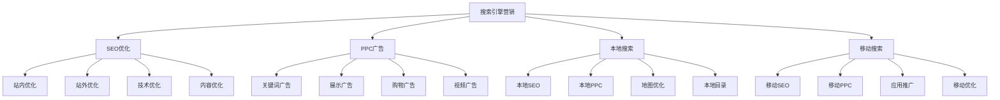
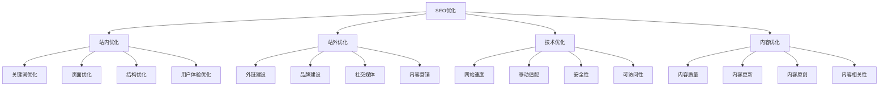
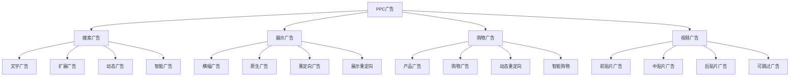
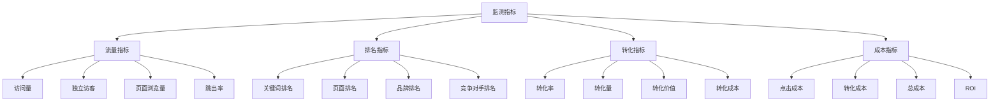

# 搜索引擎营销

## 搜索引擎营销概述

### 营销定义
**搜索引擎营销（SEM）**：通过搜索引擎平台进行营销推广，包括搜索引擎优化（SEO）和付费搜索广告（PPC）。

### 营销价值
| 价值 | 内容 | 意义 |
|------|------|------|
| **精准流量** | 获得精准流量 | 用户质量高 |
| **品牌曝光** | 提升品牌曝光 | 品牌建设 |
| **销售转化** | 促进销售转化 | 业绩提升 |
| **成本控制** | 控制营销成本 | 性价比高 |

### 营销类型

### 营销特点
| 特点 | 内容 | 优势 |
|------|------|------|
| **精准性强** | 精准匹配用户需求 | 转化率高 |
| **可控性强** | 营销过程可控 | 效果可预测 |
| **成本透明** | 成本结构透明 | ROI可计算 |
| **效果可测** | 效果数据可测量 | 优化有依据 |

## SEO优化

### 优化要素

### 关键词策略
| 策略 | 内容 | 特点 |
|------|------|------|
| **核心关键词** | 主要目标关键词 | 竞争激烈 |
| **长尾关键词** | 长尾关键词 | 竞争较小 |
| **相关关键词** | 相关关键词 | 扩展流量 |
| **品牌关键词** | 品牌相关关键词 | 品牌保护 |

### 内容优化
| 优化 | 内容 | 要求 |
|------|------|------|
| **标题优化** | 页面标题优化 | 包含关键词 |
| **描述优化** | 页面描述优化 | 吸引点击 |
| **内容优化** | 页面内容优化 | 质量高、相关性强 |
| **图片优化** | 图片SEO优化 | 图片描述、压缩 |

### 技术优化
| 优化 | 内容 | 要求 |
|------|------|------|
| **网站速度** | 页面加载速度 | 速度快 |
| **移动适配** | 移动端适配 | 响应式设计 |
| **安全性** | 网站安全性 | HTTPS、安全防护 |
| **可访问性** | 网站可访问性 | 结构清晰、导航方便 |

## PPC广告

### 广告类型

### 广告策略
| 策略 | 内容 | 特点 |
|------|------|------|
| **关键词策略** | 关键词选择和管理 | 精准匹配 |
| **出价策略** | 广告出价策略 | 成本控制 |
| **创意策略** | 广告创意策略 | 吸引点击 |
| **落地页策略** | 落地页优化策略 | 提高转化 |

### 广告优化
| 优化 | 内容 | 方法 |
|------|------|------|
| **关键词优化** | 关键词效果优化 | 添加、删除、调整 |
| **创意优化** | 广告创意优化 | A/B测试、优化 |
| **出价优化** | 广告出价优化 | 自动出价、手动调整 |
| **落地页优化** | 落地页效果优化 | 页面优化、转化优化 |

## 本地搜索

### 本地SEO
| 优化 | 内容 | 方法 |
|------|------|------|
| **Google My Business** | 谷歌我的商家 | 信息完善、优化 |
| **本地关键词** | 本地关键词优化 | 地域+关键词 |
| **本地内容** | 本地相关内容 | 本地新闻、活动 |
| **本地链接** | 本地网站链接 | 本地目录、合作伙伴 |

### 本地PPC
| 策略 | 内容 | 特点 |
|------|------|------|
| **地理位置定位** | 地理位置定向 | 精准投放 |
| **本地关键词** | 本地关键词广告 | 本地竞争 |
| **本地广告创意** | 本地化广告创意 | 本地特色 |
| **本地落地页** | 本地化落地页 | 本地信息 |

## 移动搜索

### 移动SEO
| 优化 | 内容 | 要求 |
|------|------|------|
| **响应式设计** | 移动端适配 | 自适应设计 |
| **移动速度** | 移动端加载速度 | 速度快 |
| **移动体验** | 移动端用户体验 | 操作便捷 |
| **移动内容** | 移动端内容优化 | 内容适配 |

### 移动PPC
| 策略 | 内容 | 特点 |
|------|------|------|
| **移动设备定向** | 移动设备定向 | 精准投放 |
| **移动广告创意** | 移动端广告创意 | 移动优化 |
| **移动落地页** | 移动端落地页 | 移动友好 |
| **移动转化** | 移动端转化优化 | 转化提升 |

## 数据监测

### 监测指标

### 分析工具
| 工具 | 内容 | 功能 |
|------|------|------|
| **Google Analytics** | 谷歌分析 | 网站流量分析 |
| **Google Search Console** | 谷歌搜索控制台 | 搜索表现分析 |
| **百度统计** | 百度网站分析 | 网站流量统计 |
| **百度站长工具** | 百度站长平台 | 搜索优化工具 |

### 效果评估
| 评估 | 内容 | 标准 |
|------|------|------|
| **流量增长** | 流量增长情况 | 增长率 |
| **排名提升** | 关键词排名提升 | 排名变化 |
| **转化提升** | 转化率提升 | 转化率变化 |
| **ROI分析** | 投资回报分析 | ROI计算 |

## 营销工具

### SEO工具
| 工具 | 内容 | 功能 |
|------|------|------|
| **关键词工具** | 关键词研究工具 | 关键词挖掘、分析 |
| **排名工具** | 排名监测工具 | 排名跟踪、分析 |
| **外链工具** | 外链分析工具 | 外链检查、分析 |
| **技术工具** | 技术SEO工具 | 网站技术分析 |

### PPC工具
| 工具 | 内容 | 功能 |
|------|------|------|
| **关键词工具** | 关键词规划工具 | 关键词研究、规划 |
| **出价工具** | 出价管理工具 | 出价优化、管理 |
| **创意工具** | 广告创意工具 | 创意制作、优化 |
| **分析工具** | 广告分析工具 | 效果分析、报告 |

### 综合工具
| 工具 | 内容 | 功能 |
|------|------|------|
| **SEMrush** | 综合SEO工具 | 关键词、排名、竞争分析 |
| **Ahrefs** | 外链分析工具 | 外链、关键词、内容分析 |
| **Moz** | SEO分析工具 | 域名权威、关键词分析 |
| **百度推广** | 百度广告平台 | 百度搜索广告投放 |

## 营销案例

### 成功案例
#### 某电商网站SEO优化
- **策略**：长尾关键词优化，内容营销
- **实施**：站内优化，外链建设
- **效果**：自然流量增长300%，转化率提升50%

#### 某服务企业PPC广告
- **策略**：精准关键词，本地化投放
- **实施**：广告创意优化，落地页优化
- **效果**：点击率提升40%，转化成本降低30%

### 失败案例
#### 营销失败原因
1. **关键词选择不当**：关键词不匹配目标用户
2. **内容质量差**：内容质量不高，用户体验差
3. **技术问题**：网站技术问题影响排名
4. **竞争激烈**：竞争过于激烈，成本过高
5. **策略不当**：营销策略不适合企业情况

## 营销趋势

### 发展趋势
| 趋势 | 内容 | 特点 |
|------|------|------|
| **语音搜索** | 语音搜索优化 | 自然语言查询 |
| **本地搜索** | 本地搜索优化 | 地理位置重要 |
| **移动优先** | 移动端优先 | 移动设备主导 |
| **AI优化** | 人工智能优化 | 智能推荐、优化 |

### 技术发展
| 技术 | 内容 | 应用 |
|------|------|------|
| **机器学习** | 机器学习算法 | 智能出价、推荐 |
| **自然语言处理** | NLP技术 | 语音搜索、内容理解 |
| **图像识别** | 图像识别技术 | 图片搜索、内容分析 |
| **大数据** | 大数据分析 | 用户行为分析、预测 |

### 未来方向
- **智能化营销**：AI驱动的智能营销
- **语音搜索优化**：语音搜索SEO优化
- **本地化营销**：本地搜索营销深化
- **个性化体验**：个性化搜索体验

## 实践应用

### 应用步骤
1. **策略制定**：制定搜索引擎营销策略
2. **关键词研究**：研究目标关键词
3. **内容优化**：优化网站内容和结构
4. **广告投放**：投放付费搜索广告
5. **数据监测**：监测营销数据和效果
6. **策略优化**：根据数据优化营销策略

### 应用原则
- **用户导向**：以用户需求为导向
- **内容为王**：注重内容质量和相关性
- **技术支撑**：确保网站技术优化
- **数据驱动**：基于数据分析决策
- **持续优化**：持续优化营销策略

### 注意事项
- **算法变化**：关注搜索引擎算法变化
- **用户体验**：重视用户体验优化
- **内容质量**：确保内容质量和原创性
- **技术问题**：及时解决技术问题
- **竞争分析**：持续分析竞争对手

---

**相关链接**：
- [[01-社交媒体营销|社交媒体营销]]
- [[03-内容营销|内容营销]]
- [[04-邮件营销|邮件营销]]
- [[05-移动营销|移动营销]]
