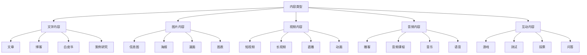
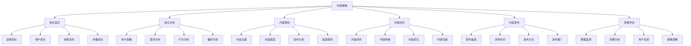
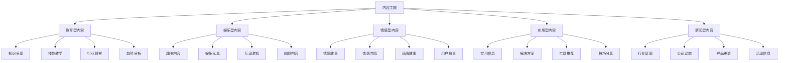
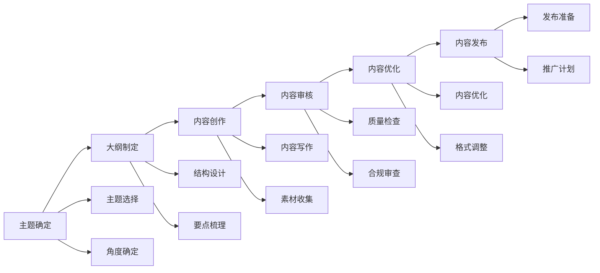
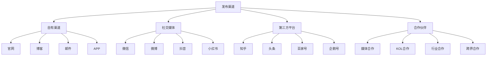
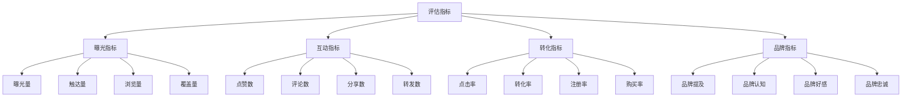

# 内容营销

## 内容营销概述

### 营销定义
**内容营销**：通过创造、发布和分享有价值的内容，吸引和留住目标受众，最终驱动用户行为转化的营销策略。

### 营销价值
| 价值 | 内容 | 意义 |
|------|------|------|
| **品牌建设** | 提升品牌影响力 | 品牌认知度提升 |
| **用户教育** | 教育目标用户 | 用户认知提升 |
| **信任建立** | 建立用户信任 | 品牌信任度提升 |
| **销售转化** | 促进销售转化 | 业绩提升 |

### 内容类型

### 营销特点
| 特点 | 内容 | 优势 |
|------|------|------|
| **价值导向** | 以价值为核心 | 用户认可度高 |
| **长期效应** | 长期积累效应 | 持续影响力 |
| **成本相对较低** | 营销成本较低 | 性价比高 |
| **用户主动** | 用户主动获取 | 参与度高 |

## 内容策略

### 策略制定

### 目标设定
| 目标类型 | 内容 | 指标 |
|----------|------|------|
| **品牌目标** | 品牌知名度、美誉度 | 品牌提及量、品牌认知度 |
| **用户目标** | 用户增长、活跃度 | 粉丝数、互动率、留存率 |
| **销售目标** | 销售转化、业绩提升 | 转化率、销售额、ROI |
| **传播目标** | 内容传播、影响力 | 分享量、转发量、曝光量 |

### 受众分析
| 分析维度 | 内容 | 方法 |
|----------|------|------|
| **用户画像** | 用户特征分析 | 数据分析、调研 |
| **需求分析** | 用户需求分析 | 需求调研、行为分析 |
| **行为分析** | 用户行为分析 | 行为数据、路径分析 |
| **偏好分析** | 用户偏好分析 | 偏好调研、内容分析 |

## 内容规划

### 内容主题

### 内容类型规划
| 类型 | 内容 | 特点 | 适用场景 |
|------|------|------|----------|
| **教育型** | 知识分享、技能教学 | 价值性强 | 用户教育 |
| **娱乐型** | 趣味内容、娱乐元素 | 吸引力强 | 用户吸引 |
| **情感型** | 情感故事、品牌故事 | 感染力强 | 品牌建设 |
| **实用型** | 实用信息、解决方案 | 实用性强 | 用户服务 |

### 发布计划
| 计划要素 | 内容 | 要求 |
|----------|------|------|
| **发布频率** | 内容发布频率 | 保持一致性 |
| **发布时间** | 内容发布时间 | 用户活跃时间 |
| **发布节奏** | 内容发布节奏 | 平衡发布量 |
| **发布周期** | 内容发布周期 | 长期规划 |

## 内容创作

### 创作流程

### 创作要素
| 要素 | 内容 | 要求 |
|------|------|------|
| **标题** | 内容标题 | 吸引人、包含关键词 |
| **开头** | 内容开头 | 吸引注意、引出主题 |
| **正文** | 内容正文 | 逻辑清晰、价值明确 |
| **结尾** | 内容结尾 | 总结要点、引导行动 |

### 内容质量
| 质量要素 | 内容 | 标准 |
|----------|------|------|
| **原创性** | 内容原创程度 | 原创、独特 |
| **价值性** | 内容价值程度 | 有价值、有用 |
| **相关性** | 内容相关程度 | 相关、匹配 |
| **可读性** | 内容可读程度 | 易读、易懂 |

## 内容发布

### 发布渠道

### 发布策略
| 策略 | 内容 | 特点 |
|------|------|------|
| **多渠道发布** | 多个渠道同时发布 | 覆盖范围广 |
| **差异化发布** | 不同渠道差异化内容 | 渠道适配 |
| **时间优化** | 优化发布时间 | 用户活跃时间 |
| **频率控制** | 控制发布频率 | 避免过度发布 |

### 发布优化
| 优化 | 内容 | 方法 |
|------|------|------|
| **标题优化** | 不同渠道标题优化 | 渠道特色 |
| **内容适配** | 内容格式适配 | 平台要求 |
| **标签优化** | 标签和关键词优化 | 搜索优化 |
| **互动引导** | 引导用户互动 | 增加参与度 |

## 效果评估

### 评估指标

### 数据分析
| 分析类型 | 内容 | 方法 |
|----------|------|------|
| **内容分析** | 内容表现分析 | 内容效果对比 |
| **用户分析** | 用户行为分析 | 用户画像分析 |
| **渠道分析** | 渠道效果分析 | 渠道对比分析 |
| **趋势分析** | 趋势变化分析 | 时间序列分析 |

### 效果优化
| 优化 | 内容 | 方法 |
|------|------|------|
| **内容优化** | 内容质量优化 | 内容改进 |
| **渠道优化** | 发布渠道优化 | 渠道调整 |
| **时间优化** | 发布时间优化 | 时间调整 |
| **策略优化** | 整体策略优化 | 策略调整 |

## 内容营销工具

### 创作工具
| 工具类型 | 工具名称 | 功能 |
|----------|----------|------|
| **文字创作** | 石墨文档、腾讯文档 | 协作写作 |
| **图片设计** | Canva、创客贴 | 图片设计 |
| **视频制作** | 剪映、PR | 视频剪辑 |
| **音频制作** | Audacity、GarageBand | 音频编辑 |

### 发布工具
| 工具类型 | 工具名称 | 功能 |
|----------|----------|------|
| **多平台发布** | 新榜、微小宝 | 多平台管理 |
| **定时发布** | 定时发布工具 | 定时发布 |
| **内容管理** | 内容管理系统 | 内容管理 |
| **版本控制** | Git、SVN | 版本管理 |

### 分析工具
| 工具类型 | 工具名称 | 功能 |
|----------|----------|------|
| **数据分析** | Google Analytics、百度统计 | 数据分析 |
| **内容分析** | 新榜、清博 | 内容分析 |
| **用户分析** | 用户画像工具 | 用户分析 |
| **竞品分析** | 竞品分析工具 | 竞品监测 |

## 内容营销案例

### 成功案例
#### 完美日记内容营销
- **策略**：KOL合作，用户生成内容
- **内容**：美妆教程，产品测评
- **渠道**：小红书、抖音、微博
- **效果**：品牌知名度大幅提升

#### 小米内容营销
- **策略**：产品发布，用户互动
- **内容**：产品介绍，用户故事
- **渠道**：微博、B站、抖音
- **效果**：用户忠诚度显著提升

### 失败案例
#### 内容营销失败原因
1. **内容质量差**：内容质量不高，价值不足
2. **策略不当**：内容策略不适合目标用户
3. **发布频率不当**：发布频率过高或过低
4. **渠道选择错误**：渠道与目标用户不匹配
5. **缺乏互动**：缺乏与用户的互动和反馈

## 内容营销趋势

### 发展趋势
| 趋势 | 内容 | 特点 |
|------|------|------|
| **视频化** | 视频内容增多 | 视觉冲击强 |
| **个性化** | 个性化内容 | 精准定制 |
| **互动化** | 互动内容增多 | 用户参与度高 |
| **AI化** | AI辅助创作 | 效率提升 |

### 技术发展
| 技术 | 内容 | 应用 |
|------|------|------|
| **AI写作** | 人工智能写作 | 内容自动生成 |
| **大数据** | 大数据分析 | 用户洞察、内容推荐 |
| **AR/VR** | 增强现实技术 | 沉浸式内容体验 |
| **5G技术** | 5G网络应用 | 高清视频、实时互动 |

### 未来方向
- **智能化创作**：AI驱动的智能内容创作
- **沉浸式体验**：AR/VR沉浸式内容体验
- **个性化定制**：个性化内容定制服务
- **实时互动**：实时互动内容体验

## 实践应用

### 应用步骤
1. **策略制定**：制定内容营销策略
2. **受众分析**：分析目标受众
3. **内容规划**：规划内容主题和类型
4. **内容创作**：创作优质内容
5. **内容发布**：在合适渠道发布内容
6. **效果评估**：评估内容营销效果
7. **策略优化**：根据效果优化策略

### 应用原则
- **价值导向**：以用户价值为导向
- **用户中心**：以用户需求为中心
- **内容为王**：注重内容质量
- **持续优化**：持续优化内容策略
- **数据驱动**：基于数据分析决策

### 注意事项
- **内容质量**：确保内容质量和原创性
- **用户需求**：深入了解用户需求
- **发布频率**：控制合适的发布频率
- **渠道选择**：选择适合的发布渠道
- **效果监测**：持续监测内容效果

---

**相关链接**：
- [[01-社交媒体营销|社交媒体营销]]
- [[02-搜索引擎营销|搜索引擎营销]]
- [[04-邮件营销|邮件营销]]
- [[05-移动营销|移动营销]]
