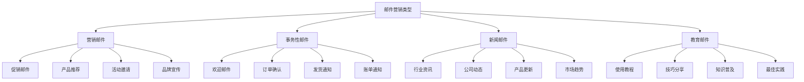
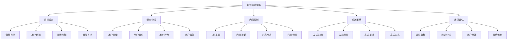
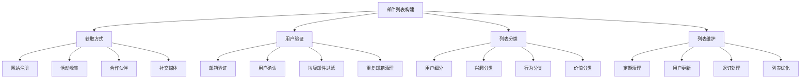
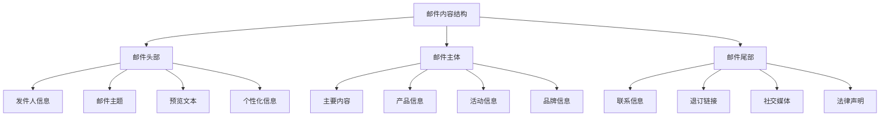
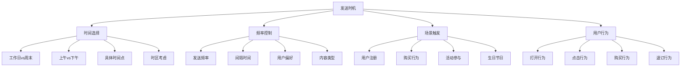
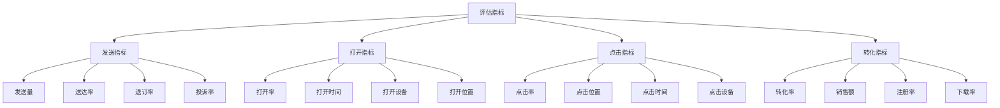

# 邮件营销

## 邮件营销概述

### 营销定义
**邮件营销**：通过电子邮件向目标用户发送营销信息，建立和维护客户关系，促进销售转化的数字营销方式。

### 营销价值
| 价值 | 内容 | 意义 |
|------|------|------|
| **成本效益** | 营销成本低 | 投资回报率高 |
| **精准触达** | 精准触达用户 | 营销效率高 |
| **个性化** | 个性化内容 | 用户体验好 |
| **可测量** | 效果可测量 | 数据驱动优化 |

### 营销特点
| 特点 | 内容 | 优势 |
|------|------|------|
| **直接性** | 直接触达用户 | 信息传递直接 |
| **可控性** | 内容完全可控 | 品牌形象可控 |
| **可追踪** | 用户行为可追踪 | 效果分析准确 |
| **可自动化** | 营销流程可自动化 | 效率提升 |

### 营销类型

## 邮件营销策略

### 策略制定

### 目标设定
| 目标类型 | 内容 | 指标 |
|----------|------|------|
| **营销目标** | 品牌推广、产品宣传 | 品牌认知度、产品知名度 |
| **用户目标** | 用户增长、用户活跃 | 订阅数、打开率、点击率 |
| **品牌目标** | 品牌建设、品牌形象 | 品牌提及、品牌好感度 |
| **销售目标** | 销售转化、业绩提升 | 转化率、销售额、ROI |

### 受众分析
| 分析维度 | 内容 | 方法 |
|----------|------|------|
| **用户画像** | 用户特征分析 | 数据分析、调研 |
| **用户细分** | 用户群体细分 | 行为分析、偏好分析 |
| **用户行为** | 用户行为分析 | 行为数据、路径分析 |
| **用户偏好** | 用户偏好分析 | 偏好调研、内容分析 |

## 邮件列表管理

### 列表构建

### 获取策略
| 策略 | 内容 | 方法 |
|------|------|------|
| **网站注册** | 网站注册获取 | 注册表单、弹窗 |
| **活动收集** | 活动参与获取 | 活动报名、抽奖 |
| **合作伙伴** | 合作伙伴推荐 | 合作推广、资源互换 |
| **社交媒体** | 社交媒体获取 | 社交推广、内容引流 |

### 列表维护
| 维护 | 内容 | 方法 |
|------|------|------|
| **定期清理** | 无效邮箱清理 | 定期检查、清理 |
| **用户更新** | 用户信息更新 | 用户反馈、数据更新 |
| **退订处理** | 退订用户处理 | 及时处理、分析原因 |
| **列表优化** | 列表质量优化 | 质量提升、效果优化 |

## 邮件内容设计

### 内容结构

### 内容要素
| 要素 | 内容 | 要求 |
|------|------|------|
| **邮件主题** | 邮件标题 | 吸引人、包含关键词 |
| **预览文本** | 邮件预览 | 补充主题、引导打开 |
| **主要内容** | 邮件正文 | 价值明确、逻辑清晰 |
| **行动号召** | 引导行动 | 明确、突出、易操作 |

### 内容类型
| 类型 | 内容 | 特点 |
|------|------|------|
| **促销邮件** | 产品促销、活动推广 | 转化导向 |
| **教育邮件** | 知识分享、使用教程 | 价值导向 |
| **新闻邮件** | 行业资讯、公司动态 | 信息导向 |
| **个性化邮件** | 个性化推荐、定制内容 | 个性化导向 |

## 邮件发送策略

### 发送时机

### 发送频率
| 频率 | 内容 | 建议 |
|------|------|------|
| **高频** | 每日发送 | 新闻类、促销类 |
| **中频** | 每周发送 | 教育类、品牌类 |
| **低频** | 每月发送 | 总结类、报告类 |
| **个性化** | 根据用户行为 | 行为触发、个性化 |

### 发送优化
| 优化 | 内容 | 方法 |
|------|------|------|
| **时间优化** | 发送时间优化 | A/B测试、数据分析 |
| **频率优化** | 发送频率优化 | 用户反馈、效果分析 |
| **内容优化** | 内容质量优化 | 内容测试、效果对比 |
| **个性化优化** | 个性化程度优化 | 用户细分、内容定制 |

## 邮件效果评估

### 评估指标

### 关键指标
| 指标 | 内容 | 计算方法 |
|------|------|----------|
| **打开率** | 邮件打开率 | 打开数/发送数 |
| **点击率** | 邮件点击率 | 点击数/发送数 |
| **转化率** | 邮件转化率 | 转化数/发送数 |
| **退订率** | 邮件退订率 | 退订数/发送数 |

### 数据分析
| 分析类型 | 内容 | 方法 |
|----------|------|------|
| **发送分析** | 发送效果分析 | 发送量、送达率分析 |
| **打开分析** | 打开行为分析 | 打开率、打开时间分析 |
| **点击分析** | 点击行为分析 | 点击率、点击位置分析 |
| **转化分析** | 转化效果分析 | 转化率、ROI分析 |

## 邮件营销工具

### 邮件平台
| 平台类型 | 平台名称 | 特点 |
|----------|----------|------|
| **国内平台** | 网易邮箱、腾讯邮箱 | 本土化、用户基数大 |
| **国际平台** | MailChimp、Constant Contact | 功能完善、国际化 |
| **企业平台** | 企业邮箱系统 | 企业级、安全性高 |
| **营销平台** | 营销自动化平台 | 自动化、智能化 |

### 设计工具
| 工具类型 | 工具名称 | 功能 |
|----------|----------|------|
| **模板设计** | 邮件模板设计工具 | 模板设计、样式定制 |
| **图片编辑** | Photoshop、Canva | 图片编辑、设计制作 |
| **HTML编辑** | Dreamweaver、Sublime | HTML编辑、代码编写 |
| **预览工具** | 邮件预览工具 | 多设备预览、测试 |

### 分析工具
| 工具类型 | 工具名称 | 功能 |
|----------|----------|------|
| **数据分析** | Google Analytics、百度统计 | 数据分析、效果监测 |
| **A/B测试** | A/B测试工具 | 邮件测试、效果对比 |
| **用户分析** | 用户行为分析工具 | 用户行为、偏好分析 |
| **竞品分析** | 竞品监测工具 | 竞品分析、市场监测 |

## 邮件营销最佳实践

### 最佳实践
| 实践 | 内容 | 建议 |
|------|------|------|
| **内容质量** | 内容质量提升 | 价值导向、用户需求 |
| **个性化** | 个性化程度提升 | 用户细分、内容定制 |
| **发送时机** | 发送时机优化 | 用户活跃时间、行为触发 |
| **频率控制** | 发送频率控制 | 避免过度发送、用户偏好 |

### 常见问题
| 问题 | 原因 | 解决方案 |
|------|------|----------|
| **低打开率** | 主题不吸引、发送时机不当 | 优化主题、调整发送时间 |
| **高退订率** | 内容不相关、发送频率过高 | 内容优化、频率控制 |
| **低转化率** | 内容价值不足、行动号召不明确 | 内容优化、CTA优化 |
| **垃圾邮件** | 内容质量差、发送方式不当 | 内容质量提升、合规发送 |

### 优化建议
| 优化 | 内容 | 方法 |
|------|------|------|
| **主题优化** | 邮件主题优化 | A/B测试、关键词优化 |
| **内容优化** | 邮件内容优化 | 价值提升、逻辑优化 |
| **设计优化** | 邮件设计优化 | 视觉优化、用户体验 |
| **发送优化** | 发送策略优化 | 时机优化、频率优化 |

## 邮件营销趋势

### 发展趋势
| 趋势 | 内容 | 特点 |
|------|------|------|
| **智能化** | AI驱动的智能邮件 | 个性化、自动化 |
| **互动化** | 互动邮件内容 | 用户参与、体验提升 |
| **视频化** | 视频邮件内容 | 视觉冲击、内容丰富 |
| **移动化** | 移动端优化 | 移动优先、响应式设计 |

### 技术发展
| 技术 | 内容 | 应用 |
|------|------|------|
| **AI技术** | 人工智能应用 | 内容生成、个性化推荐 |
| **大数据** | 大数据分析 | 用户洞察、行为预测 |
| **自动化** | 营销自动化 | 流程自动化、效率提升 |
| **个性化** | 个性化技术 | 内容定制、体验优化 |

### 未来方向
- **智能化营销**：AI驱动的智能邮件营销
- **全渠道整合**：邮件与其他渠道的整合
- **实时个性化**：实时个性化内容推荐
- **沉浸式体验**：AR/VR邮件体验

## 实践应用

### 应用步骤
1. **策略制定**：制定邮件营销策略
2. **列表构建**：构建和维护邮件列表
3. **内容设计**：设计邮件内容和模板
4. **发送策略**：制定发送时机和频率
5. **效果评估**：评估邮件营销效果
6. **策略优化**：根据效果优化策略

### 应用原则
- **用户中心**：以用户需求为中心
- **价值导向**：以用户价值为导向
- **数据驱动**：基于数据分析决策
- **持续优化**：持续优化邮件策略
- **合规发送**：遵守相关法律法规

### 注意事项
- **内容质量**：确保邮件内容质量
- **发送频率**：控制合适的发送频率
- **用户隐私**：保护用户隐私信息
- **合规性**：遵守邮件营销法规
- **效果监测**：持续监测邮件效果

---

**相关链接**：
- [[01-社交媒体营销|社交媒体营销]]
- [[02-搜索引擎营销|搜索引擎营销]]
- [[03-内容营销|内容营销]]
- [[05-移动营销|移动营销]]
