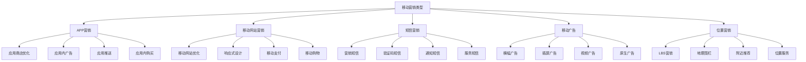
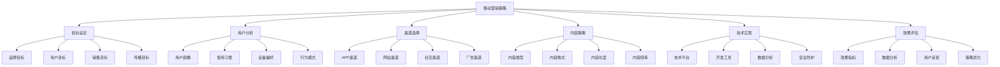
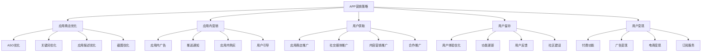
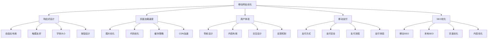
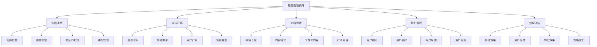
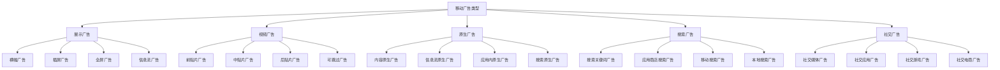
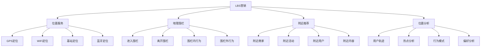
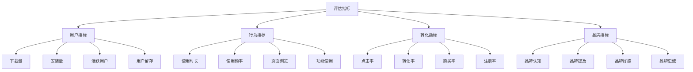

# 移动营销

## 移动营销概述

### 营销定义
**移动营销**：利用移动设备和移动互联网技术，通过手机、平板等移动终端向用户传递营销信息，实现品牌推广和销售转化的营销方式。

### 营销价值
| 价值 | 内容 | 意义 |
|------|------|------|
| **随时随地** | 用户随时随地接触 | 营销覆盖范围广 |
| **精准定位** | 基于位置的服务 | 精准营销投放 |
| **个性化** | 个性化内容推送 | 用户体验优化 |
| **互动性强** | 用户互动参与 | 营销效果提升 |

### 营销特点
| 特点 | 内容 | 优势 |
|------|------|------|
| **移动性** | 不受地点限制 | 营销灵活性高 |
| **即时性** | 实时信息传递 | 营销时效性强 |
| **便携性** | 设备便携易用 | 用户使用便利 |
| **社交性** | 社交功能丰富 | 传播效果显著 |

### 营销类型

## 移动营销策略

### 策略制定

### 目标设定
| 目标类型 | 内容 | 指标 |
|----------|------|------|
| **品牌目标** | 品牌知名度、美誉度 | 品牌提及量、品牌认知度 |
| **用户目标** | 用户增长、活跃度 | 下载量、活跃用户数、留存率 |
| **销售目标** | 销售转化、业绩提升 | 转化率、销售额、ROI |
| **传播目标** | 内容传播、影响力 | 分享量、转发量、曝光量 |

### 用户分析
| 分析维度 | 内容 | 方法 |
|----------|------|------|
| **用户画像** | 移动用户特征 | 用户调研、数据分析 |
| **使用习惯** | 移动设备使用习惯 | 行为分析、使用时长 |
| **设备偏好** | 设备类型偏好 | 设备分析、系统分析 |
| **行为模式** | 移动行为模式 | 路径分析、行为轨迹 |

## APP营销

### APP营销策略

### ASO优化
| 优化要素 | 内容 | 方法 |
|----------|------|------|
| **应用名称** | 应用名称优化 | 包含关键词、品牌名 |
| **关键词** | 关键词优化 | 相关关键词、搜索量 |
| **应用描述** | 应用描述优化 | 功能描述、价值说明 |
| **截图** | 应用截图优化 | 功能展示、界面设计 |

### 应用内营销
| 营销方式 | 内容 | 特点 |
|----------|------|------|
| **应用内广告** | 横幅、插屏、视频广告 | 精准投放、用户相关 |
| **推送通知** | 消息推送、活动通知 | 实时触达、个性化 |
| **应用内购买** | 虚拟商品、付费功能 | 直接变现、用户体验 |
| **用户引导** | 新手引导、功能引导 | 用户教育、功能推广 |

## 移动网站营销

### 移动网站优化

### 响应式设计
| 设计要素 | 内容 | 要求 |
|----------|------|------|
| **布局适配** | 不同屏幕尺寸适配 | 自适应布局、弹性设计 |
| **触摸友好** | 触摸操作优化 | 按钮大小、触摸区域 |
| **字体优化** | 移动端字体优化 | 字体大小、可读性 |
| **图片优化** | 移动端图片优化 | 图片大小、加载速度 |

### 移动支付
| 支付方式 | 内容 | 特点 |
|----------|------|------|
| **移动支付** | 支付宝、微信支付 | 便捷、安全 |
| **NFC支付** | 近场通信支付 | 快速、便捷 |
| **二维码支付** | 二维码扫码支付 | 简单、普及 |
| **生物识别** | 指纹、面部识别 | 安全、便捷 |

## 短信营销

### 短信营销策略

### 短信类型
| 类型 | 内容 | 特点 |
|------|------|------|
| **营销短信** | 促销、活动推广 | 转化导向、时效性强 |
| **服务短信** | 服务通知、状态更新 | 服务导向、用户价值 |
| **验证码短信** | 身份验证、安全验证 | 安全导向、必需性 |
| **通知短信** | 系统通知、重要提醒 | 信息导向、及时性 |

### 内容设计
| 设计要素 | 内容 | 要求 |
|----------|------|------|
| **内容长度** | 短信内容长度 | 简洁明了、信息完整 |
| **内容格式** | 短信格式设计 | 结构清晰、易读性 |
| **个性化** | 个性化内容 | 用户相关、定制化 |
| **行动号召** | 引导用户行动 | 明确、突出、易操作 |

## 移动广告

### 移动广告类型

### 广告投放策略
| 策略 | 内容 | 方法 |
|------|------|------|
| **精准投放** | 基于用户画像投放 | 用户细分、精准定向 |
| **场景投放** | 基于使用场景投放 | 场景分析、时机选择 |
| **位置投放** | 基于地理位置投放 | LBS技术、地理围栏 |
| **时间投放** | 基于时间节点投放 | 时间分析、用户活跃时间 |

### 广告优化
| 优化 | 内容 | 方法 |
|------|------|------|
| **创意优化** | 广告创意优化 | A/B测试、创意迭代 |
| **定向优化** | 投放定向优化 | 用户分析、定向调整 |
| **出价优化** | 广告出价优化 | 出价策略、预算分配 |
| **落地页优化** | 广告落地页优化 | 页面设计、转化优化 |

## 位置营销

### LBS营销

### 地理围栏
| 围栏类型 | 内容 | 应用场景 |
|----------|------|----------|
| **圆形围栏** | 以点为中心的圆形区域 | 商场、餐厅、景点 |
| **多边形围栏** | 自定义多边形区域 | 商业区、住宅区、办公区 |
| **路线围栏** | 沿路线的带状区域 | 高速公路、地铁线路 |
| **动态围栏** | 可移动的动态区域 | 车辆、人员、活动 |

### 位置分析
| 分析类型 | 内容 | 应用价值 |
|----------|------|----------|
| **用户轨迹** | 用户移动轨迹分析 | 行为洞察、偏好分析 |
| **热点分析** | 用户聚集热点分析 | 选址决策、营销投放 |
| **行为模式** | 位置行为模式分析 | 用户画像、精准营销 |
| **偏好分析** | 位置偏好分析 | 个性化推荐、服务优化 |

## 移动营销效果评估

### 评估指标

### 关键指标
| 指标 | 内容 | 计算方法 |
|------|------|----------|
| **下载转化率** | 下载转化率 | 下载数/曝光数 |
| **激活率** | 用户激活率 | 激活用户数/下载数 |
| **留存率** | 用户留存率 | 留存用户数/新增用户数 |
| **ARPU** | 平均每用户收入 | 总收入/活跃用户数 |

### 数据分析
| 分析类型 | 内容 | 方法 |
|----------|------|------|
| **用户分析** | 用户行为分析 | 用户画像、行为轨迹 |
| **渠道分析** | 渠道效果分析 | 渠道对比、ROI分析 |
| **内容分析** | 内容效果分析 | 内容表现、用户反馈 |
| **竞品分析** | 竞品对比分析 | 竞品监测、市场分析 |

## 移动营销工具

### 开发工具
| 工具类型 | 工具名称 | 功能 |
|----------|----------|------|
| **APP开发** | Android Studio、Xcode | 应用开发、调试 |
| **跨平台开发** | React Native、Flutter | 跨平台开发、代码复用 |
| **移动网站** | 响应式框架、移动优化 | 网站开发、移动适配 |
| **数据分析** | Firebase、友盟 | 用户分析、行为追踪 |

### 营销工具
| 工具类型 | 工具名称 | 功能 |
|----------|----------|------|
| **推送服务** | 极光推送、个推 | 消息推送、用户触达 |
| **短信服务** | 阿里云短信、腾讯云短信 | 短信发送、验证码 |
| **广告平台** | 广点通、今日头条 | 广告投放、效果监测 |
| **ASO工具** | ASO100、App Annie | 应用商店优化、竞品分析 |

### 分析工具
| 工具类型 | 工具名称 | 功能 |
|----------|----------|------|
| **用户分析** | Google Analytics、百度统计 | 用户行为、流量分析 |
| **A/B测试** | Optimizely、VWO | 实验测试、效果对比 |
| **热力图** | Hotjar、Crazy Egg | 用户行为、页面分析 |
| **竞品分析** | SimilarWeb、App Annie | 竞品监测、市场分析 |

## 移动营销趋势

### 发展趋势
| 趋势 | 内容 | 特点 |
|------|------|------|
| **5G技术** | 5G网络应用 | 高速、低延迟、大连接 |
| **AI技术** | 人工智能应用 | 智能化、个性化、自动化 |
| **AR/VR** | 增强现实技术 | 沉浸式体验、互动性强 |
| **物联网** | 物联网应用 | 万物互联、数据丰富 |

### 技术发展
| 技术 | 内容 | 应用 |
|------|------|------|
| **5G技术** | 第五代移动通信 | 高清视频、实时互动 |
| **AI技术** | 人工智能技术 | 智能推荐、个性化服务 |
| **AR/VR** | 增强现实技术 | 虚拟试穿、沉浸式购物 |
| **区块链** | 区块链技术 | 数据安全、信任机制 |

### 未来方向
- **智能化营销**：AI驱动的智能移动营销
- **沉浸式体验**：AR/VR沉浸式移动体验
- **全场景营销**：线上线下全场景整合
- **个性化服务**：深度个性化移动服务

## 实践应用

### 应用步骤
1. **策略制定**：制定移动营销策略
2. **用户分析**：分析移动用户特征
3. **渠道选择**：选择适合的移动渠道
4. **内容策略**：制定移动内容策略
5. **技术实现**：实现移动营销技术
6. **效果评估**：评估移动营销效果
7. **策略优化**：根据效果优化策略

### 应用原则
- **移动优先**：移动优先的设计理念
- **用户体验**：注重移动用户体验
- **数据驱动**：基于数据分析决策
- **持续优化**：持续优化移动策略
- **技术更新**：跟上移动技术发展

### 注意事项
- **设备适配**：确保多设备适配
- **网络优化**：优化移动网络体验
- **用户隐私**：保护用户隐私信息
- **合规性**：遵守移动营销法规
- **效果监测**：持续监测移动效果

---

**相关链接**：
- [[01-社交媒体营销|社交媒体营销]]
- [[02-搜索引擎营销|搜索引擎营销]]
- [[03-内容营销|内容营销]]
- [[04-邮件营销|邮件营销]]
