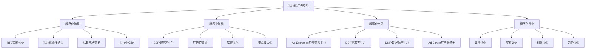
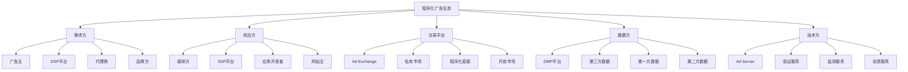
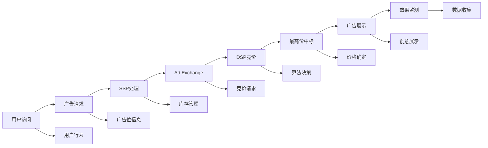
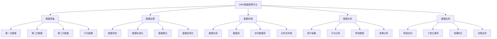
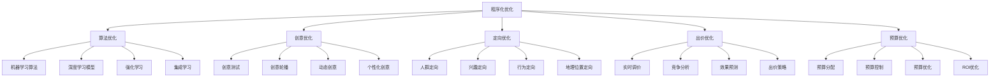
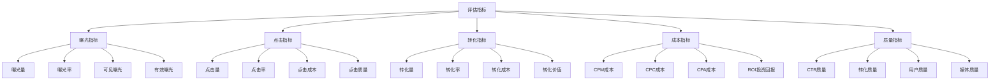
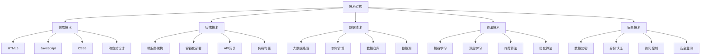

# 程序化广告

## 程序化广告概述

### 广告定义
**程序化广告**：通过自动化技术平台，利用算法和数据驱动的方式，实现广告投放、竞价、优化和效果评估的数字化广告营销方式。

### 广告价值
| 价值 | 内容 | 意义 |
|------|------|------|
| **效率提升** | 自动化投放流程 | 投放效率大幅提升 |
| **精准定向** | 基于数据的精准定向 | 广告效果显著改善 |
| **成本优化** | 实时竞价优化成本 | 广告成本有效控制 |
| **效果可测** | 全流程数据监测 | 效果评估准确可靠 |

### 广告特点
| 特点 | 内容 | 优势 |
|------|------|------|
| **自动化** | 全流程自动化 | 人工成本降低 |
| **实时性** | 实时竞价和优化 | 响应速度快 |
| **数据驱动** | 基于大数据决策 | 决策科学准确 |
| **透明化** | 投放过程透明 | 效果可追溯 |

### 广告类型

## 程序化广告生态

### 生态结构

### 核心平台
| 平台类型 | 功能 | 代表平台 |
|----------|------|----------|
| **DSP** | 需求方平台，广告主投放 | 广点通、今日头条 |
| **SSP** | 供应方平台，媒体变现 | 百度SSP、腾讯SSP |
| **Ad Exchange** | 广告交易平台 | 百度Ad Exchange |
| **DMP** | 数据管理平台 | 阿里DMP、腾讯DMP |

### 交易模式
| 模式 | 内容 | 特点 |
|------|------|------|
| **RTB** | 实时竞价 | 公开透明、竞争激烈 |
| **PDB** | 程序化直接购买 | 优质资源、价格固定 |
| **PMP** | 私有市场交易 | 优质资源、价格协商 |
| **PG** | 程序化保证 | 保量保价、效果保证 |

## 程序化购买

### 购买流程

### 竞价机制
| 机制 | 内容 | 特点 |
|------|------|------|
| **第一价格拍卖** | 最高价者支付最高价 | 简单直接、价格透明 |
| **第二价格拍卖** | 最高价者支付第二高价 | 激励真实出价、价格合理 |
| **统一价格拍卖** | 所有中标者支付统一价 | 价格公平、竞争激烈 |
| **动态定价** | 基于实时数据动态定价 | 价格灵活、效果优化 |

### 出价策略
| 策略 | 内容 | 适用场景 |
|------|------|----------|
| **CPM出价** | 按千次展示出价 | 品牌曝光、知名度提升 |
| **CPC出价** | 按点击出价 | 流量获取、网站访问 |
| **CPA出价** | 按转化出价 | 销售转化、效果导向 |
| **CPV出价** | 按观看出价 | 视频广告、内容消费 |

## 数据管理平台

### DMP功能

### 数据类型
| 类型 | 内容 | 来源 |
|------|------|------|
| **第一方数据** | 自有用户数据 | 网站、APP、CRM |
| **第二方数据** | 合作伙伴数据 | 媒体、代理商、供应商 |
| **第三方数据** | 外部数据源 | 数据公司、调研机构 |
| **行为数据** | 用户行为数据 | 点击、浏览、购买 |

### 用户画像
| 画像维度 | 内容 | 应用价值 |
|----------|------|----------|
| **基础属性** | 年龄、性别、地域 | 基础定向、人群筛选 |
| **兴趣偏好** | 兴趣标签、偏好分析 | 兴趣定向、内容推荐 |
| **行为特征** | 行为模式、使用习惯 | 行为定向、时机选择 |
| **价值评估** | 用户价值、生命周期 | 价值定向、预算分配 |

## 程序化优化

### 优化策略

### 算法优化
| 算法类型 | 内容 | 应用场景 |
|----------|------|----------|
| **机器学习** | 监督学习、无监督学习 | 用户分类、效果预测 |
| **深度学习** | 神经网络、深度学习 | 图像识别、自然语言处理 |
| **强化学习** | 智能体学习、策略优化 | 实时竞价、动态优化 |
| **集成学习** | 多模型融合、投票机制 | 效果提升、稳定性增强 |

### 实时优化
| 优化类型 | 内容 | 优化目标 |
|----------|------|----------|
| **实时调价** | 基于实时数据调价 | 成本控制、效果提升 |
| **实时定向** | 基于实时行为定向 | 精准投放、转化提升 |
| **实时创意** | 基于实时反馈优化创意 | 创意效果、用户 engagement |
| **实时预算** | 基于实时效果调整预算 | 预算效率、ROI优化 |

## 程序化广告效果评估

### 评估指标

### 关键指标
| 指标 | 内容 | 计算方法 |
|------|------|----------|
| **CTR** | 点击率 | 点击数/曝光数 |
| **CVR** | 转化率 | 转化数/点击数 |
| **CPM** | 千次展示成本 | 总成本/曝光数×1000 |
| **ROI** | 投资回报率 | (收入-成本)/成本×100% |

### 效果分析
| 分析类型 | 内容 | 方法 |
|----------|------|------|
| **归因分析** | 转化归因分析 | 多触点归因、路径分析 |
| **增量分析** | 增量效果分析 | 实验组对比、增量评估 |
| **LTV分析** | 用户生命周期价值 | 用户价值、长期收益 |
| **竞品分析** | 竞品效果对比 | 市场份额、效果对比 |

## 程序化广告技术

### 技术架构

### 核心技术
| 技术 | 内容 | 应用 |
|------|------|------|
| **实时竞价** | RTB技术 | 实时广告交易 |
| **机器学习** | ML算法 | 智能优化、预测分析 |
| **大数据** | 大数据技术 | 用户洞察、效果分析 |
| **云计算** | 云服务技术 | 弹性扩展、成本优化 |

### 技术趋势
| 趋势 | 内容 | 特点 |
|------|------|------|
| **AI技术** | 人工智能应用 | 智能化、自动化 |
| **5G技术** | 5G网络应用 | 高速、低延迟 |
| **边缘计算** | 边缘计算技术 | 实时处理、低延迟 |
| **区块链** | 区块链技术 | 透明化、可信度 |

## 程序化广告挑战

### 主要挑战
| 挑战 | 内容 | 影响 |
|------|------|------|
| **数据隐私** | 用户隐私保护 | 合规风险、用户信任 |
| **广告欺诈** | 虚假流量、点击欺诈 | 成本浪费、效果失真 |
| **品牌安全** | 品牌形象保护 | 品牌风险、声誉损害 |
| **技术复杂性** | 技术门槛高 | 实施难度、成本增加 |

### 解决方案
| 解决方案 | 内容 | 方法 |
|----------|------|------|
| **隐私保护** | 数据脱敏、合规管理 | 技术手段、制度保障 |
| **反欺诈** | 反欺诈技术、监测系统 | 算法识别、人工审核 |
| **品牌安全** | 内容过滤、白名单机制 | 技术过滤、人工审核 |
| **技术简化** | 平台化、标准化 | 工具化、服务化 |

### 发展趋势
| 趋势 | 内容 | 方向 |
|------|------|------|
| **隐私优先** | 隐私保护优先 | 合规化、透明化 |
| **质量优先** | 广告质量提升 | 用户体验、品牌安全 |
| **智能化** | 人工智能应用 | 自动化、智能化 |
| **生态化** | 生态协同发展 | 合作共赢、价值共创 |

## 程序化广告实践

### 实施步骤
1. **需求分析**：分析广告投放需求
2. **平台选择**：选择适合的程序化平台
3. **数据准备**：准备和整合数据资源
4. **策略制定**：制定程序化广告策略
5. **技术实施**：实施程序化广告技术
6. **效果监测**：监测广告投放效果
7. **优化调整**：根据效果优化调整

### 最佳实践
| 实践 | 内容 | 建议 |
|------|------|------|
| **数据质量** | 确保数据质量 | 数据清洗、标准化 |
| **策略优化** | 持续优化策略 | A/B测试、效果分析 |
| **技术更新** | 跟上技术发展 | 技术升级、能力建设 |
| **合规管理** | 遵守相关法规 | 合规审查、风险控制 |

### 注意事项
- **数据安全**：保护用户数据安全
- **效果监测**：持续监测广告效果
- **成本控制**：合理控制广告成本
- **品牌保护**：保护品牌形象安全
- **技术更新**：跟上技术发展趋势

---

**相关链接**：
- [[01-社交媒体营销|社交媒体营销]]
- [[02-搜索引擎营销|搜索引擎营销]]
- [[03-内容营销|内容营销]]
- [[04-邮件营销|邮件营销]]
- [[05-移动营销|移动营销]]
