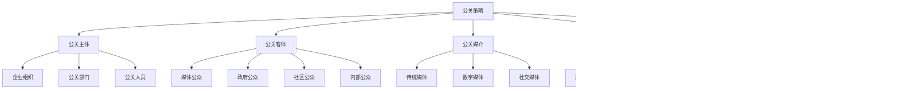
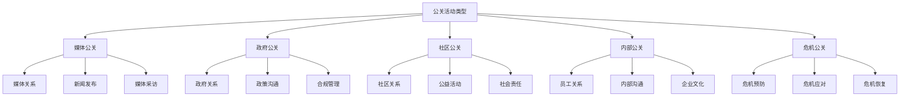
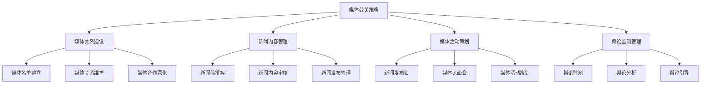
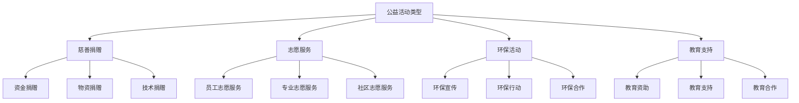
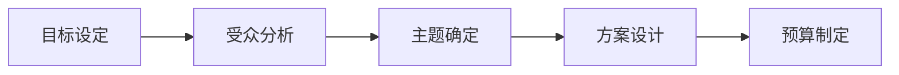
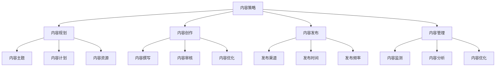
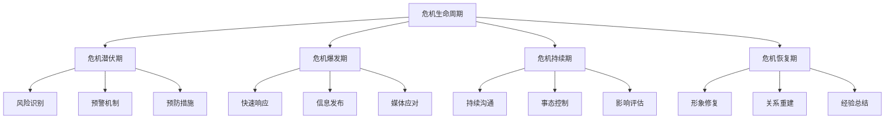

# 公关策略

## 公关策略概述

### 定义与本质
**公关策略**：通过建立和维护与公众的良好关系，塑造企业形象，提升企业声誉，实现企业目标的策略性活动。

### 公关要素模型

## 公关理论

### 公关理论发展
| 理论 | 代表人物 | 核心观点 | 应用价值 |
|------|----------|----------|----------|
| **双向对称理论** | 格鲁尼格 | 双向沟通、对称关系 | 现代公关基础 |
| **关系管理理论** | 莱丁汉姆 | 关系建立、维护、发展 | 关系营销基础 |
| **形象管理理论** | 博文 | 形象塑造、维护、修复 | 品牌形象管理 |
| **危机管理理论** | 希斯 | 危机预防、应对、恢复 | 危机公关基础 |

### 公关活动类型

### 公关目标层次
#### 1. 认知目标
- **知名度提升**：提高企业知名度
- **认知度改善**：改善企业认知
- **信息传递**：有效信息传递

#### 2. 态度目标
- **好感度提升**：提升企业好感度
- **信任度建立**：建立企业信任
- **支持度获得**：获得公众支持

#### 3. 行为目标
- **购买行为**：促进购买行为
- **推荐行为**：促进推荐行为
- **合作行为**：促进合作行为

## 公关策略类型

### 1. 媒体公关策略
#### 策略特征
- **媒体关系**：建立良好媒体关系
- **新闻发布**：有效新闻发布
- **媒体采访**：积极媒体采访
- **舆论引导**：引导舆论方向

#### 实施要点

### 2. 政府公关策略
#### 策略特征
- **政府关系**：建立良好政府关系
- **政策沟通**：有效政策沟通
- **合规管理**：合规经营管理
- **社会责任**：承担社会责任

#### 实施要点
- **政府关系建设**：建立政府关系
- **政策沟通**：有效政策沟通
- **合规管理**：合规经营管理
- **社会责任**：承担社会责任

### 3. 社区公关策略
#### 策略特征
- **社区关系**：建立社区关系
- **公益活动**：参与公益活动
- **社会责任**：承担社会责任
- **社区发展**：促进社区发展

#### 实施要点
- **社区关系建设**：建立社区关系
- **公益活动参与**：参与公益活动
- **社会责任承担**：承担社会责任
- **社区发展促进**：促进社区发展

### 4. 内部公关策略
#### 策略特征
- **员工关系**：建立员工关系
- **内部沟通**：有效内部沟通
- **企业文化**：建设企业文化
- **员工激励**：激励员工发展

#### 实施要点
- **员工关系建设**：建立员工关系
- **内部沟通**：有效内部沟通
- **企业文化建设**：建设企业文化
- **员工激励**：激励员工发展

### 5. 危机公关策略
#### 策略特征
- **危机预防**：预防危机发生
- **危机应对**：有效危机应对
- **危机恢复**：危机后恢复
- **声誉修复**：修复企业声誉

#### 实施要点
- **危机预防**：预防危机发生
- **危机应对**：有效危机应对
- **危机恢复**：危机后恢复
- **声誉修复**：修复企业声誉

## 公关活动策划

### 活动类型
#### 1. 新闻发布活动
| 活动类型 | 特点 | 适用场景 | 实施要点 |
|----------|------|----------|----------|
| **新闻发布会** | 正式、权威、影响力大 | 重大事件发布 | 媒体邀请、内容准备 |
| **媒体见面会** | 轻松、互动、关系建设 | 媒体关系维护 | 氛围营造、互动设计 |
| **媒体专访** | 深度、专业、个性化 | 深度报道需求 | 记者选择、内容准备 |

#### 2. 公益活动

#### 3. 企业活动
- **企业开放日**：企业形象展示
- **产品发布会**：产品推广发布
- **周年庆典**：企业庆典活动
- **行业会议**：行业交流活动

### 活动策划流程
#### 1. 策划准备

#### 2. 活动执行
- **活动准备**：活动前期准备
- **活动实施**：活动现场实施
- **活动监控**：活动过程监控
- **活动总结**：活动后期总结

#### 3. 效果评估
- **效果测量**：活动效果测量
- **数据分析**：活动数据分析
- **经验总结**：活动经验总结
- **改进建议**：活动改进建议

## 公关传播策略

### 传播渠道
#### 1. 传统媒体
- **报纸媒体**：权威性、可信度高
- **杂志媒体**：专业性、深度性强
- **广播媒体**：覆盖面广、时效性强
- **电视媒体**：影响力大、视觉冲击强

#### 2. 数字媒体
- **网络媒体**：传播速度快、互动性强
- **社交媒体**：传播范围广、参与度高
- **移动媒体**：便捷性、个性化强
- **视频媒体**：内容丰富、传播效果好

#### 3. 自有媒体
- **企业网站**：官方信息发布
- **企业内刊**：内部信息传播
- **企业宣传册**：企业形象展示
- **企业视频**：企业形象宣传

### 传播内容
#### 1. 内容类型
| 内容类型 | 特点 | 适用场景 | 传播效果 |
|----------|------|----------|----------|
| **新闻资讯** | 时效性、客观性 | 事件报道 | 信息传递 |
| **企业故事** | 情感性、故事性 | 形象塑造 | 情感连接 |
| **行业观点** | 专业性、权威性 | 思想领导 | 专业形象 |
| **社会责任** | 公益性、社会性 | 形象提升 | 社会认同 |

#### 2. 内容策略

## 危机公关管理

### 危机类型
#### 1. 危机分类
| 危机类型 | 特点 | 影响程度 | 应对策略 |
|----------|------|----------|----------|
| **产品质量危机** | 影响面广、危害性大 | 高 | 快速响应、产品召回 |
| **企业形象危机** | 影响声誉、长期影响 | 中 | 形象修复、声誉重建 |
| **财务危机** | 影响经营、资金链 | 高 | 财务透明、资金保障 |
| **法律危机** | 法律风险、合规问题 | 中 | 法律应对、合规管理 |

#### 2. 危机生命周期

### 危机应对策略
#### 1. 危机预防
- **风险识别**：识别潜在风险
- **预警机制**：建立预警机制
- **预防措施**：采取预防措施
- **应急预案**：制定应急预案

#### 2. 危机应对
- **快速响应**：快速响应危机
- **信息透明**：保持信息透明
- **媒体沟通**：有效媒体沟通
- **公众沟通**：积极公众沟通

#### 3. 危机恢复
- **形象修复**：修复企业形象
- **关系重建**：重建公众关系
- **经验总结**：总结危机经验
- **制度完善**：完善危机管理制度

## 公关效果评估

### 评估指标
#### 1. 认知指标
| 指标类型 | 具体指标 | 测量方法 | 评估意义 |
|----------|----------|----------|----------|
| **知名度指标** | 企业知名度、品牌知名度 | 问卷调查 | 认知效果评估 |
| **认知度指标** | 企业认知度、产品认知度 | 认知测试 | 认知深度评估 |
| **信息传递指标** | 信息到达率、信息理解度 | 信息测试 | 信息传递效果 |

#### 2. 态度指标
- **好感度指标**：企业好感度、品牌好感度
- **信任度指标**：企业信任度、品牌信任度
- **支持度指标**：公众支持度、政策支持度

#### 3. 行为指标
- **购买行为指标**：购买率、转化率
- **推荐行为指标**：推荐率、分享率
- **合作行为指标**：合作意向、合作行为

### 评估方法
#### 1. 定量评估
- **问卷调查**：公众态度调查
- **媒体监测**：媒体报道监测
- **数据分析**：公关数据分析
- **效果测量**：公关效果测量

#### 2. 定性评估
- **深度访谈**：深度访谈调研
- **焦点小组**：焦点小组讨论
- **专家评估**：专家评估分析
- **案例研究**：案例研究分析

## 公关策略案例

### 成功案例：苹果公关策略
#### 策略特点
- **媒体关系**：建立良好媒体关系
- **产品发布**：有效产品发布策略
- **危机应对**：有效危机应对
- **形象塑造**：成功形象塑造

#### 实施要点
- 建立媒体关系
- 有效产品发布
- 快速危机应对
- 持续形象塑造

#### 成功因素
- 强大的品牌影响力
- 有效的媒体关系
- 快速的反应能力
- 持续的形象建设

### 失败案例：公关策略失败
#### 问题分析
- 媒体关系不佳
- 危机应对不力
- 信息沟通不畅
- 形象管理不当

#### 改进建议
- 改善媒体关系
- 提升危机应对能力
- 加强信息沟通
- 完善形象管理

## 公关策略趋势

### 数字化趋势
#### 趋势特征
- **数字媒体**：数字媒体公关
- **社交媒体**：社交媒体公关
- **数据驱动**：数据驱动公关
- **实时沟通**：实时沟通公关

#### 实施要点
- 数字媒体策略
- 社交媒体管理
- 数据收集分析
- 实时沟通机制

### 整合营销趋势
#### 趋势特征
- **整合传播**：整合传播公关
- **全媒体**：全媒体公关
- **内容营销**：内容营销公关
- **关系营销**：关系营销公关

#### 实施要点
- 整合传播策略
- 全媒体覆盖
- 内容营销整合
- 关系营销深化

## 实践应用

### 公关策略制定步骤
1. **目标设定**：明确公关目标
2. **受众分析**：分析目标受众
3. **策略选择**：选择公关策略
4. **活动策划**：策划公关活动
5. **传播策略**：制定传播策略
6. **危机管理**：建立危机管理
7. **效果评估**：评估公关效果
8. **策略优化**：优化公关策略

### 公关策略最佳实践
- **关系导向**：以关系为导向
- **透明沟通**：保持透明沟通
- **快速响应**：快速响应能力
- **持续建设**：持续关系建设
- **危机预防**：有效危机预防

---

**相关链接**：
- [[01-广告策略|广告策略]]
- [[03-促销策略|促销策略]]
- [[04-渠道管理|渠道管理]]
- [[05-零售营销|零售营销]]
- [[03-营销理论框架/01-经典营销理论/01-4P营销理论|4P营销理论]]

