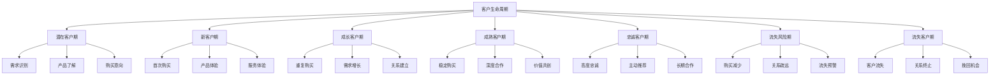
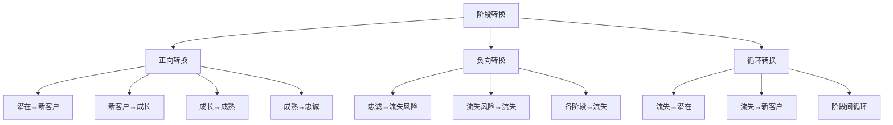
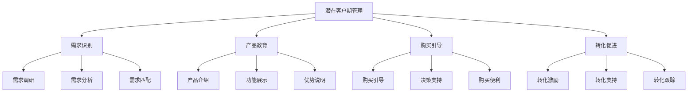
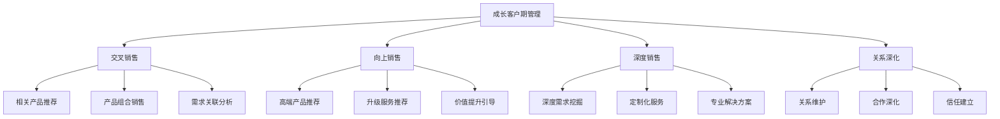
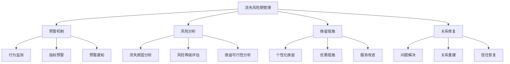
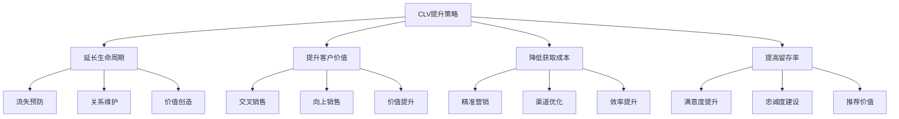

# 客户生命周期管理

## 客户生命周期概述

### 定义与本质
**客户生命周期管理**：基于客户从潜在客户到忠诚客户的全过程，通过差异化的策略和服务，最大化客户价值，延长客户生命周期的管理活动。

### 生命周期阶段

## 生命周期理论

### 理论发展
| 理论 | 代表人物 | 核心观点 | 应用价值 |
|------|----------|----------|----------|
| **客户生命周期理论** | 德怀尔 | 客户关系发展过程 | 生命周期管理基础 |
| **客户价值理论** | 伍德拉夫 | 客户价值创造过程 | 价值管理基础 |
| **客户忠诚理论** | 奥利弗 | 客户忠诚度建设 | 忠诚度管理基础 |
| **客户流失理论** | 赖克赫尔德 | 客户流失原因分析 | 流失预防基础 |

### 阶段特征分析
#### 1. 各阶段特征
| 阶段 | 特征 | 目标 | 策略重点 | 关键指标 |
|------|------|------|----------|----------|
| **潜在客户期** | 需求不明确、购买意向低 | 需求激发 | 市场教育、产品介绍 | 转化率 |
| **新客户期** | 首次购买、体验关键 | 满意度提升 | 产品体验、服务优化 | 满意度 |
| **成长客户期** | 重复购买、需求增长 | 价值提升 | 交叉销售、向上销售 | 购买频次 |
| **成熟客户期** | 稳定购买、深度合作 | 价值最大化 | 深度合作、价值共创 | 客户价值 |
| **忠诚客户期** | 高度忠诚、主动推荐 | 推荐价值 | 推荐激励、关系维护 | 推荐率 |
| **流失风险期** | 购买减少、关系疏远 | 流失预防 | 预警机制、挽留措施 | 流失率 |
| **流失客户期** | 客户流失、关系终止 | 客户挽回 | 挽回策略、关系重建 | 挽回率 |

#### 2. 阶段转换模型

## 生命周期管理策略

### 1. 潜在客户期管理
#### 管理目标
- **需求激发**：激发潜在客户需求
- **产品认知**：提升产品认知度
- **购买意向**：建立购买意向
- **转化促进**：促进客户转化

#### 管理策略

#### 实施要点
- **精准营销**：精准目标客户营销
- **内容营销**：有价值内容提供
- **体验营销**：产品体验机会
- **转化优化**：转化流程优化

### 2. 新客户期管理
#### 管理目标
- **满意度提升**：提升客户满意度
- **体验优化**：优化客户体验
- **关系建立**：建立客户关系
- **忠诚培养**：培养客户忠诚

#### 管理策略
- **欢迎流程**：新客户欢迎流程
- **产品指导**：产品使用指导
- **服务支持**：优质服务支持
- **反馈收集**：客户反馈收集

#### 实施要点
- **第一印象**：良好的第一印象
- **快速响应**：快速问题响应
- **个性化服务**：个性化服务提供
- **关系建立**：积极关系建立

### 3. 成长客户期管理
#### 管理目标
- **价值提升**：提升客户价值
- **需求扩展**：扩展客户需求
- **关系深化**：深化客户关系
- **合作加强**：加强客户合作

#### 管理策略

#### 实施要点
- **需求挖掘**：深度挖掘客户需求
- **产品推荐**：精准产品推荐
- **价值提升**：持续价值提升
- **关系维护**：积极关系维护

### 4. 成熟客户期管理
#### 管理目标
- **价值最大化**：最大化客户价值
- **深度合作**：深化客户合作
- **价值共创**：与客户价值共创
- **长期关系**：建立长期关系

#### 管理策略
- **战略合作**：建立战略合作关系
- **价值共创**：与客户价值共创
- **创新合作**：创新产品合作
- **长期规划**：长期合作规划

#### 实施要点
- **战略思维**：战略合作思维
- **价值共创**：共同价值创造
- **创新驱动**：创新驱动合作
- **长期视角**：长期关系视角

### 5. 忠诚客户期管理
#### 管理目标
- **忠诚维护**：维护客户忠诚
- **推荐价值**：发挥推荐价值
- **关系深化**：深化客户关系
- **价值扩展**：扩展客户价值

#### 管理策略
- **忠诚计划**：客户忠诚计划
- **推荐激励**：推荐激励措施
- **专属服务**：专属服务提供
- **关系维护**：积极关系维护

#### 实施要点
- **忠诚计划**：完善的忠诚计划
- **推荐机制**：有效的推荐机制
- **专属服务**：个性化专属服务
- **关系维护**：持续关系维护

### 6. 流失风险期管理
#### 管理目标
- **流失预警**：建立流失预警机制
- **风险识别**：识别流失风险
- **挽留措施**：实施挽留措施
- **关系修复**：修复客户关系

#### 管理策略

#### 实施要点
- **预警系统**：完善的预警系统
- **快速响应**：快速响应机制
- **个性化挽留**：个性化挽留策略
- **问题解决**：根本问题解决

### 7. 流失客户期管理
#### 管理目标
- **客户挽回**：挽回流失客户
- **关系重建**：重建客户关系
- **经验总结**：总结流失经验
- **预防改进**：预防措施改进

#### 管理策略
- **挽回策略**：客户挽回策略
- **关系重建**：客户关系重建
- **经验分析**：流失经验分析
- **预防改进**：预防措施改进

#### 实施要点
- **挽回机会**：识别挽回机会
- **挽回策略**：制定挽回策略
- **关系重建**：积极关系重建
- **经验总结**：总结改进经验

## 生命周期价值管理

### 客户生命周期价值（CLV）
#### 1. CLV计算模型
| 模型类型 | 计算方法 | 适用场景 | 优势 | 劣势 |
|----------|----------|----------|------|------|
| **简单模型** | 平均价值×生命周期 | 初步估算 | 简单易用 | 精度较低 |
| **RFM模型** | 最近购买、频次、金额 | 行为分析 | 行为导向 | 历史依赖 |
| **预测模型** | 机器学习预测 | 精准预测 | 精度较高 | 复杂度高 |
| **综合模型** | 多因素综合 | 全面分析 | 综合考虑 | 计算复杂 |

#### 2. CLV提升策略

### 价值管理实施
#### 1. 价值分析
- **价值评估**：客户价值评估
- **价值分层**：客户价值分层
- **价值趋势**：价值变化趋势
- **价值预测**：未来价值预测

#### 2. 价值策略
- **价值提升**：客户价值提升
- **价值保护**：高价值客户保护
- **价值开发**：潜在价值开发
- **价值优化**：价值结构优化

## 生命周期管理工具

### 管理工具
#### 1. 分析工具
- **客户画像**：客户画像分析
- **行为分析**：客户行为分析
- **价值分析**：客户价值分析
- **预测分析**：客户行为预测

#### 2. 管理工具
- **CRM系统**：客户关系管理系统
- **营销自动化**：营销自动化工具
- **客户服务**：客户服务系统
- **数据分析**：数据分析工具

#### 3. 监测工具
- **行为监测**：客户行为监测
- **满意度监测**：满意度监测
- **流失预警**：流失预警系统
- **效果评估**：管理效果评估

## 生命周期管理案例

### 成功案例：星巴克客户生命周期管理
#### 管理策略
- **会员体系**：完善的会员体系
- **个性化服务**：个性化服务提供
- **体验优化**：持续体验优化
- **关系维护**：积极关系维护

#### 实施要点
- 会员等级设计
- 个性化推荐
- 体验持续优化
- 关系积极维护

#### 成功因素
- 强大的品牌影响力
- 优质的产品体验
- 完善的会员体系
- 持续的服务创新

### 失败案例：生命周期管理失败
#### 问题分析
- 阶段识别不清
- 策略选择不当
- 执行管理不力
- 效果评估缺失

#### 改进建议
- 准确阶段识别
- 合理策略选择
- 有效执行管理
- 完善效果评估

## 生命周期管理趋势

### 数字化趋势
#### 趋势特征
- **数据驱动**：数据驱动管理
- **智能化**：智能化管理工具
- **实时化**：实时生命周期管理
- **个性化**：个性化管理策略

#### 实施要点
- 数据收集分析
- 智能化工具应用
- 实时监测管理
- 个性化策略制定

### 全渠道趋势
#### 趋势特征
- **全渠道整合**：全渠道客户整合
- **统一管理**：统一生命周期管理
- **数据共享**：渠道数据共享
- **体验一致**：一致的用户体验

#### 实施要点
- 全渠道数据整合
- 统一管理策略
- 数据共享机制
- 体验一致性保证

## 实践应用

### 生命周期管理实施步骤
1. **阶段识别**：识别客户生命周期阶段
2. **特征分析**：分析各阶段特征
3. **策略制定**：制定管理策略
4. **工具选择**：选择管理工具
5. **实施执行**：执行管理策略
6. **效果监测**：监测管理效果
7. **策略调整**：调整管理策略
8. **持续优化**：持续优化改进

### 生命周期管理最佳实践
- **客户中心**：以客户为中心
- **数据驱动**：数据驱动决策
- **个性化**：个性化管理策略
- **持续优化**：持续优化改进
- **价值导向**：价值创造导向

---

**相关链接**：
- [[01-客户关系管理|客户关系管理]]
- [[03-客户价值分析|客户价值分析]]
- [[04-客户忠诚度管理|客户忠诚度管理]]
- [[03-营销理论框架/02-战略营销理论/01-关系营销理论|关系营销理论]]
- [[06-营销效果评估/02-数据分析/01-营销数据分析|营销数据分析]]

