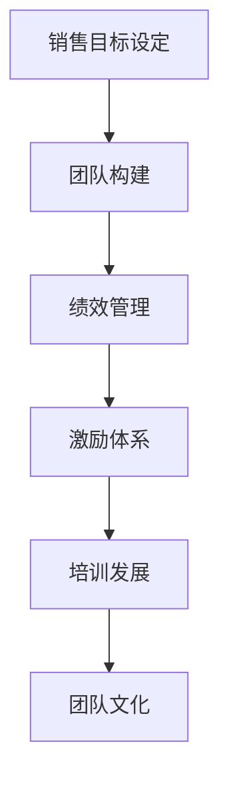
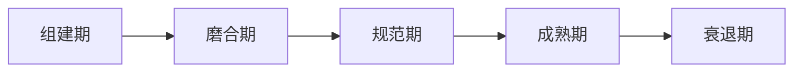
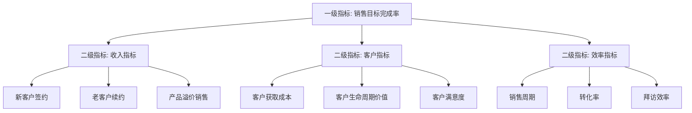
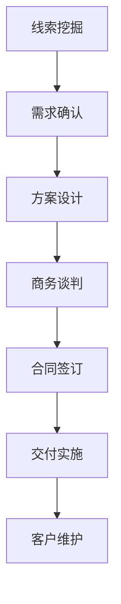

# 销售团队管理

## 📋 知识框架总览



---

## 🎯 核心理念

**销售团队管理** = 通过科学管理使销售团队效能最大化，实现企业商业目标的管理艺术。

**核心目标**：构建高效能、高执行力、可持续增长的销售团队

---

## 🏗️ 知识结构

### 第一层：认知基础

#### 1.1 销售团队管理原理

| 维度 | 核心概念 | 重要性 |
|------|----------|--------|
| **目标导向** | SMART目标设定原则 | ⭐⭐⭐ |
| **人员匹配** | 人岗匹配度 | ⭐⭐⭐ |
| **流程标准** | 销售流程标准化 | ⭐⭐ |
| **数据驱动** | 销售数据化管理 | ⭐⭐⭐ |

#### 1.2 团队发展阶段理论



**关键识别指标**：
- **组建期**：角色模糊，依赖性强
- **磨合期**：冲突频繁，生产力低
- **规范期**：流程明确，协作顺畅
- **成熟期**：高效运作，自我管理

---

### 第二层：理解深化

#### 2.1 销售团队组织架构

**职能型团队结构**
```
销售总监
├── 企业客户部
│   ├── 大客户经理
│   └── 客户经理
├── 中小企业部  
│   ├── 区域经理
│   └── 销售代表
└── 渠道发展部
    └── 渠道经理
```

#### 2.2 销售人员角色定位

| 角色 | 核心职责 | 成功标准 |
|------|----------|----------|
| **销售总监** | 战略规划、团队管理 | 业绩达成率 + 团队留存率 |
| **销售经理** | 目标分解、过程管控 | 团队业绩 + 人员培养 |
| **销售主管** | 一线管理、现场指导 | 销售效率 + 团队配合 |
| **销售代表** | 客户开发、订单落地 | 成交率 + 客户满意度 |

#### 2.3 销售绩效指标体系

**层级化指标设计**



---

### 第三层：应用实战

#### 3.1 团队激励体系构建

**多元化激励矩阵**

| 激励类型 | 短期激励 | 中期激励 | 长期激励 |
|----------|----------|----------|----------|
| **物质激励** | 销售提成、奖金 | 季度奖金、股权 | 期权激励、利润分享 |
| **精神激励** | 表扬、表彰 | 晋升平台、授权 | 股权激励、合伙人 |
| **发展激励** | 培训机会 | 轮岗锻炼、项目 | 管理通道、专家通道 |

#### 3.2 销售培训体系设计

**4R培训模型**

```mermaid
graph LR
    A[Relevance 相关性] --> B[Reality 实用性]
    B] --> C[Repetition 重复性]
    C --> D[Reinforcement 巩固性]
```

**培训内容体系**：
1. **基础技能**：销售话术、产品知识
2. **进阶能力**：客户洞察、提案技巧  
3. **高级策略**：谈判技巧、团队管理
4. **持续发展**：行业趋势、商业模式

#### 3.3 销售流程管理

**销售漏斗管理**



**关键控制点**：
- **第一阶段**：线索质量筛查（40%淘汰率）
- **第二阶段**：方案匹配合规性检查
- **第三阶段**：商务条件风险控制
- **第四阶段**：合同执行质量监控

---

## 🎯 刻意练习计划

### 练习1：团队诊断分析
**任务**：分析现有销售团队结构和效能
**输出**：团队现状诊断报告
**评估**：数据准确性 + 分析深度

### 练习2：激励方案设计  
**任务**：针对不同层级设计差异化激励方案
**输出**：激励机制方案书
**评估**：可操作性 + 激励效果

### 练习3：培训项目开发
**任务**：设计一个完整的产品培训课程
**输出**：培训内容和交付方案
**评估**：内容质量 + 培训效果

---

## 🔗 知识链接

**相关联链接**：
- [[01-B2B营销策略]] - B2B营销理论基础
- [[02-企业采购行为分析]] - 客户决策行为洞察
- [[04-企业客户开发]] - 客户开发实践应用
- [[05-客户关系维护]] - 长期关系管理策略

**进阶学习路径**：
1. [[03-营销理论框架/02-战略营销理论/01-STP理论]] - 市场细分定位
2. [[06-营销效果评估/01-营销指标/01-KPI指标体系]] - 绩效指标设计
3. [[09-营销工具资源/01-营销工具/01-市场调研工具]] - 工具应用实践

---

## 📚 学习检查清单

**基础认知检查**：
- [ ] 理解销售团队管理的核心目标
- [ ] 掌握团队发展的五个阶段特征
- [ ] 能够识别不同角色的职责定位

**深化理解检查**：
- [ ] 能够设计销售组织结构
- [ ] 掌握绩效指标的层级设计原理
- [ ] 理解激励机制的多维度组合

**应用实践检查**：
- [ ] 能够诊断团队现状和问题
- [ ] 能够设计激励和培训方案
- [ ] 能够优化销售流程管理效率

**知识整合检查**：
- [ ] 能够将销售管理与其他营销模块关联
- [ ] 能够在实际工作中应用所学方法论
- [ ] 能够持续改进和完善管理体系
