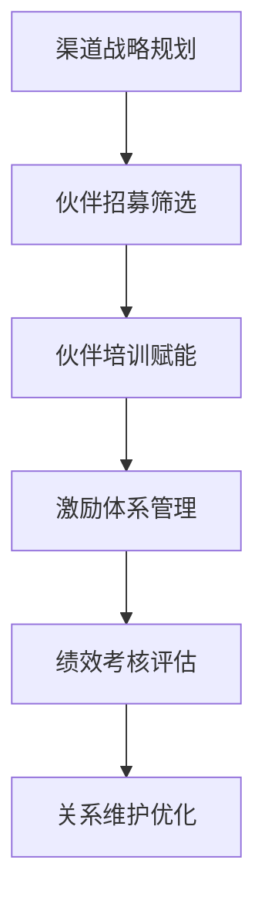
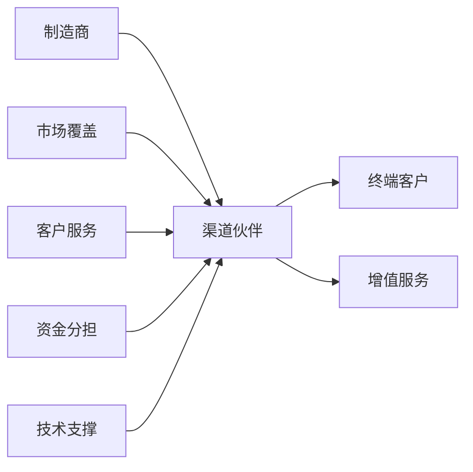
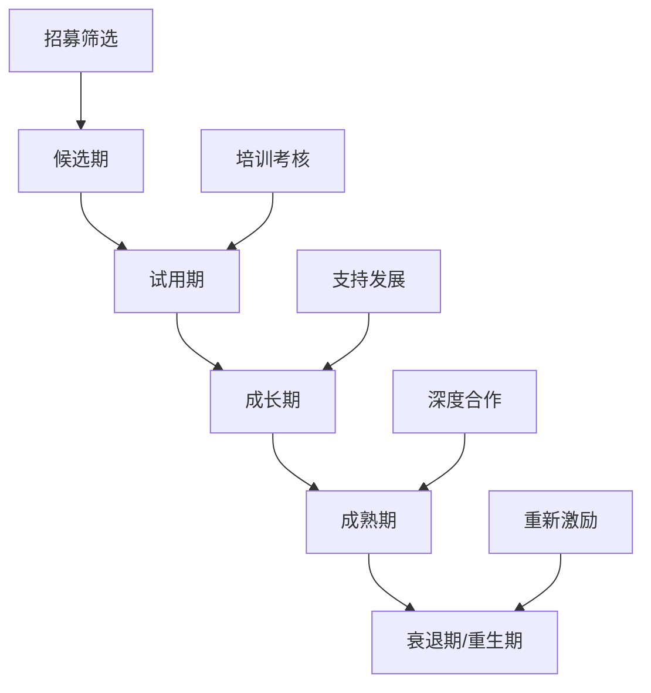
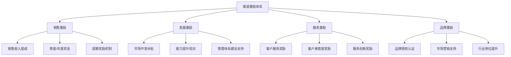
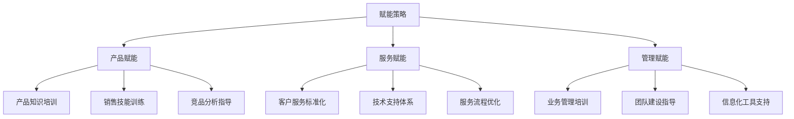
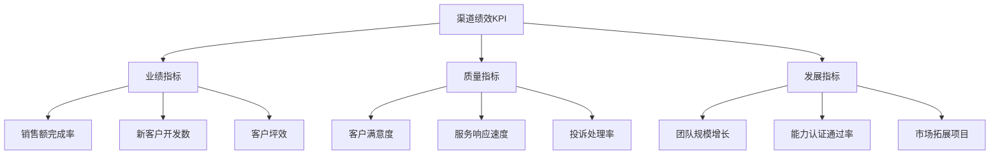

# 渠道伙伴管理

## 📋 知识框架总览

---

## 🎯 核心理念

**渠道伙伴管理** = 通过建立和管理合作伙伴网络，实现市场覆盖和销售目标最大化的管理体系。

**核心价值**：渠道伙伴是企业销售力的延伸，高质量渠道管理能够10倍放大市场影响力

---

## 🏗️ 知识结构

### 第一层：认知基础

#### 1.1 渠道伙伴类型分析

| 伙伴类型 | 特点 | 职责范围 | 合作模式 |
|----------|------|----------|----------|
| **代理商** | 独立经营 | 区域销售+客户服务 | 佣金分成 |
| **经销商** | 自有库存 | 库存管理+终端销售 | 差价利润 |
| **系统集成商** | 技术能力 | 方案整合+项目实施 | 项目分成 |
| **咨询顾问** | 专业影响 | 需求挖掘+解决方案 | 服务费分成 |

#### 1.2 渠道价值创造模式

**价值创造维度**：
- **市场扩展**：伙伴的本地化市场能力
- **客户服务**：就近响应和专业支持
- **风险分担**：库存和资金压力分担
- **技术增值**：行业解决方案整合

---

### 第二层：理解深化

#### 2.1 渠道伙伴生命周期管理

**伙伴发展阶段模型**

**各阶段管理重点**：

| 阶段 | 管理目标 | 关键任务 | 成功指标 |
|------|----------|----------|----------|
| **候选期** | 精准筛选 | 资格审查+实地考察 | 匹配度评估 |
| **试用期** | 快速上手 | 产品培训+销售支持 | 首次成单 |
| **成长期** | 能力建设 | 技能提升+市场开发 | 业绩增长率 |
| **成熟期** | 深度合作 | 战略合作+共同发展 | 市场份额+客户深度 |
| **衰退期** | 重新激活 | 问题诊断+改进计划 | 业绩回升率 |

#### 2.2 渠道伙伴筛选评估

**综合评估矩阵**

| 评估维度 | 权重 | 评估标准 | 评分细则 |
|----------|------|----------|----------|
| **财务实力** | 25% | 资金状况+盈利能力 | A级：资产>500万 B级：200-500万 |
| **市场能力** | 30% | 客户资源+市场覆盖 | A级：500+客户 B级：200-500客户 |
| **服务能力** | 20% | 团队配置+服务标准 | A级：专业团队+标准化服务 |
| **合作意愿** | 15% | 投入承诺+发展计划 | A级：战略投入+5年规划 |
| **行业经验** | 10% | 行业背景+项目经验 | A级：5年+行业经验 |

#### 2.3 渠道激励体系设计

**多元化激励组合**

---

### 第三层：应用实战

#### 3.1 渠道伙伴赋能体系

**三层赋能模型**

#### 3.2 渠道冲突管控

**冲突预防和解决机制**

| 冲突类型 | 诱发因素 | 预防措施 | 解决方案 |
|----------|----------|----------|----------|
| **价格冲突** | 价格不统一 | 价格政策标准化 | 统一指导价+差异化区域政策 |
| **区域冲突** | 边界模糊 | 明确区域划分 | 重新划分区域+补偿机制 |
| **产品冲突** | 产品分配不均 | 公平分配原则 | 轮换机制+绩效调整 |
| **客户冲突** | 客户归属不清 | 首报保护制度 | 客户备案+合作分成 |

#### 3.3 渠道绩效管理

**KPI指标体系**

---

## 🎯 刻意练习计划

### 练习1：渠道伙伴筛选方案
**任务**：制定行业渠道伙伴招募和筛选标准
**输出**：筛选流程+评估标准+操作手册
**评估**：标准合理性+执行可行性

### 练习2：渠道激励体系设计
**任务**：设计差异化渠道激励方案
**输出**：激励政策+实施计划+效果预期
**评估**：激励有效性+成本控制

### 练习3：渠道冲突处理预案
**任务**：制定渠道冲突预防和解决机制
**输出**：冲突管理流程+处理标准+升级机制
**评估**：机制完整性+处理公平性

---

## 🧩 实战案例分析

### 案例：华为渠道伙伴管理成功之道

**华为渠道管理核心策略**：

1. **分层分类管理**
   - 金牌伙伴：年销售额>1亿，获得核心支持
   - 银牌伙伴：年销售额>5000万，获得重点支持  
   - 铜牌伙伴：年销售额>1000万，获得基础支持

2. **赋能式管理**
   - 技术培训：华为大学免费培训
   - 产品销售：工程师认证和授权
   - 服务体系：标准服务和流程

3. **激励与约束并重**
   - 高激励：高额返点+增值服务机会
   - 严约束：违规严惩+退出机制

**关键成功要素**：
- 完善的伙伴分级管理体系
- 持续的赋能和能力建设
- 合理的激励约束平衡机制
- 深度的战略合作关系

---

## 🔗 知识链接

**核心关联模块**：
- [[01-B2B营销策略]] - 渠道战略制定基础
- [[02-企业采购行为分析]] - 渠道销售对象理解
- [[04-企业客户开发]] - 渠道客户开发协同
- [[04-客户关系维护]] - 渠道客户关系延续

**技能提升路径**：
1. [[03-营销理论框架/01-经典营销理论/01-4P营销理论]] - 渠道理论基础
2. [[04-营销策略制定/02-竞争策略/04-竞争定位策略]] - 渠道竞争策略
3. [[05-营销执行实施/02-传统营销/04-渠道管理]] - 渠道管理实务
4. [[06-营销效果评估/01-营销指标/01-KPI指标体系]] - 渠道绩效考核

---

## 📚 学习检查清单

**基础认知检查**：
- [ ] 理解渠道伙伴管理的核心价值和管理目标
- [ ] 掌握不同类型渠道伙伴的特点和合作模式
- [ ] 能够识别优质渠道伙伴的关键特征

**深化理解检查**：
- [ ] 能够制定系统的渠道伙伴生命周期管理策略
- [ ] 掌握渠道伙伴筛选和评估的方法工具
- [ ] 理解多元化渠道激励体系的设计原理

**应用实践检查**：
- [ ] 能够建立完善的渠道伙伴赋能体系
- [ ] 能够有效预防和解决渠道冲突问题
- [ ] 能够设计科学的渠道绩效管理机制

**知识整合检查**：
- [ ] 能够将渠道管理与整体营销战略有效整合
- [ ] 能够在实际业务中持续优化渠道管理效果
- [ ] 能够建立可持续的渠道伙伴发展生态
