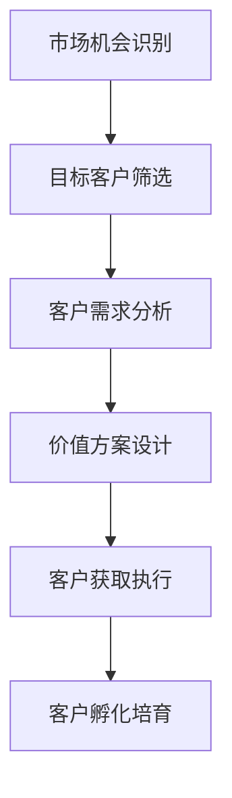
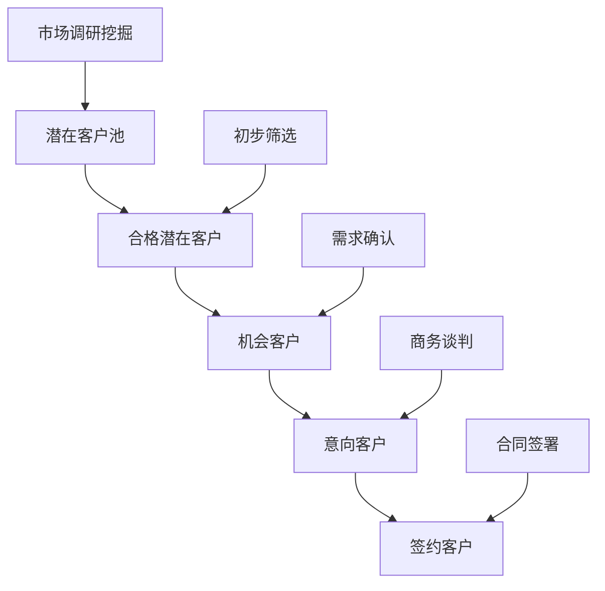
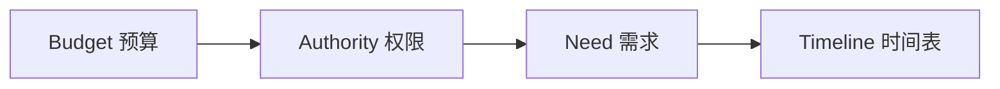
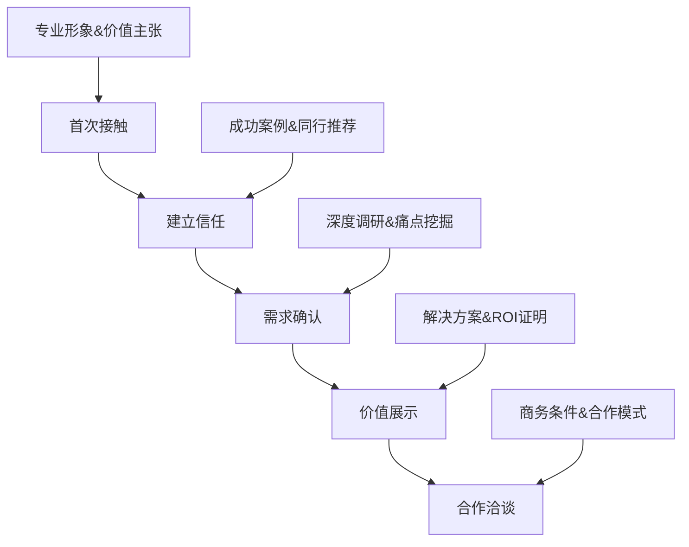

# 企业客户开发

## 📋 知识框架总览



---

## 🎯 核心理念

**企业客户开发** = 系统性发现、接触、培育企业未来客户的过程，是销售业绩增长的源头活水。

**核心价值**：企业客户开发质量直接影响销售成交概率和客户生命周期价值

---

## 🏗️ 知识结构

### 第一层：认知基础

#### 1.1 企业客户特征分析

| 客户类型 | 规模特征 | 决策特征 | 开发策略 |
|----------|----------|----------|----------|
| **大型企业** | 员工>1000人 | 复杂集体决策 | 关系建立+价值证明 |
| **中型企业** | 员工200-1000人 | 关键人决策 | 需求挖掘+方案匹配 |
| **小型企业** | 员工<200人 | 老板决策 | 效率引导+成本控制 |

#### 1.2 客户开发漏斗模型



**转化率行业基准**：
- 潜在→合格：20-30%
- 合格→机会：15-25%
- 机会→意向：10-20%
- 意向→签约：30-50%

---

### 第二层：理解深化

#### 2.1 企业客户识别体系

**多维度客户筛查矩阵**

| 评估维度 | 权重 | 评分标准 | 筛选条件 |
|----------|------|----------|----------|
| **预算能力** | 30% | 年收入规模 | >500万 |
| **需求匹配** | 25% | 业务契合度 | 匹配度≥70% |
| **决策能力** | 20% | 采购权限 | 有自主采购权 |
| **时间窗口** | 15% | 项目时机 | 6个月内决策 |
| **关系基础** | 10% | 现有关系 | 有内部联系人 |

#### 2.2 客户需求洞察方法

**BANT分析法**



**需求深挖技巧**：
1. **表面需求**：客户直接表达的需求
2. **深层需求**：隐含的真实动机
3. **潜在需求**：未来可能的需求
4. **紧急需求**：短期必须解决的需求

#### 2.3 客户开发渠道矩阵

**多渠道布局策略**

| 渠道类型 | 获客成本 | 转换质量 | 使用场景 |
|----------|----------|----------|----------|
| **线上推广** | 高 | 中 | 品牌建设+线索收集 |
| **电话营销** | 中 | 低 | 大范围快速筛选 |
| **内容营销** | 低 | 高 | 专业形象建立 |
| **线下活动** | 高 | 高 | 深度关系建立 |
| **转介绍** | 极低 | 极高 | 信任关系利用 |

---

### 第三层：应用实战

#### 3.1 客户接触策略设计

**分层接触模型**



#### 3.2 客户价值方案设计

**价值主张画布**

```
客户画像：中型制造企业管理层
核心任务：提升生产效率、降低成本
痛点需求：设备维护成本高、生产停机时间长
价值方案：智能化设备管理系统，降低维护成本30%，减少停机时间40%
差异化优势：AI预测性维护、行业成功经验
```

#### 3.3 客户开发执行管理

**5W1H执行框架**

| 环节 | 内容要求 | 执行标准 | 检查要点 |
|------|----------|----------|----------|
| **Who** | 确定目标客户 | 符合客户画像 | 预算+需求+权限 |
| **What** | 制定价值方案 | 解决核心痛点 | 方案匹配度 |
| **When** | 规划接触时机 | 项目关键节点 | 时间紧迫性 |
| **Where** | 选择接触场所 | 客户办公室/公司 | 环境影响评估 |
| **Why** | 明确合作理由 | 价值驱动动机 | 说服力强度 |
| **How** | 设计接触方式 | 个性化定制 | 执行可操作性 |

---

## 🎯 刻意练习计划

### 练习1：目标客户画像设计
**任务**：针对公司产品设计3个细分客户画像
**输出**：客户画像文档+筛选条件
**评估**：画像准确性+可操作性

### 练习2：客户开发方案设计
**任务**：为一个具体行业设计完整的客户开发方案
**输出**：开发策略+执行计划+监控指标
**评估**：方案完整性+执行可行性

### 练习3：客户价值计算模型
**任务**：建立客户价值评估和ROI计算模型
**输出**：价值评估工具+ROI计算表
**评估**：模型准确性+实用性

---

## 🧩 实战案例分析

### 案例：CRM系统面向中小企业客户开发

**挑战**：中小企业对CRM系统需求模糊，预算有限

**解决方案**：
1. **客户细分**：按行业垂直细分为制造业、服务业、零售业
2. **痛点挖掘**：客户流失、销售效率低、客户管理混乱
3. **价值定位**：以"提效增收"为核心，ROI导向营销
4. **接触策略**：免费试用+成功案例+成本对比

**关键成功因素**：
- 针对性的痛点解决方案
- 清晰的ROI计算方法
- 行业标准化产品配置
- 快速的实施交付能力

---

## 🔗 知识链接

**核心关联模块**：
- [[01-B2B营销策略]] - 客户开发战略基础
- [[02-企业采购行为分析]] - 客户决策行为理解
- [[03-销售团队管理]] - 客户开发团队管理
- [[04-客户关系维护]] - 客户开发后的关系延续

**技能提升路径**：
1. [[01-营销总览/01-营销知识地图]] - 整体知识体系认知
2. [[04-营销策略制定/01-市场分析/01-市场调研方法]] - 市场研究技能
3. [[04-营销策略制定/03-品牌策略/01-品牌定位策略]] - 品牌价值定位
4. [[06-营销效果评估/01-营销指标/01-KPI指标体系]] - 效果评估体系

---

## 📚 学习检查清单

**基础认知检查**：
- [ ] 理解企业客户开发的核心流程和价值
- [ ] 掌握不同规模客户的决策特征
- [ ] 能够识别优质的潜在客户

**深化理解检查**：
- [ ] 能够运用多维度客户筛查工具
- [ ] 掌握客户需求洞察和深挖技巧
- [ ] 理解不同渠道的优劣势和适用场景

**应用实践检查**：
- [ ] 能够设计系统性的客户接触策略
- [ ] 能够为客户定制价值方案
- [ ] 能够完整执行客户开发流程

**知识整合检查**：
- [ ] 能够将客户开发与其他销售环节有效衔接
- [ ] 能够在实际业务中持续优化开发效果
- [ ] 能够建立完整的客户开发管理体系
