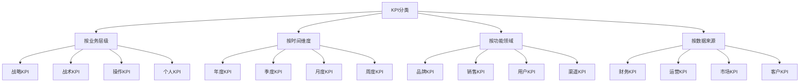
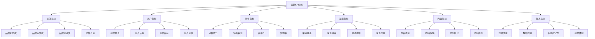
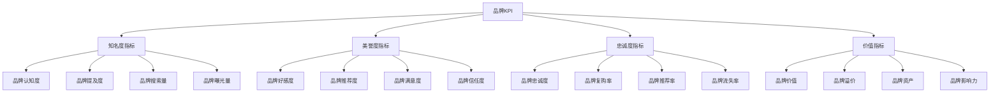
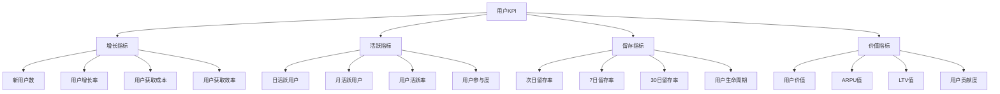
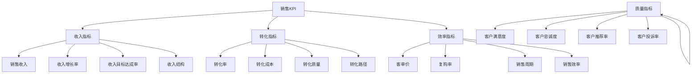
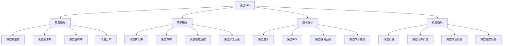
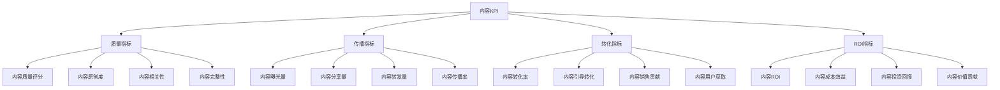
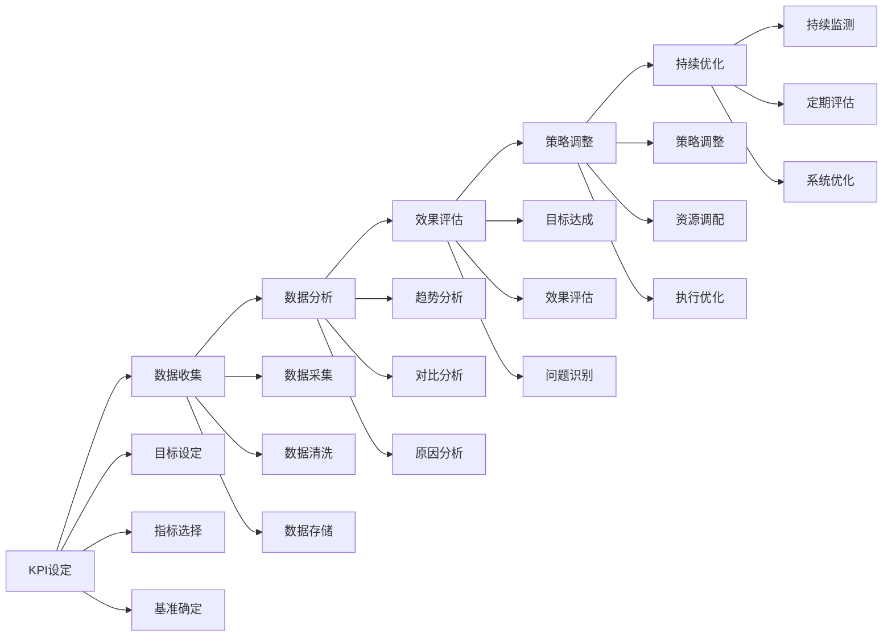

# KPI指标体系

## KPI概述

### 定义
**KPI（Key Performance Indicator）**：关键绩效指标，用于衡量营销活动效果和业务目标达成情况的核心指标。

### 价值
| 价值 | 内容 | 意义 |
|------|------|------|
| **目标导向** | 明确营销目标 | 方向清晰、重点突出 |
| **效果量化** | 量化营销效果 | 客观评估、科学决策 |
| **过程监控** | 监控营销过程 | 及时发现问题、快速调整 |
| **持续改进** | 推动持续改进 | 效果提升、策略优化 |

### 特点
| 特点 | 内容 | 要求 |
|------|------|------|
| **关键性** | 反映关键业务 | 核心指标、重点监控 |
| **可测量** | 能够量化测量 | 数据可得、指标明确 |
| **可达成** | 目标可实现 | 合理设定、现实可行 |
| **相关性** | 与业务相关 | 业务导向、价值关联 |

### 分类

## 营销KPI体系

### 体系架构

### 核心指标
| 指标类别 | 核心指标 | 计算方法 | 业务意义 |
|----------|----------|----------|----------|
| **品牌指标** | 品牌知名度 | 品牌提及数/总提及数 | 品牌影响力 |
| **用户指标** | 用户增长率 | (新用户-流失用户)/期初用户 | 用户规模增长 |
| **销售指标** | 销售转化率 | 转化数/访问数 | 销售效率 |
| **渠道指标** | 渠道ROI | (收入-成本)/成本 | 渠道投资回报 |

## 品牌KPI

### 品牌指标

### 测量方法
| 指标 | 测量方法 | 数据来源 | 频率 |
|------|----------|----------|------|
| **品牌认知度** | 品牌调研、问卷 | 市场调研 | 季度 |
| **品牌提及度** | 社交媒体监测 | 社交媒体 | 月度 |
| **品牌搜索量** | 搜索引擎数据 | 搜索引擎 | 周度 |
| **品牌曝光量** | 媒体监测 | 媒体数据 | 日度 |

### 目标设定
| 指标 | 目标类型 | 设定原则 | 示例 |
|------|----------|----------|------|
| **品牌认知度** | 提升目标 | 基于现状提升 | 从30%提升到50% |
| **品牌好感度** | 维持目标 | 保持现有水平 | 维持在80%以上 |
| **品牌忠诚度** | 增长目标 | 持续增长 | 年增长10% |
| **品牌价值** | 价值目标 | 价值最大化 | 品牌价值增长20% |

## 用户KPI

### 用户指标

### 关键指标
| 指标 | 定义 | 计算方法 | 业务价值 |
|------|------|----------|----------|
| **DAU** | 日活跃用户数 | 每日活跃用户数 | 用户活跃度 |
| **MAU** | 月活跃用户数 | 每月活跃用户数 | 用户规模 |
| **留存率** | 用户留存比例 | 留存用户/新增用户 | 用户粘性 |
| **ARPU** | 平均每用户收入 | 总收入/用户数 | 用户价值 |

### 用户细分
| 细分维度 | 指标类型 | 应用场景 | 优化方向 |
|----------|----------|----------|----------|
| **新用户** | 获取成本、转化率 | 用户获取 | 降低获取成本 |
| **活跃用户** | 活跃度、参与度 | 用户运营 | 提升活跃度 |
| **流失用户** | 流失率、流失原因 | 用户挽回 | 减少流失率 |
| **高价值用户** | 价值贡献、忠诚度 | 用户维护 | 提升用户价值 |

## 销售KPI

### 销售指标

### 核心指标
| 指标 | 定义 | 计算方法 | 优化目标 |
|------|------|----------|----------|
| **转化率** | 转化用户比例 | 转化数/访问数 | 提升转化率 |
| **客单价** | 平均订单金额 | 总收入/订单数 | 提升客单价 |
| **复购率** | 重复购买比例 | 复购用户/总用户 | 提升复购率 |
| **ROI** | 投资回报率 | (收入-成本)/成本 | 提升ROI |

### 销售漏斗
| 阶段 | 指标 | 目标 | 优化策略 |
|------|------|------|----------|
| **认知阶段** | 曝光量、点击率 | 提升曝光 | 内容优化、渠道拓展 |
| **兴趣阶段** | 访问量、停留时间 | 提升兴趣 | 页面优化、内容吸引 |
| **考虑阶段** | 咨询量、对比率 | 提升考虑 | 产品展示、价值传递 |
| **购买阶段** | 转化率、客单价 | 提升转化 | 购买流程、价格策略 |

## 渠道KPI

### 渠道指标

### 渠道评估
| 评估维度 | 指标 | 权重 | 评估方法 |
|----------|------|------|----------|
| **覆盖能力** | 覆盖范围、触达率 | 25% | 定量分析 |
| **转化效率** | 转化率、转化成本 | 30% | 效果分析 |
| **成本效益** | ROI、成本控制 | 25% | 财务分析 |
| **质量水平** | 用户质量、内容质量 | 20% | 质量评估 |

### 渠道优化
| 优化方向 | 策略 | 方法 | 预期效果 |
|----------|------|------|----------|
| **效率提升** | 转化优化 | A/B测试、流程优化 | 转化率提升20% |
| **成本控制** | 成本优化 | 预算调整、资源优化 | 成本降低15% |
| **质量改善** | 质量提升 | 内容优化、服务提升 | 质量评分提升10% |
| **覆盖扩展** | 渠道拓展 | 新渠道开发、合作拓展 | 覆盖范围扩大30% |

## 内容KPI

### 内容指标

### 内容评估
| 评估维度 | 指标 | 计算方法 | 优化方向 |
|----------|------|----------|----------|
| **内容质量** | 质量评分 | 专家评分+用户评分 | 提升内容质量 |
| **传播效果** | 传播率 | 分享数/曝光数 | 提升传播效果 |
| **转化效果** | 转化率 | 转化数/访问数 | 提升转化效果 |
| **ROI效果** | 内容ROI | (收入-成本)/成本 | 提升内容ROI |

### 内容优化
| 优化策略 | 方法 | 工具 | 效果 |
|----------|------|------|------|
| **质量优化** | 内容审核、质量提升 | 内容管理系统 | 质量评分提升 |
| **传播优化** | 传播策略、渠道优化 | 社交媒体工具 | 传播率提升 |
| **转化优化** | 转化路径、CTA优化 | 转化分析工具 | 转化率提升 |
| **ROI优化** | 成本控制、效果提升 | 数据分析工具 | ROI提升 |

## KPI管理

### 管理流程

### 管理原则
| 原则 | 内容 | 要求 |
|------|------|------|
| **SMART原则** | 具体、可测量、可达成、相关、时限 | 目标明确、指标合理 |
| **平衡原则** | 短期与长期、数量与质量 | 平衡发展、全面考虑 |
| **动态原则** | 根据变化调整 | 灵活调整、及时响应 |
| **透明原则** | 信息公开透明 | 数据透明、过程透明 |

### 管理工具
| 工具类型 | 工具名称 | 功能 | 应用场景 |
|----------|----------|------|----------|
| **数据收集** | Google Analytics、百度统计 | 数据采集、分析 | 网站分析、用户行为 |
| **数据可视化** | Tableau、Power BI | 数据可视化、报表 | 数据展示、决策支持 |
| **项目管理** | 项目管理工具 | 目标管理、进度跟踪 | 项目执行、团队协作 |
| **绩效管理** | 绩效管理系统 | 绩效评估、考核 | 员工绩效、团队管理 |

## KPI应用实践

### 应用步骤
1. **目标设定**：明确营销目标和业务目标
2. **指标选择**：选择关键绩效指标
3. **基准确定**：确定指标基准和目标值
4. **数据收集**：建立数据收集体系
5. **效果监测**：持续监测指标变化
6. **分析评估**：分析指标变化原因
7. **策略调整**：根据分析结果调整策略
8. **持续优化**：持续优化KPI体系

### 最佳实践
| 实践 | 内容 | 建议 |
|------|------|------|
| **指标精简** | 选择核心指标 | 避免指标过多、重点突出 |
| **数据质量** | 确保数据质量 | 数据准确、及时、完整 |
| **定期评估** | 定期评估效果 | 月度评估、季度调整 |
| **团队协作** | 团队协作管理 | 明确责任、协同配合 |

### 注意事项
- **指标选择**：选择与业务目标相关的核心指标
- **目标设定**：设定合理、可达成的目标值
- **数据质量**：确保数据的准确性和及时性
- **动态调整**：根据业务变化动态调整指标
- **团队共识**：确保团队对指标的理解和共识

---

**相关链接**：
- [[02-ROI计算方法|ROI计算方法]]
- [[03-营销效果评估|营销效果评估]]
- [[04-营销预算管理|营销预算管理]]
- [[01-营销数据分析|营销数据分析]]
