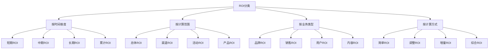
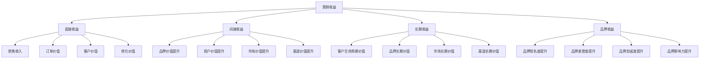
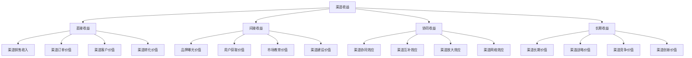
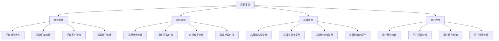

# ROI计算方法

## ROI概述

### 定义
**ROI（Return on Investment）**：投资回报率，衡量营销投资所产生的回报与投资成本的比率，是评估营销效果的重要财务指标。

### 价值
| 价值 | 内容 | 意义 |
|------|------|------|
| **投资评估** | 评估营销投资效果 | 投资决策支持 |
| **效果量化** | 量化营销投资回报 | 效果客观评估 |
| **资源优化** | 优化营销资源配置 | 资源效率提升 |
| **决策支持** | 支持营销决策制定 | 科学决策依据 |

### 特点
| 特点 | 内容 | 优势 |
|------|------|------|
| **量化性** | 用数字衡量效果 | 客观、准确 |
| **可比性** | 不同项目可比较 | 便于选择 |
| **综合性** | 综合考虑投入产出 | 全面评估 |
| **实用性** | 直接指导决策 | 决策支持 |

### 分类


## ROI计算方法

### 基本公式
```mermaid
graph TD
    A[ROI计算公式] --> B[基本公式]
    A --> C[调整公式]
    A --> D[增量公式]
    A --> E[综合公式]
    
    B --> B1[ROI = (收益-成本)/成本×100%]
    B --> B2[ROI = 收益/成本-1]
    B --> B3[ROI = 净收益/投资成本×100%]
    
    C --> C1[调整ROI = (收益-成本-机会成本)/成本×100%]
    C --> C2[调整ROI = (收益-成本-风险成本)/成本×100%]
    
    D --> D1[增量ROI = (增量收益-增量成本)/增量成本×100%]
    D --> D2[增量ROI = 增量净收益/增量投资×100%]
    
    E --> E1[综合ROI = Σ(各项目ROI×权重)]
    E --> E2[综合ROI = 总收益/总成本×100%]
```

### 计算公式
| 公式类型 | 计算公式 | 适用场景 | 特点 |
|----------|----------|----------|------|
| **基本ROI** | ROI = (收益-成本)/成本×100% | 简单项目评估 | 计算简单、理解容易 |
| **调整ROI** | ROI = (收益-成本-调整项)/成本×100% | 复杂项目评估 | 考虑更多因素 |
| **增量ROI** | ROI = (增量收益-增量成本)/增量成本×100% | 增量投资评估 | 评估增量效果 |
| **综合ROI** | ROI = Σ(各项目ROI×权重) | 多项目评估 | 综合评估效果 |

### 计算要素
| 要素 | 内容 | 计算方法 | 注意事项 |
|------|------|----------|----------|
| **收益** | 营销活动产生的收益 | 销售收入、品牌价值提升 | 准确计量、时间匹配 |
| **成本** | 营销活动的总成本 | 直接成本+间接成本 | 全面计算、避免遗漏 |
| **时间** | 计算的时间周期 | 活动周期、影响周期 | 时间一致、周期合理 |
| **基准** | 对比的基准值 | 历史数据、行业标准 | 基准合理、可比性强 |

## 营销ROI计算

### 营销收益计算


### 营销成本计算
| 成本类型 | 内容 | 计算方法 | 包含项目 |
|----------|------|----------|----------|
| **直接成本** | 直接营销成本 | 广告费+推广费+活动费 | 广告投放、内容制作、活动执行 |
| **间接成本** | 间接营销成本 | 人力成本+管理成本+系统成本 | 人员工资、管理费用、系统费用 |
| **机会成本** | 机会成本 | 其他投资机会的收益 | 资金占用、时间成本 |
| **风险成本** | 风险成本 | 潜在风险损失 | 市场风险、操作风险 |

### 营销ROI计算示例
| 项目 | 收益(万元) | 成本(万元) | ROI | 评估 |
|------|------------|------------|-----|------|
| **数字广告** | 100 | 20 | 400% | 优秀 |
| **内容营销** | 80 | 15 | 433% | 优秀 |
| **社交媒体** | 60 | 12 | 400% | 优秀 |
| **邮件营销** | 40 | 8 | 400% | 优秀 |

## 渠道ROI计算

### 渠道收益分析


### 渠道成本分析
| 成本类型 | 内容 | 计算方法 | 包含项目 |
|----------|------|----------|----------|
| **渠道建设成本** | 渠道开发成本 | 开发费用+培训费用 | 渠道开发、人员培训 |
| **渠道运营成本** | 渠道运营成本 | 运营费用+维护费用 | 日常运营、系统维护 |
| **渠道推广成本** | 渠道推广成本 | 推广费用+活动费用 | 渠道推广、促销活动 |
| **渠道管理成本** | 渠道管理成本 | 管理费用+监督费用 | 渠道管理、质量监督 |

### 渠道ROI对比
| 渠道 | 收益(万元) | 成本(万元) | ROI | 排名 | 建议 |
|------|------------|------------|-----|------|------|
| **搜索引擎** | 200 | 40 | 400% | 1 | 加大投入 |
| **社交媒体** | 150 | 35 | 329% | 2 | 保持投入 |
| **内容营销** | 120 | 30 | 300% | 3 | 优化投入 |
| **邮件营销** | 80 | 25 | 220% | 4 | 调整投入 |

## 活动ROI计算

### 活动收益计算


### 活动成本计算
| 成本类型 | 内容 | 计算方法 | 包含项目 |
|----------|------|----------|----------|
| **活动策划成本** | 活动策划费用 | 策划费用+设计费用 | 活动策划、创意设计 |
| **活动执行成本** | 活动执行费用 | 执行费用+物料费用 | 活动执行、物料制作 |
| **活动推广成本** | 活动推广费用 | 推广费用+广告费用 | 活动推广、广告投放 |
| **活动管理成本** | 活动管理费用 | 管理费用+监督费用 | 活动管理、质量监督 |

### 活动ROI评估
| 活动类型 | 收益(万元) | 成本(万元) | ROI | 效果评估 |
|----------|------------|------------|-----|----------|
| **新品发布** | 300 | 50 | 500% | 优秀 |
| **促销活动** | 200 | 30 | 567% | 优秀 |
| **品牌活动** | 150 | 40 | 275% | 良好 |
| **用户活动** | 100 | 20 | 400% | 优秀 |

## ROI优化策略

### 优化方向
```mermaid
graph TD
    A[ROI优化] --> B[收益优化]
    A --> C[成本优化]
    A --> D[效率优化]
    A --> E[风险优化]
    
    B --> B1[提升转化率]
    B --> B2[提升客单价]
    B --> B3[提升复购率]
    B --> B4[提升用户价值]
    
    C --> C1[降低获客成本]
    C --> C2[降低运营成本]
    C --> C3[降低管理成本]
    C --> C4[降低风险成本]
    
    D --> D1[提升执行效率]
    D --> D2[提升管理效率]
    D --> D3[提升决策效率]
    D --> D4[提升协同效率"]
    
    E --> E1[风险识别]
    E --> E2[风险评估]
    E --> E3[风险控制]
    E --> E4[风险转移]
```

### 优化策略
| 策略类型 | 具体策略 | 实施方法 | 预期效果 |
|----------|----------|----------|----------|
| **收益提升** | 转化率优化 | A/B测试、流程优化 | ROI提升20% |
| **成本控制** | 成本优化 | 预算控制、资源优化 | 成本降低15% |
| **效率提升** | 流程优化 | 自动化、标准化 | 效率提升30% |
| **风险控制** | 风险管控 | 风险识别、控制措施 | 风险降低25% |

### 优化工具
| 工具类型 | 工具名称 | 功能 | 应用场景 |
|----------|----------|------|----------|
| **数据分析** | Google Analytics、百度统计 | 数据分析、效果监测 | 效果分析、优化决策 |
| **A/B测试** | Optimizely、VWO | 实验测试、效果对比 | 策略测试、效果优化 |
| **预算管理** | 预算管理系统 | 预算控制、成本管理 | 成本控制、预算优化 |
| **风险管控** | 风险管理系统 | 风险识别、控制 | 风险管控、损失预防 |

## ROI应用实践

### 应用步骤
1. **目标设定**：明确ROI计算目标
2. **数据收集**：收集收益和成本数据
3. **计算分析**：计算ROI并分析结果
4. **对比评估**：与基准和目标对比
5. **问题识别**：识别ROI低的原因
6. **策略调整**：制定优化策略
7. **实施优化**：实施优化措施
8. **效果评估**：评估优化效果

### 最佳实践
| 实践 | 内容 | 建议 |
|------|------|------|
| **数据准确** | 确保数据准确性 | 数据验证、质量检查 |
| **计算标准** | 统一计算标准 | 标准制定、培训执行 |
| **定期评估** | 定期评估ROI | 月度评估、季度调整 |
| **持续优化** | 持续优化ROI | 持续改进、效果提升 |

### 注意事项
- **数据质量**：确保数据的准确性和完整性
- **计算标准**：统一ROI计算标准和方法
- **时间匹配**：确保收益和成本的时间匹配
- **基准对比**：选择合适的对比基准
- **全面考虑**：考虑所有相关因素

---

**相关链接**：
- [[01-KPI指标体系|KPI指标体系]]
- [[03-营销效果评估|营销效果评估]]
- [[04-营销预算管理|营销预算管理]]
- [[01-营销数据分析|营销数据分析]]
