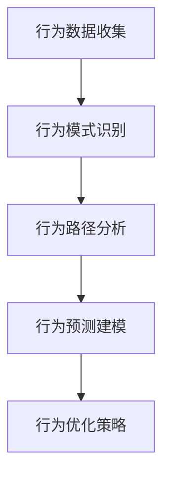
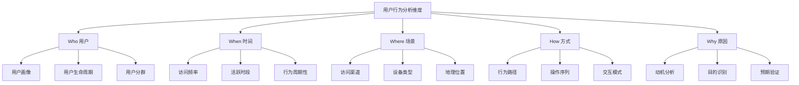
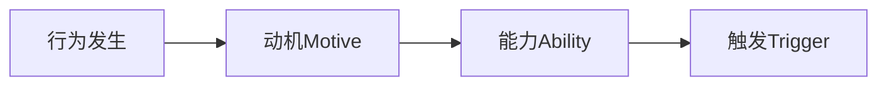
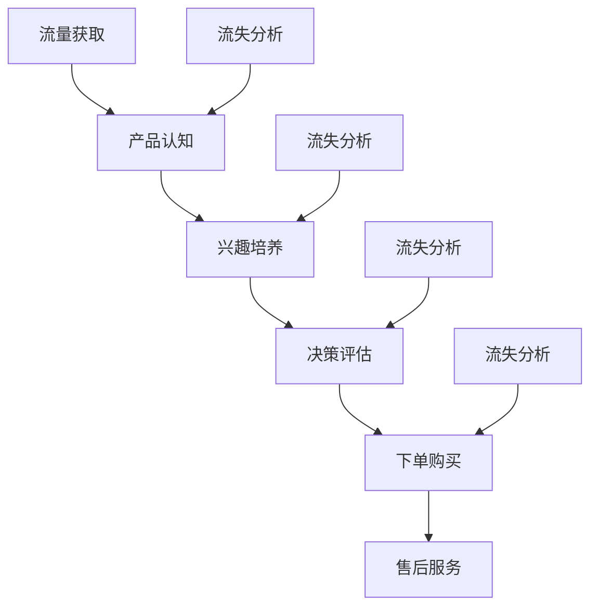
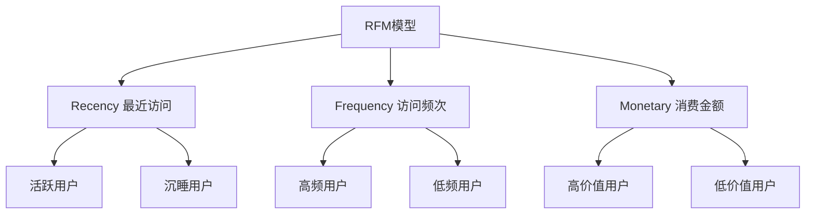
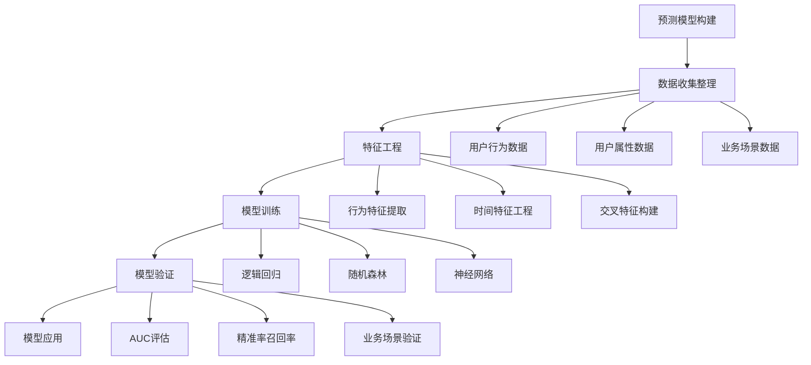

# 用户行为分析

## 📋 知识框架总览

---

## 🎯 核心理念

**用户行为分析** = 通过对用户在产品/服务中的行为轨迹进行系统分析，洞察用户需求、偏好和行为模式，优化产品和服务体验。

**核心价值**：从用户行为中挖掘商业价值，实现产品优化和营销精准化

---

## 🏗️ 知识结构

### 第一层：认知基础

#### 1.1 用户行为数据分类

| 数据类型 | 具体内容 | 收集方式 | 分析价值 |
|----------|----------|----------|----------|
| **浏览行为** | 页面访问、停留时间 | 埋点追踪 | 内容兴趣偏好 |
| **交互行为** | 点击、滚动、输入 | 事件追踪 | 操作便利性评估 |
| **交易行为** | 购买、付费、订阅 | 业务系统 | 商业价值分析 |
| **社交行为** | 分享、评论、关注 | 社交平台 | 用户影响力分析 |

#### 1.2 行为分析维度和指标

**核心分析维度**

#### 1.3 常用行为指标

**北极星指标体系**

| 指标层级 | 核心指标 | 定义 | 计算公式 |
|----------|----------|------|----------|
| **访问量** | PV、UV、VV | 基础流量指标 | PV=页面浏览次数 |
| **参与度** | 跳出率、停留时间、页面深度 | 内容质量评估 | 跳出率=单页访问/总访问 |
| **转化率** | 注册率、购买转化率 | 目标达成度 | 转化率=转化行为/总访问 |
| **留存率** | DAU、MAU、留存曲线 | 用户黏性 | 留存率=次日留存用户/首日用户 |

---

### 第二层：理解深化

#### 2.1 用户行为分析模型

**Fogg行为模型**

**模型解读**：
- **动机>障碍**：用户有足够的动力
- **能力>难度**：用户有能力完成任务
- **触发时机**：在合适的时机提示用户

#### 2.2 用户行为路径分析

**转化漏斗模型**

**关键分析点**：
- **流失节点**：识别主要流失环节
- **转化路径**：分析成功转化路径
- **路径优化**：优化高流失环节

#### 2.3 用户生命周期行为

**RFM模型应用**

**用户分层策略**：
- **明星用户**：高频、高价值、最近活跃
- **忠实用户**：高频、最近活跃、中等价值
- **沉睡用户**：有历史价值、较久未活跃
- **潜在用户**：低频活跃、有成长空间

---

### 第三层：应用实战

#### 3.1 用户行为分析方法

**定性分析方法**

**用户访谈法**
- **深度访谈**：了解行为动机和真实想法
- **焦点小组**：比较分析不同用户群体
- **观察研究**：现场观察用户行为模式

**定量分析方法**

**统计分析**
- **描述统计**：用户行为基本特征
- **关联分析**：行为之间的关联关系
- **聚类分析**：用户行为模式分组

#### 3.2 用户行为预测建模

**机器学习预测模型**

**常用预测模型**：
- **用户流失预测**：预测用户流失概率
- **购买行为预测**：预测用户购买意向
- **生命周期价值预测**：预测用户LTV

#### 3.3 用户行为优化策略

**个性化推荐系统**

**协同过滤**
- **基于用户**：寻找相似用户偏好
- **基于物品**：基于物品相似性推荐

**内容推荐**
- **标签匹配**：根据用户标签匹配内容
- **主题模型**：基于主题相似度推荐

**实时推荐**
- **实时特征**：基于当前行为实时推荐
- **上下文感知**：考虑时间地点情境

---

## 🎯 刻意练习计划

### 练习1：用户行为路径分析
**任务**：分析电商网站用户购物路径，识别关键转化节点
**输出**：路径分析报告+流失分析+优化建议
**评估**：分析深度+洞察价值+可操作性

### 练习2：用户行为预测模型
**任务**：构建用户流失预测模型，预测未来1月流失风险
**输出**：预测模型+模型评估报告+应用建议
**评估**：模型准确性+特征解释性+业务价值

### 练习3：个性化推荐算法设计
**任务**：设计电商个性化推荐系统算法方案
**输出**：算法设计方案+技术实现+效果评估
**评估**：算法合理性+技术可行性+推荐效果

---

## 🧩 实战案例分析

### 案例：字节跳动用户行为分析优化策略

**挑战**：多产品用户行为数据复杂，缺乏统一分析框架

**解决方案**：

1. **统一行为分析平台**
   - 建立用户行为统一标签体系
   - 构建跨产品行为数据中台
   - 实现实时用户行为追踪

2. **智能用户分群**
   - 基于多维行为特征聚类
   - 动态更新用户画像
   - 精准识别高价值用户

3. **个性化内容分发**
   - 实时行为特征提取
   - 算法实时调优
   - 跨产品个性化推荐

**关键成果**：
- **用户参与度提升**：平均时长提升35%
- **内容消费效率**：精准推荐准确率达到85%
- **变现能力增强**：广告点击率提升40%

**核心成功要素**：
- 强大的数据技术能力
- 完善的行为分析体系
- 敏捷的算法优化机制
- 深度理解用户需求

---

## 🔗 知识连接

**核心关联模块**：
- [[01-营销数据分析]] - 行为分析技术基础
- [[02-客户数据分析]] - 客户行为洞察方法
- [[04-竞品分析]] - 竞品用户行为对比
- [[05-私域流量运营]] - 私域用户行为分析

**技能提升路径**：
1. [[06-营销效果评估/01-营销指标/01-KPI指标体系]] - 指标体系设计
2. [[09-营销工具资源/01-营销工具/02-数据分析工具]] - 分析工具应用
3. [[08-营销创新趋势/01-新兴技术/01-AI营销应用]] - AI分析技术
4. [[04-营销策略制定/03-产品策略/04-产品创新策略]] - 产品优化策略

---

## 📚 学习检查清单

**基础认知检查**：
- [ ] 理解用户行为分析的核心价值和基本原理
- [ ] 掌握不同类型用户行为数据的特点和应用
- [ ] 能够设计合理的用户行为指标和评估体系

**深化理解检查**：
- [ ] 能够运用各种工具进行深度的用户行为路径分析
- [ ] 掌握用户生命周期管理和RFM分析模型应用
- [ ] 理解机器学习在用户行为预测中的应用原理

**应用实践检查**：
- [ ] 能够构建用户行为预测模型并得到有价值洞察
- [ ] 能够设计个性化推荐系统和优化策略
  - [ ] 能够建立完整的用户行为分析和优化体系

**知识整合检查**：
- [ ] 能够将用户行为分析与业务决策紧密结合
- [ ] 能够在实际业务中持续优化用户行为和体验
- [ ] 能够建立基于数据驱动的用户运营管理体系
