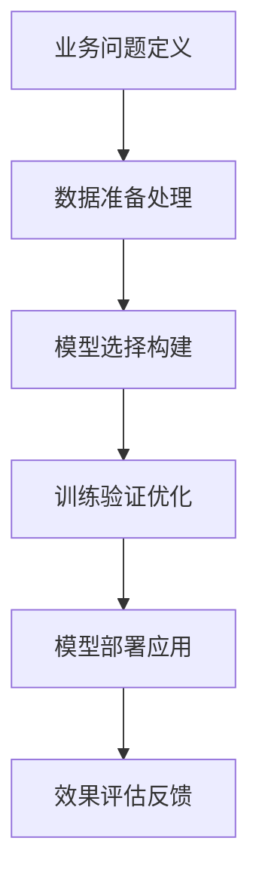
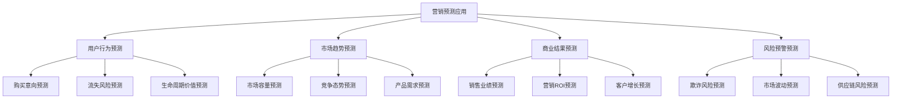
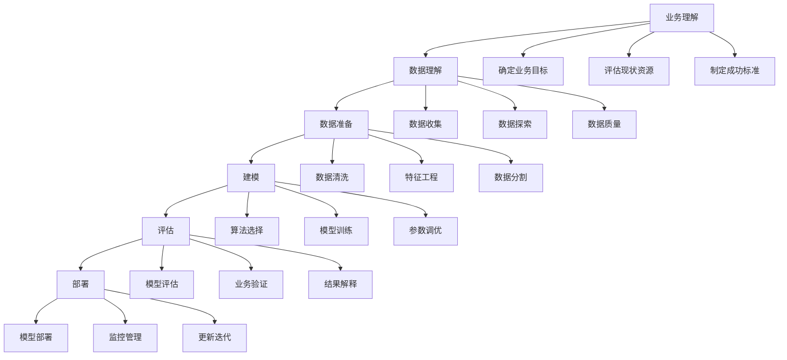
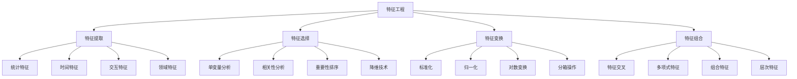
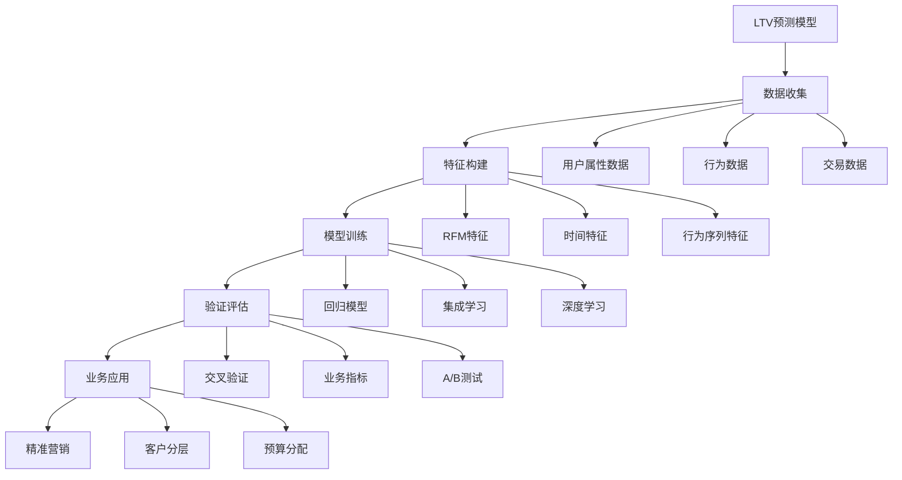

# 预测分析模型

## 📋 知识框架总览



---

## 🎯 核心理念

**预测分析模型** = 运用统计学和机器学习方法，基于历史数据构建数学模型，预测未来业务趋势和用户行为的科学方法。

**核心价值**：从数据中洞察未来，实现精准营销和风险预警

---

## 🏗️ 知识结构

### 第一层：认知基础

#### 1.1 预测模型分类体系

| 模型类型 | 应用场景 | 数据要求 | 预测精度 | 解释性 |
|----------|----------|----------|----------|--------|
| **时间序列** | 销售预测、趋势分析 | 时间序列数据 | 中高 | 高 |
| **分类模型** | 客户流失、购买意愿 | 结构化特征数据 | 高 | 中 |
| **回归模型** | 客户价值、定价优化 | 连续型目标变量 | 高 | 高 |
| **聚类模型** | 用户分群、市场细分 | 多维特征数据 | 中 | 中 |
| **深度学习** | 图像识别、NLP处理 | 大数据量 | 很高 | 低 |

#### 1.2 营销预测应用场景

**核心预测目标**



#### 1.3 预测模型评估指标

**常用评估指标**

| 评估类型 | 指标名称 | 指标定义 | 理想值 |
|----------|----------|----------|--------|
| **准确性** | 准确率(Accuracy) | 正确预测比例 | >80% |
| **精确性** | 精确率(Precision) | 阳性预测的准确性 | >70% |
| **召回性** | 召回率(Recall) | 识别阳性样本的能力 | >70% |
| **平衡性** | F1分数 | 精确率和召回率调和平均 | >75% |
| **误差性** | RMSE | 预测误差标准差 | 越小越好 |

---

### 第二层：理解深化

#### 2.1 机器学习建模流程

**CRISP-DM方法论**



#### 2.2 特征工程深度应用

**特征构造策略**



#### 2.3 模型集成策略

**集成学习方法**

| 集成类型 | 原理 | 适用场景 | 优势 | 劣势 |
|----------|------|----------|------|------|
| **Bagging** | 训练多个独立模型投票 | 数据量适中 | 降低过拟合 | 计算开销大 |
| **Boosting** | 迭代改进模型性能 | 弱学习器 | 高精度 | 容易过拟合 |
| **Stacking** | 多层模型堆叠 | 复杂预测任务 | 强模型组合 | 复杂度高 |
| **Blending** | 简单加权平均 | 快速部署 | 简单有效 | 效果有限 |

---

### 第三层：应用实战

#### 3.1 客户生命周期价值预测

**LTV预测模型构建**



#### 3.2 营销效果预测优化

**多渠道归因预测**

**营销归因模型选择**

| 归因模型 | 原理 | 适用场景 | 准确性 |
|----------|------|----------|--------|
| **首次点击** | 归因给首次接触渠道 | 品牌认知型 | 低 |
| **末次点击** | 归因给最后接触渠道 | 直效营销型 | 中 |
| **时间衰减** | 根据时间距离权重分配 | 决策周期长 | 中高 |
| **线性归因** | 平均分配给各接触点 | 复杂决策路径 | 中高 |
| **马尔科夫链** | 基于状态转移概率 | 多路径复杂场景 | 高 |
| **机器学习** | AI算法学习最优权重 | 大数据场景 | 很高 |

#### 3.3 商品需求预测

**多因子需求预测模型**

**需求影响因素矩阵**

| 因素类别 | 具体因素 | 影响权重 | 预测难度 |
|----------|----------|----------|----------|
| **外部环境** | 季节、节日、天气 | 高 | 中 |
| **市场因素** | 竞争态势、价格变化 | 高 | 中高 |
| **营销活动** | 促销、广告、渠道 | 中高 | 低 |
| **产品因素** | 新品发布、库存状态 | 中 | 低 |
| **用户行为** | 搜索、浏览、购买历史 | 中高 | 高 |

---

## 🎯 刻意练习计划

### 练习1：客户流失预测模型
**任务**：构建用户流失预测模型，识别高风险客户
**输出**：完整建模流程+模型评估报告+应用策略
**评估**：模型效果+业务价值+实施可行性

### 练习2：销售预测优化
**任务**：建立多维度销售预测模型，提升预测准确率
**输出**：预测模型+误差分析+改进建议
**评估**：预测精度+特征重要性+商业洞察

### 练习3：营销ROI预测分析
**任务**：构建营销投入产出比预测模型
**输出**：ROI预测模型+预算分配建议+优化策略
**评估**：模型准确性+成本效益+决策支持度

---

## 🧩 实战案例分析

### 案例：Netflix推荐算法中的预测模型

**业务挑战**：如何预测用户对不同内容的喜好，提升观看时长

**解决方案架构**：

1. **多策略融合模型**
   ```
   协同过滤 + 内容过滤 + 深度学习 = 组合预测模型
   ```

2. **实时预测系统**
   - **离线模型**：基于用户历史行为训练
   - **在线模型**：实时更新用户偏好
   - **混合推荐**：冷启动+动态调整

3. **效果监控优化**
   - **A/B测试**：持续验证预测效果
   - **指标追踪**：观看时长+满意度+留存率
   - **模型更新**：定期重训练和优化

**关键成果**：
- **观看时长提升**：平均提升30%+
- **用户满意度**：净推荐值增长25%
- **商业价值**：减少用户流失，增加订阅收入

**核心成功要素**：
- 大数据量支撑（千万级用户行为数据）
- 多样化算法组合（协同+内容+深度）
- 持续优化机制（实时学习+定期更新）
- 业务导向验证（商业指标+用户体验）

---

## 🔗 知识连接

**核心关联模块**：
- [[01-营销数据分析]] - 数据分析技术基础
- [[02-客户数据分析]] - 客户行为数据应用
- [[03-市场趋势分析]] - 市场预测分析维度
- [[04-竞品分析]] - 竞争预测分析框架

**进阶技能路径**：
1. [[08-营销创新趋势/01-新兴技术/02-大数据营销]] - 大数据分析方法
2. [[08-营销创新趋势/01-新兴技术/01-AI营销应用]] - AI算法在营销中的应用
3. [[09-营销工具资源/01-营销工具/02-数据分析工具]] - 预测分析工具选择
4. [[06-营销效果评估/01-营销指标/02-ROI计算方法]] - ROI预测和评估

---

## 📚 学习检查清单

**基础认知检查**：
- [ ] 理解预测分析模型的核心原理和应用价值
- [ ] 掌握不同类型预测模型的适用场景和特征
- [ ] 能够识别营销领域的核心预测目标和应用场景

**深化理解检查**：
- [ ] 能够运用CRISP-DM方法论进行模型构建
- [ ] 掌握特征工程和模型集成的高级技术
- [ ] 理解各种营销归因模型和需求预测方法

**应用实践检查**：
- [ ] 能够独立构建客户流失和LTV预测模型
- [ ] 能够设计和实现多渠道营销效果预测系统
- [ ] 能够进行销售预测和需求预测的高级建模

**知识整合检查**：
- [ ] 能够将预测模型与营销决策和业务优化紧密结合
- [ ] 能够在实际业务中建立持续的预测分析优化体系
- [ ] 能够基于预测结果指导营销战略和预算分配决策
