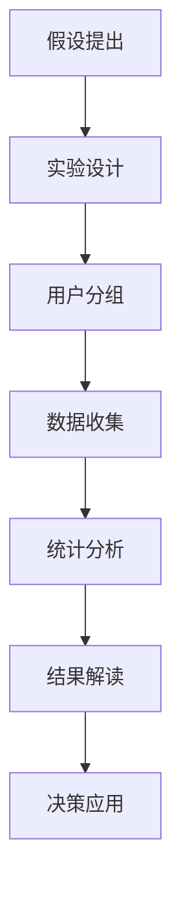
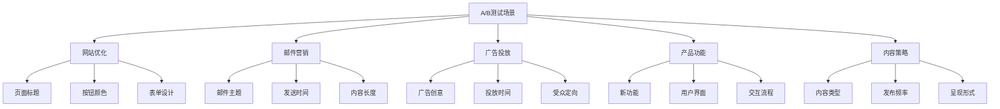
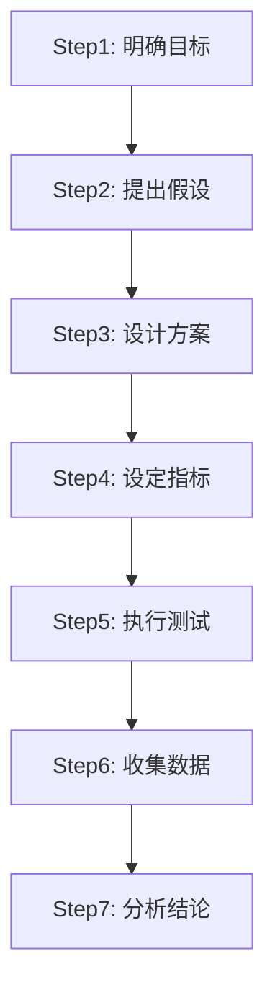
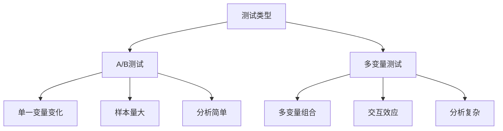

# A/B测试方法

## 📋 知识框架总览



---

## 🎯 核心理念

**A/B测试** = 通过控制变量的科学实验方法，在真实用户中对比不同方案的效果，为营销决策提供数据支撑。

**核心价值**：将营销决策从"拍脑袋"转向"数据驱动"，降低决策风险，提升成功率

---

## 🏗️ 知识结构

### 第一层：认知基础

#### 1.1 A/B测试基础概念

| 核心概念 | 定义 | 作用 |
|----------|------|------|
| **对照组** | 保持现状不变 | 基准对比 |
| **实验组** | 实施新方案 | 效果测试 |
| **样本量** | 参与测试用户数 | 统计显著性 |
| **显著性** | 结果可信度概率 | 结论可靠性 |

#### 1.2 A/B测试应用场景

**营销场景矩阵**



#### 1.3 测试成功指标

**关键指标分类**

| 指标类型 | 示例指标 | 测试重点 | 衡量维度 |
|----------|----------|----------|----------|
| **转化类** | 注册率、购买率 | 目标行为转化 | 数量提升 |
| **参与类** | 点击率、停留时间 | 用户参与度 | 质量提升 |
| **商业类** | 收入、利润率 | 商业价值 | 价值提升 |
| **体验类** | 满意度、净推荐值 | 用户体验 | 满意度提升 |

---

### 第二层：理解深化

#### 2.1 A/B测试设计原理

**实验设计四要素**


**设计原则**：
1. **单一变量原则**：每次只改变一个元素
2. **随机分组原则**：确保组间无系统性差异
3. **样本量充足**：确保统计功效足够
4. **测试时间充分**：避免短期波动影响

#### 2.2 样本量计算

**样本量计算公式组件**

```
所需样本量 = 2 × (Z₁-α/2 + Z₃₁-β)² × p(1-p) / δ²

Z₁-α/2: 统计显著性水平（通常1.96，对应95%置信度）
Z₃₁-β: 统计功效（通常0.84，对应80%功效）
p: 基线转化率
δ: 最小检测效应
```

**简化工具使用**：
- **在线计算器**：Evan Miller样本量计算器
- **经验法则**：最小每组1000样本
- **转化率越高**：所需样本量越小

#### 2.3 测试时长确定

**测试时长影响因素**

| 影响因素 | 影响程度 | 调整建议 |
|----------|----------|----------|
| **流量大小** | 高 | 流量小→延长测试期 |
| **业务周期** | 中 | 包含完整业务周期 |
| **天气季节** | 中 | 考虑季节性因素 |
| **外部事件** | 高 | 避开重大外部干扰 |

---

### 第三层：应用实战

#### 3.1 完整测试流程

**七步测试法**



**操作详解**：

1. **明确目标**：具体明确的优化目标
2. **提出假设**：基于数据洞察的假设
3. **设计方案**：设计控制组和实验组
4. **设定指标**：确定主要和次要指标
5. **执行测试**：实施分组和变量控制
6. **收集数据**：按计划收集完整数据
7. **分析结论**：统计分析和业务解读

#### 3.2 A/B测试平台工具

**工具选择矩阵**

| 工具类型 | 产品举例 | 适用场景 | 优缺点 |
|----------|----------|----------|--------|
| **通用平台** | Google Optimize | 网站优化 | 易用+免费 |
| **专业平台** | Optimizely | 复杂实验 | 强大功能+成本高 |
| **营销平台** | HubSpot | 营销活动 | 集成度高+易上手 |
| **自建系统** | 内部开发 | 定制需求 | 完全可控+开发成本高 |

#### 3.3 多变量测试(MVT)

**A/B测试 vs 多变量测试**



**选择建议**：
- **A/B测试**：原因明确，变量简单
- **多变量测试**：探索多个因素，寻找最优组合

#### 3.4 常见错误规避

**测试设计错误案例**

| 错误类型 | 错误表现 | 正确做法 | 影响后果 |
|----------|----------|----------|----------|
| **变量混淆** | 同时改变多个元素 | 严格执行单一变量 | 无法确定真正原因 |
| **样本过小** | 测试用户<500人 | 确保样本量充足 | 结果不够可信 |
| **时间过短** | 测试<1周 | 包含完整业务周期 | 短期波动干扰 |
| **指标单一** | 只关注转化率 | 设置多维度指标 | 错过其他价值 |
| **停止过早** | 中期数据即得出结论 | 等待统计显著性 | 误判效果 |

---

## 🎯 刻意练习计划

### 练习1：测试方案设计
**任务**：为电商网站设计A/B测试方案提升结账转化率
**输出**：完整测试设计文档+执行计划
**评估**：方案科学性+可执行性

### 练习2：样本量估算
**任务**：计算不同场景下的样本量需求
**输出**：样本量计算表格+计算过程
**评估**：计算准确性+实用价值

### 练习3：结果分析解读
**任务**：分析实际A/B测试数据并得出业务结论
**输出**：数据分析报告+业务建议
**评估**：分析深度+商业洞察

---

## 🧩 实战案例分析

### 案例：Netflix推荐算法A/B测试

**测试背景**：优化视频推荐算法提升用户观看时长

**测试设计**：
- **对照组**：使用现有推荐算法
- **实验组**：使用新开发算法
- **测试周期**：3个月
- **样本量**：每组50万用户

**关键发现**：
- **观看时长提升**：15.3%的增长
- **用户满意度**：净推荐值上升8.7%
- **技术成本**：服务器成本增加12%

**决策结果**：
基于15.3%的观看时长提升带来的订阅价值，远超12%的技术成本增长，最终决定全面部署新算法。

**关键成功因素**：
- 明确的商业目标和衡量指标
- 充足的样本量和测试时长
- 综合考虑收益和成本的全面分析
- 持续监控和优化机制

---

## 🔗 知识链接

**核心关联模块**：
- [[01-营销效果优化]] - A/B测试应用场景
- [[02-营销流程优化]] - 流程优化测试方法  
- [[03-营销技术优化]] - 技术工具和平台选择
- [[04-营销成本优化]] - 成本效益分析

**技能提升路径**：
1. [[06-营销效果评估/01-营销指标/01-KPI指标体系]] - 指标设计基础
2. [[06-营销效果评估/02-数据分析/01-营销数据分析]] - 数据分析技能
3. [[09-营销工具资源/01-营销工具/04-营销自动化工具]] - 测试平台应用
4. [[08-营销创新趋势/01-新兴技术/02-大数据营销]] - 数据驱动营销

---

## 📚 学习检查清单

**基础认知检查**：
- [ ] 理解A/B测试的核心原理和商业价值
- [ ] 掌握A/B测试的主要应用场景和指标类型
- [ ] 能够识别适合A/B测试的营销问题

**深化理解检查**：
- [ ] 能够设计符合统计原理的测试方案
- [ ] 掌握样本量计算和测试时长确定的科学方法
- [ ] 理解多变量测试与A/B测试的差异和选择

**应用实践检查**：
- [ ] 能够独立设计和执行完整的A/B测试
- [ ] 能够选择和使用适合的测试工具平台
- [ ] 能够正确分析测试结果并得出业务结论

**知识整合检查**：
- [ ] 能够将A/B测试与其他营销优化方法结合使用
- [ ] 能够在实际业务中建立持续优化的测试文化
- [ ] 能够建立完整的A/B测试管理体系和最佳实践
