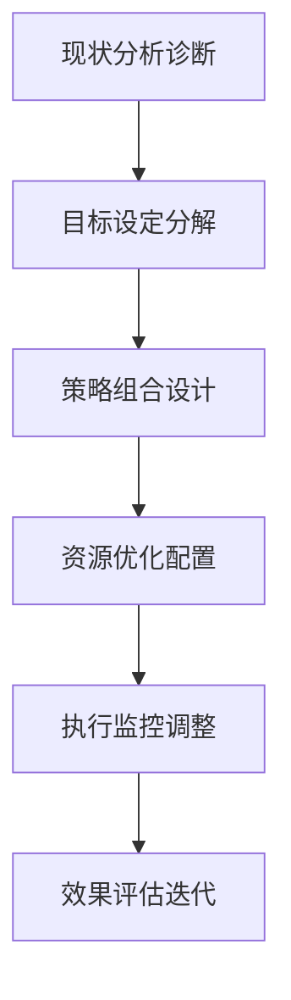
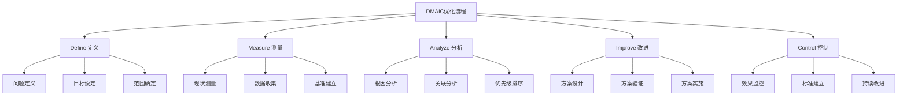
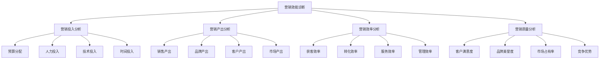
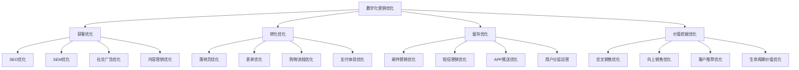
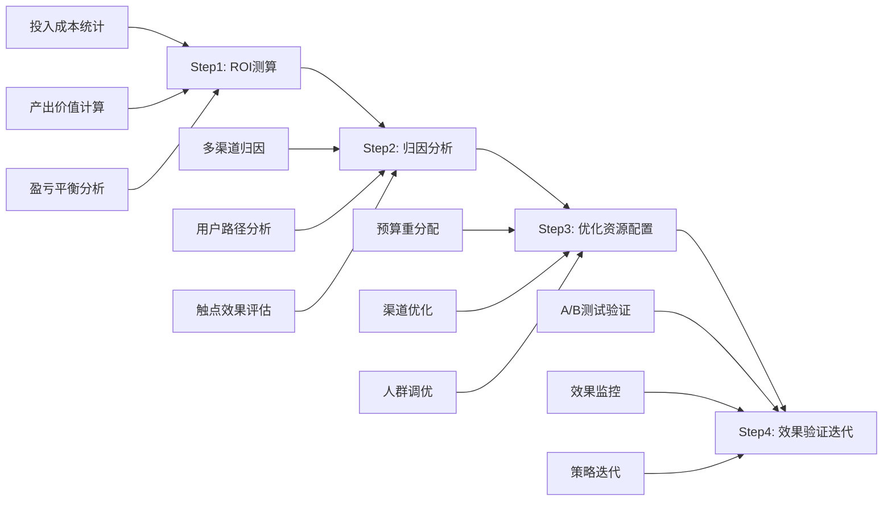

# 营销优化策略

## 📋 知识框架总览



---

## 🎯 核心理念

**营销优化策略** = 基于数据洞察和业务目标，系统性制定并实施营销改进方案，实现营销效率和质量双提升的战略方法论。

**核心价值**：通过科学决策和系统优化，实现营销ROI的最大化

---

## 🏗️ 知识结构

### 第一层：认知基础

#### 1.1 营销优化的核心维度

| 优化维度 | 核心内容 | 关键指标 | 优化目标 |
|----------|----------|----------|----------|
| **效率优化** | 流程速度、资源利用 | 人均产出、执行效率 | 成本降低30%+ |
| **效果优化** | 转化率、客户质量 | 转化率、平均客单价 | 效果提升20%+ |
| **体验优化** | 用户体验、服务质量 | 满意度、NPS | 体验分提升15%+ |
| **创新优化** | 新方法、新渠道 | 创新占比、成功案例 | 创新贡献40%+ |

#### 1.2 优化策略框架体系

**DMAIC优化模型**



#### 1.3 优化策略分类

**策略矩阵分类**

| 策略类型 | 优化对象 | 实施周期 | 预期效果 | 风险等级 |
|----------|----------|----------|----------|----------|
| **增量优化** | 现有流程微调 | 1-3个月 | 10-20%提升 | 低 |
| **改进优化** | 方法创新重构 | 3-6个月 | 30-50%提升 | 中 |
| **突破优化** | 颠覆性创新 | 6-12个月 | 50-100%提升 | 高 |
| **重建优化** | 全面系统重构 | 12个月+ | 100%+提升 | 很高 |

---

### 第二层：理解深化

#### 2.1 营销诊断分析体系

**营销效能诊断模型**



#### 2.2 营销优化优先级矩阵

**ICE优先级评估框架**

| 因素 | 权重 | 评分标准 | 计算方法 |
|------|------|----------|----------|
| **Impact影响力** | 40% | 1-10分 | 对业务目标影响程度 |
| **Confidence信心度** | 30% | 1-10分 | 成功实施的概率 |
| **Ease易度性** | 30% | 1-10分 | 实施的难易程度 |

**计算公式**：ICE总分 = Impact × 0.4 + Confidence × 0.3 + Ease × 0.3

#### 2.3 营销资源优化配置

**资源配置优化模型**

**帕累托优化原理应用**

| 资源类型 | 当前配置 | 优化目标 | 调整策略 | 预期效果 |
|----------|----------|----------|----------|----------|
| **预算资源** | 分散投入 | 80/20集中 | 聚焦高ROI渠道 | ROI提升50% |
| **人力资源** | 平均分配 | 能力匹配 | 专业分工+专长发挥 | 效率提升40% |
| **技术资源** | 工具分散 | 平台统一 | 工具整合+流程标准化 | 成本降低30% |
| **时间资源** | 活动堆叠 | 科学规划 | 优化排期+关键节点 | 执行质量提升35% |

---

### 第三层：应用实战

#### 3.1 数字营销优化策略

**全链路数字化优化**



#### 3.2 营销漏斗优化策略

**漏斗优化方法矩阵**

| 优化策略 | 适用阶段 | 优化方法 | 成功指标 | 实施周期 |
|----------|----------|----------|----------|----------|
| **认知优化** | 引流阶段 | 品牌曝光+内容吸引 | 流量增长+品牌认知 | 2-4周 |
| **兴趣优化** | 关注阶段 | 痛点挖掘+价值传递 | 关注转化率 | 1-3周 |
| **意向优化** | 考虑阶段 | 对比分析+信任建立 | 意向转化率 | 2-6周 |
| **决策优化** | 购买阶段 | 促销刺激+便利化 | 购买转化率 | 1-2周 |
| **忠诚优化** | 留存阶段 | 服务体验+价值延续 | 留存率+复购率 | 4-12周 |

#### 3.3 营销ROI优化策略

**ROI优化四步法**



**ROI优化关键指标**

| 指标类别 | 核心指标 | 优化目标 | 计算方法 |
|----------|----------|----------|----------|
| **成本效率** | CAC获客成本 | 降低20-30% | 营销成本/新增客户 |
| **产出效果** | LTV客户价值 | 提升25-40% | 客户生命周期收入 |
| **比值优化** | ROI投资回报率 | 提升50-80% | (收入-成本)/成本×100% |
| **质量改进** | NPS客户推荐值 | 提升30-50% | 推荐者比例-贬损者比例 |

---

## 🎯 刻意练习计划

### 练习1：营销诊断和优化方案设计
**任务**：对公司营销现状进行全面诊断，制定系统优化方案
**输出**：诊断报告+优化策略+实施计划+预期效果
**评估**：诊断准确性+策略有效性+实施可行性+商业价值

### 练习2：营销漏斗优化实践
**任务**：选择具体营销漏斗，设计并实施优化策略
**输出**：漏斗分析+优化方案+测试结果+效果评估
**评估**：分析深度+优化效果+学习总结+持续改进

### 练习3：营销ROI优化决策
**任务**：基于数据分析进行营销资源配置优化决策
**输出**：ROI分析+归因洞察+配置方案+效果预测
**评估**：决策科学性+资源配置合理性+预期收益+实施风险

---

## 🧩 实战案例分析

### 案例：Shopify营销优化成功经验

**企业背景**：全球领先的电商建站平台，服务200万+商家

**营销优化挑战**：
- 获客成本不断上升，传统渠道效果下降
- 用户留存率偏低，生命周期价值有待提升
- 营销预算有限，需要提高ROI效率

**系统优化方案**：

1. **数据驱动决策体系建设**
   ```
   营销数据分析平台 + 实时监控体系 + ROI评估机制
   ```

2. **全渠道效果优化**
   - **搜索引擎优化**：SEM/SEO效率提升40%
   - **社交媒体优化**：内容质量和转化率提升60%
   - **合作伙伴营销**：KOL营销ROI提升100%+
   - **内容营销优化**：SEO流量增长80%

3. **用户体验持续改进**
   - **注册流程优化**：转化率提升25%
   - **产品优化迭代**：用户满意度提升30%
   - **客户成功体系**：客户成功率和续费率显著提升

**关键成果**：
- **获客成本优化**：CAC降低35%
- **客户价值提升**：LTV增长50%+
- **ROI效果显著**：营销ROI提升80%+
- **增长速度加快**：业务增长率提升40%

**核心成功要素**：
- 数据驱动的决策文化
- 持续优化和改进机制
- 用户体验为中心的设计
- 多渠道协同的整合营销

---

## 🔗 知识连接

**核心关联模块**：
- [[01-营销效果优化]] - 效果优化基础理论
- [[01-A-B测试方法]] - 优化测试验证方法
- [[03-持续改进机制]] - 持续优化管理机制
- [[04-营销实验设计]] - 实验设计和验证

**技能提升路径**：
1. [[06-营销效果评估/01-营销指标/02-ROI计算方法]] - ROI计算和优化基础
2. [[04-营销策略制定/02-竞争策略/03-定价策略]] - 策略制定和优化思维
3. [[05-营销执行实施/01-数字营销]] - 数字化营销优化实践
4. [[08-营销创新趋势/01-新兴技术]] - 新技术在营销优化中的应用

---

## 📚 学习检查清单

**基础认知检查**：
- [ ] 理解营销优化的核心原理和价值创造逻辑
- [ ] 掌握营销优化的主要维度和评估框架
- [ ] 能够识别营销优化的关键问题和改进机会

**深化理解检查**：
- [ ] 能够运用系统诊断方法分析营销现状
- [ ] 掌握营销优化策略的优先级评估和资源配置
- [ ] 理解数字化营销优化和漏斗优化的核心方法

**应用实践检查**：
- [ ] 能够设计并实施完整的营销优化策略
- [ ] 能够进行营销漏斗的持续优化改进
- [ ] 能够通过ROI优化实现营销资源配置的最优化

**知识整合检查**：
- [ ] 能够将营销优化与其他营销管理活动有效整合
- [ ] 能够在实际业务中建立持续的营销优化文化
- [ ] 能够基于数据驱动实现营销效果的持续改进和突破
