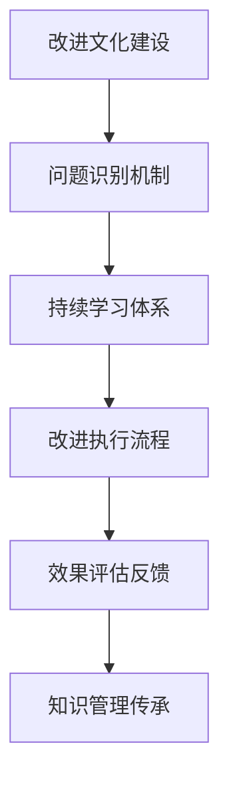
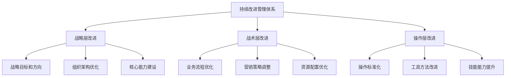
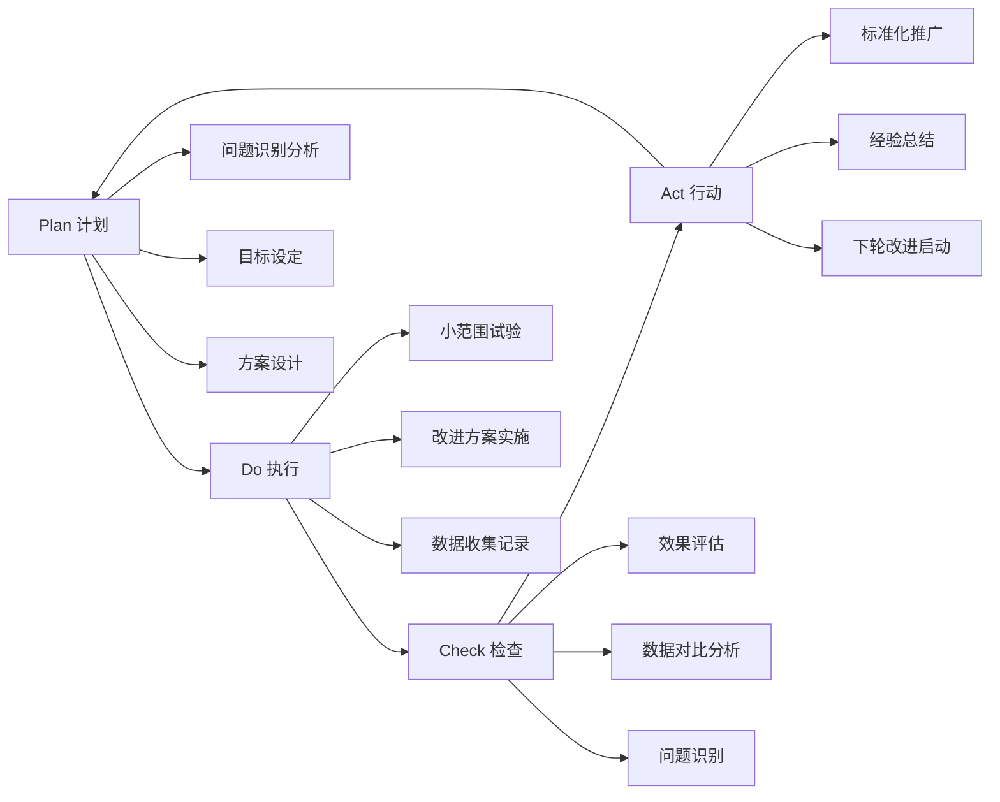
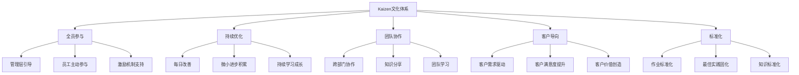
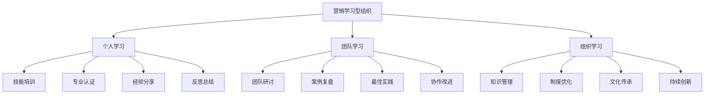
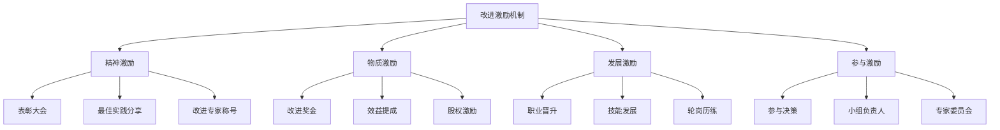

# 持续改进机制

## 📋 知识框架总览



---

## 🎯 核心理念

**持续改进机制** = 建立系统化的改进文化、流程和方法，确保营销能力持续提升的管理体系。

**核心价值**：从被动响应转向主动改进，实现营销绩效的持续增长和竞争优势的不断累积

---

## 🏗️ 知识结构

### 第一层：认知基础

#### 1.1 持续改进的核心要素

| 要素维度 | 核心内容 | 实施重点 | 成功标准 |
|----------|----------|----------|----------|
| **文化氛围** | 学习型组织文化 | 全员参与、持续学习 | 改进提案增长率50%+ |
| **机制流程** | 标准化改进流程 | PDCA循环、Kaizen理念 | 流程标准化100% |
| **能力建设** | 团队改进能力 | 培训体系、工具方法 | 员工技能提升率80%+ |
| **评估激励** | 效果评估和激励 | 量化评估、奖励机制 | 改进效果达标率90%+ |

#### 1.2 持续改进管理体系

**改进管理层次结构**



#### 1.3 改进类型和周期

**改进类型分类**

| 改进类型 | 改进内容 | 实施周期 | 相关人员 | 预期效果 |
|----------|----------|----------|----------|----------|
| **日常改进** | 操作细节优化 | 1-2周 | 一线员工 | 效率提升5-10% |
| **专题改进** | 具体问题解决 | 1-3个月 | 跨部门团队 | 效果提升15-25% |
| **系统改进** | 流程体系重构 | 3-6个月 | 管理层+专家 | 整体提升30-50% |
| **创新改进** | 突破性创新 | 6-12个月 | 创新团队+外部专家 | 革命性提升100%+ |

---

### 第二层：理解深化

#### 2.1 PDCA持续改进循环

**经典PDCA模型应用**



#### 2.2 Kaizen持续改善文化

**Kaizen文化五要素**



#### 2.3 6σ持续改进方法论

**6σ DMAIC改进路径**

**六西格玛核心工具**

| 工具类型 | 工具名称 | 应用场景 | 改进效果 |
|----------|----------|----------|----------|
| **测量工具** | SIPOC流程图 | 流程梳理 | 流程理解清晰度+80% |
| **分析工具** | 鱼骨图分析 | 根因分析 | 问题分析准确率+70% |
| **改进工具** | FMEA故障分析 | 风险预防 | 故障发生率-60% |
| **控制工具** | 控制图 | 过程监控 | 变异降低+50% |

---

### 第三层：应用实战

#### 3.1 营销团队持续改进体系

**学习型营销组织建设**



#### 3.2 营销流程持续优化

**营销流程优化三层架构**

**流程优化关键要素**

| 优化层次 | 优化内容 | 优化重点 | 实施方法 | 预期效果 |
|----------|----------|----------|----------|----------|
| **战略流程** | 营销战略制定 | 决策效率 | 战略分析工具+决策机制 | 决策速度提升50% |
| **管理流程** | 营销管理流程 | 管理效率 | 管理制度优化+工具应用 | 管理效率提升40% |
| **执行流程** | 营销执行流程 | 执行效率 | SOP标准化+工具自动化 | 执行效率提升60% |

#### 3.3 持续改进激励机制

**多层次激励体系**



**激励效果评估指标**

| 评估维度 | 量化指标 | 目标值 | 测量方法 |
|----------|----------|--------|----------|
| **参与度** | 改进提案数量 | 人均年提案2个+ | 提案统计系统 |
| **积极性** | 改进实施率 | 85%+ | 实施跟踪系统 |
| **效果性** | 改进产出价值 | 年提升营收15%+ | ROI计算分析 |
| **持续性** | 机制运行时间 | 长期可持续发展 | 机制评估报告 |

---

## 🎯 刻意练习计划

### 练习1：营销改进文化建设
**任务**：设计并实施营销团队的持续改进文化建设方案
**输出**：文化建设方案+实施计划+激励机制+效果评估
**评估**：文化设计合理性+实施可行性+参与积极性+长期持续性

### 练习2：营销流程改进实践
**任务**：选择具体营销流程，运用DMAIC方法进行系统改进
**输出**：流程诊断+改进方案+实施过程+效果评估+经验总结
**评估**：诊断准确性+改进效果+方法运用+学习成长

### 练习3：营销知识管理体系
**任务**：建立营销组织的知识管理和传承体系
**输出**：知识管理体系+工具方法+管理制度+应用效果
**评估**：体系完整性+应用便利性+知识价值+持续更新能力

---

## 🧩 实战案例分析

### 案例：丰田营销持续改进管理体系

**企业背景**：丰田汽车在全球汽车市场成功运用持续改进文化

**营销持续改进特色**：

1. **全员营销改进文化**
   ```
   "营销的每个人都是改进专家" - 丰田哲学
   ```

2. **系统性改进机制**
   - **日常改善：** 每个员工每天都有改进任务
   - **专题改进：** 定期组织营销改进项目
   - **系统改进：** 年度营销体系全面升级

3. **学习型营销组织**
   - **技能培训体系：** 持续提升营销技能
   - **经验分享机制：** 最佳实践全员共享
   - **创新文化氛围：** 鼓励营销创新和实验

**关键改进成效**：
- **效率持续提升**：营销效率年均提升15%+
- **成本控制优化**：营销成本控制精确到细节
- **客户满意度**：全球客户满意度长期领先
- **竞争优势**：基于改进能力的差异化竞争

**核心成功要素**：
- 深入人心的改进文化底蕴
- 完善的制度流程保障机制
- 强有力的学习和激励体系
- 长期主义的持续投入

---

## 🔗 知识连接

**核心关联模块**：
- [[01-营销效果优化]] - 优化改进基础理论
- [[02-营销优化策略]] - 营销改进策略方法
- [[04-营销实验设计]] - 实验和改进验证
- [[06-营销效果评估/01-营销指标]] - 改进效果评估体系

**管理技能提升**：
1. [[03-营销理论框架/01-经典营销理论]] - 营销理论基础的持续更新
2. [[04-营销策略制定]] - 营销策略的持续优化调整
3. [[05-营销执行实施]] - 营销执行的持续改进提升
4. [[01-营销总览]] - 营销知识体系的整体迭代

---

## 📚 学习检查清单

**基础认知检查**：
- [ ] 理解持续改进机制的核心价值和基本原理
- [ ] 掌握PDCA、Kaizen和6σ等主流改进方法论
- [ ] 能够识别营销组织中需要持续改进的关键领域

**深化理解检查**：
- [ ] 能够设计和建立系统的营销改进管理体系
- [ ] 掌握学习型营销组织建设和知识管理方法
- [ ] 理解改进激励机制的设计和实施原理

**应用实践检查**：
- [ ] 能够在实际团队中建立持续改进文化
- [ ] 能够运用系统方法进行营销流程优化改进
- [ ] 能够设计和实施有效的营销改进激励体系

**知识整合检查**：
- [ ] 能够将持续改进与其他营销管理活动有机结合
- [ ] 能够在实际业务中建立可持续的改进文化和发展机制
- [ ] 能够通过持续改进实现营销能力的长期竞争力建设
